# Introduction to the Tidyverse {#intro}


The **data science life cycle** begins with a question that can be answered with data and ends with an answer to that question. However, there are a lot of steps that happen after a question has been generated and before arriving at an answer. After generating their specific question, data scientists have to determine what data will be useful, import the data, tidy the data into a format that is easy to work with, explore the data, generate insightful visualizations, carry out the analysis, and communicate their findings. Throughout this process, it is often said that [50-80% of a data scientist's time is spent wrangling data](https://www.nytimes.com/2014/08/18/technology/for-big-data-scientists-hurdle-to-insights-is-janitor-work.html). It can be hard work to read the data in and get data into the format you need to ultimately answer the question. As a result, conceptual frameworks and software packages to make these steps easier have been developed.

Within the R community, R packages that have been developed for this very purpose are often referred to as the Tidyverse. According to their website, the [tidyverse](https://www.tidyverse.org/) is "an opinionated collection of R packages designed for data science. All packages share an underlying design philosophy, grammar, and data structures." There are currently about a dozen packages that make up the official tidyverse; however, there are dozens of tidyverse-adjacent packages that follow this philosophy, grammar, and data structures and work well with the official tidyverse packages. It is this whole set of packages that we have set out to teach in this specialization. 

In this course, we set out to introduce the conceptual framework behind tidy data and introduce the tidyverse and tidyverse-adjacent packages that we'll be teaching throughout this specialization. Mastery of these fundamental concepts and familiarity with what can be accomplished using the tidyverse will be critical throughout the more technical courses ahead. So, be sure you are familiar with the vocabulary provided and have a clear understanding of the tidy data principles introduced here before moving forward.

In this specialization we assume familiarity with the R programming language. If you are not yet familiar with R, we suggest you first complete [R Programming](https://www.coursera.org/learn/r-programming) before returning to complete this specialization. However, if you have some familiarity with R and want to learn how to work more efficiently with data, then you've come to the right place!


## About This Course

This course introduces a powerful set of data science tools known as the Tidyverse. The Tidyverse has revolutionized the way in which data scientists do almost every aspect of their job. We will cover the simple idea of "tidy data" and how this idea serves to organize data for analysis and modeling. We will also cover how non-tidy data can be transformed to tidy data, the data science project life cycle, and the ecosystem of Tidyverse R packages that can be used to execute a data science project. 

If you are new to data science, the Tidyverse ecosystem of R packages is an excellent way to learn the different aspects of the data science pipeline, from importing the data, tidying the data into a format that is easy to work with, exploring and visualizing the data, and fitting machine learning models. If you are already experienced in data science, the Tidyverse provides a power system for streamlining your workflow in a coherent manner that can easily connect with other data science tools. 

In this course it is important that you be familiar with the R programming language. If you are not yet familiar with R, we suggest you first complete [R Programming](https://www.coursera.org/learn/r-programming) before returning to complete this course. 


## Tidy Data

Before we can discuss all the ways in which R makes it easy to work with tidy data, we have to first be sure we know what tidy data are. Tidy datasets, by design, are easier to manipulate, model, and visualize because the tidy data principles that we'll discuss in this course impose a general framework and a consistent set of rules on data. In fact, a well-known quote from Hadley Wickham is that "tidy datasets are all alike but every messy dataset is messy in its own way." Utilizing a consistent tidy data format allows for tools to be built that work well within this framework, ultimately simplifying the data wrangling, visualization, and analysis processes.  By starting with data that are already in a tidy format *or* by spending the time at the beginning of a project to get data into a tidy format, the remaining steps of your data science project will be easier.

### Data Terminology

Before we move on, let's discuss what is meant by **dataset**, **observations**, **variables**, and **types**, all of which are used to explain the principles of tidy data.

**Dataset**

A *dataset* is a collection of values. These are often numbers and strings, and are stored in a variety of ways. However, every value in a dataset belongs to a *variable* and an *observation*.

**Variables**

*Variables* in a dataset are the different categories of data that will be collected. They are the different pieces of information that can be collected or measured on each observation. Here, we see there are 7 different variables: ID, LastName, FirstName, Sex, City, State, and Occupation. The names for variables are put in the first row of the spreadsheet.

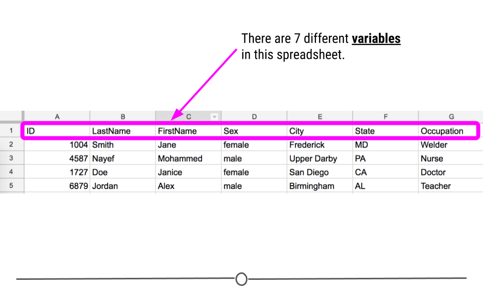

**Observations**

The measurements taken from a person for each variable are called *observations.* Observations in a tidy dataset are stored in a single row, with each observation being put in the appropriate column for each variable. 

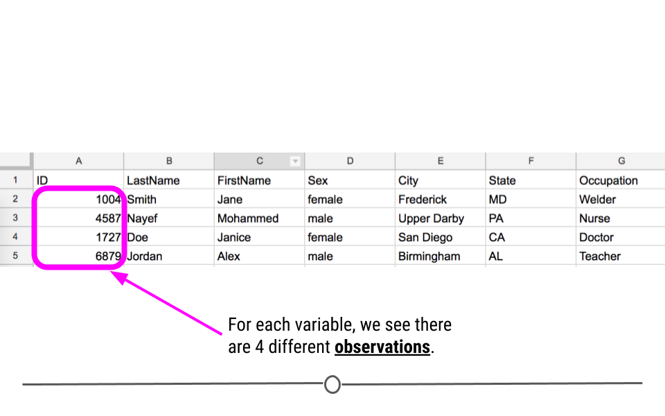

**Types**

Often, data are collected for the same individuals from multiple sources. For example, when you go to the doctor's office, you fill out a survey about yourself. That would count as one type of data. The measurements a doctor collects at your visit, however, would be a different type of data. 

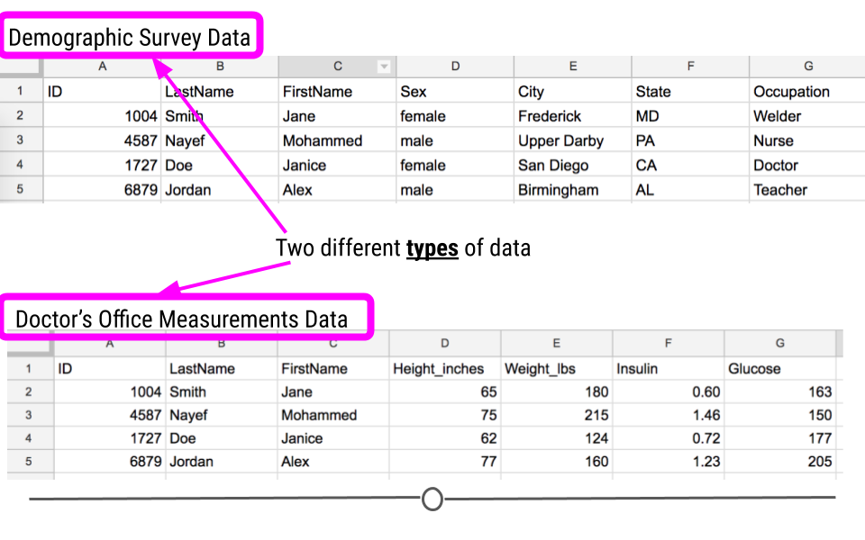

### Principles of Tidy Data

In Hadley Wickham's 2014 paper titled ["Tidy Data"](https://www.jstatsoft.org/article/view/v059i10), he explains:

> Tidy datasets are easy to manipulate, model and visualize, and have a specific structure: each variable is a column, each observation is a row, and each type of observational unit is a table.

These points are known as the tidy data principles. Here, we'll break down each one to ensure that we are all on the same page going forward.

1. Each variable you measure should be in one column.

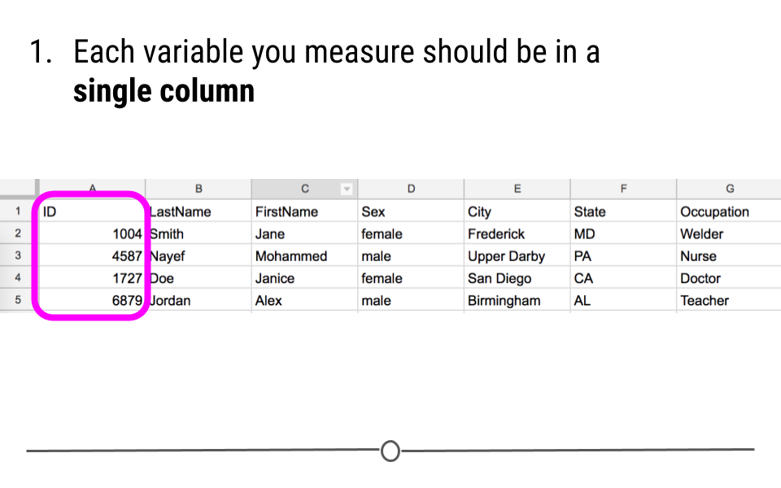

2. Each different observation of that variable should be in a different row.


3. There should be one table for each "type" of data.


4. If you have multiple tables, they should include a column in each spreadsheet (with the same column label!) that allows them to be joined or merged.

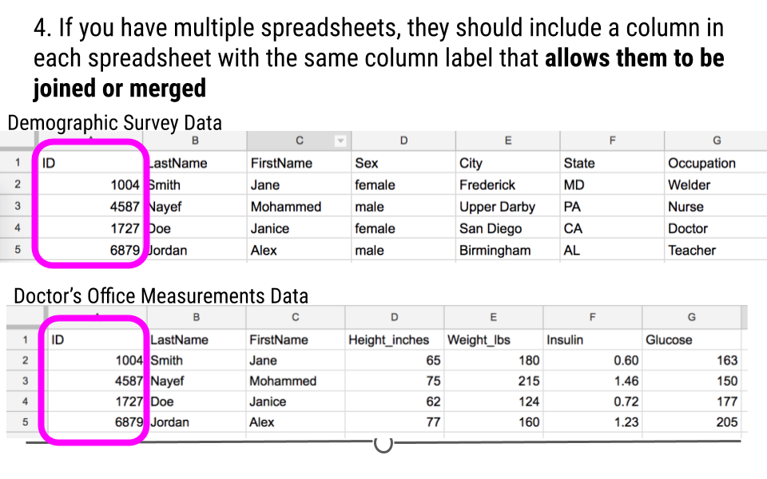

### Tidy Data Are Rectangular

When it comes to thinking about tidy data, remember that tidy data are rectangular data. The data should be a rectangle with each variable in a separate column and each entry in a different row. All cells should contain some text, so that the spreadsheet looks like a rectangle with something in every cell.


So, if you're working with a dataset and attempting to tidy it, if you don't have a rectangle at the end of the process, you likely have more work to do before it's truly in a tidy data format.

### Tidy Data Benefits

There are a number of benefits to working within a tidy data framework: 

1. Tidy data have a *consistent data structure* - This eliminates the *many* different ways in which data can be stored. By imposing a uniform data structure, the cognitive load imposed on the analyst is minimized for each new project.
2. Tidy data *foster tool development* - Software that all work within the tidy data framework can all work well with one another, even when developed by different individuals, ultimately increasing the variety and scope of tools available, without requiring analysts to learn an entirely new mental model with each new tool.
3. Tidy data require only a *small set of tools to be learned* - When using a consistent data format, only a small set of tools is required and these tools can be reused from one project to the next.
4. Tidy data allow for *datasets to be combined* - Data are often stored in multiple tables or in different locations. By getting each table into a tidy format, combining across tables or sources becomes trivial.

### Rules for Storing Tidy Data

In addition to the four tidy data principles, there are a number of rules to follow when entering data to be stored, or when re-organizing untidy data that you have already been given for a project into a tidy format. They are rules that will help make data analysis and visualization easier down the road. They were formalized in a paper called ["Data organization in spreadsheets"](https://peerj.com/preprints/3183/), written by two prominent data scientists, [Karl Broman](http://kbroman.org/) and [Kara Woo](http://karawoo.com/). In this paper, in addition to ensuring that the data are tidy, they suggest following these guidelines when entering data into spreadsheets:

1. Be consistent
2. Choose good names for things
3. Write dates as YYYY-MM-DD
4. No empty cells
5. Put just one thing in a cell
6. Don't use font color or highlighting as data
7. Save the data as plain text files

We'll go through each of these to make sure we're all clear on what a great tidy spreadsheet looks like.

#### Be consistent

Being consistent in data entry and throughout an analysis is key. It minimizes confusion and makes analysis simpler. For example, here we see sex is coded as "female" or "male." Those are the only two ways in which sex was entered into the data. This is an example of consistent data entry. You want to avoid sometimes coding a female's sex as "female" and then entering it as "F" in other cases. Simply, you want to pick a way to code sex and stick to it. 

With regard to entering a person's sex, we were talking about how to code observations for a specific variable; however, consistency also matters when you're choosing how to name a variable. If you use the variable name "ID" in one spreadsheet, use the same variable name ("ID") in the next spreadsheet. Do not change it to "id" (capitalization matters!) or "identifier" or anything else in the next spreadsheet. Be consistent!

Consistency matters across every step of the analysis. Name your files in a consistent format. Always code dates in a consistent format (discussed further below). Avoid extra spaces in cells. Being careful and consistent in data entry will be incredibly helpful when you get to the point of analyzing your data.


#### Choose good names for things

Choosing good variable names is important. Generally, avoid spaces in variable names and file names. You'll see why this is important as we learn more about programming, but for now, know that "Doctor Visit 1" is not a good file name. "doctor_visit_v1" is much better. Stick to using underscores instead of spaces or any other symbol when possible. The same thing goes for variable names. "FirstName" is a good variable name while "First Name" with a space in the middle of it is not. 

Additionally, make sure that file and variable names are as short as possible while still being meaningful. "F1" is short, but it doesn't really tell you anything about what is in that file. "doctor_visit_v1" is a more meaningful file name. We know now that this spreadsheet contains information about a doctor's visit. 'v1' specifies version 1 allowing for updates to this file later which would create a new file "doctor_visit_v2." 


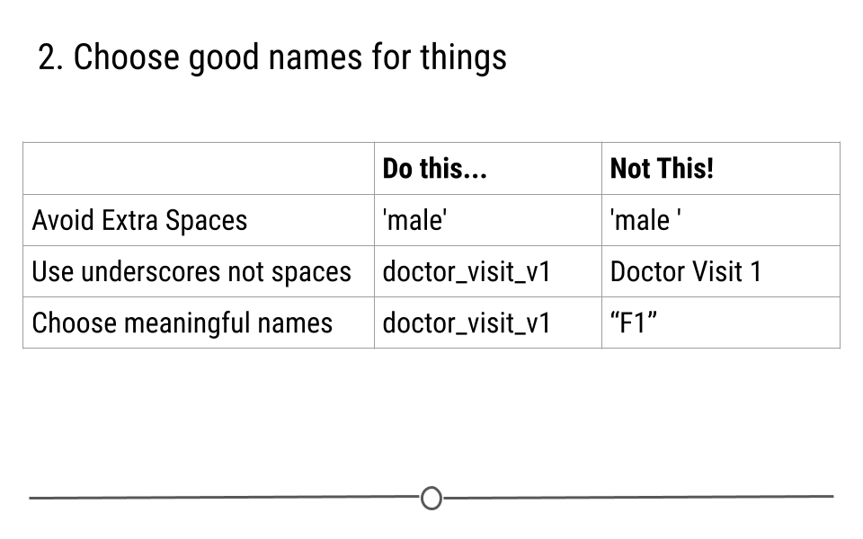

#### Write dates as YYYY-MM-DD

When entering dates, there is a global [ISO 8601](https://en.wikipedia.org/wiki/ISO_8601) standard. Dates should be encoded YYYY-MM-DD. For example if you want to specify that a measurement was taken on February 27th, 2018, you would type 2018-02-27. YYYY refers to the year, 2018. MM refers to the month of February, 02. And DD refers to the day of the month, 27. This standard is used for dates for two main reason. First, it avoids confusion when sharing data across different countries, where date conventions can differ. By all using ISO 8601 standard conventions, there is less room for error in interpretation of dates. Secondly, spreadsheet software often mishandles dates and assumes that non-date information are actually dates and vice versa. By encoding dates as YYYY-MM-DD, this confusion is minimized. 


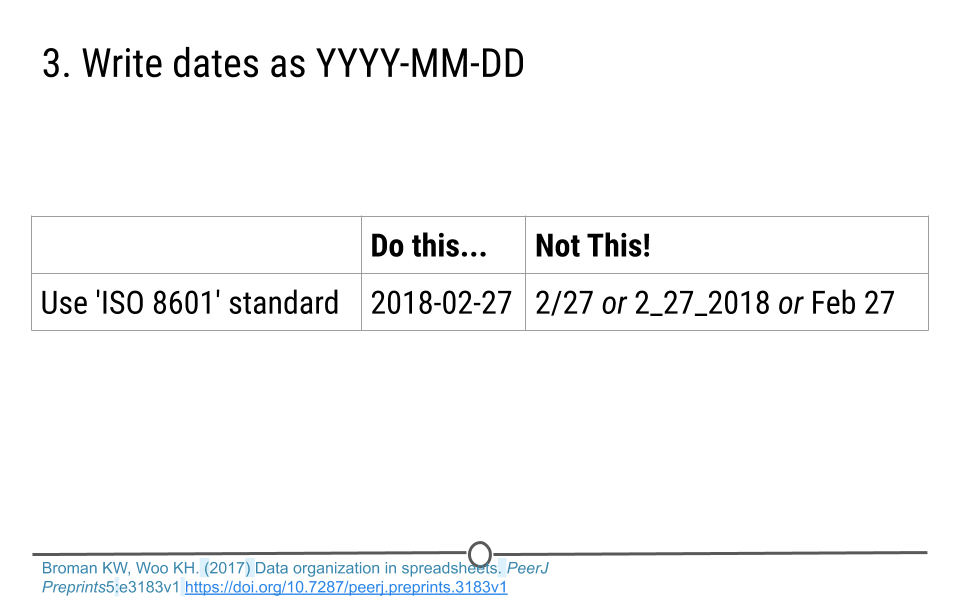

#### No empty cells

Simply, fill in every cell. If the data is unknown for that cell, put `NA`. Without information in each cell, the analyst is often left guessing. In the spreadsheets below, on the left, is the analyst to assume that the empty cells should use the date from the cell above? Or are we to assume that the date for that measurement is unknown? Fill in the date if it is known or type 'NA' if it is not. That will clear up the need for any guessing on behalf of the analyst. On the spreadsheet to the right, the first two rows have a lot of empty cells. This is problematic for the analysis. This spreadsheet does not follow the rules for tidy data. There is not a single variable per column with a single entry per row. These data would have to be reformatted before they could be used in analysis.


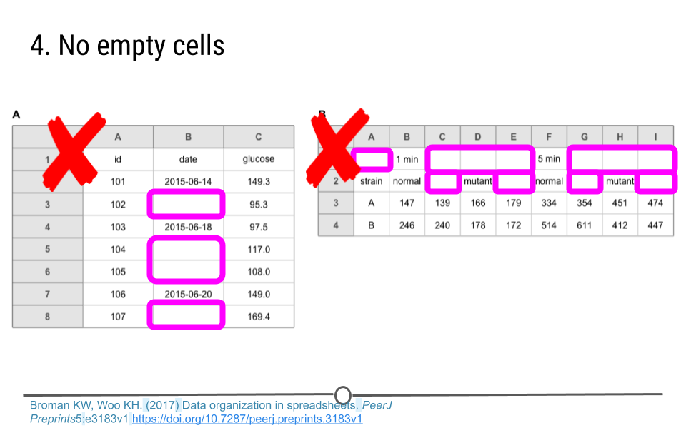

#### Put just one thing in a cell

Sometimes people are tempted to include a number and a unit in a single cell. For weight, someone may *want* to put '165 lbs' in that cell. Avoid this temptation! Keep numbers and units separate. In this case, put one piece of information in the cell (the person's weight) and either put the unit in a separate column, or better yet, make the variable name weight_lbs. That clears everything up for the analyst and avoids a number and a unit from both being put in a single cell. As analysts, we prefer weight information to be in number form if we want to make calculations or figures. This is facilitated by the first column called "Weight_lbs" because it will be read into R as a numeric object. The second column called "Weight", however, will be read into R as a character object because of the "lbs", which makes our desired tasks more difficult.


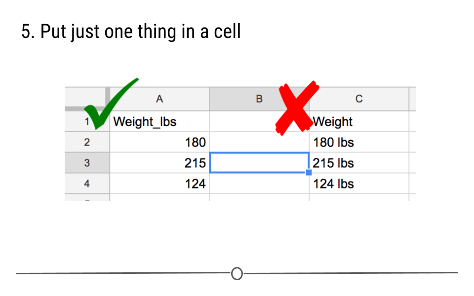

#### Don't use font color or highlighting as data

Avoid the temptation to highlight particular cells with a color to specify something about the data. Instead, add another column to convey that information. In the example below, 1.1 looks like an incorrect value for an individual's glucose measure. Instead of highlighting the value in red, create a new variable. Here, on the right, this column has been named 'outlier.' Including 'TRUE' for this individual suggests that this individual may be an outlier to the data analyst. Doing it in this way ensures that this information will not be lost. Using font color or highlighting however can easily be lost in data processing, as you will see in future lessons.


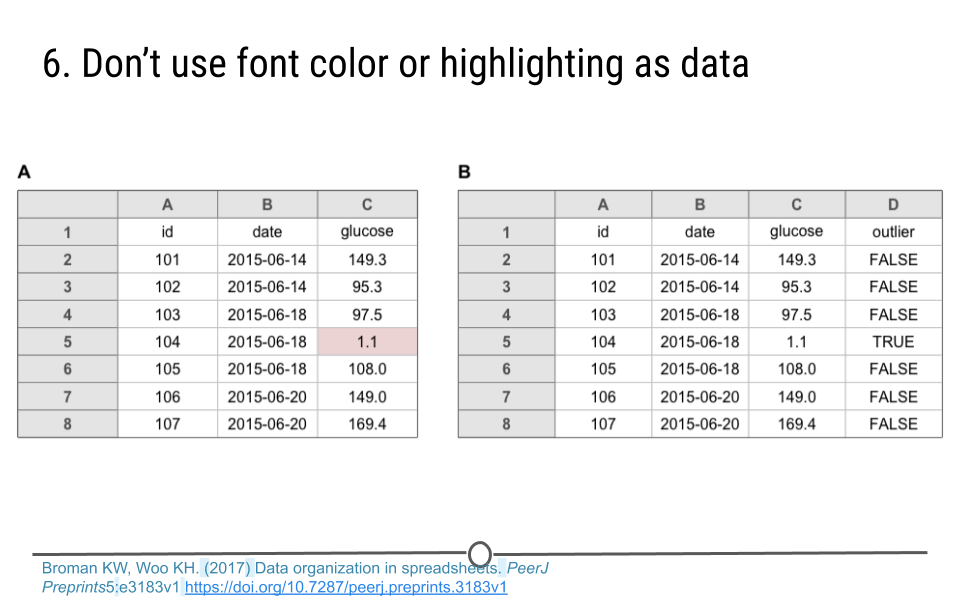

#### Save the data as plain text files

The following lessons will go into detail about which file formats are ideal for saving data, such as text files (.txt) and comma-delimited files (.csv). These file formats can easily be opened and will never require special software, ensuring that they will be usable no matter what computer or analyst is looking at the data.

#### Summary

The data entry guidelines discussed in and a few additional rules have been summarized below and are [available online for reference](https://doi.org/10.7287/peerj.preprints.3139v5).

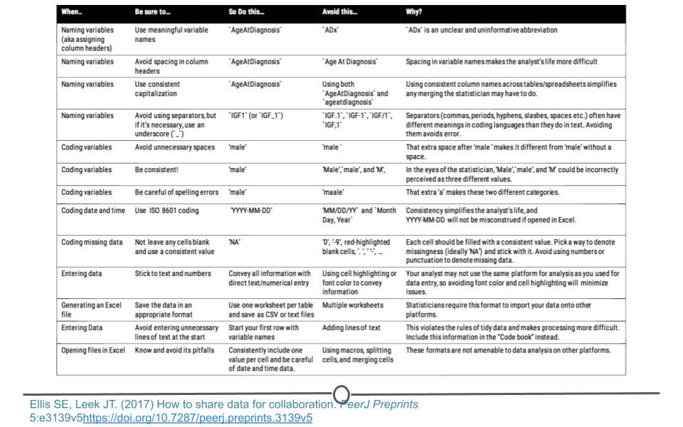


## From Non-Tidy --> Tidy

The reason it's important to discuss what tidy data are an what they look like is because out in the world, most data are untidy. If you are not the one entering the data but are instead handed the data from someone else to do a project, more often than not, those data will be untidy. Untidy data are often referred to simply as messy data. In order to work with these data easily, you'll have to get them into a tidy data format. This means you’ll have to fully recognize untidy data and understand how to get data into a tidy format.

The following common problems seen in messy datasets again come from [Hadley Wickham's paper on tidy data](http://vita.had.co.nz/papers/tidy-data.pdf). After briefly reviewing what each common problem is, we will then take a look at a few messy datasets. We'll finally touch on the concepts of tidying untidy data, but we won't actually do any practice *yet*. That's coming soon! 

### Common problems with messy datasets

1. Column headers are values but should be variable names.
2. A single column has multiple variables.
3. Variables have been entered in both rows and columns.
4. Multiple "types" of data are in the same spreadsheet.
5. A single observation is stored across multiple spreadsheets.

### Examples of untidy data

To see some of these messy datasets, let's explore three different sources of messy data.

#### Examples from [Data Organization in Spreadsheets](https://peerj.com/preprints/3183/)

In each of these examples, we see the principles of tidy data being broken. Each variable is not a unique column. There are empty cells all over the place. The data are not rectangular. Data formatted in these messy ways are likely to cause problems during analysis.


For a specific example, [Miles McBain](https://milesmcbain.github.io/), a data scientist from Brisbane, Australia set out to analyze Australian survey data on Same Sex marriage. Before he could do the analysis, however, he had a lot of tidying to do. He annotated all the ways in which the data were untidy, including the use of commas in numerical data entry, blank cells, junk at the top of the spreadsheet, and merged cells. All of these would have stopped him from being able to analyze the data had he not taken the time to first tidy the data. Luckily, he wrote a [Medium piece](https://medium.com/@miles.mcbain/tidying-the-australian-same-sex-marriage-postal-survey-data-with-r-5d35cea07962) including all the steps he took to tidy the data. 

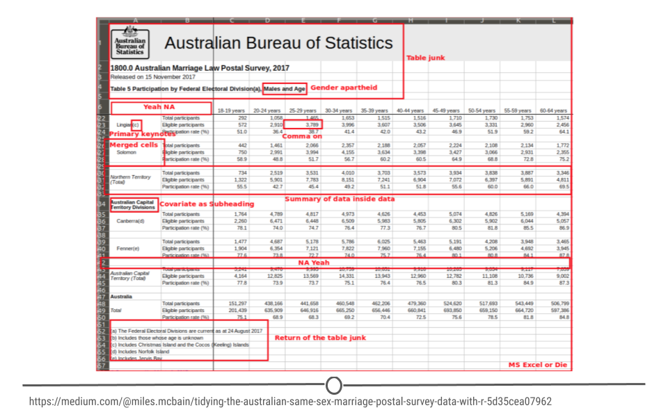

Inspired by Miles' work, Sharla Gelfand decided to tackle a messy dataset from Toronto's open data. She similarly outlined all the ways in which the data were messy including: names and addresses across multiple cells in the spreadsheet, merged column headings, and lots of blank cells. She has also included the details of how she cleaned these data [in a blog post](https://sharlagelfand.netlify.com/posts/tidying-toronto-open-data/). While the details of the code may not make sense yet, it will shortly as you get more comfortable with the programming language, R.


### Tidying untidy data

There are a number of actions you can take on a dataset to tidy the data depending on the problem. These include: filtering, transforming, modifying variables, aggregating the data, and sorting the order of the observations. There are functions to accomplish each of these actions in R. While we'll get to the details of the code in a few lessons, it's important at this point to be able to identify untidy data and to determine what needs to be done in order to get those data into a tidy format. Specifically, we will focus on a single messy dataset. This is dataset D from the 'Data Organization in Spreadsheets' example of messy data provided above. We note that there are blank cells and that the data are not rectangular.


To address this, these data can be split into two different spreadsheets, one for each type of data. Spreadsheet A includes information about each sample. Spreadsheet B includes measurements for each sample over time. Note that both spreadsheets have an 'id' column so that the data can be merged if necessary during analysis. The 'note' column does have some missing data. Filling in these blank cells with 'NA' would fully tidy these data. We note that sometimes a single spreadsheet becomes two spreadsheets during the tidying process. This is OK as long as there is a consistent variable name that links the two spreadsheets!


## The Data Science Life Cycle

Now that we have an understanding of what tidy data are, it's important to put them in context of the data science life cycle. We mentioned this briefly earlier, but the data science life cycle starts with a question and then uses data to answer that question. The focus of this specialization is mastering all the steps in between formulating a question and finding an answer. There have been a number of charts that have been designed to capture what these in-between steps are.

The most famous is likely this version from [R for Data Science](https://r4ds.had.co.nz). This version highlights import and tidying as important steps in the pipeline. It also captures the fact that visualization, data transformation, and modeling are often an iterative process before one can arrive at an answer to their question of interest.

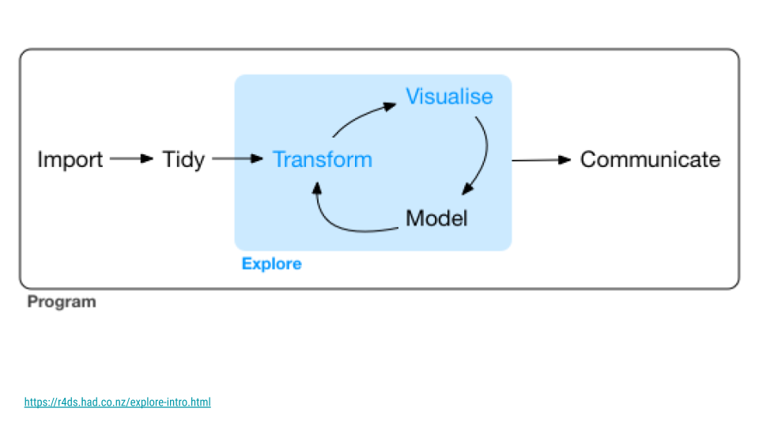

Others have set out to design charts to explain all the steps in between asking and answering question. They are all similar but have different aspects of the process they highlight and/or on which they focus. These have been summarized in [A First Course on Data Science](https://doi.org/10.1080/10691898.2019.1623136).

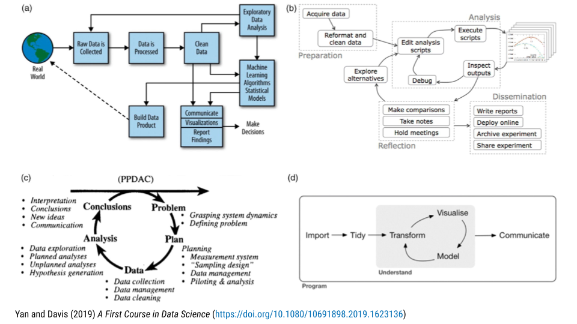

Regardless of which life cycle chart you like best, when it comes down to answering a data science question, **importing**, **tidying**, **visualizing**, and **analyzing** the data are important parts of the process. It's these four parts of the pipeline that we'll cover throughout this specialization.

## The Tidyverse Ecosystem

With a solid understanding of tidy data and how tidy data fit into the data science life cycle, we'll take a bit of time to introduce you to the tidyverse and tidyverse-adjacent packages that we'll be teaching and using throughout this specialization. Taken together, these packages make up what we're referring to as the **tidyverse ecosystem**. The purpose for the rest of this course is not for you to understand *how* to use each of these packages (that's coming soon!), but rather to help you familiarize yourself with which packages fit into which part of the data science life cycle.

Note that the official tidyverse packages below are **bold**. All other packages are tidyverse-adjacent, meaning they follow the same conventions as the official tidyverse packages and work well within the tidy framework and structure of data analysis.

### Reading Data into R

After identifying a question that can be answered using data, there are *many* different ways in which the data you'll want to use may be stored. Sometimes information is stored within an Excel spreadsheet. Other times, the data are in a table on a website that needs to be scraped. Or, in a CSV file. Each of these types of data files has their own structure, but R can work with all of them. To do so, however, requires becoming familiar with a few different packages. Here, we'll discuss these packages briefly. In later courses in the specialization we'll get into the details of what characterizes each file type and how to use each packages to read data into R.

#### **`tibble`**

While not technically a package that helps read data into R, `tibble` is a package that re-imagines the familiar R data.frame. It is a way to store information in columns and rows, but does so in a way that addresses problems earlier in the pipeline. 

From the [`tibble` website](https://tibble.tidyverse.org/):

> A tibble, or tbl_df, is a modern reimagining of the data.frame, keeping what time has proven to be effective, and throwing out what is not. Tibbles are data.frames that are lazy and surly: they do less (i.e. they don’t change variable names or types, and don’t do partial matching) and complain more (e.g. when a variable does not exist). This forces you to confront problems earlier, typically leading to cleaner, more expressive code. Tibbles also have an enhanced print() method which makes them easier to use with large datasets containing complex objects.

In fact, when working with data using the tidyverse, you'll get very comfortable working with tibbles.

#### **`readr`**

`readr` is a package that users of the tidyverse use all the time. It helps read rectangular data into R. If you find yourself working with CSV files frequently, then you'll find yourself using readr regularly.

According to the [`readr` website](https://readr.tidyverse.org/): 

> The goal of `readr` is to provide a fast and friendly way to read rectangular data (like csv, tsv, and fwf). It is designed to flexibly parse many types of data found in the wild, while still cleanly failing when data unexpectedly changes. If you are new to readr, the best place to start is the data import chapter in R for data science.


#### googlesheets

[`googlesheets`](https://github.com/jennybc/googlesheets) is a brilliant package that allows users to "access and manage Google spreadsheets from R." As more and more data is saved in the cloud (rather than on local computers), packages like googlesheets become invaluable. If you store data on Google Sheets or work with people who do, this package will be a lifesaver.

#### **`readxl`**

Another package for working with tabular data is `readxl`, which is specifically designed to move data from Excel into R. If many of your data files have the .xls or .xlsx extension, familiarizing yourself with this package will be helpful.

From the [`readxl` website](https://readxl.tidyverse.org/):

> The readxl package makes it easy to get data out of Excel and into R. Compared to many of the existing packages (e.g. `gdata`, `xlsx`, `xlsReadWrite`) `readxl` has no external dependencies, so it’s easy to install and use on all operating systems. It is designed to work with tabular data.


#### **`googledrive`**

Similar to `googlesheets`, but for interacting with file on Google Drive from R (rather than just Google Sheets), the [`googledrive`](https://googledrive.tidyverse.org/) package is an important package for working with data in R.


#### **`haven`**

If you are a statistician (or work with statisticians), you've likely heard of the statistical packages SPSS, Stata, and SAS. Each of these has data formats for working with data that are compatible only with their platform. However, there is an R package that allows you to use read stored in these formats into R. For this, you'll need [`haven`](https://haven.tidyverse.org/).


#### **`jsonlite` & `xml2`**

Data stored on and retrieved from the Internet are often stored in one of the two most common semi-structured data formats: JSON or XML. We'll discuss the details of these when we discuss how to use [`jsonlite`](https://github.com/jeroen/jsonlite#jsonlite) and [`xml2`](https://github.com/r-lib/xml2), which allow data in the JSON and XML formats, respectively, to be read into R. `jsonlite` helps extensively when working with Application Programming Interfaces (APIs) and `xml2` is incredibly helpful when working with HTML.


#### **`rvest`**

If you are hoping to scrape data from a website, [`rvest`](https://github.com/tidyverse/rvest) is a package with which you'll want to become familiar. It allows you to scrape information directly from web pages on the Internet.


#### **`httr`**

Companies that share data with users often do so using Application Programming Interfaces or APIs. We've mentioned that these data are often stored in the JSON format, requiring packages like jsonlite to work with the data. However, to retrieve the data in the first place, you'll use [`httr`](https://github.com/r-lib/httr). This package helps you interact with modern web APIs.


### Data Tidying

There are *loads* of ways in which data and information are stored on computers and the Internet. We've reviewed that there are a number of packages that you'll have to use depending on the type of data you need to get into R. However, once the data are in R, the next goal is to tidy the data. This process is often referred to as data wrangling or data tidying. Regardless of what you call it, there are a number of packages that will help you take the untidy data you just read into R and convert it into the flexible and usable tidy data format.

#### **`dplyr`**

The most critical package for wrangling data is `dplyr`. Its release completely transformed the way many R users write R code and work with data, greatly simplifying the process.

According to the [`dplyr` website](https://dplyr.tidyverse.org/)

> dplyr is a grammar of data manipulation, providing a consistent set of verbs that help you solve the most common data manipulation challenges. 

`dplyr` is built around five primary verbs (mutate, select, filter, summarize, and arrange) that help make the data wrangling process simpler. This specialization will cover these verbs among other functionality within the `dplyr` package.

#### **`tidyr`**

Like `dplyr`, `tidyr` is a package with the primary goal of helping users take their untidy data and make it tidy. 

According to the [`tidyr` website](https://tidyr.tidyverse.org/):

> The goal of `tidyr` is to help you create tidy data. Tidy data is data where: each variable is in a column, each observation is a row, and each value is a cell. Tidy data describes a standard way of storing data that is used wherever possible throughout the `tidyverse`. If you ensure that your data is tidy, you’ll spend less time fighting with the tools and more time working on your analysis.

#### **`janitor`**

In addition to `dplyr` and `tidyr`, a common `tidyverse`-adjacent package used to clean dirty data and make users life easier while doing so is `janitor`.

According to the [`janitor` website](https://github.com/sfirke/janitor):

> janitor has simple functions for examining and cleaning dirty data. It was built with beginning and intermediate R users in mind and is optimized for user-friendliness. Advanced R users can already do everything covered here, but with janitor they can do it faster and save their thinking for the fun stuff.


#### **`forcats`**

R is known for its ability to work with categorical data (called factors); however, they have historically been more of a necessary evil than a joy to work with. Due to the frustratingly hard nature of working with factors in R, the `forcats` package developers set out to make working with categorical data simpler.

According to the [`forcats` website](https://forcats.tidyverse.org/)

> The goal of the forcats package is to provide a suite of tools that solve common problems with factors, including changing the order of levels or the values.


#### **`stringr`**

Similar to `forcats`, but for strings, the `stringr` package makes common tasks simple and streamlined. Working with this package becomes easier with some knowledge of regular expressions, which we'll cover in this specialization.

According to the [`string` website](https://stringr.tidyverse.org/)

> Strings are not glamorous, high-profile components of R, but they do play a big role in many data cleaning and preparation tasks. The stringr package provide a cohesive set of functions designed to make working with strings as easy as possible.


#### **`lubridate`**

The final common package dedicated to working with a specific type of variable is `lubridate`, which makes working with dates and times simpler. Working with dates and times has historically been difficult due to the nature of our calendar, with its varying number of days per month and days per year, and due to time zones, which can make working with times infuriating. The `lubridate` developers aimed to make working with these types of data simpler.

According to the [`lubridate` website](https://lubridate.tidyverse.org/)

> Date-time data can be frustrating to work with in R. R commands for date-times are generally unintuitive and change depending on the type of date-time object being used. Moreover, the methods we use with date-times must be robust to time zones, leap days, daylight savings times, and other time related quirks, and R lacks these capabilities in some situations. `Lubridate` makes it easier to do the things R does with date-times and possible to do the things R does not.

#### **`glue`**

The [`glue`](https://glue.tidyverse.org/) package makes working with interpreted string literals simpler. We'll discuss this package in detail in this specialization.

#### **`skimr`**

After you've got your data into a tidy format and all of your variable types have been cleaned, the next step is often summarizing your data. If you've used the `summary()` function in R before, you're going to love `skimr`, which summarizes entire data frames for you in a tidy manner. 

According to the [*skimr*](https://github.com/ropensci/skimr) package:

> `skimr` provides a frictionless approach to summary statistics which conforms to the principle of least surprise, displaying summary statistics the user can skim quickly to understand their data.

#### **`tidytext`**

While working with factors, numbers, and small strings is common in R, longer texts have historically been analyzed using approaches outside of R. However, once `tidytext` was developed, R had a tidy approach to analyzing text data, such as novels, news stories, and speeches.

According to the [`tidytext` website](https://github.com/juliasilge/tidytext):


> In this package, we provide functions and supporting data sets to allow conversion of text to and from tidy formats, and to switch seamlessly between tidy tools and existing text mining packages. 


#### **`purrr`**

The final package we'll discuss here for data tidying is `purrr`, a package for working with functions and vectors in a tidy format. If you find yourself writing for loops to iterate through data frames, then purrr will save you a ton of time!

According to the [`purrr` website](https://purrr.tidyverse.org/):

> `purrr` enhances R’s functional programming (FP) toolkit by providing a complete and consistent set of tools for working with functions and vectors. If you’ve never heard of FP before, the best place to start is the family of `map()` functions which allow you to replace many for loops with code that is both more succinct and easier to read.


### Data Visualization 

Data Visualization is a critical piece of any data science project. Once you have your data in a tidy format, you'll first explore your data, often generating a number of basic plots to get a better understanding of your dataset. Then, once you've carried out your analysis, creating a few detailed and well-designed visualizations to communicate your findings is necessary. Fortunately, there are a number of helpful packages to create visualizations.

#### **`ggplot2`**

The most critical package when it comes to plot generation in data visualization is `ggplot2`, a package that allows you to quickly create plots and meticulously customize them depending on your needs.   

According to the [`ggplot2` website](https://ggplot2.tidyverse.org/):

> `ggplot2` is a system for declaratively creating graphics, based on [The Grammar of Graphics](http://amzn.to/2ef1eWp). You provide the data, tell ggplot2 how to map variables to aesthetics, what graphical primitives to use, and it takes care of the details.

This package will be covered in a great amount of detail in this specialization, largely due to the fact that you'll find yourself using it all the time. Having a strong foundation of how to use `ggplot2` is incredibly important for any data science project.

#### **`kableExtra`**

While the ability to make beautiful and informative plots is essential, tables can be incredibly effective vehicles for the conveyance of information. Customizing plots can be done using the `kableExtra` package, which is built on top of the `knitr()` function from the `kable` package, which generates basic tables. [`kableExtra`](https://github.com/haozhu233/kableExtra) allows complex and detailed tables to be built using a `ggplot2`-inspired syntax.

#### **`ggrepel`**

Due to the popularity of `ggplot2`, there are a number of `tidyverse`-adjacent packages built on top of and within the `ggplot2` framework. [`ggrepel`](https://github.com/slowkow/ggrepel) is one of theses packages that "provides geoms for `ggplot2` to repel overlapping text labels."

#### **`cowplot`**

**`cowplot`** is another `tidyverse`-adjacent package that helps you to polish and put finishing touches on your plots. 

According to the [`cowplot`](https://github.com/wilkelab/cowplot) developers:

> The `cowplot` package provides various features that help with creating publication-quality figures, such as a set of themes, functions to align plots and arrange them into complex compound figures, and functions that make it easy to annotate plots and or mix plots with images.

#### **`patchwork`**

The [`patchwork`](https://patchwork.data-imaginist.com/) package is similar to `cowplot` and is an excellent option for combining multiple plots together. 

#### **`gganimate`**

Beyond static images, there are times when we want to display changes over time or other visualizations that require animation. The `gganimate` package enables animation on top of `ggplot2` plots. 

According to the [`gganimate` website](https://gganimate.com/):

> `gganimate` extends the grammar of graphics as implemented by `ggplot2` to include the description of animation. It does this by providing a range of new grammar classes that can be added to the plot object in order to customize how it should change with time.

### Data Modeling 

Once data have been read in, tidied, and explored, the last step to answering your question and before communicating your findings is data modeling. In this step, you're carrying out an analysis to answer your question of interest. There are a number of helpful suites of R packages. 

#### The `tidymodels` ecosystem

When it comes to predictive analyses and machine learning, there is a suite of packages called `tidymodels`. 

The `tidymodels` ecosystem contains packages for data splitting, preprocessing, model fitting, performance assessment and more. 

The great advantage is that is allows for users to use predictive algorithms that were written across dozens of different R packages and makes them all usable with a standard syntax. 


#### Inferential packages: `broom` and `infer`
When carrying out inferential analyses the [`tidymodels`](https://github.com/tidymodels) suite of tidyverse-adjacent packages is essential. 

[`broom`](https://broom.tidyverse.org/) which happens to be an official `tidyverse` package and part of the `tidymodels` suite takes statistical analysis objects from R (think the output of your `lm()` function) and converts them into a tidy data format. This makes obtaining the information you're most interested in from your statistical models much simpler. 

Similarly, [`infer`](https://github.com/tidymodels/infer) sets out to perform statistical inference using a standard statistical grammar. Historically, the syntax varied widely from one statistical test to the next in R. The `infer` package sets out to standardize the syntax, regardless of the test.


#### tidyverts: tsibble, feasts, and fable

While many datasets are like a snapshot in time - survey data collected once or contact information from a business - time series data are unique. Time series datasets represent changes over time and require computational approaches that are unique to this fact. A suite of tidyverse-adjacent packages called [`tidyverts`](https://github.com/tidyverts) have been developed to enable and simplify tidy time series analyses in R. Among these are `tsibble`, `feasts`, and `fable`.

A `tsibble` is the time-series version of a tibble in that is provides the data.frame-like structure most useful for carrying out tidy time series analyses.

According to the [`tsibble` website](https://tsibble.tidyverts.org/):

> The *tsibble* package provides a data infrastructure for tidy temporal data with wrangling tools. Adhering to the tidy data principles, tsibble is an explicit data- and model-oriented object.

The `feasts` package is most helpful when it comes to the modeling step in time series analyses.  

According to the [`feasts` website](https://feasts.tidyverts.org):

> Feasts provides a collection of tools for the analysis of time series data. The package name is an acronym comprising of its key features: Feature Extraction And Statistics for Time Series.

The `fable` package is most helpful when it comes to the modeling step in forecasting analyses.  

According to the [`fable` website](https://fable.tidyverts.org/):

> The R package fable provides a collection of commonly used univariate and multivariate time series forecasting models including exponential smoothing via state space models and automatic ARIMA modelling. These models work within the fable framework, which provides the tools to evaluate, visualize, and combine models in a workflow consistent with the tidyverse.


## Data Science Project Organization

Data science projects vary quite a lot so it can be difficult to give universal rules for how they should be organized. However, there are a few ways to organize projects that are commonly useful. In particular, almost all projects have to deal with files of various sorts---data files, code files, output files, etc. This section talks about how files work and how projects can be organized and customized.

### RStudio Projects

Creating [RStudio projects](https://support.rstudio.com/hc/en-us/articles/200526207-Using-Projects) can be very helpful for organizing your code and any other files that you may want to use in one location together. 

New projects can be created by clicking on the RStudio Projects button in RStudio:


This will create a special file with the .Rproj extension. This file tells RStudio to identify the directory containing the .Rproj file as the main directory for that R Project. A new session of RStudio will be started when a user opens an R project from this main directory. The previous state including settings of that project will be maintained from one time to the next. The files that were open the last time the user worked on the project will automatically be opened again. Other packages like the `here` package will also recognize the .Rproj file to make analyses easier for the user. We will explain how this package works in the next section.


### File Paths

Since we're assuming R knowledge in this course, you're likely familiar with file paths. However, this information will be critical at a number of points throughout this course, so we want to quickly review relative and absolute file paths briefly before moving on.

In future courses, whenever you write code and run commands within R to work with data, or whenever you use Git commands to document updates to your files, you will be working *in a particular location*. To know your location within a file system is to know exactly what folder you are in right now. The folder that you are in right now is called the **working directory**. Your current working directory in the Terminal may be different from your current working directory in R and may yet even be different from the folder shown in the Files pane of RStudio. The focus of this lesson is on the Terminal, so we will not discuss working directories within R until the next lesson.

Knowing your working directory is important because if you want to tell Terminal to perform some actions on files in other folders, you will need to be able to tell the Terminal where that folder is. That is, you will need to be able to specify a **path** to that folder. A path is a string that specifies a sequence of folders to traverse in order to end up at a final destination. The end of a path string may be a file name if you are creating a path to a file. If you are creating a path to a folder, the path string will end with the destination folder. In a path, folder names are separated by forward slashes `/`. For example, let's say that your current working directory in the Terminal is the `raw_code` directory, and you wish to navigate to the `exploratory` subfolder within the `figures` folder to see the graphics you've created.


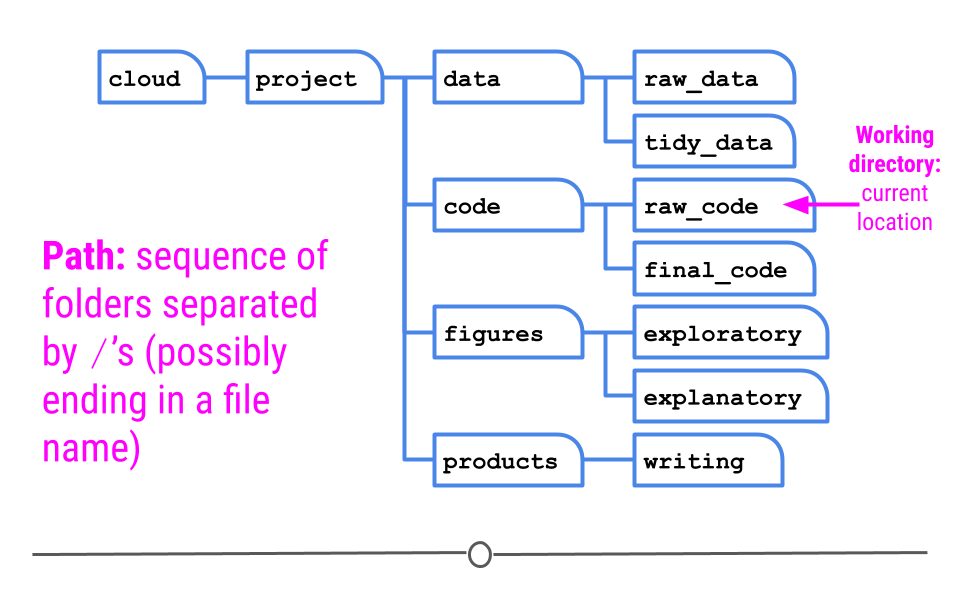

There are two types of paths that can lead to that location: **relative** and **absolute**.

#### Relative Paths

The first is called a **relative path** which gives a path to the destination folder based on where you are right now (in `raw_code`). ]


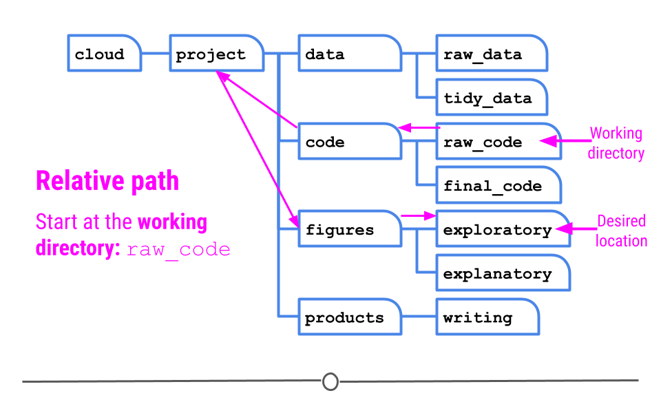

#### Absolute Paths

Alternatively, you can specify an **absolute path**. An absolute path starts at the **root directory** of a file system. The root directory does not have a name like other folders do. It is specified with a single forward slash `/` and is special in that it cannot be contained within other folders. In the current file system, the root directory contains a folder called `cloud`, which contains a folder called `project`.


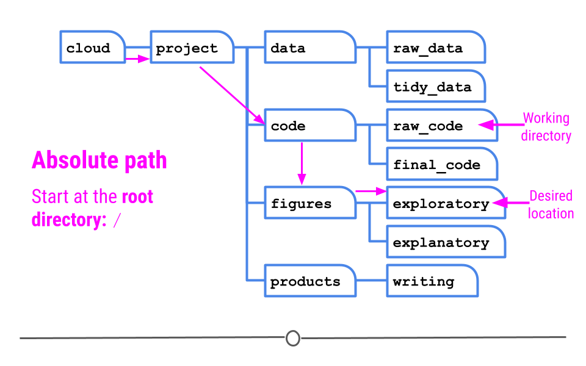

#### Path Summary

**Analogy**: The root directory is analogous to a town square, a universal starting location. The desired destination location might be the baker. An absolute path specifies how to reach the bakery starting from this universal starting location of the town square. However, if we are in the library right now, a relative path would specify how to reach the bakery from our current location in the library. This could be pretty different than the path from the town square.

Imagine that your friend plans to go from the town square, then to the library, and finally to the bakery. In this analogy, the town square represents the root directory, a universal starting location. If your friend is currently at the library and asks you for directions, you would likely tell them how to go from the library (where they are) to the bakery (where they want to go). This represents a **relative path** -- taking you from where you are currently to where you want to be. Alternatively, you could give them directions from the Town square, to the library, and then to the bakery. This represents an **absolute path**, directions that will always work in this town, no matter where you are currently, but that contain extra information given where your friend is currently.

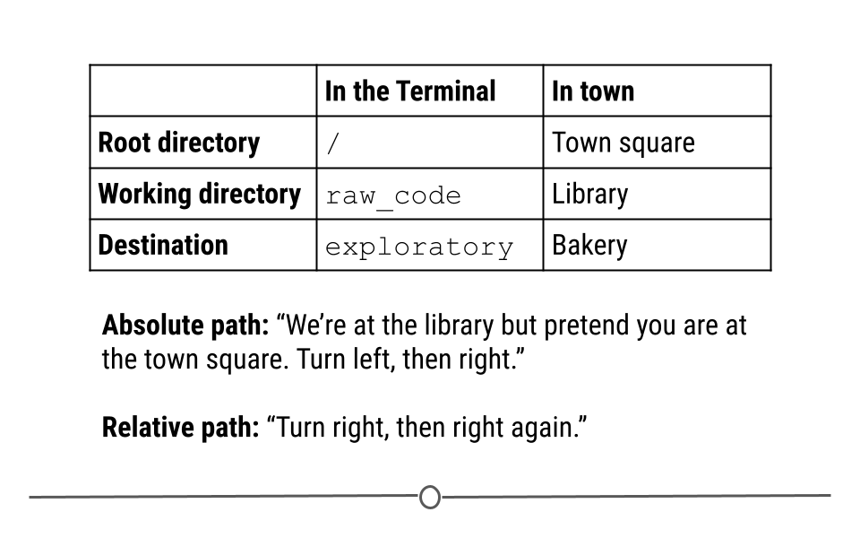

To summarize once more, **relative paths** give a path to the destination folder based on where you are right now (your current working directory) while **absolute paths** give a path to the destination folder based on the root directory of a file system. 


### The `here` package  

With most things in R, there's a package to help minimize the pain of working with and setting file paths within an R Project - the [`here`](https://github.com/r-lib/here) package. 

As a reminder, to get started using the `here` package (or any R package!), it first has to be installed (using the `install.packages()` function) and then loaded in (using the `library()` function). Note that the package name in the `install.packages()` function has to be in quotes but for `library()` it doesn't have to. The code to copy and paste into your R console is below:


```r
install.packages("here")
library(here)
```


`here` is a package specifically designed to help you deal with file organization when you're coding. This package allows you to define in which folder all your relative paths should begin within a project. The path of this folder will be displayed after typing `library(here)` or `here()`. 


#### Setting your project directory

After installing and loading the `here` package, to set your project directory using `here()`, you'll simply type the command `here()`. You'll notice that the output of `here()` and `getwd()` in this case is the same; however, what they're doing behind the scenes is different. 

* `getwd()` - shows the directory you are in currently
* `here()` - sets the directory to use for all future relative paths

The `here()` function is what you want to use to set your project directory so that you can use it for future relative paths in your code. While in this case it *also* happened to be in the same directory you were in, it doesn't have to be this way. The here() function looks to see if you have a .Rproj file in your project. It then sets your base directory to whichever directory that file is located. 


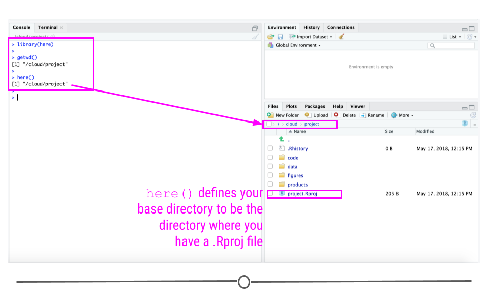

So, if we were to change our current directory and re-type `here()` in the Console, you'll note that the output from here() does not change because it's still looking for the directory where .Rproj is. 


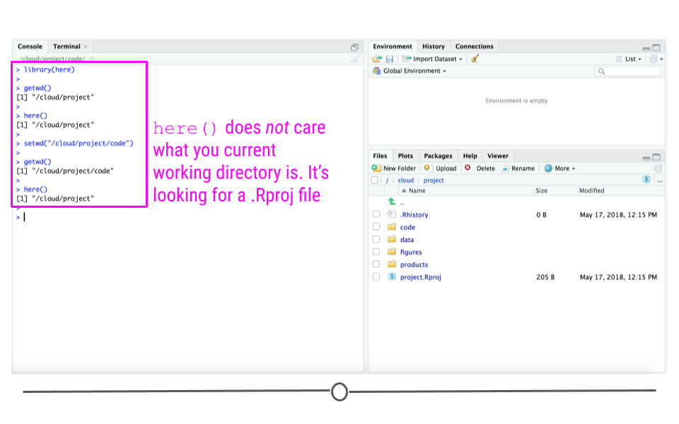

Note: In cases where there is no .Rproj file, `here()` will look for files other than a .Rproj file. You can read about those cases in the fine print [here](https://github.com/jennybc/here_here#the-fine-print). But for most of your purposes, `here()` will behave as we just discussed.


#### Get files paths using `here()`

After setting your project folder using `here()`, R will then know what folder to use to define any and all other paths within this project.

For example, if you wanted to include a path to a file named "intro_code.R" in your `raw_code` directory (which is in your code directory), you would simply specify that in your code like this:


```r
here("code", "raw_code", "intro_code.R")
```

This code says start from where I've already defined the project starts (`here()`), then look in the folders `code` and then `raw_code`, for the file "intro_code.R."

The syntax is simplified when using `here()`. Each subdirectory or file in the path is in quotes and simply separated by commas within the `here()` function, and voila you have the relative path you're looking for relative to `here()`.

The output from this code includes the correct file path to this file, just as you wanted!

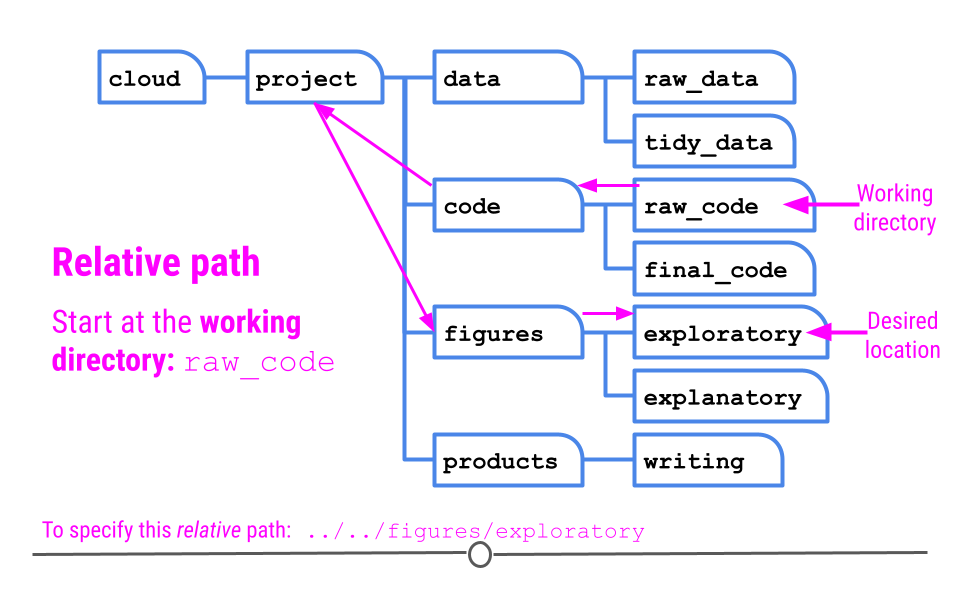

#### Save and load files using `here()`
Using the `here` package, files within the project can be saved or loaded by simply typing `here` (to replace the path to the project directory) and typing any subdirectories like in this example, where we want to save data to the raw_data directory within the data directory of the project: 


```r
save(introcode_data_object, file = here::here("data", "raw_data", "intro_code_object.rda"))
```

Or if we want to load this data:

```r
load(here::here("data", "raw_data", "intro_code_object.rda"))
```

Remember that the `::` notation indicates that we are using a function of a particular package. So the `here` package is indicated on the left of the `::` and the `here()` function is indicated on the right.

#### Where you should use this

You should use `here()` to set the base project directory for each data science project you do. And, you should use relative paths using `here()` throughout your code any time you want to refer to a different directory or sub-directory within your project using the syntax we just discussed. 

#### The utility of the `here` package

You may be asking, "Why do I need the `here` package?", and you may be thinking, "I can just write the paths myself or use the `setwd()` function".


[Jenny Bryan](https://github.com/jennybc), has several [reasons](https://www.tidyverse.org/blog/2017/12/workflow-vs-script/). We highly recommend checking them out.

In our own words:

1) It makes your project work more easily on someone else's machine - there is no need to change the working directory path with the `setwd()` function. Everything will be relative to the .Rproj containing directory.
2) It allows for your project to work more easily for you on your own machine - say your working directory was set to "/Users/somebody/2019_data_projects/that_big_project" and you decide you want to copy your scripts to be in  "/Users/somebody/2020_data_projects/that_big_project_again" to update a project for the next year with new data. You would need to update all of your scripts each time you set your working directory or load or save files. In some cases that will happen many times in a single project!
3) It saves time. Sometimes our directory structures are complicated and we can easily make a typo. The `here` package makes writing paths easier!

### File Naming

Having discussed the overall file structure and the `here` package, it's now important to spend a bit of time talking about file naming. It may not be the most *interesting* topic on its surface, but naming files well can save future you a lot of time and make collaboration with others a lot easier on everyone involved. By having descriptive and consistent file names, you'll save yourself a lot of headaches. 

#### Good File Names

One of the most frustrating things when looking at someone's data science project is to see a set of files that are completely scattered with names that don't make any sense. It also makes it harder to search for files if they don't have a consistent naming scheme. 

One of the best organized file naming systems is due to [Jenny Bryan](http://www2.stat.duke.edu/~rcs46/lectures_2015/01-markdown-git/slides/naming-slides/naming-slides.pdf) who gives three key principles of file naming for data science projects. Files should be:

* Machine readable
* Human readable
* Nicely ordered

If your files have these three characteristics, then it will be easy for you to search for them (machine readable), easy for you to understand what is in the files (human readable), and easy for you to glance at a whole folder and understand the organization (be nicely ordered). We'll now discuss some concrete rules that will help you achieve these goals. 

#### Machine readable files

The machine we are talking about when we say "machine readable" is a computer. To make a file machine readable means to make it easy for you to use the machine to search for it. Let's see which one of the following examples are good example of machine readable files and which are not. 

- Avoid spaces: *2013 my report.md* is a not good name but *2013_my_report.md* is.
- Avoid punctuation: *malik's_report.md* is not a good name but *maliks_report.md* is.
- Avoid accented characters: *01_zoë_report.md* is not a good name but *01_zoe_report.md* is.
- Avoid case sensitivity: *AdamHooverReport.md* is not a good name but *adam-hoover-report.md* is.
- Use delimiters: *executivereportpepsiv1.md* is not a good name but *executive_report_pepsi_v1.md* is.

So to wrap up, spaces, punctuations, and periods should be avoided but underscores and dashes are recommended. You should always use lowercase since you don't have to later remember if the name of the file contained lowercase or uppercase letters. Another suggestion is the use of delimiters (hyphens or underscores) instead of combining all the words together. The use of delimiters makes it easier to look for files on your computer or in R and to extract information from the file names like the image below.


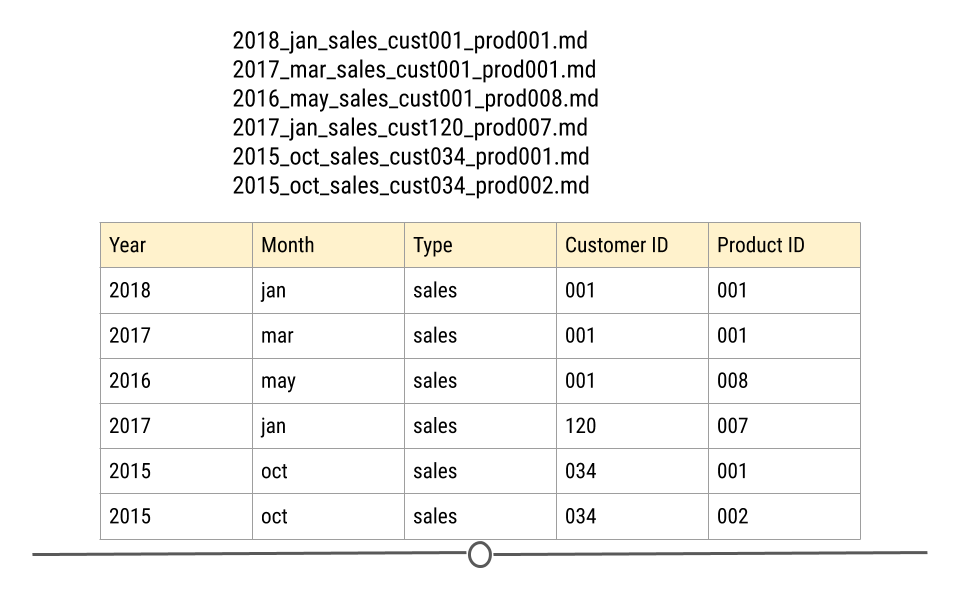

#### Human readable files

What does it mean for a file to be human readable? A file name is human readable if the name tells you something informative about the content of the file. For instance, the name `analysis.R` does not tell you what is in the file especially if you do multiple analyses at the same time. Is this analysis about the project you did for your client X or your client Y? Is it preliminary analysis or your final analysis? A better name maybe would be `2017-exploratory_analysis_crime.R`. The ordering of the information is mostly up to you but make sure the ordering makes sense. For better browsing of your files, it is better to use the dates and numbers in the beginning of the file name.


#### Be nicely ordered

By using dates, you can sort your files based on chronological order. Dates are preferred to be in the ISO8601 format. In the United States we mainly use the mm-dd-yyyy format. If we use this format for naming files, files will be first sorted based on month, then day, then year. However for browsing purposes it is better to sort files based on year, then month, and then day and, therefore, the yyyy-mm-dd format, also known as the ISO8601 format, is better. Therefore, `2017-05-21-analysis-cust001.R` is preferred to `05-21-2017-analysis-cust001.R`.

If dates are not relevant for your file naming, put something numeric first. For instance if you're dealing with multiple reports, you can add a reportxxx to the beginning of the file name so you can easily sort files by the report number.


In addition to making sure your files can be nicely ordered, always left-pad numbers with zeros. That is first set a max number of digits for your numbers determined by how many files you will potentially have. So if you may not have more than 1000 files you can choose three digits. If not more than a hundred you can choose two digits and so on. Once you know the number of digits, left-pad numbers with zeros to satisfy the number of digits you determined in the first step. In other words, if you're using three digits, instead of writing 1 write 001 and instead of writing 17 write 017.

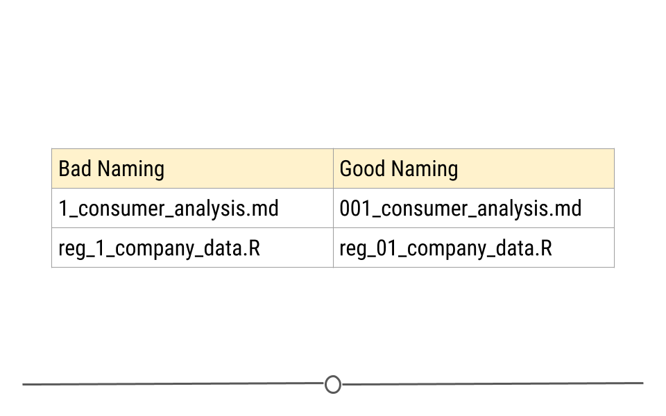

### Project Template: Everything In Its Place

When organizing a data science project all of your files need to be placed somewhere on your computer. While there is no universal layout for how to do this, most projects have some aspects in common. The `ProjectTemplate` package codifies some of these defaults into a usable file hierarchy so that you can immediately start placing files in the right place.

Here, we load the `ProjectTemplate` package and create a new project called `data_analysis` under the current working directory using the `minimal` template.


```r
library(ProjectTemplate)
create.project(project.name = "data_analysis",
               template = "minimal")
```

The `create.project()` function creates a directory called `data_analysis` for this project. Inside that directory are the following sub-directories (which we can view in the RStudio File browser):

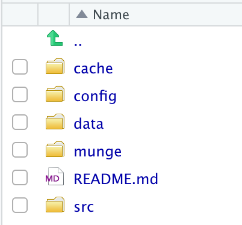

Inside each directory is a README file that contains a brief description of what kinds of files should go in this directory. If you do not need all of these directories, it is okay to leave them empty for now.

The `data` directory is most straightforward as it holds any data files (in any variety of formats) that will be needed for the project. The `munge` directory contains R code files that pre-process the data you will eventually use an any analysis. Any results from pre-processing can be stored in the `cache` directory if needed (for example, if the pre-processing takes a long time). Finally, the `src` directory contains R code for data analysis, such as fitting statistical models, computing summary statistics, or creating plots.

A benefit of the `ProjectTemplate` package is that it allows for a lot of customization. So if there is file/directory structure that you commonly use for your projects, then you can create a custom template that can be called everytime you call `create.project()`. Custom templates can be created with the `create.template()` function. For example, you might always want to have a directory called `plots` for saving plots made as part of the data analysis.

The `config` directory can contain configuration information for your project, such as any packages that need to be loaded for your code to work. We will not go into the details of this directory for now, but suffice it to say that there are many ways to customize your project. Lastly, the `load.project()` function can be used to "setup" your project each time you open it. For example, if you always need to execute some code or load some packages, calling `load.project()` with the right `config` settings will allow you to automate this process.


## Data Science Workflows

The phrase "data science workflow" describes the method or steps by which a data scientist might evaluate data to perform a data analysis from start to finish. In this course we will provide examples of workflows with real data. In general, workflows involve the following steps:

- Identifying a question of interest - determining if it is feasible
- Identifying data to answer that question
- Importing that data into a programming language such as R
- Cleaning / wrangling / and tiding the data
- Exploratory data analysis to get to know the data
- Data analysis to look for associations in the data
- Generation of data visualizations to demonstrate findings
- Communication of your analysis and findings
        
We will demonstrate potential ways of organizing a workflow using real data from the [Open Case Studies](https://www.opencasestudies.org) project. 

## Case Studies

Throughout this specialization, we're going to make use of a number of case studies from [Open Case Studies](https://www.opencasestudies.org) to demonstrate the concepts introduced in the course. We will generally make use of the same case studies throughout the specialization, providing continuity to allow you focus on the concepts and skills being taught (rather than the context) while working with interesting data. These case studies aim to address a public-health question and all of them use real data. 

### Case Study #1: Health Expenditures

Health policy in the United States of America is complicated, and several forms of healthcare 
coverage exist, including that of federal government-led healthcare programs and that of private insurance companies. We are interested in getting sense of the health expenditure, including healthcare coverage and healthcare spending, across the United States. More specifically, the questions are:  

1. Is there a relationship between healthcare coverage and healthcare spending in the United States?   

2. How does the spending distribution change across geographic regions in the United States?  

3. Does the relationship between healthcare coverage and healthcare spending in the United States change from 2013 to 2014?  


#### Data: Healthcare

The two datasets used in this case study come from the [Henry J Kaiser Family Foundation (KFF)](https://www.kff.org/) and include:

* [Health Insurance Coverage of the Total Population](https://www.kff.org/other/state-indicator/total-population/) - Includes years 2013-2016
* [Health Care Expenditures by State of Residence (in millions)](https://www.kff.org/other/state-indicator/health-care-expenditures-by-state-of-residence-in-millions/) - Includes years 1991-2014

       
### Case Study #2: Firearms

In the United States, firearm laws differ by state. Additionally, [police](https://www.nature.com/articles/d41586-019-02601-9) [shootings](https://www.washingtonpost.com/graphics/2019/national/police-shootings-2019/) [are](https://www.latimes.com/science/story/2019-08-15/police-shootings-are-a-leading-cause-of-death-for-black-men) [frequently](https://www.npr.org/tags/522920705/police-shootings) [in](https://www.huffpost.com/news/police-shooting) [the](https://www.nytimes.com/2019/08/14/us/philadelphia-shooting-temple-university.html) [news](https://www.washingtonpost.com/graphics/2019/national/police-shootings-2019/). Understanding the relationship between firearm laws and police shootings is of public health interest.

A recent study set out ["to examine whether stricter firearm legislation is associated with rates of fatal police shootings"](https://ajph.aphapublications.org/doi/suppl/10.2105/AJPH.2017.303770). We'll use the state-level data from this study about firearm legislation and fatal police shootings in this case study.

#### Question 

The main question from this case study is: At the state-level, what is the relationship between firearm legislation strength and annual rate of fatal police shootings?

#### Data

To accomplish this in this case study, we'll use data from a *number* of different sources:

* [The Brady Campaign State Scorecard 2015](http://crimadvisor.com/data/Brady-State-Scorecard-2015.pdf): numerical scores for firearm legislation in each state.
* [The Counted](https://www.theguardian.com/us-news/ng-interactive/2015/jun/01/about-the-counted): Persons killed by police in the US. The Counted project started because “the US government has no comprehensive record of the number of people killed by law enforcement.”
* [US Census](https://www.census.gov/content/census/en/data/tables/2017/demo/popest/state-detail.html): Population characteristics by state.
* [FBI’s Uniform Crime Report](https://ucr.fbi.gov/crime-in-the-u.s/2015/crime-in-the-u.s.-2015/tables/table-5).
* [Unemployment rate data](https://htmlpreview.github.io/?https://github.com/opencasestudies/ocs-police-shootings-firearm-legislation/blob/master/ocs-police-shootings-firearm-legislation.html#LND).
* [US Census 2010 Land Area](https://htmlpreview.github.io/?https://github.com/opencasestudies/ocs-police-shootings-firearm-legislation/blob/master/ocs-police-shootings-firearm-legislation.html#LND).
* Education data for 2010 via the [US Census education table editor](https://factfinder.census.gov/faces/tableservices/jsf/pages/productview.xhtml?src=bkmk).
* Household firearm ownership rates - by using the percentage of firearm suicides to all suicides as a proxy (as this was used in the above [referenced study](https://ajph.aphapublications.org/doi/suppl/10.2105/AJPH.2017.303770)) that we are trying to replicate. This data is downloaded from the [CDC’s Web-Based Injury Statistics Query and Reporting System](https://www.cdc.gov/injury/wisqars/fatal.html).


