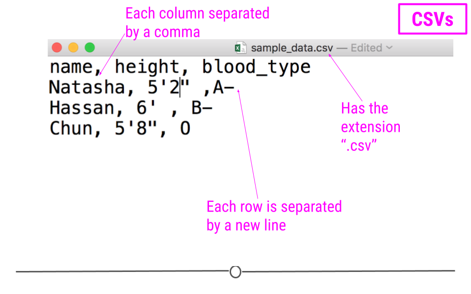
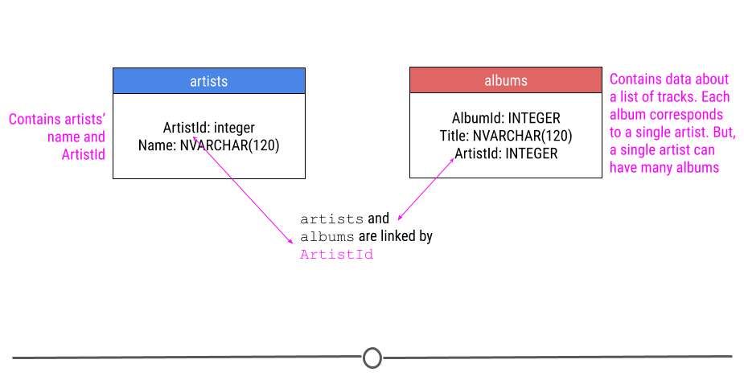
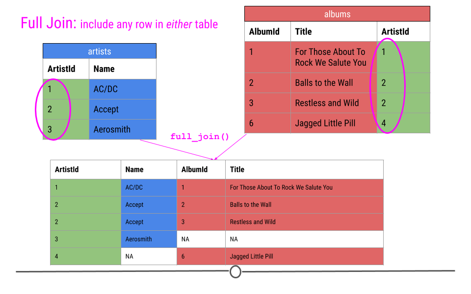

# Importing Data in the Tidyverse {#get-data}

Data are stored in all sorts of different file formats and structures. In this course, we'll discuss each of these common formats and discuss how to get them into R so you can start working with them! 


## About This Course

Getting data into your statistical analysis system can be one of the most challenging parts of any data science project. Data must be imported and harmonized into a coherent format before any insights can be obtained. You will learn how to get data into R from commonly used formats and how to harmonize different kinds of datasets from different sources. If you work in an organization where different departments collect data using different systems and different storage formats, then this course will provide essential tools for bringing those datasets together and making sense of the wealth of information in your organization.

This course introduces the Tidyverse tools for importing data into R so that it can be prepared for analysis, visualization, and modeling. Common data formats are introduced, including delimited files, spreadsheets, and relational databases. We will also introduce techniques for obtaining data from the web, such as web scraping and getting data from web APIs. 

In this specialization we assume familiarity with the R programming language. If you are not yet familiar with R, we suggest you first complete [R Programming](https://www.coursera.org/learn/r-programming) before returning to complete this course.


## Tibbles

Before we can discuss any particular file format, let's discuss the end goal - the **tibble**! If you've been using R for a while, you're likely familiar with the data.frame. It's best to think of tibbles as an updated and stylish version of the data.frame. And, tibbles are what tidyverse packages work with most seamlessly. Now, that doesn't mean tidyverse packages *require* tibbles. In fact, they still work with data.frames, but the more you work with tidyverse and tidyverse-adjacent packages, the more you'll see the advantages of using tibbles.

Before we go any further, tibbles *are* data frames, but they have some new bells and whistles to make your life easier. 

### How tibbles differ from data.frame

There are a number of differences between tibbles and data.frames. To see a full vignette about tibbles and how they differ from data.frame, you'll want to execute `vignette("tibble")` and read through that vignette. However, we'll summarize some of the most important points here:

* **Input type remains unchanged** - data.frame is notorious for treating strings as factors; this will not happen with tibbles
* **Variable names remain unchanged** - In base R, creating data.frames will remove spaces from names, converting them to periods or add “x” before numeric column names. Creating tibbles will not change variable (column) names.
* **There are no `row.names()` for a tibble** - Tidy data requires that variables be stored in a consistent way, removing the need for row names.
* **Tibbles print first ten rows and columns that fit on one screen** - Printing a tibble to screen will never print the entire huge data frame out. By default, it just shows what fits to your screen.

### Creating a tibble

The tibble package is part of the `tidyverse` and can thus be loaded in (once installed) using:


```r
library(tidyverse)
```

#### `as_tibble()`

Since many packages use the historical data.frame from base R, you'll often find yourself in the situation that you have a data.frame and want to convert that data.frame to a tibble. To do so, the `as_tibble()` function is exactly what you're looking for.

For example, the `trees` dataset is a data.frame that's available in base R. This dataset stores the diameter, height, and volume for Black Cherry Trees. To convert this data.frame to a tibble you would use the following:


```r
as_tibble(trees)
```

```
## # A tibble: 31 x 3
##    Girth Height Volume
##    <dbl>  <dbl>  <dbl>
##  1   8.3     70   10.3
##  2   8.6     65   10.3
##  3   8.8     63   10.2
##  4  10.5     72   16.4
##  5  10.7     81   18.8
##  6  10.8     83   19.7
##  7  11       66   15.6
##  8  11       75   18.2
##  9  11.1     80   22.6
## 10  11.2     75   19.9
## # … with 21 more rows
```

Note in the above example and as mentioned earlier, that tibbles, by default, only print the first ten rows to screen. If you were to print `trees` to screen, all 31 rows would be displayed. When working with large data.frames, this default behavior can be incredibly frustrating. Using tibbles removes this frustration because of the default settings for tibble printing.

Additionally, you'll note that the type of the variable is printed for each variable in the tibble. This helpful feature is another added bonus of tibbles relative to data.frame.

If you *do* want to see more rows from the tibble, there are a few options! First, the `View()` function in RStudio is incredibly helpful. The input to this function is the data.frame or tibble you'd like to see. Specifically, `View(trees)` would provide you, the viewer, with a scrollable view (in a new tab) of the complete dataset. 

A second option is the fact that `print()` enables you to specify how many rows and columns you'd like to display. Here, we again display the `trees` data.frame as a tibble but specify that we'd only like to see 5 rows. The `width = Inf` argument specifies that we'd like to see all the possible columns. Here, there are only 3, but for larger datasets, this can be helpful to specify.


```r
as_tibble(trees) %>% 
  print(n = 5, width = Inf)
```

```
## # A tibble: 31 x 3
##   Girth Height Volume
##   <dbl>  <dbl>  <dbl>
## 1   8.3     70   10.3
## 2   8.6     65   10.3
## 3   8.8     63   10.2
## 4  10.5     72   16.4
## 5  10.7     81   18.8
## # … with 26 more rows
```

Other options for viewing your tibbles are the `slice_*` functions of the `dplyr` package. 

The `slice_sample()` function of the `dplyr` package will allow you to see a sample of random rows in random order. The number of rows to show is specified by the `n` argument. This can be useful if you don't want to print the entire tibble, but you want to get a greater sense of the values. This is a good option for data analysis reports, where printing the entire tibble would not be appropriate if the tibble is quite large.


```r
slice_sample(trees, n = 10)
```

```
##    Girth Height Volume
## 1   11.4     76   21.4
## 2   11.3     79   24.2
## 3   13.7     71   25.7
## 4   12.0     75   19.1
## 5   17.5     82   55.7
## 6   12.9     85   33.8
## 7   14.0     78   34.5
## 8   20.6     87   77.0
## 9   16.0     72   38.3
## 10  12.9     74   22.2
```

You can also use `slice_head()` or `slice_tail()` to take a look at the top rows or bottom rows of your tibble. Again the number of rows can be specified with the n argument.

This will show the first 5 rows.


```r
slice_head(trees, n = 5)
```

```
##   Girth Height Volume
## 1   8.3     70   10.3
## 2   8.6     65   10.3
## 3   8.8     63   10.2
## 4  10.5     72   16.4
## 5  10.7     81   18.8
```

This will show the last 5 rows.


```r
slice_tail(trees, n = 5)
```

```
##   Girth Height Volume
## 1  17.5     82   55.7
## 2  17.9     80   58.3
## 3  18.0     80   51.5
## 4  18.0     80   51.0
## 5  20.6     87   77.0
```


#### `tibble()`

Alternatively, you can create a tibble on the fly by using `tibble()` and specifying the information you'd like stored in each column. Note that if you provide a single value, this value will be repeated across all rows of the tibble. This is referred to as "recycling inputs of length 1."

In the example here, we see that the column `c` will contain the value '1' across all rows. 


```r
tibble(
  a = 1:5,
  b = 6:10,
  c = 1,
  z = (a + b)^2 + c
)
```

```
## # A tibble: 5 x 4
##       a     b     c     z
##   <int> <int> <dbl> <dbl>
## 1     1     6     1    50
## 2     2     7     1    82
## 3     3     8     1   122
## 4     4     9     1   170
## 5     5    10     1   226
```

The `tibble()` function allows you to quickly generate tibbles and even allows you to reference columns within the tibble you're creating, as seen in column z of the example above.

We also noted previously that tibbles can have column names that are not allowed in data.frame. In this example, we see that to utilize a nontraditional variable name, you surround the column name with backticks. Note that to refer to such columns in other tidyverse packages, you'll continue to use backticks surrounding the variable name. 


```r
tibble(
  `two words` = 1:5,
  `12` = "numeric",
  `:)` = "smile",
)
```

```
## # A tibble: 5 x 3
##   `two words` `12`    `:)` 
##         <int> <chr>   <chr>
## 1           1 numeric smile
## 2           2 numeric smile
## 3           3 numeric smile
## 4           4 numeric smile
## 5           5 numeric smile
```

### Subsetting

Subsetting tibbles also differs slightly from how subsetting occurs with data.frame. When it comes to tibbles, `[[` can subset by name or position;``$` only subsets by name. For example:


```r
df <- tibble(
  a = 1:5,
  b = 6:10,
  c = 1,
  z = (a + b)^2 + c
)

# Extract by name using $ or [[]]
df$z
```

```
## [1]  50  82 122 170 226
```

```r
df[["z"]]
```

```
## [1]  50  82 122 170 226
```

```r
# Extract by position requires [[]]
df[[4]]
```

```
## [1]  50  82 122 170 226
```

Having now discussed tibbles, which are the type of object most tidyverse and tidyverse-adjacent packages work best with, we now know the goal. In many cases, tibbles are ultimately what we want to work with in R. However, data are stored in many different formats outside of R. We'll spend the rest of this course discussing those formats and talking about how to get those data into R so that you can start the process of working with and analyzing these data in R.

## Spreadsheets

Spreadsheets are an incredibly common format in which data are stored. If you've ever worked in Microsoft Excel or Google Sheets, you've worked with spreadsheets. By definition, spreadsheets require that information be stored in a grid utilizing rows and columns. 

### Excel files

Microsoft Excel files, which typically have the file extension .xls or .xlsx, store information in a workbook. Each workbook is made up of one or more spreadsheet. Within these spreadsheets, information is stored in the format of values and formatting (colors, conditional formatting, font size, etc.). While this may be a format you've worked with before and are familiar, we note that Excel files can only be viewed in specific pieces of software (like Microsoft Excel), and thus are generally less flexible than many of the other formats we'll discuss in this course. Additionally, Excel has certain defaults that make working with Excel data difficult outside of Excel. For example, Excel has a habit of aggressively changing data types. For example if you type 1/2, to mean 0.5 or one-half, Excel assumes that this is a date and converts this information to January 2nd. If you are unfamiliar with these defaults, your spreadsheet can sometimes store information other than what you or whoever entered the data into the Excel spreadsheet may have intended. Thus, it's important to understand the quirks of how Excel handles data. Nevertheless, many people *do* save their data in Excel, so it's important to know how to work with them in R. 

#### Reading Excel files into R

Reading spreadsheets from Excel into R is made possible thanks to the `readxl` package. This is not a core tidyverse package, so you'll need to install and load the package in before use:


```r
library(readxl)
```

The function `read_excel()` is particularly helpful whenever you want read an Excel file into your R Environment. The only required argument of this function is the path to the Excel file on your computer. In the following example, `read_excel()` would look for the file "filename.xlsx" in your current working directory. If the file were located somewhere else on your computer, you would have to provide the *path* to that file.


```r
# read Excel file into R
df_excel <- read_excel("filename.xlsx")
```

Within the `readxl` package there are a number of example datasets that we can use to demonstrate the packages functionality. To read the example dataset in, we'll use the `readxl_example()` function.


```r
# read example file into R
example <- readxl_example("datasets.xlsx")
df <- read_excel(example)
df
```

```
## # A tibble: 150 x 5
##    Sepal.Length Sepal.Width Petal.Length Petal.Width Species
##           <dbl>       <dbl>        <dbl>       <dbl> <chr>  
##  1          5.1         3.5          1.4         0.2 setosa 
##  2          4.9         3            1.4         0.2 setosa 
##  3          4.7         3.2          1.3         0.2 setosa 
##  4          4.6         3.1          1.5         0.2 setosa 
##  5          5           3.6          1.4         0.2 setosa 
##  6          5.4         3.9          1.7         0.4 setosa 
##  7          4.6         3.4          1.4         0.3 setosa 
##  8          5           3.4          1.5         0.2 setosa 
##  9          4.4         2.9          1.4         0.2 setosa 
## 10          4.9         3.1          1.5         0.1 setosa 
## # … with 140 more rows
```

Note that the information stored in `df` is a tibble. This will be a common theme throughout the packages used in these courses. 

Further, by default, `read_excel()` converts blank cells to missing data (NA). This behavior can be changed by specifying the `na` argument within this function. There are a number of additional helpful arguments within this function. They can all be seen using `?read_excel`, but we'll highlight a few here:

* `sheet` - argument specifies the name of the sheet from the workbook you'd like to read in (string) or the integer of the sheet from the workbook.
* `col_names` - specifies whether the first row of the spreadsheet should be used as column names (default: TRUE). Additionally, if a character vector is passed, this will rename the columns explicitly at time of import.
* `skip` - specifies the number of rows to skip before reading information from the file into R. Often blank rows or information about the data are stored at the top of the spreadsheet that you want R to ignore.

For example, we are able to change the column names directly by passing a character string to the `col_names` argument:


```r
# specify column names on import
read_excel(example, col_names = LETTERS[1:5])
```

```
## # A tibble: 151 x 5
##    A            B           C            D           E      
##    <chr>        <chr>       <chr>        <chr>       <chr>  
##  1 Sepal.Length Sepal.Width Petal.Length Petal.Width Species
##  2 5.1          3.5         1.4          0.2         setosa 
##  3 4.9          3           1.4          0.2         setosa 
##  4 4.7          3.2         1.3          0.2         setosa 
##  5 4.6          3.1         1.5          0.2         setosa 
##  6 5            3.6         1.4          0.2         setosa 
##  7 5.4          3.9         1.7          0.4         setosa 
##  8 4.6          3.4         1.4          0.3         setosa 
##  9 5            3.4         1.5          0.2         setosa 
## 10 4.4          2.9         1.4          0.2         setosa 
## # … with 141 more rows
```

To take this a step further let's discuss one of the lesser-known arguments of the `read_excel()` function: `.name_repair`. This argument allows for further fine-tuning and handling of column names. 

The default for this argument is `.name_repair = "unique"`. This checks to make sure that each column of the imported file has a unique name. If TRUE, `readxl` leaves them as is, as you see in the example here:


```r
# read example file into R using .name_repair default
read_excel(
  readxl_example("deaths.xlsx"),
  range = "arts!A5:F8",
  .name_repair = "unique"
)
```

```
## # A tibble: 3 x 6
##   Name       Profession   Age `Has kids` `Date of birth`     `Date of death`    
##   <chr>      <chr>      <dbl> <lgl>      <dttm>              <dttm>             
## 1 David Bow… musician      69 TRUE       1947-01-08 00:00:00 2016-01-10 00:00:00
## 2 Carrie Fi… actor         60 TRUE       1956-10-21 00:00:00 2016-12-27 00:00:00
## 3 Chuck Ber… musician      90 TRUE       1926-10-18 00:00:00 2017-03-18 00:00:00
```

Another option for this argument is `.name_repair = "universal"`. This ensures that column names don’t contain any forbidden characters or reserved words. It's often a good idea to use this option if you plan to use these data with other packages downstream. This ensures that all the column names will work, regardless of the R package being used.


```r
# require use of universal naming conventions
read_excel(
  readxl_example("deaths.xlsx"),
  range = "arts!A5:F8",
  .name_repair = "universal"
)
```

```
## New names:
## * `Has kids` -> Has.kids
## * `Date of birth` -> Date.of.birth
## * `Date of death` -> Date.of.death
```

```
## # A tibble: 3 x 6
##   Name         Profession   Age Has.kids Date.of.birth       Date.of.death      
##   <chr>        <chr>      <dbl> <lgl>    <dttm>              <dttm>             
## 1 David Bowie  musician      69 TRUE     1947-01-08 00:00:00 2016-01-10 00:00:00
## 2 Carrie Fish… actor         60 TRUE     1956-10-21 00:00:00 2016-12-27 00:00:00
## 3 Chuck Berry  musician      90 TRUE     1926-10-18 00:00:00 2017-03-18 00:00:00
```

Note that when using `.name_repair = "universal"`, you'll get a readout about which column names have been changed. Here you see that column names with a space in them have been changed to periods for word separation.

Aside from these options, functions can be passed to `.name_repair`. For example, if you want all of your column names to be uppercase, you would use the following:


```r
# pass function for column naming
read_excel(
  readxl_example("deaths.xlsx"),
  range = "arts!A5:F8",
  .name_repair = toupper
)
```

```
## # A tibble: 3 x 6
##   NAME       PROFESSION   AGE `HAS KIDS` `DATE OF BIRTH`     `DATE OF DEATH`    
##   <chr>      <chr>      <dbl> <lgl>      <dttm>              <dttm>             
## 1 David Bow… musician      69 TRUE       1947-01-08 00:00:00 2016-01-10 00:00:00
## 2 Carrie Fi… actor         60 TRUE       1956-10-21 00:00:00 2016-12-27 00:00:00
## 3 Chuck Ber… musician      90 TRUE       1926-10-18 00:00:00 2017-03-18 00:00:00
```

Notice that the function is passed directly to the argument. It does not have quotes around it, as we want this to be interpreted as the `toupper()` function.

Here we've really only focused on a single function (`read_excel()`) from the `readxl` package. This is because some of the best packages do a single thing and do that single thing well. The `readxl` package has a single, slick function that covers most of what you'll need when reading in files from Excel. That is not to say that the package doesn't have other useful functions (it does!), but this function will cover your needs most of the time.

### Google Sheets

Similar to Microsoft Excel, Google Sheets is another place in which spreadsheet information is stored. Google Sheets also stores information in spreadsheets within workbooks. Like Excel, it allows for cell formatting and has defaults during data entry that *could* get you into trouble if you're not familiar with the program. 

Unlike Excel files, however, Google Sheets live on the Internet, rather than your computer. This makes sharing and updating Google Sheets among people working on the same project much quicker. This also makes the process for reading them into R slightly different. Accordingly, it requires the use of a different, but also very helpful package, `googlesheets4`!

As Google Sheets are stored on the Internet and not on your computer, the `googlesheets4` package does not require you to download the file to your computer before reading it into R. Instead, it reads the data into R directly from Google Sheets. Note that if the data hosted on Google Sheets changes, every time the file is read into R, the most updated version of the file will be utilized. This can be very helpful if you're collecting data over time; however, it could lead to unexpected changes in results if you're not aware that the data in the Google Sheet is changing.

To see exactly what we mean, let's look at a specific example. Imagine you've sent out a survey to your friends asking about how they spend their day. Let's say you're mostly interested in knowing the hours spent on work, leisure, sleep, eating, socializing, and other activities. So in your Google Sheet you add these six items as columns and one column asking for your friends names. To collect this data, you then share the link with your friends, giving them the ability to edit the Google Sheet. 


Your friends will then one-by-one complete the survey. And, because it's a Google Sheet, everyone will be able to update the Google Sheet, regardless of whether or not someone else is also looking at the Sheet at the same time. As they do, you'll be able to pull the data and import it to R for analysis at any point. You won't have to wait for everyone to respond. You'll be able to analyze the results in real-time by directly reading it into R from Google Sheets, avoiding  the need to download it each time you do so. 

In other words, every time you import the data from the Google Sheets link using the `googlesheets4` package, the most updated data will be imported. Let's say, after waiting for a week, your friends' data look something like this:


You'd be able to analyze these updated data using R and the `googlesheets4` package!

In fact, let's have you do that right now! Click on [this link](https://docs.google.com/spreadsheets/d/e/2PACX-1vSOaV-SM4nI7HrtZs8GDSL9Wgyfl0kv_vlaIdYiueBZDPpKejKFF3zzT_eKk8TG3V6oW7xcMBV9VYR3/pubhtml) to see these data!

#### The `googlesheets4` package

The `googlesheets4` package allows R users to take advantage of the Google Sheets Application Programming Interface (API). Very generally, APIs allow different applications to communicate with one another. In this case, Google has released an API that allows other software to communicate with Google Sheets and retrieve data and information directly from Google Sheets. The `googlesheets4` package enables R users (you!) to easily access the Google Sheets API and retrieve your Google Sheets data.

Using this package is is the best and easiest way to analyze and edit Google Sheets data in R. In addition to the ability of pulling data, you can also edit a Google Sheet or create new sheets.

The `googlesheets4` package is tidyverse-adjacent, so it requires its own installation. It also requires that you load it into R before it can be used.

##### Getting Started with `googlesheets4`


```r
#install.packages("googlesheets4")
# load package
library(googlesheets4)
```

Now, let’s get to importing your survey data into R. Every time you start a new session, you need to authenticate the use of the `googlesheets4` package with your Google account. This is a great feature as it ensures that you want to allow access to your Google Sheets and allows the Google Sheets API to make sure that you should have access to the files you’re going to try to access.

The command `gs4_auth()` will open a new page in your browser that asks you which Google account you’d like to have access to. Click on the appropriate Google user to provide `googlesheets4` access to the Google Sheets API.


After you click “ALLOW”, giving permission for the `googlesheets4` package to connect to your Google account, you will likely be shown a screen where you will be asked to copy an authentication code. Copy this authentication code and paste it into R.


##### Navigating `googlesheets4`:`gs4_find()`

Once authenticated, you can use the command `gs4_find()` to **list** all your worksheets on Google Sheets as a table. Note that this will ask for authorization of the googledrive package. We will discuss more about googledrive later. 


##### Reading data in using `googlesheets`:`gs_read()`

In order to ultimately access the information a specific Google Sheet, you can use `the read_sheets()` function by typing in the id listed for your Google Sheet of interest when using `gs4_find()`.


```r
# read Google Sheet into R with id
read_sheet("2cdw-678dSPLfdID__LIt8eEFZPasdebgIGwH")
# note this is a fake id
```

You can also navigate to your own sheets or to other people's sheets using a URL. For example, paste [https://docs.google.com/spreadsheets/d/1FN7VVKzJJyifZFY5POdz_LalGTBYaC4SLB-X9vyDnbY/] in your web browser. We will now read this into R like so:


```r
 # read Google Sheet into R with URL
survey_sheet <- read_sheet("https://docs.google.com/spreadsheets/d/1FN7VVKzJJyifZFY5POdz_LalGTBYaC4SLB-X9vyDnbY/")
```

Note that we assign the information stored in this Google Sheet to the object `survey_sheet`so that we can use it again shortly.


Note that by default the data on the first sheet will be read into R.  If you wanted the data on a particular sheet you could specify with the sheet argument, like so:


 

```r
 # read specific Google Sheet into R wih URL
survey_sheet <- read_sheet("https://docs.google.com/spreadsheets/d/1FN7VVKzJJyifZFY5POdz_LalGTBYaC4SLB-X9vyDnbY/", sheet = 2)
```

If the sheet was named something in particular you would use this instead of the number 2.

Here you can see that there is more data on sheet 2:


There are other additional (optional) arguments to `read_sheet()`, some are similar to those in `read_csv()` and `read_excel()`, while others are more specific to reading in Google Sheets:  

* `skip = 1`: will skip the first row of the Google Sheet  
* `col_names` = FALSE`: specifies that the first row is not column names  
*`range = "A1:G5"`: specifies the range of cells that we like to import is A1 to G5  
* `n_max = 100`: specifies the maximum number of rows that we want to import is 100  

To read in data from a Google Sheet in `googlesheets4`, you must first know the **id**, the **name** or the **URL** of the Google Sheet and have access to it. 

See [https://googlesheets4.tidyverse.org/reference/index.html] for a list of additional functions in the **googlesheets4** package.


## CSVs

Like Excel Spreadsheets and Google Sheets, **Comma-separated values (CSV)** files allow us to store tabular data; however, it does this in a much simple format. CSVs are **plain-text** files, which means that all the important information in the file is represented by text (where text is numbers, letters, and symbols you can type on your keyboard). This means that there are no workbooks or metadata making it difficult to open these files. CSVs are flexible files and are thus the preferred storage method for tabular data for many data scientists.

For example, consider a dataset that includes information about the heights and blood types of three individuals. You could make a table that has three columns (names, heights, and blood types) and three rows (one for each person) in Google Docs or Microsoft Word. However, there is a better way of storing this data in plain text without needing to put them in table format. CSVs are a perfect way to store these data. In the CSV format, the values of each column for each person in the data are separated by commas and each row (each person in our case) is separated by a new line. This means your data would be stored in the following format:



Notice that CSV files have a .csv extension at the end. You can see this above at the top of the file. One of the advantages of CSV files is their *simplicity*. Because of this, they are one of the most common file formats used to store tabular data. Additionally, because they are plain text, they are compatible with *many* different types of software.  CSVs can be read by most programs. Specifically, for our purposes, these files can be easily read into R (or Google Sheets, or Excel), where they can be better understood by the human eye. Here you see the same CSV opened in Google Sheets, where it's more easily interpretable by the human eye:


As with any file type, CSVs do have their limitations. Specifically, CSV files are best used for data that have a consistent number of variables across observations. In our example, there are three variables for each observation: "name", "height", and "blood_type". If, however, you had eye color and weight for the second observation, but not for the other rows, you'd have a different number of variables for the second observation than the other two. This type of data is not best suited for CSVs (although NA values could be used to make the data rectangular). Whenever you have information with the same number of variables across all observations, CSVs are a good bet!

### Downloading CSV files

If you entered the same values used above into Google Sheets first and wanted to download this file as a CSV to read into R, you would enter the values in Google Sheets and then click on "File" and then "Download as" and choose "Comma-separated values (.csv, current sheet)". The dataset that you created will be downloaded as a CSV file on your computer. Make sure you know the location of your file (if on a Chromebook, this will be in your "Downloads" folder).


### Reading CSVs into R

Now that you have a CSV file, let's discuss how to get it into R! The best way to accomplish this is using the function `read_csv()` from the `readr` package. (Note, if you haven't installed the `readr` package, you'll have to do that first.) Inside the parentheses of the function, write the name of the file in quotes, including the file extension (.csv). Make sure you type the exact file name. Save the imported data in a data frame called `df_csv`. Your data will now be imported into R environment. If you use the command `head(df_csv)` you will see the first several rows of your imported data frame: 
 

```r
## install.packages("readr")
library(readr)

## read CSV into R
df_csv <- read_csv("sample_data - Sheet1.csv")

## look at the object
head(df_csv)
```


Above, you see the simplest way to import a CSV file. However, as with many functions, there are other arguments that you can set to specify how to import your specific CSV file, a few of which are listed below. However, as usual, to see all the arguments for this function, use `?read_csv` within R.

- `col_names = FALSE` to specify that the first row does NOT contain column names. 
- `skip = 2` will skip the first 2 rows. You can set the number to any number you want. This is helpful if there is additional information in the first few rows of your data frame that are not actually part of the table.
- `n_max = 100` will only read in the first 100 rows. You can set the number to any number you want. This is helpful if you're not sure how big a file is and just want to see part of it.

By default, `read_csv()` converts blank cells to missing data (NA).

Finally, we introduce the function `read_csv` here and recommend that you use it, as it is the simplest and fastest way to read CSV files into R. However, we note that there *is* a function `read.csv()` which is available by default in R. You will likely see this function in others' code, so we just want to make sure you're aware of it.


## TSVs

Another common form of data is text files that usually come in the form of TXT or TSV file formats. Like CSVs, text files are simple, plain-text files; however, rather than columns being separated by commas, they are separated by tabs (represented by "\t" in plain-text). Like CSVs, they don't allow text formatting (i.e. text colors in cells) and are able to be opened on many different software platforms. This makes them good candidates for storing data.

### Reading TSVs into R

The process for reading these files into R is similar to what you've seen so far. We'll again use the `readr` package, but we'll instead use the `read_tsv()` function. 


```r
## read TSV into R
df_tsv <- read_tsv("sample_data - Sheet1.tsv")

## look at the object
head(df_tsv)
```

## Delimited Files

Sometimes, tab-separated files are saved with the .txt file extension. TXT files can store tabular data, but they can also store simple text. Thus, while TSV is the more appropriate extension for tabular data that are tab-separated, you'll often run into tabular data that individuals have saved as a TXT file. In these cases, you'll want to use the more generic `read_delim()` function from `readr`.

Google Sheets does not allow tab-separated files to be downloaded with the .txt file extension (since .tsv is more appropriate); however, if you were to have a file "sample_data.txt" uploaded into R, you could use the following code to read it into your R Environment, where "\t" specifies that the file is tab-delimited. 

### Reading Delimited Files into R


```r
## read TXT into R
df_txt <- read_delim("sample_data.txt", delim = "\t")

## look at the object
head(df_txt)
```

This function allows you to specify how the file you're reading is in delimited. This means, rather than R knowing by default whether or not the data are comma- or tab- separated, you'll have to specify it within the argument `delim` in the function.

The `read_delim()` function is a more generic version of `read_csv()`. What this means is that you *could* use `read_delim()` to read in a CSV file. You would just need to specify that the file was comma-delimited if you were to use that function.

## Exporting Data from R

The last topic of this lesson is about how to export data from R. So far we learned about reading data into R. However, sometimes you would like to share *your* data with others and need to export your data from R to some format that your collaborators can see. 

As discussed above, CSV format is a good candidate because of its simplicity and compatibility. Let's say you have a data frame in the R environment that you would like to export as a CSV. To do so, you could use `write_csv()` from the `readr` package. 

Since we've already created a data frame named `df_csv`, we can export it to a CSV file using the following code. After typing this command, a new CSV file called `my_csv_file.csv` will appear in the Files section.


```r
write_csv(df_csv, path = "my_csv_file.csv")
```

You could similarly save your data as a TSV file using the function `write_tsv()` function.

We'll finally note that there are default R functions `write.csv()` and `write.table()` that accomplish similar goals. You may see these in others' code; however, we recommend sticking to the intuitive and quick `readr` functions discussed in this lesson.


## JSON

All of the file formats we've discussed so far (tibbles, CSVs, Excel Spreadsheets and Google Sheets) are various ways to store what is known as tabular data, data where information is stored in rows and columns. To review, when data are stored in a tidy format, variables are stored in **columns** and each observation is stored in a different **row**. The values for each observation is stored in its respective **cell**. These *rules* for tabular data help define the **structure** of the file. Storing information in rows and columns, however, is not the only way to store data. 

Alternatively, JSON (JavaScript Object Notation) data are *nested* and *hierarchical*. JSON  is a very commonly-used text-based way to send information between a browser and a server. It is easy for humans to read and to write. JSON data adhere to certain rules in how they are structured. For simplicity, JSON format requires objects to be comprised of **key-value pairs**. For example, in the case of: `{"Name": "Isabela"}`, "Name" would be a key, "Isabela" would be a value, and together they would be a key-value pair. Let's take a look at how JSON data looks in R.This means that key-pairs can be organized into different levels (hierarchical) with some levels of information being stored *within* other levels (nested).

Using a snippet of JSON data here, we see a portion of JSON data from Yelp looking at the `attributes` of a restaurant. Within `attributes`, there are four nested categories: `Take-out`, `Wi-Fi`, `Drive-Thru`, and `Good For`. In the hierarchy, attributes is at the top, while these four categories are within attributes. Within one of these attributes `Good For`, we see another level within the hierarchy. In this third level we see a number of other categories nested within `Good For`. This should give you a slightly better idea of how JSON data are structured.


To get a sense of what JSON data look like in R, take a peak at this minimal example:


```r
## generate a JSON object
json <-
'[
  {"Name" : "Woody", "Age" : 40, "Occupation" : "Sherriff"}, 
  {"Name" : "Buzz Lightyear", "Age" : 34, "Occupation" : "Space Ranger"},
  {"Name" : "Andy", "Occupation" : "Toy Owner"}
]'

## take a look
json
```

```
## [1] "[\n  {\"Name\" : \"Woody\", \"Age\" : 40, \"Occupation\" : \"Sherriff\"}, \n  {\"Name\" : \"Buzz Lightyear\", \"Age\" : 34, \"Occupation\" : \"Space Ranger\"},\n  {\"Name\" : \"Andy\", \"Occupation\" : \"Toy Owner\"}\n]"
```

Here, we've stored information about Toy Story characters, their age, and their occupation in an object called `json`.

In this format, we cannot easily work with the data with within R; however, the `jsonlite` package can help us. Using the defaults of the function `fromJSON()`, `jsonlite` will take the data from JSON array format and helpfully return a data frame. 


```r
#install.packages("jsonlite")
library(jsonlite)

## take JSON object and covert to a data frame
mydf <- fromJSON(json)

## take a look
mydf
```

```
##             Name Age   Occupation
## 1          Woody  40     Sherriff
## 2 Buzz Lightyear  34 Space Ranger
## 3           Andy  NA    Toy Owner
```


Data frames can also be returned to their original JSON format using the function: `toJSON()`.


```r
## take JSON object and convert to a data frame
json <- toJSON(mydf)
json
```

```
## [{"Name":"Woody","Age":40,"Occupation":"Sherriff"},{"Name":"Buzz Lightyear","Age":34,"Occupation":"Space Ranger"},{"Name":"Andy","Occupation":"Toy Owner"}]
```


While this gives us an idea of how to work with JSON formatted data in R, we haven't yet discussed how to read a JSON file into R. When you have data in the JSON format (file extension: .json), you'll use the `read_json()` function, which helpfully looks very similar to the other `read_` functions we've discussed so far:


```r
# read JSON file into R
read_json("json_file.json")

# read JSON file into R and 
# simplifies nested lists into vectors and data frames
read_json("json_file.json", simplifyVector = TRUE)
```

Note in our examples here that by default, `read_json()` reads the data in while retaining the JSON format. However, if you would like to simplify the information into a data.frame, you'll want to specify the argument, `simplifyVector = TRUE`.

## XML

**Extensible Markup Language (XML)**, is another human- and machine-readable language that is used frequently by web services and APIs. However, instead of being based on key-value pairs, XML relies on **nodes**, **tags**, and **elements**. The author defines these *tags* to specify what information is included in each *element* of the XML document and allows for elements to be nested within one another. The **nodes** define the hierarchical structure of the XML (which means that XML is hierarchical and nested like JSON)! 


XML accomplishes the same goal as JSON, but it just does it in a different format. Thus, the two formats are commonly used for similar purposes -- sharing information on the web; however, because the format in which they do this is different, a different R package is needed to process XML data. This packages is called `xml2`.

We will look into the `xml2` package a bit more when we look at importing html files.


```r
# read XML file into R
read_xml("xml_file.xml")
```


## Databases

So far we've discussed reading in data that exist in a single file, like a CSV file or a Google Sheet. However, there will be many cases where the data for your project will be stored across a number of different tables that are all related to one another. In this lesson, we'll discuss what relational data are, why you would want to store data in this way, and how to work with these types of data into R.

### Relational Data

Relational data can be thought of as information being stored across many tables, with each table being related to all the other tables. Each table is linked to every other table by a set of **unique identifiers**. 


To better understand this, let's consider a toy example. Consider a town where you have a number of different restaurants. In one table you have information about these restaurants including, where they are located and what type of food they serve. You then have a second table where information about health and safety inspections is stored. Each inspection is a different row and the date of the inspection, the inspector, and the safety rating are stored in this table. Finally, you have a third table. This third table contains information pulled from an API, regarding the number of stars given to each restaurant, as rated by people online. Each table contains different bits of information; however, there is a common column `id` in each of the tables. This allows the information to be linked between the tables. The restaurant with the `id` "JJ29JJ" in the restaurant table would refer to the same restaurant with the `id` "JJ29JJ" in the health inspections table, and so on. The values in this `id` column are known as `unique identifiers` because they uniquely identify each restaurant. No two restaurants will have the same `id`, and the same restaurant will always have the same `id`, no matter what table you're looking at. The fact that these tables have unique identifiers connecting each table to all the other tables makes this example what we call **relational data**.


#### Why relational data?

Storing data in this way has a number of advantages; however, the three most important are:

1. Efficient Data Storage
2. Avoids Ambiguity
2. Privacy

**Efficient Data Storage** - By storing each bit of information in a separate table, you limit the need to repeat information. Taking our example above, imagine if we included everything in a single table. This means that for each inspection, we would copy and paste the restaurant's address, type, and number of stars every time the facility is inspected. If a restaurant were inspected 15 times, this same information would be unnecessarily copy and pasted in each row! To avoid this, we simply separate out the information into different tables and relate them by their unique identifiers.

**Avoids Ambiguity** - Take a look at the first table: "restaurant" here. You may notice there are two different restaurants named "Taco Stand." However, looking more closely, they have a different id *and* a different address. They're even different types of restaurants. So, despite having the same name, they actually are two different restaurants. The unique identifier makes this immediately clear!


**Privacy** - In using relational data, if there is ever information that is private and only some people should have access to, using this system simplifies that. You can restrict access to some of the data to ensure only those who should have access are able to access the data.

### Relational Databases: `SQL`

Now that we have an idea of what relational data are, let's spend a second talking about how relational data are stored. Relational data are stored in databases. The most common database is **SQLite**. In order to work with data in databases, there has to be a way to **query** or search the database for the information you're interested in. **SQL** queries search through SQLite databases and return the information you ask for in your query.

For example, a query of the above example may look to obtain information about any restaurant that was inspected after July 1st of 2018. One would then use SQL commands to carry out this query and return the information requested.

While we won't be discussing how to write SQL commands in-depth here, we *will* be discussing how to use the R package `RSQLite` to connect to an SQLite database using `RSQLite` and how to work with relational data using `dplyr` and `dbplyr`.

### Connecting to Databases: `RSQLite`

To better understand databases and how to work with relational data, let's just start working with data from a database! The data we'll be using are from a database with relational data: `company.db`. The database includes 11 tables with data that represents a digital media store. The data includes information generally related to related to media, artists, artists' work, and those who purchase artists' work (customers). You can download the database file here:

* [company.db.zip](company.db.zip)

You will need to unzip the file before using it. The original version of this database can be downloaded [here](http://www.sqlitetutorial.net/). For our purposes though, we're only going to only describe two of the tables we'll be using in our example in this lesson. We're going to be looking at data in the `artists` and `albums` tables, which both have the column `ArtistId`.




Without any more details, let's get to it! Here you'll see the code to install and load the `RSQLite` package. 

You'll then load the `company.db` sample database, connect to the database, and first obtain a list the tables in the database. Before you begin, make sure that the file `company.db` is in your current working directory (you can check by calling the `ls()` function).


```r
## install and load packages
## this may take a minute or two
# install.packages("RSQLite")
library(RSQLite)

## Specify driver
sqlite <- dbDriver("SQLite")

## Connect to Database
db <- dbConnect(sqlite, "company.db")

## List tables in database
dbListTables(db)
```

```
##  [1] "albums"          "artists"         "customers"       "employees"      
##  [5] "genres"          "invoice_items"   "invoices"        "media_types"    
##  [9] "playlist_track"  "playlists"       "sqlite_sequence" "sqlite_stat1"   
## [13] "tracks"
```

The output from `dbListTables()` will include 13 tables. Among them will be the two tables we're going to work through in our example: `artists`, and `albums`.


In this example, we're downloading a database and working with the data locally. However, more often, when working with SQLite databases, you'll be connecting remotely. Using the `RSQLite` package is particularly helpful in this case because it allows you to connect to and query the database from R without reading all the data in. This is helpful in the case of very large databases, where you'll want to avoid copying all the data and will instead want to only work with the parts of the database you need. 

### Working with Relational Data: `dplyr` & `dbplyr`

To access these tables within R, we'll have to install the packages `dbplyr`, which enables us to access the parts of the database we're going to be working with. The `dbplyr` package allows you to use the same functions that you learned about and will learn about when working with `dplyr`; however, it allows you to use these functions with a *database*. While `dbplyr` has to be loaded to work with databases, you likely won't notice that you're using it beyond that. Otherwise, you'll just work with the files as if you were working with `dplyr` functions!

After installing and loading `dbplyr`, we'll be able to use the helpful `tbl()` function to extract the two tables we're interested in working with!


```r
## install and load packages
# install.packages("dbplyr")
library(dbplyr)
library(dplyr)

## get two tables
albums <- tbl(db, "albums")
artists <- tbl(db, "artists")
```

### Mutating Joins

Mutating joins allow you to take two different tables and combine the variables from both tables. This requires that each table have a column relating the tables to one another (i.e. a unique identifier). This unique identifier is used to match observations between the tables.

However, when combining tables, there are a number of different ways in which the tables can be joined:

* Inner Join - only keep observations found in *both* `x` *and* `y`
* Left Join - keep all observations in `x`
* Right Join - keep all observations in `y`
* Full Join - keep *any* observations in `x` *or* `y`

Let's break down exactly what we mean by this using just a small toy example from the `artists` and `albums` tables from the `company` database. Here you see three rows from the `artists` table and four rows from the `albums` table.


#### Inner Join

When talking about inner joins, we are only going to keep an observation if it is found in all of the tables we're combining. Here, we're combining the tables based on the `ArtistId` column. In our dummy example, there are only two artists that are found in *both* tables. These are highlighted in green and will be the rows used to join the two tables. Then, once the inner join happens, only these artists' data will be included after the inner join.


In our toy example, when doing an `inner_join()`, data from any observation found in all the tables being joined are included in the output. Here, `ArtistId`s "1" and "2" are in both the `artists` and `albums` tables. Thus, those will be the only `ArtistId`s in the output from the inner join. 

And, since it's a mutating join, our new table will have information from both tables! We now have `ArtistId`, `Name`, `AlbumId`, *and* `Title` in a single table! We've joined the two tables, based on the column `ArtistId`!


Throughout this lesson we will use the coloring use see here to explain the joins, so we want to explain it explicitly here. Green cells are cells that will be used to make the merge happen and will be included in the resulting merged table. Blue cells are information that comes from the `artists` table that will be included after the merge. Red cells are pieces of information that come from the `albums` table that will be included after the merge. Finally, cells that are left white in the `artists` or `albums` table are cells that will not be included in the merge while cells that are white *after* the merge are NAs that have been added as a result of the merge.

Now, to run this for our tables from the database, rather than just for a few rows in our toy example, you would do the following:


```r
## do inner join
inner <- inner_join(artists, albums, by = "ArtistId")

## look at output as a tibble
as_tibble(inner)
```

```
## # A tibble: 347 x 4
##    ArtistId Name                 AlbumId Title                                
##       <int> <chr>                  <int> <chr>                                
##  1        1 AC/DC                      1 For Those About To Rock We Salute You
##  2        2 Accept                     2 Balls to the Wall                    
##  3        2 Accept                     3 Restless and Wild                    
##  4        1 AC/DC                      4 Let There Be Rock                    
##  5        3 Aerosmith                  5 Big Ones                             
##  6        4 Alanis Morissette          6 Jagged Little Pill                   
##  7        5 Alice In Chains            7 Facelift                             
##  8        6 Antônio Carlos Jobim       8 Warner 25 Anos                       
##  9        7 Apocalyptica               9 Plays Metallica By Four Cellos       
## 10        8 Audioslave                10 Audioslave                           
## # … with 337 more rows
```

#### Left Join

For a left join, all rows in the first table specified will be included in the output. Any row in the second table that is *not* in the first table will not be included. 

In our toy example this means that `ArtistID`s 1, 2, and 3 will be included in the output; however, `ArtistID` 4 will not.


Thus, our output will again include all the columns from both tables combined into a single table; however, for `ArtistId` 3, there will be NAs for `AlbumId` and `Title`. NAs will be filled in for any observations in the first table specified that are missing in the second table.


Now, to run this for our tables from the database, rather than just for a few rows in our toy example, you would do the following:


```r
## do left join
left <- left_join(artists, albums, by = "ArtistId")

## look at output as a tibble
as_tibble(left)
```

```
## # A tibble: 418 x 4
##    ArtistId Name                 AlbumId Title                                
##       <int> <chr>                  <int> <chr>                                
##  1        1 AC/DC                      1 For Those About To Rock We Salute You
##  2        1 AC/DC                      4 Let There Be Rock                    
##  3        2 Accept                     2 Balls to the Wall                    
##  4        2 Accept                     3 Restless and Wild                    
##  5        3 Aerosmith                  5 Big Ones                             
##  6        4 Alanis Morissette          6 Jagged Little Pill                   
##  7        5 Alice In Chains            7 Facelift                             
##  8        6 Antônio Carlos Jobim       8 Warner 25 Anos                       
##  9        6 Antônio Carlos Jobim      34 Chill: Brazil (Disc 2)               
## 10        7 Apocalyptica               9 Plays Metallica By Four Cellos       
## # … with 408 more rows
```


#### Right Join

Right Join is similar to what we just discussed; however, in the output from a right join, all rows in the final table specified are included in the output. NAs will be included for any observations found in the last specified table but not in the other tables.

In our toy example, that means, information about `ArtistID`s 1, 2, and 4 will be included. 


Again, in our toy example, we see that `right_join()` combines the information across tables; however, in this case, `ArtistId` 4 is included, but `Name` is an NA, as this information was not in the `artists` table for this artist.


Now, to run this for our tables from the database, you would have to do something *slightly* different than what you saw above. Note in the code below that we have to change the class of the tables from the database into tibbles before doing the join. This is because SQL does not currently support right or full joins, but `dplyr` does. Thus, we first have to be sure the data are a class that `dplyr` can work with using `as_tibble()`. Other than that, the code below is similar to what you've seen already:


```r
## do right join
right <- right_join(as_tibble(artists), as_tibble(albums), by = "ArtistId")

## look at output as a tibble
as_tibble(right)
```

```
## # A tibble: 347 x 4
##    ArtistId Name                 AlbumId Title                                
##       <int> <chr>                  <int> <chr>                                
##  1        1 AC/DC                      1 For Those About To Rock We Salute You
##  2        1 AC/DC                      4 Let There Be Rock                    
##  3        2 Accept                     2 Balls to the Wall                    
##  4        2 Accept                     3 Restless and Wild                    
##  5        3 Aerosmith                  5 Big Ones                             
##  6        4 Alanis Morissette          6 Jagged Little Pill                   
##  7        5 Alice In Chains            7 Facelift                             
##  8        6 Antônio Carlos Jobim       8 Warner 25 Anos                       
##  9        6 Antônio Carlos Jobim      34 Chill: Brazil (Disc 2)               
## 10        7 Apocalyptica               9 Plays Metallica By Four Cellos       
## # … with 337 more rows
```


While the output may look similar to the output from `left_join()`, you'll note that there are a different number of rows due to how the join was done. The fact that 347 rows are present with the right join and 418 were present after the left join suggests that there are artists in the artists table without albums in the albums table.

#### Full Join

Finally, a full join will take every observation from every table and include it in the output.


Thus, in our toy example, this join produces five rows, including all the observations from either table. NAs are filled in when data are missing for an observation.



As you saw in the last example, to carry out a full join, we have to again specify that the objects are tibbles before being able to carry out the join:


```r
## do right join
full <- full_join(as_tibble(artists), as_tibble(albums), by = "ArtistId")

## look at output as a tibble
as_tibble(full)
```

```
## # A tibble: 418 x 4
##    ArtistId Name                 AlbumId Title                                
##       <int> <chr>                  <int> <chr>                                
##  1        1 AC/DC                      1 For Those About To Rock We Salute You
##  2        1 AC/DC                      4 Let There Be Rock                    
##  3        2 Accept                     2 Balls to the Wall                    
##  4        2 Accept                     3 Restless and Wild                    
##  5        3 Aerosmith                  5 Big Ones                             
##  6        4 Alanis Morissette          6 Jagged Little Pill                   
##  7        5 Alice In Chains            7 Facelift                             
##  8        6 Antônio Carlos Jobim       8 Warner 25 Anos                       
##  9        6 Antônio Carlos Jobim      34 Chill: Brazil (Disc 2)               
## 10        7 Apocalyptica               9 Plays Metallica By Four Cellos       
## # … with 408 more rows
```

#### Mutating Joins Summary

Now that we've walked through a number of examples of mutating joins, cases where you're combining information across tables, we just want to take a second to summarize the four types of joins discussed using a visual frequently used to explain the most common mutating joins where each circle represents a different table and the gray shading on the Venn diagrams indicates which observations will be included after the join.


To see a visual representation of this, there is a great resource on GitHub, where these joins are illustrated, so feel free to check out [this link](https://github.com/gadenbuie/tidyexplain) from [Garrick Aden-Buie](https://www.garrickadenbuie.com/) animating joins within relational data. 

### Filtering Joins

While we discussed mutating joins in detail, we're just going to mention the ability to carry out filtering joins. While mutating joins combined variables across tables, **filtering joins** affect the observations, not the variables. This *still* requires a unique identifier to match the observations between tables.

Filtering joins keep observations in one table based on the observations present in a second table. Specifically:

* `semi_join(x, y)` : keeps all observations in `x` with a match in `y`.
* `anti_join(x, y)` : keeps observations in `x` that do *NOT* have a match in `y`.

In our toy example, if the join `semi_join(artists, albums)` were run, this would keep rows of `artists` where the `ArtistID` in `artist` was also in the `albums` table.


Alternatively, `anti_join(artists, albums)` would output the rows of `artists` whose `ArtistId` was *NOT* found in the `albums` table.


Note that in the case of filtering joins, the number of variables in the table *after* the join does not change. While **mutating joins** merged the tables creating a resulting table with more columns, with **filtering joins** we're simply filtering the observations in one table based on the values in a second table.

### How to Connect to a Database Online 

As mentioned briefly above, most often when working with databases, you won't be downloading the entire database. Instead, you'll connect to a server somewhere else where the data live and query the data (search for the parts you need) from R. 

For example, in this lesson we downloaded the entire `company` database, but only ended up using `artists` and `albums`. In the future, instead of downloading *all* the data, you'll just connect to the database and work with the parts you need.

This will require connecting to the database with `host`, `user`, and `password`. This information will be provided by the database's owners, but the syntax for entering this information into R to connect to the database would look something like what you see here:


```r
## This code is an example only
con <- DBI::dbConnect(RMySQL::MySQL(), 
  host = "database.host.com",
  user = "janeeverydaydoe",
  password = rstudioapi::askForPassword("database_password")
)
```

While not being discussed in detail here, it's important to know that connecting to remote databases from R is possible and that this allows you to query the database without reading *all* the data from the database into R. 

## Web Scraping

We've mentioned previously that there is a lot of data on the Internet, which probably comes at no surprise given the vast amount of information on the Internet. Sometimes these data are in a nice CSV format that we can quickly pull from the Internet. Sometimes, the data are spread across a web page, and it's our job to "scrape" that information from the webpage and get it into a usable format. Knowing first that this is possible within R and second, having some idea of where to start is an important start to beginning to get data from the Internet.

We'll walk through three R packages in this lesson to help get you started in getting data from the Internet. Let's transition a little bit to talking about how to pull pieces of data from a website, when the data aren't (yet!) in the format that we want them. 

Say you wanted to start a company but did not know exactly what people you would need. We could go to the websites of a bunch of companies similar to the company you hope to start and pull off all the names and titles of the people working there. You then compare the titles across companies and voila, you’ve got a better idea of who you’ll need at your new company.

You could imagine that while this information may be helpful to have, getting it manually would be a pain. Navigating to each site individually, finding the information, copying and pasting each name. That sounds awful! Thankfully, there's a way to scrape the web from R directly!

A very helpful package `rvest` can help us do this. It gets its name from the word "harvest." The idea here is you'll use this package to "harvest" information from websites! However, as you may imagine, this is less straightforward than pulling data that are already formatted the way you want them (as we did previously), since we'll have to do some extra work to get everything in order. 

### `rvest` Basics

When `rvest` is given a webpage (URL) as input, an `rvest` function reads in the HTML code from the webpage. HTML is the language websites use to display everything you see on the website. Generally, all HTML documents require each webpage to have a similar structure. This structure is specified by using different **tags**. For example, a header at the top of your webpage would use a specific tag. Website links would use a different tag. These different tags help to specify how the website should appear. The `rvest` package takes advantage of these tags to help you extract the parts of the webpage you're most interested in. So let's see exactly how to do that all of this with an example.


### SelectorGadget

To use `rvest`, there is a tool that will make your life *a lot* easier. It's called SelectorGadget. It's a "javascript bookmarklet." What this means for us is that we'll be able to go to a webpage, turn on SelectorGadget, and help figure out how to appropriately specify what components from the webpage we want to extract using `rvest`. 

To get started using SelectorGadget, you'll have to enable the Chrome Extension. 

To enable SelectorGadget using Google Chrome:  

1. Click [here](https://chrome.google.com/webstore/detail/selectorgadget/mhjhnkcfbdhnjickkkdbjoemdmbfginb) to open up the SelectorGadget Chrome Extension

2. Click "ADD TO CHROME"


3. Click "Add extension" 


4. SelectorGadget's icon will now be visible to the right of the web address bar within Google Chrome. You will click on this to use SelectorGadget in the example below.


### Web Scraping Example

Similar to the example above, what if you were interested in knowing a few recommended R packages for working with data. Sure, you could go to a whole bunch of websites and Google and copy and paste each one into a Google Sheet and have the information. But, that's not very fun!

Alternatively, you could write and run a few lines of code and get all the information that way! We'll do that in the example below. 

#### Using SelectorGadget

To use SelectorGadget, navigate to the webpage we're interested in scraping: [http://jhudatascience.org/stable_website/webscrape.html](http://jhudatascience.org/stable_website/webscrape.html) and toggle SelectorGadget by clicking on the SelectorGadget icon. A menu at the bottom-right of your web page should appear.


Now that SelectorGadget has been toggled, as you mouse over the page, colored boxes should appear. We'll click on the the name of the first package to start to tell SelectorGadget which component of the webpage we're interested in.


An orange box will appear around the component of the webpage you've clicked. Other components of the webpage that SelectorGadget has deemed similar to what you've clicked will be highlighted. And, text will show up in the menu at the bottom of the page letting you know what you should use in `rvest` to specify the part of the webpage you're most interested in extracting. 

Here, we see with that SelectorGadget has highlighted the package names and nothing else! Perfect. That's just what we wanted. Now we know how to specify this element in `rvest`!

#### Using `rvest`

Now we're ready to use `rvest`'s functions. First, we'll use `read_html()` (which actually comes from the `xml2` package) to read in the HTML from our webpage of interest. 

We'll then use `html_nodes()` to specify which parts of the webpage we want to extract. Within this function we specify "strong", as that's what SelectorGadget told us to specify to "harvest" the information we're interested in. 

Finally `html_text()` extracts the text from the tag we've specified, giving us that list of packages we wanted to see!


```r
## load package
# install.packages("rvest")
library(rvest) # this loads the xml2 package too!
```

```
## Loading required package: xml2
```

```
## 
## Attaching package: 'rvest'
```

```
## The following object is masked from 'package:purrr':
## 
##     pluck
```

```
## The following object is masked from 'package:readr':
## 
##     guess_encoding
```

```r
## provide URL
packages <- read_html("http://jhudatascience.org/stable_website/webscrape.html") # the function is from xml2

## Get Packages
packages %>% 
  html_nodes("strong") %>%
  html_text() 
```

```
## [1] "rvest"        "httr"         "dbplyr"       "jsonlite"     "googlesheets"
```

With just a few lines of code we have the information we were looking for!


### A final note: SelectorGadget

SelectorGadget selected what we were interested in on the first click in the example above. However, there will be times when it makes its guess and highlights more than what you want to extract. In those cases, after the initial click, click on any one of the items currently highlighted that you don't want included in your selection. SelectorGadget will mark that part of the webpage in red and update the menu at the bottom with the appropriate text. To see an example of this, watch this short video [here](https://vimeo.com/52055686). 

## APIs

**Application Programming Interfaces (APIs)** are, in the most general sense, software that allow different web-based applications to communicate with one another over the Internet. Modern APIs conform to a number of standards. This means that many different applications are using the same approach, so a single package in R is able to take advantage of this and communicate with many different applications, as long as the application's API adheres to this generally agreed upon set of "rules". 

The R package that we'll be using to acquire data and take advantage of this is called `httr`. This package name suggests that this is an "R" package for "HTTP". So, we know what R is, but what about HTTP? 

You've probably seen HTTP before at the start of web addresses, (ie http://www.gmail.com), so you may have some intuition that HTTP has something to do with the Internet, which is absolutely correct! HTTP stands for Hypertext Transfer Protocol. In the broadest sense, HTTP transactions allow for messages to be sent between two points on the Internet. You, on your computer can request something from a web page, and the protocol (HTTP) allows you to connect with that webpage's server, do something, and then return you whatever it is you asked for. 

Working with a web API is similar to accessing a website in many ways. When you type a URL (ie www.google.com) into your browser, information is sent from your computer to your browser. Your browser then interprets what you're asking for and displays the website you've requested. Web APIs work similarly. You **request** some information from the API and the API sends back a **response**.

The `httr` package will help you carry out these types of requests within R. Let's stop talking about it, and see an actual example!


### Getting Data: `httr`

HTTP is based on a number of important verbs : `GET()`, `HEAD()`, `PATCH()`, `PUT()`, `DELETE()`, and `POST()`. For the purposes of retrieving data from the Internet, you may be able to guess which verb will be the most important for our purposes! `GET()` will allow us to *fetch* a resource that already exists. We'll specify a URL to tell `GET()` where to go look for what we want. While we'll only highlight `GET()` in this lesson, for full understanding of the many other HTTP verbs and capabilities of `httr`, refer to the additional resources provided at the end of this lesson. 

`GET()` will access the API, provide the API with the necessary information to request the data we want, and retrieve some output. 


### Example 1: GitHub's API

The example is based on a wonderful [blogpost](https://www.tylerclavelle.com/code/2017/randapis/) from [Tyler Clavelle](https://www.tylerclavelle.com/about/). In this example, we'll use will take advantage of GitHub's API, because it's accessible to anyone. Other APIs, while often freely-accessible, require credentials, called an **API key**. We'll talk about those later, but let's just get started using [GitHub's API](https://docs.github.com/en/free-pro-team@latest/rest) now!

#### API Endpoint

The URL you're requesting information from is known as the **API endpoint**. The documentation from GitHub's API explains what information can be obtained from their API endpoint: [https://api.github.com](https://api.github.com). That's the base endpoint, but if you wanted to access a particular individual's GitHub repositories, you would want to modify this base endpoint to: `https://api.github.com/users/username/repos`, where you would replace `username` with *your* GitHub username.   

#### API request: `GET()`

Now that we know what our API endpoint is, we're ready to make our **API request** using `GET()`. 

The goal of this request is to obtain information about what repositories are available in *your* GitHub account. To use the example below, you'll want to change the username `janeeverydaydoe` to your GitHub username.


```r
## load package
library(httr)
library(dplyr)
 	
## Save GitHub username as variable
username <- 'janeeverydaydoe'

## Save base endpoint as variable
url_git <- 'https://api.github.com/'

## Construct API request
api_response <- GET(url = paste0(url_git, 'users/', username, '/repos'))
```

Note: In the code above, you see the function `paste0()`. This function concatenates (links together) each the pieces within the parentheses, where each piece is separated by a comma. This provides `GET()` with the URL we want to use as our endpoints! 


#### API response: `content()`

Let's first take a look at what other variables are available within the `api_response` object:


```r
## See variables in response
names(api_response)
```

```
##  [1] "url"         "status_code" "headers"     "all_headers" "cookies"    
##  [6] "content"     "date"        "times"       "request"     "handle"
```


While we see ten different variables within `api_response`, we should probably first make sure that the request to GitHub's API was successful. We can do this by checking the status code of the request, where "200" means that everything worked properly:


```r
## Check Status Code of request
api_response$status_code
```

```
## [1] 200
```

But, to be honest, we aren't really interested in just knowing the request worked. We actually want to see what information is contained on our GitHub account. 

To do so we'll take advantage of `httr`'s `content()` function, which as its name suggests, extracts the contents from an API request.


```r
## Extract content from API response
repo_content <- content(api_response)
```


You can see here that the length of `repo_content` in our case is 6 by looking at the Environment tab. This is because the GitHub account `janeeverydaydoe` had six repositories at the time of this API call. We can get some information about each repo by running the function below:


```r
## function to get name and URL for each repo
lapply(repo_content, function(x) {
  df <- data_frame(repo = x$name,
                   address = x$html_url)}) %>% 
  bind_rows()
```

```
## Warning: `data_frame()` is deprecated as of tibble 1.1.0.
## Please use `tibble()` instead.
## This warning is displayed once every 8 hours.
## Call `lifecycle::last_warnings()` to see where this warning was generated.
```

```
## # A tibble: 8 x 2
##   repo                       address                                            
##   <chr>                      <chr>                                              
## 1 cbds                       https://github.com/JaneEverydayDoe/cbds            
## 2 first_project              https://github.com/JaneEverydayDoe/first_project   
## 3 gcd                        https://github.com/JaneEverydayDoe/gcd             
## 4 hello-world                https://github.com/JaneEverydayDoe/hello-world     
## 5 janeeverydaydoe.github.com https://github.com/JaneEverydayDoe/janeeverydaydoe…
## 6 my_first_project           https://github.com/JaneEverydayDoe/my_first_project
## 7 newproject                 https://github.com/JaneEverydayDoe/newproject      
## 8 Temporary_add_to_version_… https://github.com/JaneEverydayDoe/Temporary_add_t…
```


Here, we've pulled out the name and URL of each repository in Jane Doe's account; however, there is *a lot* more information in the `repo_content` object. To see how to extract more information, check out the rest of Tyler's wonderful post [here](https://www.tylerclavelle.com/code/2017/randapis/).


### Example 2: Obtaining a CSV

This same approach can be used to download datasets directly from the web. The data for this example are available for download from this link: [data.fivethirtyeight.com](https://data.fivethirtyeight.com/), but are also hosted on GitHub [here](https://github.com/fivethirtyeight/data), and we will want to use the specific URL for this file: [https://raw.githubusercontent.com/fivethirtyeight/data/master/steak-survey/steak-risk-survey.csv](https://raw.githubusercontent.com/fivethirtyeight/data/master/steak-survey/steak-risk-survey.csv) in our `GET()` request.


To do so, we would do the following:


```r
## Make API request
api_response <- GET(url = "https://raw.githubusercontent.com/fivethirtyeight/data/master/steak-survey/steak-risk-survey.csv")

## Extract content from API response
df_steak <- content(api_response, type="text/csv")
```


Here, we again specify our url within `GET()` followed by use of the helpful `content()` function from `httr` to obtain the CSV from the `api_response` object. The `df_steak` includes the data from the CSV directly from the GitHub API, without having to download the data first!

### `read_csv()` from a URL

Before going any further, we'll note that these data are in the CSV format and that the `read_csv()` function can read CSVs directly from a URL:


```r
#use readr to read in CSV from a URL
df <- read_csv("https://raw.githubusercontent.com/fivethirtyeight/data/master/steak-survey/steak-risk-survey.csv")
```

As this is a simpler approach than the previous example, you'll want to use this approach when reading CSVs from URL. However, you won't always have data in the CSV format, so we wanted to be sure to demonstrate how to use `httr` when obtaining information from URLs using HTTP methods.

### API keys

Not all API's are as "open" as GitHub's. For example, if you ran the code for the first example above exactly as it was written (and didn't change the GitHub username), you would have gotten information about the repos in janeeverydaydoe's GitHub account. Because it is a fully-open API, you're able to retrieve information about not only your GitHub account, but also other users' public GitHub activity. This makes good sense because sharing code among public repositories is an important part of GitHub.

Alternatively, while Google also has an API (or rather, *many* API's), they aren't quite as open. This makes good sense. There is no reason why one should have access to the files on someone else's Google Drive account. Controlling whose files one can access through Google's API is an important privacy feature. 

In these cases, what is known as a key is required to gain access to the API. **API keys** are obtained from the website's API site (ie, for Google's APIs, you would start [here](https://developers.google.com/apis-explorer/#p/). Once acquired, these keys should **never be shared on the Internet**. There is a reason they're required, after all. So, be sure to **never push a key to GitHub or share it publicly**. (If you do ever accidentally share a key on the Internet, return to the API and disable the key immediately.)

For example, to access the Twitter API, you would obtain your key and necessary tokens from [Twitter's API](https://developer.twitter.com/en/docs/tweets/search/overview) and replace the text in the `key`, `secret`, `token` and `token_secret` arguments below. This would authenticate you to use Twitter's API to acquire information about your home timeline. 


```r
myapp = oauth_app("twitter",
                   key = "yourConsumerKeyHere",
                   secret = "yourConsumerSecretHere")
sig = sign_oauth1.0(myapp,
                    token = "yourTokenHere",
                    token_secret = "yourTokenSecretHere")
homeTL = GET("https://api.twitter.com/1.1/statuses/home_timeline.json", sig)
```

## Foreign Formats

### `haven`

Perhaps you or your collaborators use other types of statistical software such as [SAS](https://en.wikipedia.org/wiki/SAS_(software)), [SPSS](https://en.wikipedia.org/wiki/SPSS), and [Stata](https://en.wikipedia.org/wiki/Stata). Files supported by these software packages can be imported into R and exported from R using the `haven` package. 

As an example, we will first write files for each of these software packages and then read them. The data needs to be in a data frame format and spaces and punctuation in variable names will cause issues. We will use the Toy Story character data frame that we created earlier for this example. Note that we are using the `here` package that was described in the introduction to save our files in a directory called `data` which is a subdirectory of the directory in which the `.Rproj` file is located.


```r
#install.packages("haven")
library(haven)

## SAS
write_sas(data = mydf, path = here::here("data", "mydf.sas7bdat"))
# read_sas() reads .sas7bdat and .sas7bcat files 
sas_mydf <-read_sas(here::here("data", "mydf.sas7bdat")) 
sas_mydf
```

```
## # A tibble: 3 x 3
##   Name             Age Occupation  
##   <chr>          <dbl> <chr>       
## 1 Woody             40 Sherriff    
## 2 Buzz Lightyear    34 Space Ranger
## 3 Andy              NA Toy Owner
```

```r
# use read_xpt() to read SAS transport files (version 5 and 8)
```

We can also write the data frame to SPSS format.

```r
## SPSS
write_sav(data = mydf, path = here::here("data", "mydf.sav"))
# use to read_sav() to read .sav files
sav_mydf <-read_sav(here::here("data", "mydf.sav"))
sav_mydf
```

```
## # A tibble: 3 x 3
##   Name             Age Occupation  
##   <chr>          <dbl> <chr>       
## 1 Woody             40 Sherriff    
## 2 Buzz Lightyear    34 Space Ranger
## 3 Andy              NA Toy Owner
```

```r
# use read_por() to read older .por files
```


Stata format is also supported.


```r
## Stata
write_dta(data = mydf, path = here::here("data", "mydf.dta"))
# use to read_dta() to read .dta files 
dta_mydf <-read_dta(here::here("data", "mydf.dta"))
dta_mydf
```

```
## # A tibble: 3 x 3
##   Name             Age Occupation  
##   <chr>          <dbl> <chr>       
## 1 Woody             40 Sherriff    
## 2 Buzz Lightyear    34 Space Ranger
## 3 Andy              NA Toy Owner
```

When exporting and importing to and from all foreign statistical formats it's important to realize that the conversion will generally be less than perfect. For simple data frames with numerical data, the conversion should work well. However, when there are a lot of missing data, or different types of data that perhaps a given statistical software package may not recognize, it's always important to check the output to make sure it contains all of the information that you expected.


## Images

Only a few decades ago, analyzing a large dataset of images was not feasible for most researchers. Many didn't even think of images as data. But, there is so much we can get from analyzing image data. Although we will not study images processing techniques in this lesson, let's look at one example that gives us an idea of how image data can be used. 

Within Google Maps there is a Street View feature that allows panoramic views from positions along many streets in the world. One of the things you may notice if you're looking around on Google Maps' street view is that for many streets in the world you do not only see houses; you are also able to see cars. 


Some 50 million images of cars from over 200 cities were used by researchers to detect the make, model, body type, and age of the cars in each neighborhood. They were able to take unstructured image data and compile a structured dataset! These same researchers then pulled together a structured dataset from the Census and the 2008 elections of demographic information (such as race and income), and voting history in these same neighborhoods. 


Using these two datasets (the Google Street view car image data and the demographic data), researchers used a technique known as **machine learning** to build an algorithm that could, from the images of cars in a neighborhood, predict the demographics (race, income, etc) and how that area is likely to vote. Comparing these two sets of data, they were able to accurately estimate income, race, education, and voting patterns at the zip code level from the Google Street view images.


#### Reading Images in R

Like with text, there are packages in R that will help you carry out analysis of images. In particular, `magick` is particularly helpful for advanced image processing within R, allowing you to process, edit, and manipulate images within R. Like JSON and XML, where there is more than one file format for a similar task, there are also a number of different image file formats. The `magick` package is capable of working with many different types of images, including PNG, JPEG, and TIFF. The `magick` package has a particularly helpful [vignette](https://cran.r-project.org/web/packages/magick/vignettes/intro.html#drawing_and_graphics) where you can learn the ins and outs of working with images using `magick`'s functionality. Their documentation will discuss how to read image data into R, how to edit images, and even how to add images to your R plots! 


A really useful manipulation that one can perform is text extraction from images. Typically this works best with images that have text, where the text is not angled and is in a conventional font.

We will show how to do this using a couple of tidyverse package hex stickers.


```r
# install package
#install.packages("magick")
# load package
library(magick)
```

```
## Linking to ImageMagick 6.9.11.32
## Enabled features: cairo, fontconfig, freetype, lcms, pango, rsvg, webp
## Disabled features: fftw, ghostscript, x11
```

```r
img1 <- image_read("https://ggplot2.tidyverse.org/logo.png")
img2 <- image_read("https://pbs.twimg.com/media/D5bccHZWkAQuPqS.png")
#show the image
print(img1)
```

```
## # A tibble: 1 x 7
##   format width height colorspace matte filesize density
##   <chr>  <int>  <int> <chr>      <lgl>    <int> <chr>  
## 1 PNG      240    278 sRGB       TRUE     38516 85x85
```


```r
print(img2)
```

```
## # A tibble: 1 x 7
##   format width height colorspace matte filesize density
##   <chr>  <int>  <int> <chr>      <lgl>    <int> <chr>  
## 1 PNG      864    864 sRGB       TRUE     54056 72x72
```


```r
#concatenate and print text
cat(image_ocr(img1))
```

```
## ggplot2
```

```r
cat(image_ocr(img2))
```

```
## parsnip
```

Great! We extracted the text!

## `googledrive`

Another really helpful package is the `googledrive` package which enables users to interact with their Google Drive directly from R. This package, unlike the `googlesheets4` package, also allows for users to interact with other file types besides Google Sheets. It however does not allow for as many modifications of these files like the `googlesheets4` package allows for Google Sheets files.

Using `googledrive` requires having an established Google Drive account. You will be asked to authorize access for the package to interact with your Google Drive.

Finding files in your drive can be done using `drive_find()`.


```r
# install.packages("googledrive")
# load package
library("googledrive")
# Files can be found based on file name words like this:
drive_find(pattern ="tidyverse")
# Files can be found based on file type like this:
drive_find(type ="googlesheets")
# Files that have specific types of visibility can be found like this:
files <- drive_find(q = c("visibility = 'anyoneWithLink'"))
```

Files can be viewed from your default browser by using the `drive_browse()` function:


```r
drive_browse("tidyverse")
```

Files can be uploaded to your Google Drive using the `drive_upload()` function.


```r
drive_upload(here::here("tidyverse.txt"))
```


If we wanted this file to be converted and saved as a Google file, then we would do the following based on the type of Goggle document desired. Only certain types of files can be converted to each type of Google file.


```r
drive_upload(here::here("tidyverse.txt"), type = "document")
drive_upload(here::here("tidyverse.csv"), type = "spreadsheet")
drive_upload(here::here("tidyverse.pptx"), type = "presentation")
```

Files can be downloaded using the `drive_download()` function. Google file types need to be converted to a conventional file type. For example one might save a Google Sheet file to a CSV file. This would download a file called tidyverse.csv to your project directory. This file could then be used in an analysis.


```r
drive_download("tidyverse", type = "csv")
tidyverse_data <-readr::read_csv(here("tidyverse.csv"))
```

Files can be moved to trash using the `drive_trash()` function. This can be undone using the `drive_untrash()` function.

The trash can also be emptied using `drive_empty_trash()`.


```r
drive_trash("tidyverse.txt")
drive_untrash("tidyverse.txt")
drive_empty_trash()
```

To permanently remove a file you can use the `drive_rm()` function. This does not keep the file in trash.


```r
drive_rm("tidyverse.txt")
```


Files can be shared using the `drive_share()` function. The sharing status of a file can be checked using `drive_reveal()`.


```r
drive_share(file = "tidyverse", 
            role = "commenter", 
            type = "user", 
            emailAddress = "someone@example.com",
            emailMessage = "Would greatly appreciate your feedback.")

drove_share_anyone(file = "tidyverse", verbose = TRUE) # anyone with link can read

drive_reveal(file = "tidyverse", what = "permissions")
```

There are many other helpful functions for interacting with the files in your Google Drive within the `googledrive` package.

## Case Studies

Now we will demonstrate how to import data using our case study examples.

### Case Study #1: Health Expenditures

The data for this case study are available in [CSVs hosted on GitHub](https://github.com/opencasestudies/ocs-healthexpenditure/tree/master/data/KFF). CSVs from URLs can be read directly using `read_csv()` from `readr` (a core tidyverse package).

As a reminder, we're ultimately interested in answering the following questions with these data:

1. Is there a relationship between healthcare coverage and healthcare spending in the United States?
2. How does the spending distribution change across geographic regions in the United States?
3. Does the relationship between healthcare coverage and healthcare spending in the United States change from 2013 to 2014?

#### Healthcare Coverage Data

We'll first read the data in. Note that we have to skip the first two lines, as there are two lines in the CSV that store information about the file before we get to the actual data.

To see what we mean, you can always use the `read_lines()` function from `readr` to see the first few lines:


```r
read_lines(file = 'https://raw.githubusercontent.com/opencasestudies/ocs-healthexpenditure/master/data/KFF/healthcare-coverage.csv', n_max = 10)
```

```
##  [1] "\"Title: Health Insurance Coverage of the Total Population | The Henry J. Kaiser Family Foundation\""                                                                                                                                                                                                                                                                                                                                                                                                                                                                        
##  [2] "\"Timeframe: 2013 - 2016\""                                                                                                                                                                                                                                                                                                                                                                                                                                                                                                                                                  
##  [3] "\"Location\",\"2013__Employer\",\"2013__Non-Group\",\"2013__Medicaid\",\"2013__Medicare\",\"2013__Other Public\",\"2013__Uninsured\",\"2013__Total\",\"2014__Employer\",\"2014__Non-Group\",\"2014__Medicaid\",\"2014__Medicare\",\"2014__Other Public\",\"2014__Uninsured\",\"2014__Total\",\"2015__Employer\",\"2015__Non-Group\",\"2015__Medicaid\",\"2015__Medicare\",\"2015__Other Public\",\"2015__Uninsured\",\"2015__Total\",\"2016__Employer\",\"2016__Non-Group\",\"2016__Medicaid\",\"2016__Medicare\",\"2016__Other Public\",\"2016__Uninsured\",\"2016__Total\""
##  [4] "\"United States\",\"155696900\",\"13816000\",\"54919100\",\"40876300\",\"6295400\",\"41795100\",\"313401200\",\"154347500\",\"19313000\",\"61650400\",\"41896500\",\"5985000\",\"32967500\",\"316159900\",\"155965800\",\"21816500\",\"62384500\",\"43308400\",\"6422300\",\"28965900\",\"318868500\",\"157381500\",\"21884400\",\"62303400\",\"44550200\",\"6192200\",\"28051900\",\"320372000\""                                                                                                                                                                           
##  [5] "\"Alabama\",\"2126500\",\"174200\",\"869700\",\"783000\",\"85600\",\"724800\",\"4763900\",\"2202800\",\"288900\",\"891900\",\"718400\",\"143900\",\"522200\",\"4768000\",\"2218000\",\"291500\",\"911400\",\"719100\",\"174600\",\"519400\",\"4833900\",\"2263800\",\"262400\",\"997000\",\"761200\",\"128800\",\"420800\",\"4834100\""                                                                                                                                                                                                                                      
##  [6] "\"Alaska\",\"364900\",\"24000\",\"95000\",\"55200\",\"60600\",\"102200\",\"702000\",\"345300\",\"26800\",\"130100\",\"55300\",\"37300\",\"100800\",\"695700\",\"355700\",\"22300\",\"128100\",\"60900\",\"47700\",\"90500\",\"705300\",\"324400\",\"20300\",\"145400\",\"68200\",\"55600\",\"96900\",\"710800\""                                                                                                                                                                                                                                                             
##  [7] "\"Arizona\",\"2883800\",\"170800\",\"1346100\",\"842000\",\"N/A\",\"1223000\",\"6603100\",\"2835200\",\"333500\",\"1639400\",\"911100\",\"N/A\",\"827100\",\"6657200\",\"2766500\",\"278400\",\"1711500\",\"949000\",\"189300\",\"844800\",\"6739500\",\"3010700\",\"377000\",\"1468400\",\"1028000\",\"172500\",\"833700\",\"6890200\""                                                                                                                                                                                                                                     
##  [8] "\"Arkansas\",\"1128800\",\"155600\",\"600800\",\"515200\",\"67600\",\"436800\",\"2904800\",\"1176500\",\"231700\",\"639200\",\"479400\",\"82000\",\"287200\",\"2896000\",\"1293700\",\"200200\",\"641400\",\"484500\",\"63700\",\"268400\",\"2953000\",\"1290900\",\"252900\",\"618600\",\"490000\",\"67500\",\"225500\",\"2945300\""                                                                                                                                                                                                                                        
##  [9] "\"California\",\"17747300\",\"1986400\",\"8344800\",\"3828500\",\"675400\",\"5594100\",\"38176400\",\"17703700\",\"2778800\",\"9618800\",\"4049000\",\"634400\",\"3916700\",\"38701300\",\"17718300\",\"3444200\",\"10138100\",\"4080100\",\"752700\",\"2980600\",\"39113900\",\"18116200\",\"3195400\",\"9853800\",\"4436000\",\"556100\",\"3030800\",\"39188300\""                                                                                                                                                                                                         
## [10] "\"Colorado\",\"2852500\",\"426300\",\"697300\",\"549700\",\"118100\",\"654000\",\"5297800\",\"2489400\",\"397900\",\"1053700\",\"619500\",\"214000\",\"602900\",\"5377400\",\"2706000\",\"346900\",\"1036600\",\"708000\",\"148000\",\"475700\",\"5421300\",\"2872600\",\"370000\",\"855800\",\"692400\",\"190100\",\"528400\",\"5509200\""
```

We'll read in the data, starting with the third line of the file:


```r
coverage <- read_csv('https://raw.githubusercontent.com/opencasestudies/ocs-healthexpenditure/master/data/KFF/healthcare-coverage.csv', 
                     skip = 2)
```

```
## Warning: 26 parsing failures.
## row col   expected    actual                                                                                                              file
##  53  -- 29 columns 1 columns 'https://raw.githubusercontent.com/opencasestudies/ocs-healthexpenditure/master/data/KFF/healthcare-coverage.csv'
##  54  -- 29 columns 1 columns 'https://raw.githubusercontent.com/opencasestudies/ocs-healthexpenditure/master/data/KFF/healthcare-coverage.csv'
##  55  -- 29 columns 1 columns 'https://raw.githubusercontent.com/opencasestudies/ocs-healthexpenditure/master/data/KFF/healthcare-coverage.csv'
##  56  -- 29 columns 1 columns 'https://raw.githubusercontent.com/opencasestudies/ocs-healthexpenditure/master/data/KFF/healthcare-coverage.csv'
##  57  -- 29 columns 1 columns 'https://raw.githubusercontent.com/opencasestudies/ocs-healthexpenditure/master/data/KFF/healthcare-coverage.csv'
## ... ... .......... ......... .................................................................................................................
## See problems(...) for more details.
```

```r
coverage
```

```
## # A tibble: 78 x 29
##    Location `2013__Employer` `2013__Non-Grou… `2013__Medicaid` `2013__Medicare`
##    <chr>               <dbl>            <dbl>            <dbl>            <dbl>
##  1 United …        155696900         13816000         54919100         40876300
##  2 Alabama           2126500           174200           869700           783000
##  3 Alaska             364900            24000            95000            55200
##  4 Arizona           2883800           170800          1346100           842000
##  5 Arkansas          1128800           155600           600800           515200
##  6 Califor…         17747300          1986400          8344800          3828500
##  7 Colorado          2852500           426300           697300           549700
##  8 Connect…          2030500           126800           532000           475300
##  9 Delaware           473700            25100           192700           141300
## 10 Distric…           324300            30400           174900            59900
## # … with 68 more rows, and 24 more variables: `2013__Other Public` <chr>,
## #   `2013__Uninsured` <dbl>, `2013__Total` <dbl>, `2014__Employer` <dbl>,
## #   `2014__Non-Group` <dbl>, `2014__Medicaid` <dbl>, `2014__Medicare` <dbl>,
## #   `2014__Other Public` <chr>, `2014__Uninsured` <dbl>, `2014__Total` <dbl>,
## #   `2015__Employer` <dbl>, `2015__Non-Group` <dbl>, `2015__Medicaid` <dbl>,
## #   `2015__Medicare` <dbl>, `2015__Other Public` <chr>,
## #   `2015__Uninsured` <dbl>, `2015__Total` <dbl>, `2016__Employer` <dbl>,
## #   `2016__Non-Group` <dbl>, `2016__Medicaid` <dbl>, `2016__Medicare` <dbl>,
## #   `2016__Other Public` <chr>, `2016__Uninsured` <dbl>, `2016__Total` <dbl>
```

So, the first few lines of the dataset appear to store information for each state (observation) in the rows and different variables in the columns. What about the final few lines of the file?


```r
tail(coverage, n = 30)
```

```
## # A tibble: 30 x 29
##    Location `2013__Employer` `2013__Non-Grou… `2013__Medicaid` `2013__Medicare`
##    <chr>               <dbl>            <dbl>            <dbl>            <dbl>
##  1 "Washin…          3541600           309000          1026800           879000
##  2 "West V…           841300            42600           382500           329400
##  3 "Wiscon…          3154500           225300           907600           812900
##  4 "Wyomin…           305900            19500            74200            65400
##  5 "Notes"                NA               NA               NA               NA
##  6 "The ma…               NA               NA               NA               NA
##  7  <NA>                  NA               NA               NA               NA
##  8 "In thi…               NA               NA               NA               NA
##  9  <NA>                  NA               NA               NA               NA
## 10 "Data e…               NA               NA               NA               NA
## # … with 20 more rows, and 24 more variables: `2013__Other Public` <chr>,
## #   `2013__Uninsured` <dbl>, `2013__Total` <dbl>, `2014__Employer` <dbl>,
## #   `2014__Non-Group` <dbl>, `2014__Medicaid` <dbl>, `2014__Medicare` <dbl>,
## #   `2014__Other Public` <chr>, `2014__Uninsured` <dbl>, `2014__Total` <dbl>,
## #   `2015__Employer` <dbl>, `2015__Non-Group` <dbl>, `2015__Medicaid` <dbl>,
## #   `2015__Medicare` <dbl>, `2015__Other Public` <chr>,
## #   `2015__Uninsured` <dbl>, `2015__Total` <dbl>, `2016__Employer` <dbl>,
## #   `2016__Non-Group` <dbl>, `2016__Medicaid` <dbl>, `2016__Medicare` <dbl>,
## #   `2016__Other Public` <chr>, `2016__Uninsured` <dbl>, `2016__Total` <dbl>
```

Looks like there's a lot of missing information there at the end of the file due the "Notes" observation. Seems as though Notes were added to the file that are not the actual data. We'll want to only include rows before the "Notes" at the end of the file, using `n_max`:


```r
## read coverage data into R
coverage <- read_csv('https://raw.githubusercontent.com/opencasestudies/ocs-healthexpenditure/master/data/KFF/healthcare-coverage.csv', 
                     skip = 2,
                     n_max  = which(coverage$Location == "Notes")-1)

tail(coverage)
```

```
## # A tibble: 6 x 29
##   Location `2013__Employer` `2013__Non-Grou… `2013__Medicaid` `2013__Medicare`
##   <chr>               <dbl>            <dbl>            <dbl>            <dbl>
## 1 Vermont            317700            26200           123400            96600
## 2 Virginia          4661600           364800           773200           968000
## 3 Washing…          3541600           309000          1026800           879000
## 4 West Vi…           841300            42600           382500           329400
## 5 Wiscons…          3154500           225300           907600           812900
## 6 Wyoming            305900            19500            74200            65400
## # … with 24 more variables: `2013__Other Public` <chr>,
## #   `2013__Uninsured` <dbl>, `2013__Total` <dbl>, `2014__Employer` <dbl>,
## #   `2014__Non-Group` <dbl>, `2014__Medicaid` <dbl>, `2014__Medicare` <dbl>,
## #   `2014__Other Public` <chr>, `2014__Uninsured` <dbl>, `2014__Total` <dbl>,
## #   `2015__Employer` <dbl>, `2015__Non-Group` <dbl>, `2015__Medicaid` <dbl>,
## #   `2015__Medicare` <dbl>, `2015__Other Public` <chr>,
## #   `2015__Uninsured` <dbl>, `2015__Total` <dbl>, `2016__Employer` <dbl>,
## #   `2016__Non-Group` <dbl>, `2016__Medicaid` <dbl>, `2016__Medicare` <dbl>,
## #   `2016__Other Public` <chr>, `2016__Uninsured` <dbl>, `2016__Total` <dbl>
```

Looks much better now! We can then use `glimpse()` to get a sense of what types of information are stored in our dataset.


```r
glimpse(coverage)
```

```
## Rows: 52
## Columns: 29
## $ Location             <chr> "United States", "Alabama", "Alaska", "Arizona",…
## $ `2013__Employer`     <dbl> 155696900, 2126500, 364900, 2883800, 1128800, 17…
## $ `2013__Non-Group`    <dbl> 13816000, 174200, 24000, 170800, 155600, 1986400…
## $ `2013__Medicaid`     <dbl> 54919100, 869700, 95000, 1346100, 600800, 834480…
## $ `2013__Medicare`     <dbl> 40876300, 783000, 55200, 842000, 515200, 3828500…
## $ `2013__Other Public` <chr> "6295400", "85600", "60600", "N/A", "67600", "67…
## $ `2013__Uninsured`    <dbl> 41795100, 724800, 102200, 1223000, 436800, 55941…
## $ `2013__Total`        <dbl> 313401200, 4763900, 702000, 6603100, 2904800, 38…
## $ `2014__Employer`     <dbl> 154347500, 2202800, 345300, 2835200, 1176500, 17…
## $ `2014__Non-Group`    <dbl> 19313000, 288900, 26800, 333500, 231700, 2778800…
## $ `2014__Medicaid`     <dbl> 61650400, 891900, 130100, 1639400, 639200, 96188…
## $ `2014__Medicare`     <dbl> 41896500, 718400, 55300, 911100, 479400, 4049000…
## $ `2014__Other Public` <chr> "5985000", "143900", "37300", "N/A", "82000", "6…
## $ `2014__Uninsured`    <dbl> 32967500, 522200, 100800, 827100, 287200, 391670…
## $ `2014__Total`        <dbl> 316159900, 4768000, 695700, 6657200, 2896000, 38…
## $ `2015__Employer`     <dbl> 155965800, 2218000, 355700, 2766500, 1293700, 17…
## $ `2015__Non-Group`    <dbl> 21816500, 291500, 22300, 278400, 200200, 3444200…
## $ `2015__Medicaid`     <dbl> 62384500, 911400, 128100, 1711500, 641400, 10138…
## $ `2015__Medicare`     <dbl> 43308400, 719100, 60900, 949000, 484500, 4080100…
## $ `2015__Other Public` <chr> "6422300", "174600", "47700", "189300", "63700",…
## $ `2015__Uninsured`    <dbl> 28965900, 519400, 90500, 844800, 268400, 2980600…
## $ `2015__Total`        <dbl> 318868500, 4833900, 705300, 6739500, 2953000, 39…
## $ `2016__Employer`     <dbl> 157381500, 2263800, 324400, 3010700, 1290900, 18…
## $ `2016__Non-Group`    <dbl> 21884400, 262400, 20300, 377000, 252900, 3195400…
## $ `2016__Medicaid`     <dbl> 62303400, 997000, 145400, 1468400, 618600, 98538…
## $ `2016__Medicare`     <dbl> 44550200, 761200, 68200, 1028000, 490000, 443600…
## $ `2016__Other Public` <chr> "6192200", "128800", "55600", "172500", "67500",…
## $ `2016__Uninsured`    <dbl> 28051900, 420800, 96900, 833700, 225500, 3030800…
## $ `2016__Total`        <dbl> 320372000, 4834100, 710800, 6890200, 2945300, 39…
```

Looks like we have a whole bunch of numeric variables, but a few that appear like they *should* be numeric, but are actually strings. We'll keep this in mind for when we wrangle the data!

#### Healthcare Spending Data

Now, we're ready to read in our healthcare spending data, using a similar approach as we did for the coverage data.


```r
## read spending data into R
spending <- read_csv('https://raw.githubusercontent.com/opencasestudies/ocs-healthexpenditure/master/data/KFF/healthcare-spending.csv', 
                     skip = 2)
```

```
## Warning: 12 parsing failures.
## row col   expected    actual                                                                                                              file
##  53  -- 25 columns 1 columns 'https://raw.githubusercontent.com/opencasestudies/ocs-healthexpenditure/master/data/KFF/healthcare-spending.csv'
##  54  -- 25 columns 1 columns 'https://raw.githubusercontent.com/opencasestudies/ocs-healthexpenditure/master/data/KFF/healthcare-spending.csv'
##  55  -- 25 columns 1 columns 'https://raw.githubusercontent.com/opencasestudies/ocs-healthexpenditure/master/data/KFF/healthcare-spending.csv'
##  56  -- 25 columns 1 columns 'https://raw.githubusercontent.com/opencasestudies/ocs-healthexpenditure/master/data/KFF/healthcare-spending.csv'
##  57  -- 25 columns 1 columns 'https://raw.githubusercontent.com/opencasestudies/ocs-healthexpenditure/master/data/KFF/healthcare-spending.csv'
## ... ... .......... ......... .................................................................................................................
## See problems(...) for more details.
```

```r
#got some parsing errors...
spending <- read_csv('https://raw.githubusercontent.com/opencasestudies/ocs-healthexpenditure/master/data/KFF/healthcare-spending.csv', 
                     skip = 2, 
                     n_max  = which(spending$Location == "Notes")-1)
tail(spending)
```

```
## # A tibble: 6 x 25
##   Location `1991__Total He… `1992__Total He… `1993__Total He… `1994__Total He…
##   <chr>               <dbl>            <dbl>            <dbl>            <dbl>
## 1 Vermont              1330             1421             1522             1625
## 2 Virginia            14829            15599            16634            17637
## 3 Washing…            12674            13859            14523            15303
## 4 West Vi…             4672             5159             5550             5891
## 5 Wiscons…            12694            13669            14636            15532
## 6 Wyoming              1023             1067             1171             1265
## # … with 20 more variables: `1995__Total Health Spending` <dbl>, `1996__Total
## #   Health Spending` <dbl>, `1997__Total Health Spending` <dbl>, `1998__Total
## #   Health Spending` <dbl>, `1999__Total Health Spending` <dbl>, `2000__Total
## #   Health Spending` <dbl>, `2001__Total Health Spending` <dbl>, `2002__Total
## #   Health Spending` <dbl>, `2003__Total Health Spending` <dbl>, `2004__Total
## #   Health Spending` <dbl>, `2005__Total Health Spending` <dbl>, `2006__Total
## #   Health Spending` <dbl>, `2007__Total Health Spending` <dbl>, `2008__Total
## #   Health Spending` <dbl>, `2009__Total Health Spending` <dbl>, `2010__Total
## #   Health Spending` <dbl>, `2011__Total Health Spending` <dbl>, `2012__Total
## #   Health Spending` <dbl>, `2013__Total Health Spending` <dbl>, `2014__Total
## #   Health Spending` <dbl>
```

Recall from the introduction, that in data science workflows, we perform multiple steps in evaluating data. To keep this process tidy and reproducible, it is often helpful to save our data in a raw state and in processed states to allow for easy comparison. So let's save our case study 1 data to use in later sections of the course. 

We can use the `here` package described in the introduction to help us make this process easier. Recall that the `here` package allows us to quickly reference the directory in which the .Rproj file is located.

Assuming we created a project called "project", let's save our raw coverage data in a directory called raw_data within a directory called data inside of our RStudio project similarly to the workflows that we have seen in the introduction. 


After creating a directory called raw_data within a directory that we called data, we can now save our raw data for case study #1 using the `here` package by simply typing:

```r
library(here)
```

```
## here() starts at /Users/carriewright/Documents/GitHub/Coursera/tidyversecourse
```

```r
save(coverage, spending, file = here::here("data", "raw_data", "case_study_1.rda"))
#the coverage object and the spending object will get saved as case_study_1.rda within the raw_data directory which is a subdirectory of data 
#the here package identifies where the project directory is located based on the .Rproj, and thus the path to this directory is not needed
```

### Case Study #2: Firearms

We've got a whole bunch of datasets that we'll need to read in for this case study. They are from a number of different sources and are stored in different file formats. This means we'll need to use various functions to read the data into R.

As a reminder, we're interested in the following question: At the state-level, what is the relationship between firearm legislation strength and annual rate of fatal police shootings?

#### Census Data

Population characteristics at the state level for 2017 are available [here](https://raw.githubusercontent.com/opencasestudies/ocs-police-shootings-firearm-legislation/master/data/sc-est2017-alldata6.csv). Let's read it into R.


```r
# read in the census data
census <- read_csv('https://raw.githubusercontent.com/opencasestudies/ocs-police-shootings-firearm-legislation/master/data/sc-est2017-alldata6.csv',
                   n_max = 236900)
census
```

```
## # A tibble: 236,844 x 19
##    SUMLEV REGION DIVISION STATE NAME    SEX ORIGIN  RACE   AGE CENSUS2010POP
##    <chr>   <dbl>    <dbl> <chr> <chr> <dbl>  <dbl> <dbl> <dbl>         <dbl>
##  1 040         3        6 01    Alab…     0      0     1     0         37991
##  2 040         3        6 01    Alab…     0      0     1     1         38150
##  3 040         3        6 01    Alab…     0      0     1     2         39738
##  4 040         3        6 01    Alab…     0      0     1     3         39827
##  5 040         3        6 01    Alab…     0      0     1     4         39353
##  6 040         3        6 01    Alab…     0      0     1     5         39520
##  7 040         3        6 01    Alab…     0      0     1     6         39813
##  8 040         3        6 01    Alab…     0      0     1     7         39695
##  9 040         3        6 01    Alab…     0      0     1     8         40012
## 10 040         3        6 01    Alab…     0      0     1     9         42073
## # … with 236,834 more rows, and 9 more variables: ESTIMATESBASE2010 <dbl>,
## #   POPESTIMATE2010 <dbl>, POPESTIMATE2011 <dbl>, POPESTIMATE2012 <dbl>,
## #   POPESTIMATE2013 <dbl>, POPESTIMATE2014 <dbl>, POPESTIMATE2015 <dbl>,
## #   POPESTIMATE2016 <dbl>, POPESTIMATE2017 <dbl>
```

#### Counted Data

[The Counted](https://docubase.mit.edu/project/the-counted/) project started to count persons killed by police in the US due to the fact that as stated by Jon Swaine "the US government has no comprehensive record of the number of people killed by law enforcement". These data can be read in from the CSV stored on [GitHub](https://raw.githubusercontent.com/opencasestudies/ocs-police-shootings-firearm-legislation/master/data/the-counted-2015.csv), for 2015:


```r
# read in the counted data
counted15 <- read_csv("https://raw.githubusercontent.com/opencasestudies/ocs-police-shootings-firearm-legislation/master/data/the-counted-2015.csv")
```

#### Suicide Data

Information about suicide and suicide as a result of firearms can also be directly read into R from the CSVs stored on GitHub:


```r
# read in suicide data
suicide_all <- read_csv("https://raw.githubusercontent.com/opencasestudies/ocs-police-shootings-firearm-legislation/master/data/suicide_all.csv")
suicide_all
```

```
## # A tibble: 51 x 12
##    Sex   Race  State Ethnicity `Age Group` `First Year` `Last Year`
##    <chr> <chr> <chr> <chr>     <chr>              <dbl>       <dbl>
##  1 Both… All … Alab… Both      All Ages            2015        2016
##  2 Both… All … Alas… Both      All Ages            2015        2016
##  3 Both… All … Ariz… Both      All Ages            2015        2016
##  4 Both… All … Arka… Both      All Ages            2015        2016
##  5 Both… All … Cali… Both      All Ages            2015        2016
##  6 Both… All … Colo… Both      All Ages            2015        2016
##  7 Both… All … Conn… Both      All Ages            2015        2016
##  8 Both… All … Dela… Both      All Ages            2015        2016
##  9 Both… All … Flor… Both      All Ages            2015        2016
## 10 Both… All … Geor… Both      All Ages            2015        2016
## # … with 41 more rows, and 5 more variables: `Cause of Death` <chr>,
## #   Deaths <dbl>, Population <dbl>, `Crude Rate` <dbl>, `Age-Adjusted
## #   Rate` <chr>
```

```r
# read in firearm suicide data
suicide_firearm <- read_csv("https://raw.githubusercontent.com/opencasestudies/ocs-police-shootings-firearm-legislation/master/data/suicide_firearm.csv")
suicide_firearm
```

```
## # A tibble: 51 x 12
##    Sex   Race  State Ethnicity `Age Group` `First Year` `Last Year`
##    <chr> <chr> <chr> <chr>     <chr>              <dbl>       <dbl>
##  1 Both… All … Alab… Both      All Ages            2015        2016
##  2 Both… All … Alas… Both      All Ages            2015        2016
##  3 Both… All … Ariz… Both      All Ages            2015        2016
##  4 Both… All … Arka… Both      All Ages            2015        2016
##  5 Both… All … Cali… Both      All Ages            2015        2016
##  6 Both… All … Colo… Both      All Ages            2015        2016
##  7 Both… All … Conn… Both      All Ages            2015        2016
##  8 Both… All … Dela… Both      All Ages            2015        2016
##  9 Both… All … Flor… Both      All Ages            2015        2016
## 10 Both… All … Geor… Both      All Ages            2015        2016
## # … with 41 more rows, and 5 more variables: `Cause of Death` <chr>,
## #   Deaths <dbl>, Population <dbl>, `Crude Rate` <dbl>, `Age-Adjusted
## #   Rate` <chr>
```

#### Brady Data

For the Brady Scores data, quantifying numerical scores for firearm legislation in each state, we'll need the `httr` package, as these data are stored in an Excel spreadsheet. Note, we could download these files to our local computer, store them, and read this file in using `readxl`'s `read_excel()` file, *or* we can use the `httr` package to download and store the file in a temporary directory, followed by `read_excel` to read them into R. We'll go with this second option here to demonstrate how it works.


```r
library(readxl)
library(httr)

# specify URL to file
url = "https://github.com/opencasestudies/ocs-police-shootings-firearm-legislation/blob/master/data/Brady-State-Scorecard-2015.xlsx?raw=true"

# Use httr's GET() and read_excel() to read in file
GET(url, write_disk(tf <- tempfile(fileext = ".xlsx")))
```

```
## Response [https://raw.githubusercontent.com/opencasestudies/ocs-police-shootings-firearm-legislation/master/data/Brady-State-Scorecard-2015.xlsx]
##   Date: 2021-01-22 20:29
##   Status: 200
##   Content-Type: application/octet-stream
##   Size: 66.2 kB
## <ON DISK>  /var/folders/6h/jgypt4153dq7_4nl6g04qtqh0000gn/T//Rtmp8mRlAI/filee7de59c09d07.xlsx
```

```r
brady <- read_excel(tf, sheet = 1)

brady
```

```
## # A tibble: 116 x 54
##    `States can rec… `Category Point… `Sub Category P… Points AL    AK    AR   
##    <chr>                       <dbl>            <dbl>  <dbl> <chr> <chr> <chr>
##  1 TOTAL STATE POI…               NA               NA     NA -18   -30   -24  
##  2 CATEGORY 1:  KE…               50               NA     NA <NA>  <NA>  <NA> 
##  3 BACKGROUND CHEC…               NA               25     NA AL    AK    AR   
##  4 Background Chec…               NA               NA     25 <NA>  <NA>  <NA> 
##  5 Background Chec…               NA               NA     20 <NA>  <NA>  <NA> 
##  6 Background Chec…               NA               NA      5 <NA>  <NA>  <NA> 
##  7 Verifiy Legal P…               NA               NA     20 <NA>  <NA>  <NA> 
##  8 TOTAL                          NA               NA     NA 0     0     0    
##  9 <NA>                           NA               NA     NA <NA>  <NA>  <NA> 
## 10 OTHER LAWS TO S…               NA               12     NA AL    AK    AR   
## # … with 106 more rows, and 47 more variables: AZ <chr>, CA <chr>, CO <chr>,
## #   CT <chr>, DE <chr>, FL <chr>, GA <chr>, HI <chr>, ID <chr>, IL <chr>,
## #   IN <chr>, IA <chr>, KS <chr>, KY <chr>, LA <chr>, MA <chr>, MD <chr>,
## #   ME <chr>, MI <chr>, MN <chr>, MO <chr>, MT <chr>, MS <chr>, NC <chr>,
## #   ND <chr>, NE <chr>, NH <chr>, NJ <chr>, NM <chr>, NV <chr>, NY <chr>,
## #   OK <chr>, OH <chr>, OR <chr>, PA <chr>, RI <chr>, SC <chr>, SD <chr>,
## #   TN <chr>, TX <chr>, UT <chr>, VA <chr>, VT <chr>, WA <chr>, WI <chr>,
## #   WV <chr>, WY <chr>
```

#### Crime Data

Crime data, from the FBI’s Uniform Crime Report, are stored as an Excel file, so we'll use a similar approach as above for these data:


```r
# specify URL to file
url = "https://github.com/opencasestudies/ocs-police-shootings-firearm-legislation/blob/master/data/table_5_crime_in_the_united_states_by_state_2015.xls?raw=true"

# Use httr's GET() and read_excel() to read in file
GET(url, write_disk(tf <- tempfile(fileext = ".xls")))
```

```
## Response [https://raw.githubusercontent.com/opencasestudies/ocs-police-shootings-firearm-legislation/master/data/table_5_crime_in_the_united_states_by_state_2015.xls]
##   Date: 2021-01-22 20:29
##   Status: 200
##   Content-Type: application/octet-stream
##   Size: 98.3 kB
## <ON DISK>  /var/folders/6h/jgypt4153dq7_4nl6g04qtqh0000gn/T//Rtmp8mRlAI/filee7de618fb492.xls
```

```r
crime <- read_excel(tf, sheet = 1, skip = 3)

# see data
crime
```

```
## # A tibble: 510 x 14
##    State Area  ...3  Population `Violent\ncrime… `Murder and \nn…
##    <chr> <chr> <chr> <chr>                 <dbl>            <dbl>
##  1 ALAB… Metr… <NA>  3708033                  NA               NA
##  2 <NA>  <NA>  Area… 0.9709999…            18122              283
##  3 <NA>  <NA>  Esti… 1                     18500              287
##  4 <NA>  Citi… <NA>  522241                   NA               NA
##  5 <NA>  <NA>  Area… 0.9739999…             3178               32
##  6 <NA>  <NA>  Esti… 1                      3240               33
##  7 <NA>  Nonm… <NA>  628705                   NA               NA
##  8 <NA>  <NA>  Area… 0.9939999…             1205               28
##  9 <NA>  <NA>  Esti… 1                      1212               28
## 10 <NA>  Stat… <NA>  4858979               22952              348
## # … with 500 more rows, and 8 more variables:
## #   `Rape\n(revised\ndefinition)2` <dbl>, `Rape\n(legacy\ndefinition)3` <dbl>,
## #   Robbery <dbl>, `Aggravated \nassault` <dbl>, `Property \ncrime` <dbl>,
## #   Burglary <dbl>, `Larceny-\ntheft` <dbl>, `Motor \nvehicle \ntheft` <dbl>
```

Note, however, there are slight differences in the code used here, relative to the Brady data. We have to use `skip = 3` to skip the first three lines of this file. *Also*, this file has the extension `.xls` rather than `.xlsx`, which we specify within the `fileext` argument.

#### Land Area Data

US Census 2010 land area data are also stored in an excel spreadsheet. So again we will use a similar method.


```r
# specify URL to file
url = "https://github.com/opencasestudies/ocs-police-shootings-firearm-legislation/blob/master/data/LND01.xls?raw=true"

# Use httr's GET() and read_excel() to read in file
GET(url, write_disk(tf <- tempfile(fileext = ".xls")))
```

```
## Response [https://raw.githubusercontent.com/opencasestudies/ocs-police-shootings-firearm-legislation/master/data/LND01.xls]
##   Date: 2021-01-22 20:29
##   Status: 200
##   Content-Type: application/octet-stream
##   Size: 1.57 MB
## <ON DISK>  /var/folders/6h/jgypt4153dq7_4nl6g04qtqh0000gn/T//Rtmp8mRlAI/filee7de6135133.xls
```

```r
land <- read_excel(tf, sheet = 1)

# see data
land
```

```
## # A tibble: 3,198 x 34
##    Areaname STCOU LND010190F LND010190D LND010190N1 LND010190N2 LND010200F
##    <chr>    <chr>      <dbl>      <dbl> <chr>       <chr>            <dbl>
##  1 UNITED … 00000          0   3787425. 0000        0000                 0
##  2 ALABAMA  01000          0     52423. 0000        0000                 0
##  3 Autauga… 01001          0       604. 0000        0000                 0
##  4 Baldwin… 01003          0      2027. 0000        0000                 0
##  5 Barbour… 01005          0       905. 0000        0000                 0
##  6 Bibb, AL 01007          0       626. 0000        0000                 0
##  7 Blount,… 01009          0       651. 0000        0000                 0
##  8 Bullock… 01011          0       626. 0000        0000                 0
##  9 Butler,… 01013          0       778. 0000        0000                 0
## 10 Calhoun… 01015          0       612. 0000        0000                 0
## # … with 3,188 more rows, and 27 more variables: LND010200D <dbl>,
## #   LND010200N1 <chr>, LND010200N2 <chr>, LND110180F <dbl>, LND110180D <dbl>,
## #   LND110180N1 <chr>, LND110180N2 <chr>, LND110190F <dbl>, LND110190D <dbl>,
## #   LND110190N1 <chr>, LND110190N2 <chr>, LND110200F <dbl>, LND110200D <dbl>,
## #   LND110200N1 <chr>, LND110200N2 <chr>, LND110210F <dbl>, LND110210D <dbl>,
## #   LND110210N1 <chr>, LND110210N2 <chr>, LND210190F <dbl>, LND210190D <dbl>,
## #   LND210190N1 <chr>, LND210190N2 <chr>, LND210200F <dbl>, LND210200D <dbl>,
## #   LND210200N1 <chr>, LND210200N2 <chr>
```

#### Unemployment Data

This data is available online from the [Bureau of Labor Statistics (BLS)](https://www.bls.gov/), but there is no easy download of the table. It is also difficult to simply copy and paste; it doesn’t hold it’s table format. Thus we will want to use web scraping to most easily and accurately obtain this information using the `rvest` package.

As a reminder, to view the HTML of a webpage, right-click and select “View page source.”


```r
library(rvest)

# specify URL to where we'll be web scraping
url <- read_html("https://www.bls.gov/lau/lastrk15.htm")

# scrape specific table desired
out <- html_nodes(url, "table") %>%
  .[2] %>%
  html_table(fill = TRUE) 

# store as a tibble
unemployment <- as_tibble(out[[1]]) 

unemployment
```

```
## # A tibble: 54 x 3
##    State           `2015rate` Rank 
##    <chr>           <chr>      <chr>
##  1 "United States" "5.3"      ""   
##  2 ""              ""         ""   
##  3 "North Dakota"  "2.8"      "1"  
##  4 "Nebraska"      "3.0"      "2"  
##  5 "South Dakota"  "3.1"      "3"  
##  6 "New Hampshire" "3.4"      "4"  
##  7 "Hawaii"        "3.6"      "5"  
##  8 "Utah"          "3.6"      "5"  
##  9 "Vermont"       "3.6"      "5"  
## 10 "Minnesota"     "3.7"      "8"  
## # … with 44 more rows
```

Then we get the values from each column of the data table. The `html_nodes()` function acts as a CSS selector. The "table" class returns two tables from the webpage and we specify that we want the second table. From the object `out` we select the first in the list and store this as a tibble.

Now that we have gathered all the raw data we will need for our second case study, let's save it using the `here` package:

```r
library(here)
save(census, counted15, suicide_all, suicide_firearm, brady, crime, land, unemployment , file = here::here("data", "raw_data", "case_study_2.rda"))
#all of these objects (census, counted15 etc) will get saved as case_study_2.rda within the raw_data directory which is a subdirectory of data 
#the here package identifies where the project directory is located based on the .Rproj, and thus the path to this directory is not needed
```
