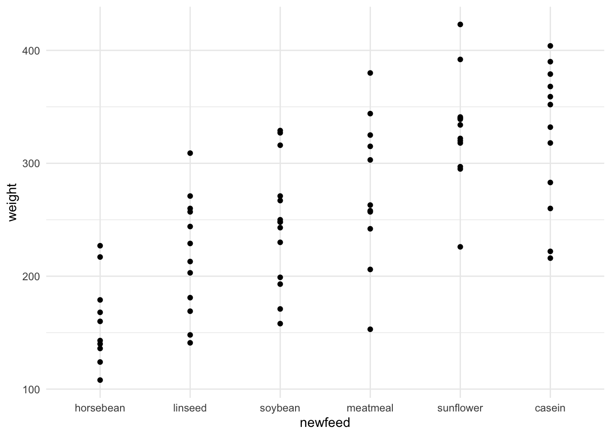
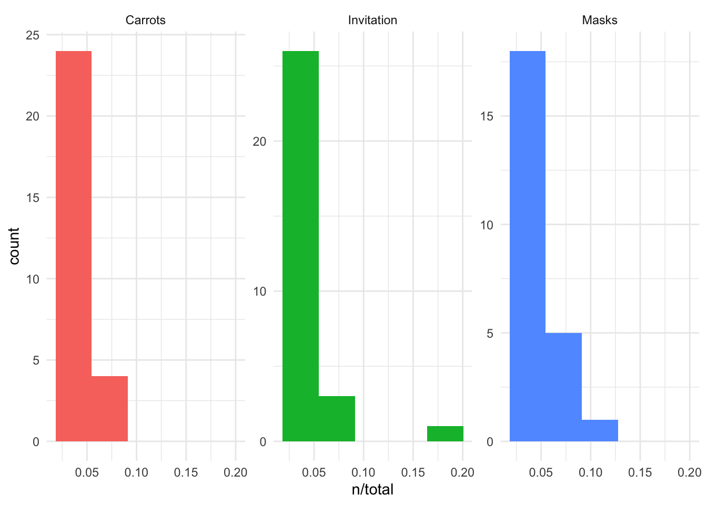
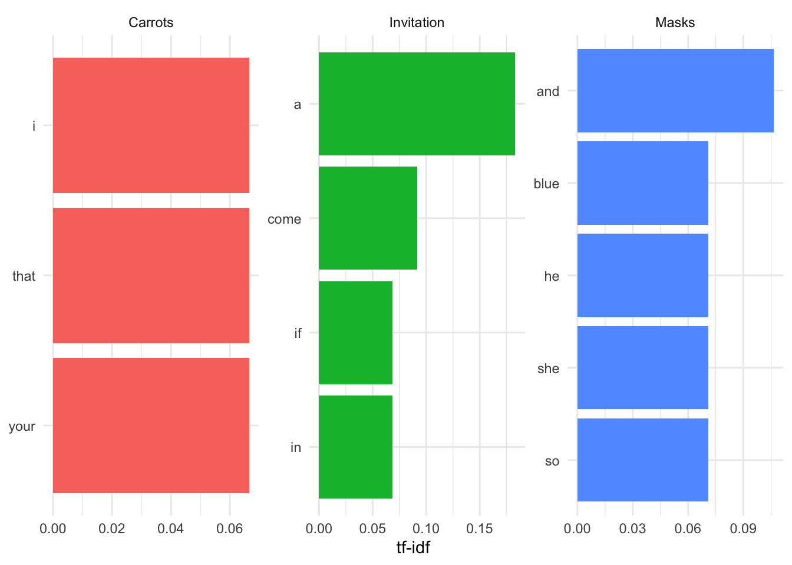

# Wrangling Data in the Tidyverse {#tidy-data}

In the last course we spent a ton of time talking about all the most common ways data are stored and reviewed how to get them into a tibble (or data.frame) in R.

So far we've discussed what tidy and untidy data are. We've (hopefully) convinced you that tidy data are the right type of data to work with. What we may not have made perfectly clear yet is that data are *not* always the tidiest when they come to you at the start of a project. An incredibly important skill of a data scientist is to be able to take data from an untidy format and get it into a tidy format. This process is often referred to as **data wrangling**. Generally, data wranglings skills are those that allow you to wrangle data from the format they're currently in into the tidy format you actually want them in.

Beyond data wrangling, it's also important to make sure the data you have are accurate and what you need to answer your question of interest. After wrangling the data into a tidy format, there is often further work that has to be done to **clean** the data. 

In this course we'll work with data in R to discuss the necessary data wrangling skills you'll need and demonstrate how to use the tidyverse to carry out data wrangling.


## Tidy Data Review

Before we move any further, let's review the requirements for a tidy dataset:

1. Each variable is stored in a column
2. Each observation is stored in a row
3. Each cell stores a single value

We had four tidy data principles in an earlier lesson, where the fourth was that each table should store a single *type* of information. That's less critical here, as we'll be working at first with single datasets, so let's just keep those three tidy data principles at the front of our minds.

## Reshaping Data

Tidy data generally exist in two forms: wide data and long data. Both types of data are used and needed in data analysis, and fortunately, there are tools that can take you from wide-to-long and from long-to-wide. This makes it easy to work with any tidy data set. We'll discuss the basics of what wide and long data are and how to go back and forth between the two in R. Getting data into the right format will be crucial later when summarizing data and visualizing it.

### Wide Data

Wide data has a column for each variable and a row for each observation. Data are often entered and stored in this manner. This is because wide data are often easy to understand at a glance. For example, this is a wide data set:


Up until this point, we would have described this dataset as a rectangular, tidy dataset. With the additional information just introduced, we can also state that it is a *wide* dataset. Here, you can clearly see what measurements were taken for each individual and can get a sense of how many individuals are contained in the dataset.

Specifically, each individual is in a different row with each variable in a different column. At a glance we can quickly see that we have information about four different people and that each person was measured in four different ways. 

### Long Data

Long data, on the other hand, has one column indicating the type of variable contained in that row and then a separate row for the value for that variable. Each row contains a single observation for a single variable. It's *still* a tidy datasets, but the information is stored in a long format:


This long dataset includes the exact same information as the previous wide dataset; it is just stored differently. It's harder to see visually how many different measurements were taken and on how many different people, but the same information is there.

While long data formats are less readable than wide data at a glance, they are often a lot easier to work with during analysis. Most of the tools we'll be working with use long data. Thus, to go from how data are often stored (wide) to working with the data during analysis (long), we'll need to understand what tools are needed to do this and how to work with them.

### Reshaping the Data

Converting your data from wide-to-long or from long-to-wide data formats is referred to as **reshaping** your data.


Within the tidyverse, [tidyr](https://tidyr.tidyverse.org/) is the go-to package for accomplishing this task. Within the `tidyr` package, you'll have to become familiar with a number of functions. The two most pertinent to reshaping data are: `pivot_wider()` and `pivot_longer()`. 

For these examples, we'll work with the `airquality` dataset available in R. The data in this dataset includes "Daily air quality measurements in New York, May to September 1973." This is a wide dataset because each day is in a separate row and there are multiple columns with each including information about a different variable (ozone, solar.r, wind, temp, month, and day). 

We'll load in the tidyverse, so that we can convert this data.frame to a tibble *and* see the first few lines of this dataset using the following code:


```r
library(tidyverse)

airquality <- as_tibble(airquality)
airquality
```

```
## # A tibble: 153 x 6
##    Ozone Solar.R  Wind  Temp Month   Day
##    <int>   <int> <dbl> <int> <int> <int>
##  1    41     190   7.4    67     5     1
##  2    36     118   8      72     5     2
##  3    12     149  12.6    74     5     3
##  4    18     313  11.5    62     5     4
##  5    NA      NA  14.3    56     5     5
##  6    28      NA  14.9    66     5     6
##  7    23     299   8.6    65     5     7
##  8    19      99  13.8    59     5     8
##  9     8      19  20.1    61     5     9
## 10    NA     194   8.6    69     5    10
## # … with 143 more rows
```

Again, wide data are easy to decipher at a glance. We can see that we have six different variables for each day, with each one of these variables (measurements) being stored in a separate column.

#### `tidyr`

The `tidyr` package is part of the tidyverse, so its functionality is available to you since you've loaded in the tidyverse. The two main functions we mentioned above will help you reshape your data in the following ways: 

* `pivot_longer()`: go from wide data to long data
* `pivot_wider()`: go from long data to wide data

To get started, you'll need to be sure that the `tidyr` package is installed and loaded into your RStudio session. 


##### `pivot_longer()`

As data are often stored in wide formats, you'll likely use `pivot_longer()` a lot more frequently than you'll use `pivot_wider()`. This will allow you to get the data into a long format that will be easy to use for analysis.

In `tidyr`, `pivot_longer()` will take the `airquality` dataset from wide to long, putting each column name into the first column and each corresponding value into the second column. Here, the first column will be called `name`. The second column will still be `value`.


```r
## use pivot_longer() to reshape from wide to long
gathered <- airquality %>%
  pivot_longer(everything())

## take a look at first few rows of long data
gathered
```

```
## # A tibble: 918 x 2
##    name    value
##    <chr>   <dbl>
##  1 Ozone    41  
##  2 Solar.R 190  
##  3 Wind      7.4
##  4 Temp     67  
##  5 Month     5  
##  6 Day       1  
##  7 Ozone    36  
##  8 Solar.R 118  
##  9 Wind      8  
## 10 Temp     72  
## # … with 908 more rows
```


However, it's very easy to change the names of these columns within `pivot_longer()`. To do so you specify what the `names_to` and `values_to` columns names should be within `pivot_longer()`:


```r
## to rename the column names that gather provides,
## change key and value to what you want those column names to be
gathered <- airquality %>%
  pivot_longer(everything(), names_to = "variable", values_to = "value")

## take a look at first few rows of long data
gathered 
```

```
## # A tibble: 918 x 2
##    variable value
##    <chr>    <dbl>
##  1 Ozone     41  
##  2 Solar.R  190  
##  3 Wind       7.4
##  4 Temp      67  
##  5 Month      5  
##  6 Day        1  
##  7 Ozone     36  
##  8 Solar.R  118  
##  9 Wind       8  
## 10 Temp      72  
## # … with 908 more rows
```


However, you're likely not interested in your day and month variable being separated out into their own variables within the `variable` column. In fact, knowing the day and month associated with a particular data point helps identify that particular data point. To account for this, you can exclude `day` and `month` from the variables being included in the `variable` column by specifying all the variables that you *do* want included in the `variable` column.  Here, that means specifying `Ozone`, `Solar.R`, `Wind`, and `Temp`. This will keep `Day` and `Month` in their own columns, allowing each row to be identified by the specific day and month being discussed.


```r
## in pivot_longer(), you can specify which variables 
## you want included in the long format
## it will leave the other variables as is
gathered <- airquality %>%
  pivot_longer(c(Ozone, Solar.R, Wind, Temp), 
               names_to = "variable", 
               values_to = "value")

## take a look at first few rows of long data
gathered
```

```
## # A tibble: 612 x 4
##    Month   Day variable value
##    <int> <int> <chr>    <dbl>
##  1     5     1 Ozone     41  
##  2     5     1 Solar.R  190  
##  3     5     1 Wind       7.4
##  4     5     1 Temp      67  
##  5     5     2 Ozone     36  
##  6     5     2 Solar.R  118  
##  7     5     2 Wind       8  
##  8     5     2 Temp      72  
##  9     5     3 Ozone     12  
## 10     5     3 Solar.R  149  
## # … with 602 more rows
```


Now, when you look at the top of this object, you'll see that `Month` and `Day` remain in the data frame and that variable combines information from the other columns in airquality (`Ozone`, `Solar.R`, `Wind`, `Temp`). This is still a long format dataset; however, it has used `Month` and `Day` as IDs when reshaping the data frame.

##### `pivot_wider()`

To return your long data back to its original form, you can use `pivot_wider()`. Here you specify two columns: the column that contains the names of what your wide data columns should be (`names_from`) and the column that contains the values that should go in these columns (`values_from`). The data frame resulting from `pivot_wider()` will have the original information back in the wide format (again, the columns will be in a different order). But, we'll discuss how to rearrange data in the next lesson!


```r
## use pivot_wider() to reshape from long to wide
spread_data <- gathered %>%
  pivot_wider(names_from = "variable", 
              values_from = "value")

## take a look at the wide data
spread_data
```

```
## # A tibble: 153 x 6
##    Month   Day Ozone Solar.R  Wind  Temp
##    <int> <int> <dbl>   <dbl> <dbl> <dbl>
##  1     5     1    41     190   7.4    67
##  2     5     2    36     118   8      72
##  3     5     3    12     149  12.6    74
##  4     5     4    18     313  11.5    62
##  5     5     5    NA      NA  14.3    56
##  6     5     6    28      NA  14.9    66
##  7     5     7    23     299   8.6    65
##  8     5     8    19      99  13.8    59
##  9     5     9     8      19  20.1    61
## 10     5    10    NA     194   8.6    69
## # … with 143 more rows
```

```r
## compare that back to the original
airquality
```

```
## # A tibble: 153 x 6
##    Ozone Solar.R  Wind  Temp Month   Day
##    <int>   <int> <dbl> <int> <int> <int>
##  1    41     190   7.4    67     5     1
##  2    36     118   8      72     5     2
##  3    12     149  12.6    74     5     3
##  4    18     313  11.5    62     5     4
##  5    NA      NA  14.3    56     5     5
##  6    28      NA  14.9    66     5     6
##  7    23     299   8.6    65     5     7
##  8    19      99  13.8    59     5     8
##  9     8      19  20.1    61     5     9
## 10    NA     194   8.6    69     5    10
## # … with 143 more rows
```


While reshaping data may not *read* like the most exciting topic, having this skill will be indispensable as you start working with data. It's best to get these skills down pat early!

## Data Wrangling

Once you've read your data into R and have it in the appropriately wide- or long-format, it's time to wrangle the data, so that it is in the appropriate format and includes the information you need. 

### R Packages

While there are *tons* of R packages out there to help you work with data, we're going to cover the packages and functions within those packages that you'll absolutely want and need to work with when working with data. 

#### `dplyr`

There is a package specifically designed for helping you wrangle your data. This package is called [`dplyr`](https://dplyr.tidyverse.org/) and will allow you to easily accomplish many of the data wrangling tasks necessary. Like `tidyr`, this package is a core package within the tidyverse, and thus it was loaded in for you when you ran `library(tidyverse)` earlier. We will cover a number of functions that will help you wrangle data using `dplyr`:

* `%>%` - pipe operator for chaining a sequence of operations
* `glimpse()` - get an overview of what's included in dataset
* `filter()` - filter rows
* `select()` - select, rename, and reorder columns
* `rename()` - rename columns
* `arrange()` - reorder rows
* `mutate()` - create a new column
* `group_by()` - group variables 
* `summarize()` - summarize information within a dataset
* `left_join()` - combine data across data frame
* `tally()` - get overall sum of values of specified column(s) or the number of rows of tibble
* `count()` - getcounts of unique values of specified column(s) (shortuct of `group_by()` and `tally()`)
* `add_count()` -  add values of `count()` as a new column 
* `add_tally()` - add value(s) of `tally()` as a new column

#### `tidyr`

We will also return to the `tidyr` package. The same package that we used to reshape our data will be helpful when wrangling data. The main functions we'll cover from `tidyr` are:

* `unite()` - combine contents of two or more columns into a single column
* `separate()` - separate contents of a column into two or more columns

#### `janitor`

The third package we'll include here is the `janitor` package. While not a core tidyverse package, this tidyverse-adjacent package provides tools for cleaning messy data. The main functions we'll cover from janitor are:

* `clean_names()` - clean names of a data frame
* `tabyl()` - get a helpful summary of a variable
* `get_dupes()` - identify duplicate observations

If you have not already, you'll want to be sure this package is installed and loaded:


```r
#install.packages('janitor')
library(janitor)
```


#### `skimr`

The final package we'll discuss here is the `skimr` package. This package provides a quick way to summarize a data.frame or tibble within the tidy data framework. We'll discuss its most useful function here:

* `skim()` - summarize a data frame
* `summary()` - quick overview stats about a data set

If you have not already, you'll want to be sure this package is installed and loaded:


```r
#install.packages('skimr')
library(skimr)
```

### The Pipe Operator

Before we get into the important functions within `dplyr`, it will be very useful to discuss what is known as the **pipe operator**. The pipe operator looks like this in R: `%>%`. Whenever you see the pipe `%>%`, think of the word "then", so if you saw the sentence "I went to the the store and %>% I went back to my house," you would read this as I went to the store and *then* I went back to my house. The pipe tells you to do one thing and *then* do another.

Generally, the pipe operator allows you to string a number of different functions together in a particular order. If you wanted to take data frame A and carry out function B on it in R, you could depict this with an arrow pointing from A to B:

A --> B

Here you are saying, "Take A and *then* feed it into function B."

In base R syntax, what is depicted by the arrow above would be carried out by calling the function B on the data frame object A:

```
B(A)
```

Alternatively, you could use the pipe operator (`%>%`):

```
A %>% B
```

However, often you are not performing just one action on a data frame, but rather you are looking to carry out multiple functions. We can again depict this with an arrow diagram.

A --> B --> C --> D

Here you are saying that you want to take data frame A and carry out function B, *then* you want to take the output from that and *then* carry out function C. Subsequently you want to take the output of that and *then* carry out function D. In R syntax, we would first apply function B to data frame A, then apply function C to this output, then apply function D to this output. This results in the following syntax that is hard to read because multiple calls to functions are nested within each other:

```
D(C(B(A)))
```

Alternatively, you could use the pipe operator. Each time you want take the output of one function and carry out something new on that output, you will use the pipe operator:

```
A %>% B %>% C %>% D
```

And, even more readable is when each of these steps is separated out onto its own individual line of code:

```
A %>% 
  B %>% 
    C %>%
      D
```

While both of the previous two code examples would provide the same output, the one below is more readable, which is a large part of why pipes are used. It makes your code more understandable to you and others.

Below we'll use this pipe operator a lot. Remember, it takes output from the left hand side and feeds it into the function that comes after the pipe. You'll get a better understanding of how it works as you run the code below. But, when in doubt remember that the pipe operator should be read as *then*.

### Filtering Data

When working with a large dataset, you're often interested in only working with a portion of the data at any one time. For example, if you had data on people from ages 0 to 100 years old, but you wanted to ask a question that only pertained to children, you would likely want to only work with data from those individuals who were less than 18 years old. To do this, you would want to **filter** your dataset to only include data from these select individuals. Filtering can be done by row or by column. We'll discuss the syntax in R for doing both. Please note that the examples in this lesson and the organization for this lesson were adapted from [Suzan Baert's](https://suzan.rbind.io/) wonderful `dplyr` tutorials. Links to the all four tutorials can be found in the "Additional Resources" section at the bottom of this lesson.

For the examples below, we'll be using a dataset from the `ggplot2` package called `msleep`. (You'll learn more about this package in a later course on data visualization. For now, it's a core tidyverse package so it's loaded in along with the other tidyverse packages using `library(tidyverse)`.) This dataset includes sleep times and weights from a number of different mammals. It has 83 rows, with each row including information about a different type of animal, and 11 variables. As each row is a different animal and each column includes information about that animal, this is a **wide** dataset.

To get an idea of what variables are included in this data frame, you can use `glimpse()`. This function summarizes how many rows there are (`Observations`) and how many columns there are (`Variables`). Additionally, it gives you a glimpse into the type of data contained in each column. Specifically, in this data set, we know that the first column is `name` and that it contains a character vector (`chr`) and that the first three entries are "Cheetah", "Owl monkey", and "Mountain beaver." It works similarly to the `summary()` function covered in an earlier course.


```r
## take a look at the data
glimpse(msleep)
```


#### Filtering Rows

If you were only interested in learning more about the sleep times of "Primates," we could filter this dataset to include only data about those mammals that are also Primates. As we can see from `glimpse()`, this information is contained within the `order` variable. So to do this within R, we use the following syntax:


```r
# filter to only include primates
msleep %>%
  filter(order == "Primates")
```

```
## # A tibble: 12 x 11
##    name  genus vore  order conservation sleep_total sleep_rem sleep_cycle awake
##    <chr> <chr> <chr> <chr> <chr>              <dbl>     <dbl>       <dbl> <dbl>
##  1 Owl … Aotus omni  Prim… <NA>                17         1.8      NA       7  
##  2 Griv… Cerc… omni  Prim… lc                  10         0.7      NA      14  
##  3 Pata… Eryt… omni  Prim… lc                  10.9       1.1      NA      13.1
##  4 Gala… Gala… omni  Prim… <NA>                 9.8       1.1       0.55   14.2
##  5 Human Homo  omni  Prim… <NA>                 8         1.9       1.5    16  
##  6 Mong… Lemur herbi Prim… vu                   9.5       0.9      NA      14.5
##  7 Maca… Maca… omni  Prim… <NA>                10.1       1.2       0.75   13.9
##  8 Slow… Nyct… carni Prim… <NA>                11        NA        NA      13  
##  9 Chim… Pan   omni  Prim… <NA>                 9.7       1.4       1.42   14.3
## 10 Babo… Papio omni  Prim… <NA>                 9.4       1         0.667  14.6
## 11 Potto Pero… omni  Prim… lc                  11        NA        NA      13  
## 12 Squi… Saim… omni  Prim… <NA>                 9.6       1.4      NA      14.4
## # … with 2 more variables: brainwt <dbl>, bodywt <dbl>
```

Note that we are using the equality `==` comparison operator that you learned about in the previous course. Also note that we have used the pipe operator to feed the `msleep` data frame into the `filter()` function. 

The above is shorthand for:


```r
filter(msleep, order == "Primates")
```

```
## # A tibble: 12 x 11
##    name  genus vore  order conservation sleep_total sleep_rem sleep_cycle awake
##    <chr> <chr> <chr> <chr> <chr>              <dbl>     <dbl>       <dbl> <dbl>
##  1 Owl … Aotus omni  Prim… <NA>                17         1.8      NA       7  
##  2 Griv… Cerc… omni  Prim… lc                  10         0.7      NA      14  
##  3 Pata… Eryt… omni  Prim… lc                  10.9       1.1      NA      13.1
##  4 Gala… Gala… omni  Prim… <NA>                 9.8       1.1       0.55   14.2
##  5 Human Homo  omni  Prim… <NA>                 8         1.9       1.5    16  
##  6 Mong… Lemur herbi Prim… vu                   9.5       0.9      NA      14.5
##  7 Maca… Maca… omni  Prim… <NA>                10.1       1.2       0.75   13.9
##  8 Slow… Nyct… carni Prim… <NA>                11        NA        NA      13  
##  9 Chim… Pan   omni  Prim… <NA>                 9.7       1.4       1.42   14.3
## 10 Babo… Papio omni  Prim… <NA>                 9.4       1         0.667  14.6
## 11 Potto Pero… omni  Prim… lc                  11        NA        NA      13  
## 12 Squi… Saim… omni  Prim… <NA>                 9.6       1.4      NA      14.4
## # … with 2 more variables: brainwt <dbl>, bodywt <dbl>
```

The output is the same as above here, but the code is slightly less readable. This is why we use the pipe (`%>%`)!


Now, we have a smaller dataset of only 12 mammals (as opposed to the original 83) and we can see that the `order` variable column only includes "Primates." 

But, what if we were only interested in Primates who sleep more than 10 hours total per night? This information is in the `sleep_total` column. Fortunately, `filter()` also works on numeric variables. To accomplish this, you would use the following syntax, separating the multiple filters you want to apply with a comma:


```r
msleep %>%
  filter(order == "Primates", sleep_total > 10)
```

```
## # A tibble: 5 x 11
##   name  genus vore  order conservation sleep_total sleep_rem sleep_cycle awake
##   <chr> <chr> <chr> <chr> <chr>              <dbl>     <dbl>       <dbl> <dbl>
## 1 Owl … Aotus omni  Prim… <NA>                17         1.8       NA      7  
## 2 Pata… Eryt… omni  Prim… lc                  10.9       1.1       NA     13.1
## 3 Maca… Maca… omni  Prim… <NA>                10.1       1.2        0.75  13.9
## 4 Slow… Nyct… carni Prim… <NA>                11        NA         NA     13  
## 5 Potto Pero… omni  Prim… lc                  11        NA         NA     13  
## # … with 2 more variables: brainwt <dbl>, bodywt <dbl>
```

Note that we have used the "greater than" comparison operator with `sleep_total`.

Now, we have a dataset focused in on only 5 mammals, all of which are primates who sleep for more than 10 hours a night total.


We can obtain the same result with the AND `&` logical operator instead of separating filtering conditions with a comma:


```r
msleep %>%
  filter(order == "Primates" & sleep_total > 10)
```

```
## # A tibble: 5 x 11
##   name  genus vore  order conservation sleep_total sleep_rem sleep_cycle awake
##   <chr> <chr> <chr> <chr> <chr>              <dbl>     <dbl>       <dbl> <dbl>
## 1 Owl … Aotus omni  Prim… <NA>                17         1.8       NA      7  
## 2 Pata… Eryt… omni  Prim… lc                  10.9       1.1       NA     13.1
## 3 Maca… Maca… omni  Prim… <NA>                10.1       1.2        0.75  13.9
## 4 Slow… Nyct… carni Prim… <NA>                11        NA         NA     13  
## 5 Potto Pero… omni  Prim… lc                  11        NA         NA     13  
## # … with 2 more variables: brainwt <dbl>, bodywt <dbl>
```

Note that the number of columns hasn't changed. All 11 variables are still shown in columns because the function `filter()` filters on rows, not columns.

#### Selecting Columns

While `filter()` operates on rows, it *is* possible to filter your dataset to only include the columns you're interested in. To select columns so that your dataset only includes variables you're interested in, you will use `select()`. 

Let's start with the code we just wrote to only include primates who sleep a lot. What if we only want to include the first column (the name of the mammal) and the sleep information (included in the columns `sleep_total`, `sleep_rem`, and `sleep_cycle`)? We would do this by starting with the code we just used, adding another pipe, and using the function `select()`. Within `select`, we specify which columns we want in our output.


```r
msleep %>%
  filter(order == "Primates", sleep_total > 10) %>%
  select(name, sleep_total, sleep_rem, sleep_cycle)
```

```
## # A tibble: 5 x 4
##   name         sleep_total sleep_rem sleep_cycle
##   <chr>              <dbl>     <dbl>       <dbl>
## 1 Owl monkey          17         1.8       NA   
## 2 Patas monkey        10.9       1.1       NA   
## 3 Macaque             10.1       1.2        0.75
## 4 Slow loris          11        NA         NA   
## 5 Potto               11        NA         NA
```


Now, using `select()` we see that we still have the five rows we filtered to before, but we only have the four columns specified using `select()`. Here you can hopefully see the power of the pipe operator to chain together several commands in a row. Without the pipe operator, the full command would look like this:


```r
select(filter(msleep, order == "Primates", sleep_total > 10), name, sleep_total, sleep_rem, sleep_cycle)
```

Yuck. Definitely harder to read. We'll stick with the above approach!

#### Renaming Columns

`select()` can also be used to rename columns. To do so, you use the syntax: `new_column_name = old_column_name` within `select`. For example, to select the same columns and rename them `total`, `rem` and `cycle`, you would use the following syntax:


```r
msleep %>%
  filter(order == "Primates", sleep_total > 10) %>%
  select(name, total = sleep_total, rem = sleep_rem, cycle = sleep_cycle)
```

```
## # A tibble: 5 x 4
##   name         total   rem cycle
##   <chr>        <dbl> <dbl> <dbl>
## 1 Owl monkey    17     1.8 NA   
## 2 Patas monkey  10.9   1.1 NA   
## 3 Macaque       10.1   1.2  0.75
## 4 Slow loris    11    NA   NA   
## 5 Potto         11    NA   NA
```


It's important to keep in mind that when using `select()` to rename columns, only the specified columns will be included and renamed in the output. If you, instead, want to change the names of a few columns but return *all* columns in your output, you'll want to use `rename()`. For example, the following, returns a data frame with all 11 columns, where the column names for three columns specified within `rename()` function have been renamed.


```r
msleep %>%
  filter(order == "Primates", sleep_total > 10) %>%
  rename(total = sleep_total, rem = sleep_rem, cycle = sleep_cycle)
```

```
## # A tibble: 5 x 11
##   name    genus  vore  order conservation total   rem cycle awake brainwt bodywt
##   <chr>   <chr>  <chr> <chr> <chr>        <dbl> <dbl> <dbl> <dbl>   <dbl>  <dbl>
## 1 Owl mo… Aotus  omni  Prim… <NA>          17     1.8 NA      7    0.0155   0.48
## 2 Patas … Eryth… omni  Prim… lc            10.9   1.1 NA     13.1  0.115   10   
## 3 Macaque Macaca omni  Prim… <NA>          10.1   1.2  0.75  13.9  0.179    6.8 
## 4 Slow l… Nycti… carni Prim… <NA>          11    NA   NA     13    0.0125   1.4 
## 5 Potto   Perod… omni  Prim… lc            11    NA   NA     13   NA        1.1
```


### Reordering

In addition to filtering rows and columns, often, you'll want the data arranged in a particular order. It may order the columns in a logical way, or it could be to sort the data so that the data are sorted by value, with those having the smallest value in the first row and the largest value in the last row. All of this can be achieved with a few simple functions.

#### Reordering Columns

The `select()` function is powerful. Not only will it filter and rename columns, but it can also be used to reorder your columns. Using our example from above, if you wanted `sleep_rem` to be the first sleep column and `sleep_total` to be the last column, all you have to do is reorder them within `select()`. The output from `select()` would then be reordered to match the order specified within `select()`.


```r
msleep %>%
  filter(order == "Primates", sleep_total > 10) %>%
  select(name, sleep_rem, sleep_cycle, sleep_total)
```

```
## # A tibble: 5 x 4
##   name         sleep_rem sleep_cycle sleep_total
##   <chr>            <dbl>       <dbl>       <dbl>
## 1 Owl monkey         1.8       NA           17  
## 2 Patas monkey       1.1       NA           10.9
## 3 Macaque            1.2        0.75        10.1
## 4 Slow loris        NA         NA           11  
## 5 Potto             NA         NA           11
```

Here we see that sleep_rem `name` is displayed first followed by `sleep_rem`, `sleep_cycle`, and `sleep_total`, just as it was specified within `select()`. 


#### Reordering Rows

Rows can also be reordered. To reorder a variable in ascending order (from smallest to largest), you'll want to use `arrange()`. Continuing on from our example above, to now sort our rows by the amount of total sleep each mammal gets, we would use the following syntax:


```r
msleep %>%
  filter(order == "Primates", sleep_total > 10) %>%
  select(name, sleep_rem, sleep_cycle, sleep_total) %>%
  arrange(sleep_total)
```

```
## # A tibble: 5 x 4
##   name         sleep_rem sleep_cycle sleep_total
##   <chr>            <dbl>       <dbl>       <dbl>
## 1 Macaque            1.2        0.75        10.1
## 2 Patas monkey       1.1       NA           10.9
## 3 Slow loris        NA         NA           11  
## 4 Potto             NA         NA           11  
## 5 Owl monkey         1.8       NA           17
```


While `arrange` sorts variables in ascending order, it's also possible to sort in descending (largest to smallest) order. To do this you just use `desc()` with the following syntax:


```r
msleep %>%
  filter(order == "Primates", sleep_total > 10) %>%
  select(name, sleep_rem, sleep_cycle, sleep_total) %>%
  arrange(desc(sleep_total))
```

```
## # A tibble: 5 x 4
##   name         sleep_rem sleep_cycle sleep_total
##   <chr>            <dbl>       <dbl>       <dbl>
## 1 Owl monkey         1.8       NA           17  
## 2 Slow loris        NA         NA           11  
## 3 Potto             NA         NA           11  
## 4 Patas monkey       1.1       NA           10.9
## 5 Macaque            1.2        0.75        10.1
```

By putting `sleep_total` within `desc()`, `arrange()` will now sort your data from the primates with the longest total sleep to the shortest.


`arrange()` can also be used to order non-numeric variables. For example, `arrange()` will sort character vectors alphabetically. 


```r
msleep %>%
  filter(order == "Primates", sleep_total > 10) %>%
  select(name, sleep_rem, sleep_cycle, sleep_total) %>%
  arrange(name)
```

```
## # A tibble: 5 x 4
##   name         sleep_rem sleep_cycle sleep_total
##   <chr>            <dbl>       <dbl>       <dbl>
## 1 Macaque            1.2        0.75        10.1
## 2 Owl monkey         1.8       NA           17  
## 3 Patas monkey       1.1       NA           10.9
## 4 Potto             NA         NA           11  
## 5 Slow loris        NA         NA           11
```


If you would like to reorder rows based on information in multiple columns, you can specify them separated by commas. This is useful if you have repeated labels in one column and want to sort within a category based on information in another column. In the example here, if there were repeated primates, this would sort the repeats based on their total sleep.


```r
msleep %>%
  filter(order == "Primates", sleep_total > 10) %>%
  select(name, sleep_rem, sleep_cycle, sleep_total) %>%
  arrange(name, sleep_total)
```

```
## # A tibble: 5 x 4
##   name         sleep_rem sleep_cycle sleep_total
##   <chr>            <dbl>       <dbl>       <dbl>
## 1 Macaque            1.2        0.75        10.1
## 2 Owl monkey         1.8       NA           17  
## 3 Patas monkey       1.1       NA           10.9
## 4 Potto             NA         NA           11  
## 5 Slow loris        NA         NA           11
```

### Creating new columns

You will often find when working with data that you need an additional column. For example, if you had two datasets you wanted to combine, you may want to make a new column in each dataset called `dataset`. In one dataset you may put `datasetA` in each row. In the second dataset, you could put `datasetB`. This way, once you combined the data, you would be able to keep track of which dataset each row came from originally. More often, however, you'll likely want to create a new column that calculates a new variable based on information in a column you already have. For example, in our mammal sleep dataset, `sleep_total` is in hours. What if you wanted to have that information in minutes? You could create a new column with this very information! The function `mutate()` was *made* for **all** of these new-column-creating situations. This function has a lot of capabilities. We'll cover the basics here. 

Returning to our `msleep` dataset, after filtering and re-ordering, we can create a new column with `mutate()`. Within `mutate()`, we will calculate the number of minutes each mammal sleeps by multiplying the number of hours each animal sleeps by 60 minutes.


```r
msleep %>%
  filter(order == "Primates", sleep_total > 10) %>%
  select(name, sleep_rem, sleep_cycle, sleep_total) %>%
  arrange(name) %>%
  mutate(sleep_total_min = sleep_total * 60)
```

```
## # A tibble: 5 x 5
##   name         sleep_rem sleep_cycle sleep_total sleep_total_min
##   <chr>            <dbl>       <dbl>       <dbl>           <dbl>
## 1 Macaque            1.2        0.75        10.1             606
## 2 Owl monkey         1.8       NA           17              1020
## 3 Patas monkey       1.1       NA           10.9             654
## 4 Potto             NA         NA           11               660
## 5 Slow loris        NA         NA           11               660
```


### Separating Columns 

Sometimes multiple pieces of information are merged within a single column even though it would be more useful during analysis to have those pieces of information in separate columns. To demonstrate, we'll now move from the `msleep` dataset to talking about another [dataset](https://raw.githubusercontent.com/suzanbaert/RTutorials/master/Rmd_originals/conservation_explanation.csv) that includes information about conservation abbreviations in a single column.

To read this file into R, we'll use the `readr` package.


```r
## download file 
conservation <- read_csv("https://raw.githubusercontent.com/suzanbaert/Dplyr_Tutorials/master/conservation_explanation.csv")

## take a look at this file
conservation
```

```
## # A tibble: 11 x 1
##    `conservation abbreviation`                  
##    <chr>                                        
##  1 EX = Extinct                                 
##  2 EW = Extinct in the wild                     
##  3 CR = Critically Endangered                   
##  4 EN = Endangered                              
##  5 VU = Vulnerable                              
##  6 NT = Near Threatened                         
##  7 LC = Least Concern                           
##  8 DD = Data deficient                          
##  9 NE = Not evaluated                           
## 10 PE = Probably extinct (informal)             
## 11 PEW = Probably extinct in the wild (informal)
```


In this dataset, we see that there is a single column that includes *both* the abbreviation for the conservation term as well as what that abbreviation means. Recall that this violates one of the tidy data principles covered in the first lesson: Put just one thing in a cell. To work with these data, you could imagine that you may want these two pieces of information (the abbreviation and the description) in two different columns. To accomplish this in R, you'll want to use `separate()` from `tidyr`.

The `separate()` function requires the name of the existing column that you want to separate (`conservation abbreviation`), the desired column names of the resulting separated columns (`into = c("abbreviation", "description")`), and the characters that currently separate the pieces of information (`sep = " = "`). We have to put `conservation abbreviation` in back ticks in the code below because the column name contains a space. Without the back ticks, R would think that `conservation` and `abbreviation` were two separate things. This is another violation of tidy data! Variable names should have underscores, not spaces!


```r
conservation %>%
  separate(`conservation abbreviation`, 
           into = c("abbreviation", "description"), sep = " = ")
```

```
## # A tibble: 11 x 2
##    abbreviation description                            
##    <chr>        <chr>                                  
##  1 EX           Extinct                                
##  2 EW           Extinct in the wild                    
##  3 CR           Critically Endangered                  
##  4 EN           Endangered                             
##  5 VU           Vulnerable                             
##  6 NT           Near Threatened                        
##  7 LC           Least Concern                          
##  8 DD           Data deficient                         
##  9 NE           Not evaluated                          
## 10 PE           Probably extinct (informal)            
## 11 PEW          Probably extinct in the wild (informal)
```

The output of this code shows that we now have two separate columns with the information in the original column separated out into `abbreviation` and `description`.


### Merging Columns 

The opposite of `separate()` is `unite()`. So, if you have information in two or more different columns but wish it were in one single column, you'll want to use `unite()`. Using the code forming the two separate columns above, we can then add on an extra line of `unite()` code to re-join these separate columns, returning what we started with.


```r
conservation %>%
  separate(`conservation abbreviation`, 
           into = c("abbreviation", "description"), sep = " = ") %>%
  unite(united_col, abbreviation, description, sep = " = ")
```

```
## # A tibble: 11 x 1
##    united_col                                   
##    <chr>                                        
##  1 EX = Extinct                                 
##  2 EW = Extinct in the wild                     
##  3 CR = Critically Endangered                   
##  4 EN = Endangered                              
##  5 VU = Vulnerable                              
##  6 NT = Near Threatened                         
##  7 LC = Least Concern                           
##  8 DD = Data deficient                          
##  9 NE = Not evaluated                           
## 10 PE = Probably extinct (informal)             
## 11 PEW = Probably extinct in the wild (informal)
```


### Cleaning up column names

While maybe not quite as important as some of the other functions mentioned in this lesson, a function that will likely prove very helpful as you start analyzing lots of different datasets is `clean_names()` from the `janitor` package. This function takes the existing column names of your dataset, converts them all to lowercase letters and numbers, and separates all words using the underscore character. For example, there is a space in the column name for conservation. `clean_names()` will convert `conservation abbreviation` to `conservation_abbreviation`. These cleaned up column names are a lot easier to work with when you have large datasets.

So remember this is what the data first looked like:


And now with "clean names" it looks like this:

```r
conservation %>%
  clean_names()
```

```
## # A tibble: 11 x 1
##    conservation_abbreviation                    
##    <chr>                                        
##  1 EX = Extinct                                 
##  2 EW = Extinct in the wild                     
##  3 CR = Critically Endangered                   
##  4 EN = Endangered                              
##  5 VU = Vulnerable                              
##  6 NT = Near Threatened                         
##  7 LC = Least Concern                           
##  8 DD = Data deficient                          
##  9 NE = Not evaluated                           
## 10 PE = Probably extinct (informal)             
## 11 PEW = Probably extinct in the wild (informal)
```


### Combining data across data frames

There is often information stored in two separate data frames that you'll want in a single data frame. There are *many* different ways to join separate data frames. They are discussed in more detail in [this tutorial](http://stat545.com/bit001_dplyr-cheatsheet.html) from [Jenny Bryan](https://www.stat.ubc.ca/~jenny/). Here, we'll demonstrate how the `left_join()` function works, as this is used frequently. 

Let's try to combine the information from the two different datasets we've used in this lesson. We have `msleep` and `conservation`. `msleep` contains a column called `conservation`. This column includes lowercase abbreviations that overlap with the uppercase abbreviations in the `abbreviation` column in the `conservation` dataset.

To handle the fact that in one dataset the abbreviations are lowercase and the other they are uppercase, we'll use `mutate()` to take all the lowercase abbreviations to uppercase abbreviations using the function `toupper()`. 
 
We'll then use `left_join()` which takes all of the rows in the first dataset mentioned (`msleep`, below) and incorporates information from the second dataset mentioned (`conserve`, below), when information in the second dataset is available. The `by = ` argument states what columns to join by in the first ("conservation") and second ("abbreviation") datasets. This join adds the `description` column from the `conserve` dataset onto the original dataset (`msleep`). Note that if there is no information in the second dataset that matches with the information in the first dataset, `left_join()` will add NA. Specifically, for rows where conservation is "DOMESTICATED" below, the `description` column will have NA because "DOMESTICATED"" is not an abbreviation in the `conserve` dataset.


```r
## take conservation dataset and separate information
## into two columns
## call that new object `conserve`
conserve <- conservation %>%
  separate(`conservation abbreviation`, 
           into = c("abbreviation", "description"), sep = " = ")


## now lets join the two datasets together
msleep %>%
  mutate(conservation = toupper(conservation)) %>%
  left_join(conserve, by = c("conservation" = "abbreviation"))
```


It's important to note that there are many other ways to join data, which are covered in more detail on this [dplyr join cheatsheet](http://stat545.com/bit001_dplyr-cheatsheet.html) from Jenny Bryan. For now, it's important to know that joining datasets is done easily in R using tools in `dplyr`. As you join data frames in your own work, it's a good idea to refer back to this cheatsheet for assistance.

### Grouping Data

Often, data scientists will want to summarize information in their dataset. You may want to know how many people are in a dataset. However, more often, you'll want to know how many people there are within a group in your dataset. For example, you may want to know how many males and how many females there are. To do this, grouping your data is necessary. Rather than looking at the total number of individuals, to accomplish this, you first have to **group the data** by the gender of the individuals. Then, you count within those groups. Grouping by variables within `dplyr` is straightforward.

#### `group_by()`

There is an incredibly helpful function within `dplyr` called `group_by()`. `group_by()` groups a dataset by one or more variables. On its own, it does not appear to change the dataset very much. The difference between the two outputs below is subtle:


```r
msleep

msleep %>%
  group_by(order)
```


In fact, the only aspect of the output that is different is that the number of different orders is now printed on your screen. However, in the next section, you'll see that the output from any further functions you carry out at this point will differ between the two datasets.

### Summarizing Data

Throughout data cleaning and analysis it will be important to summarize information in your dataset. This may be for a formal report or for checking the results of a data tidying operation.

#### `summarize()`

Continuing on from the previous examples, if you wanted to figure out how many samples are present in your dataset, you could use the `summarize()` function. 


```r
msleep %>%
# here we select the column called genus, any column would work
  select(genus) %>%
  summarize(N=n())
```

```
## # A tibble: 1 x 1
##       N
##   <int>
## 1    83
```

```r
msleep %>%
# here we select the column called vore, any column would work
  select(vore) %>%
  summarize(N=n())
```

```
## # A tibble: 1 x 1
##       N
##   <int>
## 1    83
```

This provides a summary of the data with the new column name we specified above (`N`) and the number of samples in the dataset. Note that we could also obtain the same information by directly obtaining the number of rows in the data frame with `nrow(msleep)`.


However, if you wanted to count how many of each different `order` of mammal you had. You would first `group_by(order)` and then use `summarize()`. This will summarize within group.


```r
msleep %>%
  group_by(order) %>% 
  select(order) %>%
  summarize(N=n())
```

```
## `summarise()` ungrouping output (override with `.groups` argument)
```

```
## # A tibble: 19 x 2
##    order               N
##    <chr>           <int>
##  1 Afrosoricida        1
##  2 Artiodactyla        6
##  3 Carnivora          12
##  4 Cetacea             3
##  5 Chiroptera          2
##  6 Cingulata           2
##  7 Didelphimorphia     2
##  8 Diprotodontia       2
##  9 Erinaceomorpha      2
## 10 Hyracoidea          3
## 11 Lagomorpha          1
## 12 Monotremata         1
## 13 Perissodactyla      3
## 14 Pilosa              1
## 15 Primates           12
## 16 Proboscidea         2
## 17 Rodentia           22
## 18 Scandentia          1
## 19 Soricomorpha        5
```

The output from this, like above, includes the column name we specified in summarize (`N`). However, it includes the number of samples in the group_by variable we specified (`order`).


There are other ways in which the data can be summarized using `summarize()`. In addition to using n() to count the number of samples within a group, you can also summarize using other helpful functions within R, such as `mean()`, `median()`, `min()`, and `max()`. 

For example, if we wanted to calculate the average (mean) total sleep each order of mammal got, we could use the following syntax:


```r
msleep %>%
  group_by(order) %>% 
  select(order, sleep_total) %>%
  summarize(N=n(), mean_sleep=mean(sleep_total))
```

```
## `summarise()` ungrouping output (override with `.groups` argument)
```

```
## # A tibble: 19 x 3
##    order               N mean_sleep
##    <chr>           <int>      <dbl>
##  1 Afrosoricida        1      15.6 
##  2 Artiodactyla        6       4.52
##  3 Carnivora          12      10.1 
##  4 Cetacea             3       4.5 
##  5 Chiroptera          2      19.8 
##  6 Cingulata           2      17.8 
##  7 Didelphimorphia     2      18.7 
##  8 Diprotodontia       2      12.4 
##  9 Erinaceomorpha      2      10.2 
## 10 Hyracoidea          3       5.67
## 11 Lagomorpha          1       8.4 
## 12 Monotremata         1       8.6 
## 13 Perissodactyla      3       3.47
## 14 Pilosa              1      14.4 
## 15 Primates           12      10.5 
## 16 Proboscidea         2       3.6 
## 17 Rodentia           22      12.5 
## 18 Scandentia          1       8.9 
## 19 Soricomorpha        5      11.1
```


#### `tabyl()`

In addition to using `summarize()` from `dplyr`, the `tabyl()` function from the `janitor` package can be incredibly helpful for summarizing categorical variables quickly and discerning the output at a glance. It is similar to the `table()` function from base R, but is explicit about missing data, rather than ignoring missing values by default.

Again returning to our `msleep` dataset, if we wanted to get a summary of how many samples are in each order category and what percent of the data fall into each category we could call tabyl on that variable. For example, if we use the following syntax, we easily get a quick snapshot of this variable. 


```r
msleep %>%
  tabyl(order)
```

```
##            order  n    percent
##     Afrosoricida  1 0.01204819
##     Artiodactyla  6 0.07228916
##        Carnivora 12 0.14457831
##          Cetacea  3 0.03614458
##       Chiroptera  2 0.02409639
##        Cingulata  2 0.02409639
##  Didelphimorphia  2 0.02409639
##    Diprotodontia  2 0.02409639
##   Erinaceomorpha  2 0.02409639
##       Hyracoidea  3 0.03614458
##       Lagomorpha  1 0.01204819
##      Monotremata  1 0.01204819
##   Perissodactyla  3 0.03614458
##           Pilosa  1 0.01204819
##         Primates 12 0.14457831
##      Proboscidea  2 0.02409639
##         Rodentia 22 0.26506024
##       Scandentia  1 0.01204819
##     Soricomorpha  5 0.06024096
```


Note, that `tabyl` assumes categorical variables. If you want to summarize numeric variables `summary()` works well. For example, this code will summarize the values in `msleep$awake` for you. 


```r
summary(msleep$awake)
```

```
##    Min. 1st Qu.  Median    Mean 3rd Qu.    Max. 
##    4.10   10.25   13.90   13.57   16.15   22.10
```


#### `tally()`

We can use the tally function to get the total number of samples in a tibble or the total number of rows very simply.

```r
msleep %>%
  tally()
```

```
## # A tibble: 1 x 1
##       n
##   <int>
## 1    83
```

We can see that this is very similar to our previous use of summarize.

```r
msleep %>%
  # here we select the column called genus, any column would work
  select(genus) %>% 
  summarize(N=n())
```

```
## # A tibble: 1 x 1
##       N
##   <int>
## 1    83
```

We can also use this function to get a sum of the values of a column (if the values are numeric).


```r
msleep %>%
tally(sleep_total)
```

```
## # A tibble: 1 x 1
##       n
##   <dbl>
## 1   866
```
Thus overall, all the animals in the dataset sleep 866 hours in total.

This is the equivalent to using the sum `function()` with the `summarize()` function or the `pull` function.


```r
msleep %>%
  summarize(sum_sleep_total = sum(sleep_total))
```

```
## # A tibble: 1 x 1
##   sum_sleep_total
##             <dbl>
## 1             866
```

```r
msleep %>%
pull(sleep_total)%>%
  sum()
```

```
## [1] 866
```

#### `add_tally()`

We can quickly add our tally values to our tibble using `add_tally()`.


```r
msleep %>%
  add_tally() %>%
  glimpse()
```

```
## Rows: 83
## Columns: 12
## $ name         <chr> "Cheetah", "Owl monkey", "Mountain beaver", "Greater sho…
## $ genus        <chr> "Acinonyx", "Aotus", "Aplodontia", "Blarina", "Bos", "Br…
## $ vore         <chr> "carni", "omni", "herbi", "omni", "herbi", "herbi", "car…
## $ order        <chr> "Carnivora", "Primates", "Rodentia", "Soricomorpha", "Ar…
## $ conservation <chr> "lc", NA, "nt", "lc", "domesticated", NA, "vu", NA, "dom…
## $ sleep_total  <dbl> 12.1, 17.0, 14.4, 14.9, 4.0, 14.4, 8.7, 7.0, 10.1, 3.0, …
## $ sleep_rem    <dbl> NA, 1.8, 2.4, 2.3, 0.7, 2.2, 1.4, NA, 2.9, NA, 0.6, 0.8,…
## $ sleep_cycle  <dbl> NA, NA, NA, 0.1333333, 0.6666667, 0.7666667, 0.3833333, …
## $ awake        <dbl> 11.9, 7.0, 9.6, 9.1, 20.0, 9.6, 15.3, 17.0, 13.9, 21.0, …
## $ brainwt      <dbl> NA, 0.01550, NA, 0.00029, 0.42300, NA, NA, NA, 0.07000, …
## $ bodywt       <dbl> 50.000, 0.480, 1.350, 0.019, 600.000, 3.850, 20.490, 0.0…
## $ n            <int> 83, 83, 83, 83, 83, 83, 83, 83, 83, 83, 83, 83, 83, 83, …
```
Notice the new column called "n" that repeats the total number of samples for each row.

Or we can add a column that repeats the total hours of sleep of all the animals.


```r
msleep %>%
  add_tally(sleep_total) %>%
  glimpse()
```

```
## Rows: 83
## Columns: 12
## $ name         <chr> "Cheetah", "Owl monkey", "Mountain beaver", "Greater sho…
## $ genus        <chr> "Acinonyx", "Aotus", "Aplodontia", "Blarina", "Bos", "Br…
## $ vore         <chr> "carni", "omni", "herbi", "omni", "herbi", "herbi", "car…
## $ order        <chr> "Carnivora", "Primates", "Rodentia", "Soricomorpha", "Ar…
## $ conservation <chr> "lc", NA, "nt", "lc", "domesticated", NA, "vu", NA, "dom…
## $ sleep_total  <dbl> 12.1, 17.0, 14.4, 14.9, 4.0, 14.4, 8.7, 7.0, 10.1, 3.0, …
## $ sleep_rem    <dbl> NA, 1.8, 2.4, 2.3, 0.7, 2.2, 1.4, NA, 2.9, NA, 0.6, 0.8,…
## $ sleep_cycle  <dbl> NA, NA, NA, 0.1333333, 0.6666667, 0.7666667, 0.3833333, …
## $ awake        <dbl> 11.9, 7.0, 9.6, 9.1, 20.0, 9.6, 15.3, 17.0, 13.9, 21.0, …
## $ brainwt      <dbl> NA, 0.01550, NA, 0.00029, 0.42300, NA, NA, NA, 0.07000, …
## $ bodywt       <dbl> 50.000, 0.480, 1.350, 0.019, 600.000, 3.850, 20.490, 0.0…
## $ n            <dbl> 866, 866, 866, 866, 866, 866, 866, 866, 866, 866, 866, 8…
```
#### `count()`

The `count()` function takes the `tally()` function a step further to determine the count of unique values for specified variable(s)/column(s).


```r
msleep %>%
  count(vore)
```

```
## # A tibble: 5 x 2
##   vore        n
##   <chr>   <int>
## 1 carni      19
## 2 herbi      32
## 3 insecti     5
## 4 omni       20
## 5 <NA>        7
```

This is the same as using group_by() with tally()


```r
msleep %>%
  group_by(vore) %>%
  tally()
```

```
## # A tibble: 5 x 2
##   vore        n
##   <chr>   <int>
## 1 carni      19
## 2 herbi      32
## 3 insecti     5
## 4 omni       20
## 5 <NA>        7
```

Multiple variables can be specified with `count()`. 

This can be really useful when getting to know your data.


```r
msleep %>%
  count(vore, order)
```

```
## # A tibble: 32 x 3
##    vore  order               n
##    <chr> <chr>           <int>
##  1 carni Carnivora          12
##  2 carni Cetacea             3
##  3 carni Cingulata           1
##  4 carni Didelphimorphia     1
##  5 carni Primates            1
##  6 carni Rodentia            1
##  7 herbi Artiodactyla        5
##  8 herbi Diprotodontia       1
##  9 herbi Hyracoidea          2
## 10 herbi Lagomorpha          1
## # … with 22 more rows
```


#### `add_count()`

the `add_count()` function is similar to the `add_tally()` function


```r
msleep %>%
  add_count(vore, order) %>%
  glimpse()
```

```
## Rows: 83
## Columns: 12
## $ name         <chr> "Cheetah", "Owl monkey", "Mountain beaver", "Greater sho…
## $ genus        <chr> "Acinonyx", "Aotus", "Aplodontia", "Blarina", "Bos", "Br…
## $ vore         <chr> "carni", "omni", "herbi", "omni", "herbi", "herbi", "car…
## $ order        <chr> "Carnivora", "Primates", "Rodentia", "Soricomorpha", "Ar…
## $ conservation <chr> "lc", NA, "nt", "lc", "domesticated", NA, "vu", NA, "dom…
## $ sleep_total  <dbl> 12.1, 17.0, 14.4, 14.9, 4.0, 14.4, 8.7, 7.0, 10.1, 3.0, …
## $ sleep_rem    <dbl> NA, 1.8, 2.4, 2.3, 0.7, 2.2, 1.4, NA, 2.9, NA, 0.6, 0.8,…
## $ sleep_cycle  <dbl> NA, NA, NA, 0.1333333, 0.6666667, 0.7666667, 0.3833333, …
## $ awake        <dbl> 11.9, 7.0, 9.6, 9.1, 20.0, 9.6, 15.3, 17.0, 13.9, 21.0, …
## $ brainwt      <dbl> NA, 0.01550, NA, 0.00029, 0.42300, NA, NA, NA, 0.07000, …
## $ bodywt       <dbl> 50.000, 0.480, 1.350, 0.019, 600.000, 3.850, 20.490, 0.0…
## $ n            <int> 12, 10, 16, 3, 5, 1, 12, 3, 12, 5, 5, 16, 10, 16, 3, 2, …
```


#### `get_dupes()`

Another common issue in data wrangling is the presence of duplicate entries. Sometimes you *expect* multiple observations from the same individual in your dataset. Other times, the information has accidentally been added more than once. The `get_dupes()` function becomes very helpful in this situation. If you want to identify duplicate entries during data wrangling, you'll use this function and specify which columns you're looking for duplicates in.

For example, in the `msleep` dataset, if you expected to only have one mammal representing each `genus` and `vore` you could double check this hung using `get_dupes()`


```r
# identify observations that match in both genus and vore
msleep %>% 
  get_dupes(genus, vore)
```

```
## # A tibble: 10 x 12
##    genus vore  dupe_count name  order conservation sleep_total sleep_rem
##    <chr> <chr>      <int> <chr> <chr> <chr>              <dbl>     <dbl>
##  1 Equus herbi          2 Horse Peri… domesticated         2.9       0.6
##  2 Equus herbi          2 Donk… Peri… domesticated         3.1       0.4
##  3 Pant… carni          3 Tiger Carn… en                  15.8      NA  
##  4 Pant… carni          3 Jagu… Carn… nt                  10.4      NA  
##  5 Pant… carni          3 Lion  Carn… vu                  13.5      NA  
##  6 Sper… herbi          3 Arct… Rode… lc                  16.6      NA  
##  7 Sper… herbi          3 Thir… Rode… lc                  13.8       3.4
##  8 Sper… herbi          3 Gold… Rode… lc                  15.9       3  
##  9 Vulp… carni          2 Arct… Carn… <NA>                12.5      NA  
## 10 Vulp… carni          2 Red … Carn… <NA>                 9.8       2.4
## # … with 4 more variables: sleep_cycle <dbl>, awake <dbl>, brainwt <dbl>,
## #   bodywt <dbl>
```

The output demonstrates there are 10 mammals that overlap in their genus and vore. Note that the third column of the output counts *how many* duplicate observations there are. This can be very helpful when you're checking your data!


#### `skim()`

When you would rather get a snapshot of the entire dataset, rather than just one variable, the `skim()` function from the `skimr` package can be very helpful. The output from `skim()` breaks the data up by variable type. For example, the `msleep` data set is broken up into `character` and `numeric` variable types. The data are then summarized in a meaningful way for each. This function provides a lot of information about the entire data set. So, when you want a summarize a dataset and quickly get a sense of your data, `skim()` is a great option!


```r
# summarize dataset
skim(msleep)
```


Table: (\#tab:unnamed-chunk-46)Data summary

|                         |       |
|:------------------------|:------|
|Name                     |msleep |
|Number of rows           |83     |
|Number of columns        |11     |
|_______________________  |       |
|Column type frequency:   |       |
|character                |5      |
|numeric                  |6      |
|________________________ |       |
|Group variables          |None   |


**Variable type: character**

|skim_variable | n_missing| complete_rate| min| max| empty| n_unique| whitespace|
|:-------------|---------:|-------------:|---:|---:|-----:|--------:|----------:|
|name          |         0|          1.00|   3|  30|     0|       83|          0|
|genus         |         0|          1.00|   3|  13|     0|       77|          0|
|vore          |         7|          0.92|   4|   7|     0|        4|          0|
|order         |         0|          1.00|   6|  15|     0|       19|          0|
|conservation  |        29|          0.65|   2|  12|     0|        6|          0|


**Variable type: numeric**

|skim_variable | n_missing| complete_rate|   mean|     sd|   p0|   p25|   p50|   p75|    p100|hist  |
|:-------------|---------:|-------------:|------:|------:|----:|-----:|-----:|-----:|-------:|:-----|
|sleep_total   |         0|          1.00|  10.43|   4.45| 1.90|  7.85| 10.10| 13.75|   19.90|▅▅▇▆▂ |
|sleep_rem     |        22|          0.73|   1.88|   1.30| 0.10|  0.90|  1.50|  2.40|    6.60|▇▆▂▁▁ |
|sleep_cycle   |        51|          0.39|   0.44|   0.36| 0.12|  0.18|  0.33|  0.58|    1.50|▇▂▁▁▁ |
|awake         |         0|          1.00|  13.57|   4.45| 4.10| 10.25| 13.90| 16.15|   22.10|▂▅▇▃▅ |
|brainwt       |        27|          0.67|   0.28|   0.98| 0.00|  0.00|  0.01|  0.13|    5.71|▇▁▁▁▁ |
|bodywt        |         0|          1.00| 166.14| 786.84| 0.00|  0.17|  1.67| 41.75| 6654.00|▇▁▁▁▁ |


Note that this function allows for you to specify which columns you'd like to summarize, if you're not interested in seeing a summary of the entire dataset:


```r
# see summary for specified columns
skim(msleep, genus, vore, sleep_total)
```


Table: (\#tab:unnamed-chunk-47)Data summary

|                         |       |
|:------------------------|:------|
|Name                     |msleep |
|Number of rows           |83     |
|Number of columns        |11     |
|_______________________  |       |
|Column type frequency:   |       |
|character                |2      |
|numeric                  |1      |
|________________________ |       |
|Group variables          |None   |


**Variable type: character**

|skim_variable | n_missing| complete_rate| min| max| empty| n_unique| whitespace|
|:-------------|---------:|-------------:|---:|---:|-----:|--------:|----------:|
|genus         |         0|          1.00|   3|  13|     0|       77|          0|
|vore          |         7|          0.92|   4|   7|     0|        4|          0|


**Variable type: numeric**

|skim_variable | n_missing| complete_rate|  mean|   sd|  p0|  p25|  p50|   p75| p100|hist  |
|:-------------|---------:|-------------:|-----:|----:|---:|----:|----:|-----:|----:|:-----|
|sleep_total   |         0|             1| 10.43| 4.45| 1.9| 7.85| 10.1| 13.75| 19.9|▅▅▇▆▂ |

It is also possible to group data (using `dplyr`'s `group_by()` before summarizing. Notice in the summary output that each variable specified (`genus` and `sleep_total`) are now broken down within each of the `vore` categories.


```r
msleep %>% 
  group_by(vore) %>% 
  skim(genus, sleep_total)
```


Table: (\#tab:unnamed-chunk-48)Data summary

|                         |           |
|:------------------------|:----------|
|Name                     |Piped data |
|Number of rows           |83         |
|Number of columns        |11         |
|_______________________  |           |
|Column type frequency:   |           |
|character                |1          |
|numeric                  |1          |
|________________________ |           |
|Group variables          |vore       |


**Variable type: character**

|skim_variable |vore    | n_missing| complete_rate| min| max| empty| n_unique| whitespace|
|:-------------|:-------|---------:|-------------:|---:|---:|-----:|--------:|----------:|
|genus         |carni   |         0|             1|   5|  13|     0|       16|          0|
|genus         |herbi   |         0|             1|   3|  12|     0|       29|          0|
|genus         |insecti |         0|             1|   6|  12|     0|        5|          0|
|genus         |omni    |         0|             1|   3|  13|     0|       20|          0|
|genus         |NA      |         0|             1|   6|  11|     0|        7|          0|


**Variable type: numeric**

|skim_variable |vore    | n_missing| complete_rate|  mean|   sd|  p0|  p25|  p50|   p75| p100|hist  |
|:-------------|:-------|---------:|-------------:|-----:|----:|---:|----:|----:|-----:|----:|:-----|
|sleep_total   |carni   |         0|             1| 10.38| 4.67| 2.7| 6.25| 10.4| 13.00| 19.4|▅▃▇▃▂ |
|sleep_total   |herbi   |         0|             1|  9.51| 4.88| 1.9| 4.30| 10.3| 14.22| 16.6|▇▃▂▅▇ |
|sleep_total   |insecti |         0|             1| 14.94| 5.92| 8.4| 8.60| 18.1| 19.70| 19.9|▅▁▁▁▇ |
|sleep_total   |omni    |         0|             1| 10.93| 2.95| 8.0| 9.10|  9.9| 10.93| 18.0|▇▃▁▂▂ |
|sleep_total   |NA      |         0|             1| 10.19| 3.00| 5.4| 8.65| 10.6| 12.15| 13.7|▇▁▃▇▇ |


#### `summary()`

While base R has a summary function, the `skimr` package also has a helpful `summary()` function that provides you with a quick summary of the dataset at large.


```r
skim(msleep) %>% 
  summary()
```

Table: (\#tab:unnamed-chunk-49)Data summary

|                         |       |
|:------------------------|:------|
|Name                     |msleep |
|Number of rows           |83     |
|Number of columns        |11     |
|_______________________  |       |
|Column type frequency:   |       |
|character                |5      |
|numeric                  |6      |
|________________________ |       |
|Group variables          |None   |

## Working With Factors

In R, categorical data are handled as factors. By definition, categorical data are limited in that they have a set number of possible values they can take. For example, there are 12 months in a calendar year. In a month variable, each observation is limited to taking one of these twelve values. Thus, with a limited number of possible values, month is a categorical variable. Categorical data, which will be referred to as factors for the rest of this lesson, are regularly found in data. Learning how to work with this type of variable effectively will be incredibly helpful.

To make working with factors simpler, we'll utilize the `forcats` package, a core tidyverse package. All functions within `forcats` begin with `fct_`, making them easier to look up and remember. As before, to see available functions you can type `?fct_` in your RStudio console. A drop-down menu will appear with all the possible forcats functions.


### Factor Review

In R, factors are comprised of two components: the actual **values** of the data and the possible **levels** within the factor. Thus, to create a factor, you need to supply both these pieces of information.

For example, if we were to create a character vector of the twelve months, we could certainly do that:


```r
## all 12 months
all_months <- c("Jan", "Feb", "Mar", "Apr", "May", "Jun", "Jul", "Aug", "Sep", "Oct", "Nov", "Dec")

## our data
some_months <- c("Mar", "Dec", "Jan",  "Apr", "Jul")
```

However, if we were to sort this vector, R would sort this vector alphabetically. 


```r
# alphabetical sort
sort(some_months)
```

```
## [1] "Apr" "Dec" "Jan" "Jul" "Mar"
```


While you and I know that this is not how months should be ordered, we haven't yet told R that. To do so, we need to let R know that it's a factor variable and what the levels of that factor variable should be.


```r
# create factor
mon <- factor(some_months, levels = all_months)

# look at factor
mon
```

```
## [1] Mar Dec Jan Apr Jul
## Levels: Jan Feb Mar Apr May Jun Jul Aug Sep Oct Nov Dec
```

```r
# look at sorted factor
sort(mon)
```

```
## [1] Jan Mar Apr Jul Dec
## Levels: Jan Feb Mar Apr May Jun Jul Aug Sep Oct Nov Dec
```


Here, we specify all the possible values that the factor could take in the `levels = all_months` argument. So, even though not all twelve months are included in the some_months object, we've stated that all of the months are possible values. Further, when you sort this variable, it now sorts in the sensical way!

### Manually change the labels of factor levels : `fct_relevel()`

What if you wanted your months to start with July first? That can be accomplished using `fct_relevel()`. To use this function, you simply need to state what you'd like to relevel (`mon`) followed by the levels you want to relevel. If you want these to be placed in the beginning, the after argument should be `after = 0`. You can play around with this setting to see how changing `after` affects the levels in your output.


```r
mon_relevel <- fct_relevel(mon, "Jul", "Aug", "Sep", "Oct", "Nov", "Dec", after = 0)

# releveled
mon_relevel
```

```
## [1] Mar Dec Jan Apr Jul
## Levels: Jul Aug Sep Oct Nov Dec Jan Feb Mar Apr May Jun
```

```r
# releleveld and sorted
sort(mon_relevel)
```

```
## [1] Jul Dec Jan Mar Apr
## Levels: Jul Aug Sep Oct Nov Dec Jan Feb Mar Apr May Jun
```


After re-leveling, when we sort this factor, we see that Jul is placed first, as specified by the level re-ordering.

### Keep the order of the factor levels : `fct_inorder()`

Now, if you're not interested in the months being in calendar year order, you can always state that you want the levels to stay in the same order as the data you started with, you simply specify `fct_inorder`.   


```r
# keep order of appearance
mon_inorder <- fct_inorder(some_months)

# output
mon_inorder
```

```
## [1] Mar Dec Jan Apr Jul
## Levels: Mar Dec Jan Apr Jul
```

```r
# sorted 
sort(mon_inorder)
```

```
## [1] Mar Dec Jan Apr Jul
## Levels: Mar Dec Jan Apr Jul
```


We see now with `fct_inorder` that even when we sort the output, it does not sort the factor alphabetically, nor does it put it in calendar order. In fact, it stays in the same order as the input, just as we specified.

### Advanced Factoring 

For the remainder of this lesson, we're going to return to using a dataset that's in R by default. We'll use the `chickwts` dataset for exploring the remaining advanced functions. This data set includes data from an experiment that was looking to compare the "effectiveness of various feed supplements on the growth rate of chickens."


### Re-ordering factor levels by frequency : `fct_infreq()`

To re-order factor levels by frequency of the value in the dataset, you'll want to use `fct_infreq()`. Below, we see from the output from `tabyl()` that 'soybean' is the most frequent feed in the data set while 'horsebean' is the least frequent. Thus, when we order by frequency, we can expect these two feeds to be at opposite ends for our levels.


```r
## take a look at frequency of each level 
## using tabyl() from `janitor` package
tabyl(chickwts$feed)
```

```
##  chickwts$feed  n   percent
##         casein 12 0.1690141
##      horsebean 10 0.1408451
##        linseed 12 0.1690141
##       meatmeal 11 0.1549296
##        soybean 14 0.1971831
##      sunflower 12 0.1690141
```

```r
## order levels by frequency 
fct_infreq(chickwts$feed) %>% head()
```

```
## [1] horsebean horsebean horsebean horsebean horsebean horsebean
## Levels: soybean casein linseed sunflower meatmeal horsebean
```


As expected, soybean, the most frequent level, appears as the first level and horsebean, the least frequent level, appears last. The rest of the levels are sorted by frequency. 

### Reversing order levels : `fct_rev()`

If we wanted to sort the levels from least frequent to most frequent, we could just put `fct_rev()` around the code we just used to reverse the factor level order.


```r
## reverse factor level order
fct_rev(fct_infreq(chickwts$feed)) %>% head()
```

```
## [1] horsebean horsebean horsebean horsebean horsebean horsebean
## Levels: horsebean meatmeal sunflower linseed casein soybean
```


### Re-ordering factor levels by another variable : `fct_reorder()`

At times you may want to reorder levels of a factor by another variable in your dataset. This is often helpful when generating plots (which we'll get to in a future lesson!). To do this you specify the variable you want to reorder, followed by the numeric variable by which you'd like the factor to be re-leveled. Here, we see that we're re-leveling feed by the weight of the chickens.  While we haven't discussed plotting yet, the best way to demonstrate how this works is by plotting the feed against the weights. We can see that the order of the factor is such that those chickens with the lowest median weight (horsebean) are to the left, while those with the highest median weight (casein) are to the right.


```r
## order levels by a second numeric variable 
chickwts %>%
  mutate(newfeed = fct_reorder(feed, weight)) %>% 
  ggplot(., aes(newfeed,weight)) +
  geom_point()
```




### Combining several levels into one: `fct_recode()`

To demonstrate how to combine several factor levels into a single level, we'll continue to use our 'chickwts' dataset. Now, I don't know much about chicken feed, and there's a good chance you know a lot more. However, let's *assume* (even if it doesn't make good sense with regards to chicken feed) you wanted to combine all the feeds with the name "bean" in it to a single category and you wanted to combine "linseed" and "sunflower"" into the category "seed". This can be simply accomplished with `fct_recode`. In fact, below, you see we can rename all the levels to a simpler term (the values on the left side of the equals sign) by re-naming the original level names (the right side of the equals sign). This code will create a new column, called `feed_recode` (accomplished with `mutate()`). This new column will combine "horsebean" and "soybean feeds", grouping them both into the larger level "bean". It will similarly group "sunflower" and "linseed" into the larger level "seed." All other feed types will also be renamed. When we look at the summary of this new column by using `tabyl()`, we see that all of the feeds have been recoded, just as we specified! We now have four different feed types, rather than the original six.


```r
## we can use mutate to create a new column
## and fct_recode() to:
## 1. group horsebean and soybean into a single level
## 2. rename all the other levels.
chickwts %>%
  mutate(feed_recode = fct_recode(feed,
    "seed"    =   "linseed",
    "bean"    =   "horsebean",
    "bean"    =   "soybean",
    "meal"    =   "meatmeal",
    "seed"    =   "sunflower",
    "casein"  =   "casein"
  )) %>%
  tabyl(feed_recode)
```

```
##  feed_recode  n   percent
##       casein 12 0.1690141
##         bean 24 0.3380282
##         seed 24 0.3380282
##         meal 11 0.1549296
```


### Converting numeric levels to factors: `ifelse()` + `factor()`

Finally, when working with factors, there are times when you want to convert a numeric variable into a factor. For example, if you were talking about a dataset with BMI for a number of individuals, you may want to categorize people based on whether or not they are underweight (BMI < 18.5), of a healthy weight (BMI between 18.5 and 29.9), or obese (BMI >= 30). When you want to take a numeric variable and turn it into a categorical factor variable, you can accomplish this easily by using `ifelse()` statements. `if{}` statements and `else{}` statements were covered in an earlier lesson. Here we combine those two ideas. Within a single statement we provide R with a condition: `weight <= 200`. With this, we are stating that the condition is if a chicken's weight is less than or equal to 200 grams. Then, if that condition is true, meaning if a chicken's weight is less than or equal to 200 grams, let's assign that chicken to the category `low`. Otherwise, and this is the `else{}` part of the `ifelse()` function, assign that chicken to the category `high`. Finally, we have to let R know that weight_recode is a factor variable, so we call factor() on this new column. This way we take a numeric variable (`weight`), and turn it into a factor variable (`weight_recode`). 


```r
## convert numeric variable to factor
chickwts %>%
    mutate(weight_recode = ifelse(weight <= 200, "low", "high"), 
           weight_recode = factor(weight_recode)) %>%
    tabyl(weight_recode)
```

```
##  weight_recode  n   percent
##           high 54 0.7605634
##            low 17 0.2394366
```


## Working With Dates and Times

In lessons an earlier course, you were introduced to different types of objects in R, such as characters, numeric, and logicals. Then, in earlier lessons in this course, we covered how to work with strings and factors in detail. The remaining type of variable we haven't yet covered is how to work with dates and time in R. 

As with strings and factors, there is a tidyverse package to help you work with dates more easily. The `lubridate` package is not part of the core tidyverse packages, so it will have to be loaded individually. This package will make working with dates and times easier. Before working through this lesson, you'll want to be sure that `lubridate` has been installed and loaded in:


```r
#install.packages('lubridate')
library(lubridate)
```

### Dates and time basics

When working with dates and times in R, you can consider either **dates**, **times**, or **date-times**. Date-times refer to dates plus times, specifying an exact moment in time. It's always best to work with the simplest possible object for your needs. So, if you don't need to refer to date-times specifically, it's best to work with dates. 

### Creating dates and date-time objects

To get objects into dates and date-times that can be more easily worked with in R, you'll want to get comfortable with a number of functions from the lubridate package. Below we'll discuss how to create date and date-time objects from (1) strings and (2) individual parts.

#### From strings

Date information is often provided as a string. The functions within the `lubridate` package can effectively handle this information. To use them to generate date objects, you can call a function using `y`, `m`, and `d` in the order in which the year (`y`), month (`m`), and date (`d`) appear in your data. The code below produces identical output for the date September 29th, 1988, despite the three distinct input formats. This uniform output makes working with dates much easier in R.


```r
# year-month-date
ymd("1988-09-29")
```

```
## [1] "1988-09-29"
```

```r
#month-day-year
mdy("September 29th, 1988")
```

```
## [1] "1988-09-29"
```

```r
#day-month-year
dmy("29-Sep-1988")
```

```
## [1] "1988-09-29"
```


However, this has only covered working with date objects. To work with date-time objects, you have to further include hour (`h`), minute(`m`), and second (`s`) into the function. For example, in the code below, you can see that the output contains time information in addition to the date information generated in the functions above:


```r
ymd_hms("1988-09-29 20:11:59")
```

```
## [1] "1988-09-29 20:11:59 UTC"
```

#### From individual parts

If you have a data set where month, date, year, and/or time information are included in separate columns, the functions within `lubridate` can take this separate information and create a date or date-time object. To work through examples using the functions `make_date()` and `make_timedate()`, we'll use a dataset called `nycflights13`. As this dataset is *not* included with the R by default, you'll have to install and load it in directly:


```r
#install.packages('nycflights13')
library(nycflights13)
```

Loading this package makes a data frame called `flights`, which includes "on-time data for all flights that departed NYC in 2013," available. We will work with this dataset to demonstrate how to create a date and date-time object from a dataset where the information is spread across multiple columns.

First, to create a new column, as we've done throughout the lessons in this course, we will use `mutate()`. To create a `date` object, we'll use the function `make_date()`. We just then need to supply the names of the columns containing the year, month, and day information to this function. 


```r
## make_date() creates a date object 
## from information in separate columns
flights %>% 
  select(year, month, day) %>% 
  mutate(departure = make_date(year, month, day))
```

```
## # A tibble: 336,776 x 4
##     year month   day departure 
##    <int> <int> <int> <date>    
##  1  2013     1     1 2013-01-01
##  2  2013     1     1 2013-01-01
##  3  2013     1     1 2013-01-01
##  4  2013     1     1 2013-01-01
##  5  2013     1     1 2013-01-01
##  6  2013     1     1 2013-01-01
##  7  2013     1     1 2013-01-01
##  8  2013     1     1 2013-01-01
##  9  2013     1     1 2013-01-01
## 10  2013     1     1 2013-01-01
## # … with 336,766 more rows
```


A similar procedure is used to create a date-time object; however, this requires the function `make_datetime()` and requires columns with information about time be specified. Below, `hour` and `minute` are included to the function's input.


```r
## make_datetime() creates a date-time object 
## from information in separate columns
flights %>% 
  select(year, month, day, hour, minute) %>% 
  mutate(departure = make_datetime(year, month, day, hour, minute))
```

```
## # A tibble: 336,776 x 6
##     year month   day  hour minute departure          
##    <int> <int> <int> <dbl>  <dbl> <dttm>             
##  1  2013     1     1     5     15 2013-01-01 05:15:00
##  2  2013     1     1     5     29 2013-01-01 05:29:00
##  3  2013     1     1     5     40 2013-01-01 05:40:00
##  4  2013     1     1     5     45 2013-01-01 05:45:00
##  5  2013     1     1     6      0 2013-01-01 06:00:00
##  6  2013     1     1     5     58 2013-01-01 05:58:00
##  7  2013     1     1     6      0 2013-01-01 06:00:00
##  8  2013     1     1     6      0 2013-01-01 06:00:00
##  9  2013     1     1     6      0 2013-01-01 06:00:00
## 10  2013     1     1     6      0 2013-01-01 06:00:00
## # … with 336,766 more rows
```


### Working with dates

The reason we've dedicated an entire lesson to working with dates and have shown you how to create date and date-time objects in this lesson is because you often want to plot data over time or calculate how long something has taken. Being able to accomplish these tasks is an important job for a data scientist. So, now that you know how to create date and date-time objects, we'll work through a few examples of how to work with these objects 

#### Getting components of dates

Often you're most interested in grouping your data by year, or just looking at monthly or weekly trends. To accomplish this, you have to be able to extract just a component of your date object. You can do this with the functions: `year()`, `month()`, `mday()`,`wday()`, `hour()`, `minute()` and `second()`. Each will extract the specified piece of information from the date or date-time object. 


```r
mydate <- ymd("1988-09-29")

## extract year information
year(mydate)

## extract day of the month
mday(mydate)

## extract weekday information
wday(mydate)

## label with actual day of the week
wday(mydate, label = TRUE)
```


### Time spans

In addition to being able to look at trends by month or year, which requires being able to extract that component from a date or date-time object, it's also important to be able to operate over dates.  If I give you a date of birth and ask you how old that person is today, you'll want to be able to calculate that. This is possible when working with date objects. By subtracting this birth date from today's date, you'll learn now many days old this person is. By specifying this object using `as.duration()`, you'll be able to extract how old this person is in years.


```r
## how old is someone born on Sept 29, 1988
mydate <- ymd("1988-09-29")

## subtract birthday from todays date
age <- today() - mydate
age
```

```
## Time difference of 11669 days
```

```r
## a duration object can get this information in years
as.duration(age)
```

```
## [1] "1008201600s (~31.95 years)"
```


Using addition, subtraction, multiplication, and division is possible with date objects, and accurately takes into account things like leap years and different number of days each month. This capability and the additional functions that exist within lubridate can be enormously helpful when working with dates and date-time objects.

## Working With Strings

You're likely familiar with strings generally; however, to review briefly here: 

> A string is a sequence of characters, letters, numbers or symbols.

So within R, you could create a string using this syntax. Note that the string begins and ends with quotation marks:


```r
stringA <- "This sentence is a string."
```

Multiple strings can be stored within vectors. So, if you have multiple vectors that you want to store in a single object, you could do so by using c() around the strings you want to store and commas to separate each individual string:


```r
objectA <- c( "This sentence is a string.", "Short String", "Third string" )
```

### `stringr`

[stringr](http://stringr.tidyverse.org/) is a core tidyverse package specifically designed to help make your life easier when working with strings. Similar to what we saw with `forcats` functions starting with `fct_`, all functions within this package start with `str_`, as you'll see below. There are *many* helpful functions within the `stringr` package. We'll only review the basics here, but if you're looking to accomplish something with a string and aren't sure how to approach it, the `stringr` package is a good first place to look. 

The best way to work through this lesson is to copy and paste every line of code into your RStudio window and see if the output makes sense to you. Working with strings and regular expressions is best learned by practice. 

#### Available functions

As we'll only cover a few of the functions within stringr in this lesson, it's important to remember that if you start typing "str_" within RStudio, a list of the many options will show up.


### String basics

When working with strings, some of the most frequent tasks you'll need to complete are to:
* determine the length of a string
* combine strings together
* subset strings

#### String length

Returning to our object with three strings from earlier in the lesson, we can determine the length of each string in the vector.  


```r
objectA <- c( "This sentence is a string.", "Short String", "Third string" )

str_length(objectA)
```

```
## [1] 26 12 12
```


Here we see that the first string has a length of 26. If you were to go back and count the characters in the first string, you would see that this 26 includes each letter, space, and period in that string. The length of a string does not just could the letters in its length. The length includes every character. The second and third strings each have length 12. 

#### Combining strings: `str_c()`

If you were interested in combining strings, you'd want to use `str_c`.


```r
str_c( "Good", "Morning")
```

```
## [1] "GoodMorning"
```


However, the output from this doesn't look quite right. You may want a space between these two words when you combine the two strings. That can be controlled with the `sep` argument.


```r
str_c( "Good", "Morning", sep=" ")
```

```
## [1] "Good Morning"
```

#### Subsetting strings: `str_sub()`

Often, it's important to get part of a string out. To do this, you'll want to subset the string using the `str_sub()` function. For example, if you wanted only the first three characters in the string below, you would specify that within `str_sub()`.


```r
object <- c( "Good", "Morning")

str_sub(object, 1, 3)
```

```
## [1] "Goo" "Mor"
```


You can also use negative numbers to count from the end of the string. For example, below we see code that returns the last three positions in the string.


```r
object <- c( "Good", "Morning")

str_sub(object, -3, -1)
```

```
## [1] "ood" "ing"
```


#### String sorting: `str_sort()`

Finally, if you wanted to sort a string alphabetically, `str_sort()` can help you accomplish that.


```r
names <- c("Keisha", "Mohammed", "Jane")

str_sort(names)
```

```
## [1] "Jane"     "Keisha"   "Mohammed"
```


### Regular expressions

Above we discuss the basics of working with strings within `stringr`. However, working with strings becomes infinitely easier with an understanding of regular expressions. Regular expressions (regexps) are used to **describe patterns within strings**. They can take a little while to get the hang of but become very helpful once you do. With regexps, instead of specifying that you want to extract the first three letters of a string (as we did above), you could more generally specify that you wanted to extract all strings that start with a specific letter or that contain a specific word somewhere in the string using regexps. We'll explore the basics of regexps here.

The use them in `stringr`, the general format is `function(string , pattern = regexp)`, which you'll see used in practice below. The set of functions from `stringr` we'll cover are listed below 

We'll cover a number of helpful `stringr` functions:

* **`str_view()`** - View the first occurrence in a string that matches the regex
* **`str_view_all()`** - View all occurrences in a string that match the regex
* **`str_count()`** - count the number of times a regex matches within a string
* **`str_detect()`** - determine if regex is found within string
* **`str_subset()`** - return subset of strings that match the regex
* **`str_extract()`** - return portion of each string that matches the regex
* **`str_replace()`** - replace portion of string that matches the regex with something else

#### Anchors

If interested in finding a pattern at the beginning (`^`) or end (`$`) of a string, you can specify that using a regexp. For example, if you wanted to only look at names that started with the letter "M", you would specify that using a regexp. The pattern you would include would be `"^M"` to identify all strings that start with the letter M. To specify those strings that end with a capital M, you would specify the pattern `"$M"`.


#### Show matches: `str_view()`

To get comfortable with using regexps with strings, `str_view()` can be very helpful. The output from `str_view()` highlights what portion of your string match the pattern specified in your regexp with a gray box. For example, to we'll start using anchors and `str_view()` below:


```r
names <- c("Keisha", "Mohammed", "Jane", "Mathieu")

## identify strings that start with "M"
str_view(names, "^M")
```

<!--html_preserve--><div id="htmlwidget-e5f141549b34a2465e69" style="width:960px;height:100%;" class="str_view html-widget"></div>
<script type="application/json" data-for="htmlwidget-e5f141549b34a2465e69">{"x":{"html":"<ul>\n  <li>Keisha<\/li>\n  <li><span class='match'>M<\/span>ohammed<\/li>\n  <li>Jane<\/li>\n  <li><span class='match'>M<\/span>athieu<\/li>\n<\/ul>"},"evals":[],"jsHooks":[]}</script><!--/html_preserve-->


In this first example we see in the Viewer Panel that str_view has identified the names that start with the letter M.

However, if you try to match strings that end with the letter "M", no match is found.


```r
## identify strings that end with "M"
str_view(names, "M$")
```

<!--html_preserve--><div id="htmlwidget-3dba95c4f9164497c4bd" style="width:960px;height:100%;" class="str_view html-widget"></div>
<script type="application/json" data-for="htmlwidget-3dba95c4f9164497c4bd">{"x":{"html":"<ul>\n  <li>Keisha<\/li>\n  <li>Mohammed<\/li>\n  <li>Jane<\/li>\n  <li>Mathieu<\/li>\n<\/ul>"},"evals":[],"jsHooks":[]}</script><!--/html_preserve-->


To identify names by that end with the letter "a", you would use the following.


```r
## identify strings that end with "a"
str_view(names, "a$")
```

<!--html_preserve--><div id="htmlwidget-7b1098921758e4534a5a" style="width:960px;height:100%;" class="str_view html-widget"></div>
<script type="application/json" data-for="htmlwidget-7b1098921758e4534a5a">{"x":{"html":"<ul>\n  <li>Keish<span class='match'>a<\/span><\/li>\n  <li>Mohammed<\/li>\n  <li>Jane<\/li>\n  <li>Mathieu<\/li>\n<\/ul>"},"evals":[],"jsHooks":[]}</script><!--/html_preserve-->


Note, however, that regexps are case sensitive. To match patterns, you have to consider that "A" and "a" are different characters.  


```r
## identify strings that end with "A"
str_view(names, "A$")
```


#### Count matches: `str_count()`

To count the number of matches within your strings, you would use `str_count()`. Below, using the names vector we've been using, we see that `str_count()` produces a 1 for those names that start with "M" and a 0 otherwise.


```r
## identify strings that start with "M"
## return count of the number of times string matches pattern
str_count(names, "^M")
```


However, if we instead wanted a count of the numbers of lowercase "m"s, we could still use `str_count()` to accomplish that. Notice below we've removed the specification to just look at the beginning of the string. Here, we're looking for lowercase m's anywhere in the string and counting them:


```r
## identify strings that have a lowercase "m"
## return count of the number of times string matches pattern
str_count(names, "m")
```

```
## [1] 0 2 0 0
```


#### Detect matches: `str_detect()`

Instead of returning a count, at times you're just interested in knowing which strings match the pattern you're searching for. In these cases you'll want to use `str_detect()`. This function simply returns a TRUE if the string matches the pattern specified and FALSE otherwise.


```r
## identify strings that start with "M"
## return TRUE if they do; FALSE otherwise
str_detect(names, "^M")
```

```
## [1] FALSE  TRUE FALSE  TRUE
```


#### Subset matches: `str_subset()`

To return the actual string that matches the specified pattern, rather than a TRUE/FALSE, you'll look to `str_subset()`. This function pulls out those strings that match the specified pattern. For example, to obtain the subset of names whose values start with the capital letter "M", you would use the following:


```r
## identify strings that start with "M"
## return whole string
str_subset(names, "^M")
```

```
## [1] "Mohammed" "Mathieu"
```


#### Extract matches: `str_extract()`

To extract only the portions of the string that match the specified pattern, you would use `str_extract()`. This function returns the pattern specified for strings where it is found and NA otherwise. For example, by searching for names that start with M, below, we see that the second and fourth strings in our vector return the pattern specified ("M") and that the first and third strings in the vector return NA, as they do not start with a capital "M".


```r
## return "M" from strings that start with "M"
## otherwise, return NA
str_extract(names, "^M")
```

```
## [1] NA  "M" NA  "M"
```


#### Replace matches: `str_replace()`

The final basic function from `stringr` that we'll discuss is `str_replace()`. This function identifies a regex and replaces each occurrence with whatever replacement the user specifies. For example, below we search for strings that start with the capital letter "M" and replace each of them with a question mark. All strings that do *not* match the regex are returned unchanged.


```r
## replace capital M with a question mark
str_replace(names, "^M", "?")
```

```
## [1] "Keisha"   "?ohammed" "Jane"     "?athieu"
```


#### Common regular expressions

Above we discuss two common patterns searched for using regular expressions: starts with (`^`) and ends with (`$`). However, there are a number of additional common ways to match patterns. They are listed here, and we'll discuss each one in slightly more detail below.

##### Searching for characters

To search for a set of characters, you place these characters within brackets. Below, this will identify anywhere in the strings where you have a lowercase vowel. Note, that we're now using `str_view_all()` to identify all occurrences of these characters, rather than `str_view()`, which only identifies the first occurrence in each string.


```r
## identify all lowercase vowels
str_view_all(names, "[aeiou]")
```

<!--html_preserve--><div id="htmlwidget-426b5f2ce6755e3e4ce4" style="width:960px;height:100%;" class="str_view html-widget"></div>
<script type="application/json" data-for="htmlwidget-426b5f2ce6755e3e4ce4">{"x":{"html":"<ul>\n  <li>K<span class='match'>e<\/span><span class='match'>i<\/span>sh<span class='match'>a<\/span><\/li>\n  <li>M<span class='match'>o<\/span>h<span class='match'>a<\/span>mm<span class='match'>e<\/span>d<\/li>\n  <li>J<span class='match'>a<\/span>n<span class='match'>e<\/span><\/li>\n  <li>M<span class='match'>a<\/span>th<span class='match'>i<\/span><span class='match'>e<\/span><span class='match'>u<\/span><\/li>\n<\/ul>"},"evals":[],"jsHooks":[]}</script><!--/html_preserve-->


##### Searching for anything *other* than a set of characters

By adding a caret (`^`) before the vowels within the brackets, this regular expressions specifies that you are searching for any character that is not a lowercase vowel within your strings.


```r
## identify anything that's NOT a lowercase vowel
str_view_all(names, "[^aeiou]")
```

<!--html_preserve--><div id="htmlwidget-1b094b839ebf4b9439f1" style="width:960px;height:100%;" class="str_view html-widget"></div>
<script type="application/json" data-for="htmlwidget-1b094b839ebf4b9439f1">{"x":{"html":"<ul>\n  <li><span class='match'>K<\/span>ei<span class='match'>s<\/span><span class='match'>h<\/span>a<\/li>\n  <li><span class='match'>M<\/span>o<span class='match'>h<\/span>a<span class='match'>m<\/span><span class='match'>m<\/span>e<span class='match'>d<\/span><\/li>\n  <li><span class='match'>J<\/span>a<span class='match'>n<\/span>e<\/li>\n  <li><span class='match'>M<\/span>a<span class='match'>t<\/span><span class='match'>h<\/span>ieu<\/li>\n<\/ul>"},"evals":[],"jsHooks":[]}</script><!--/html_preserve-->


##### Search for digits

To search for digits (numeric variable between 0 and 9) in a string you use "\d"; however, backslashes are protected characters in R. This means that you have to escape this character first with an additional backslash (`\`), to let R know that you want to search for the regular expression "\d".


```r
addresses <- c("1234 Main Street", "1600 Pennsylvania Ave", "Brick Building")

## identify anything that's a digit
str_view_all(addresses, "\\d")
```

<!--html_preserve--><div id="htmlwidget-af4975d7d071343e9e37" style="width:960px;height:100%;" class="str_view html-widget"></div>
<script type="application/json" data-for="htmlwidget-af4975d7d071343e9e37">{"x":{"html":"<ul>\n  <li><span class='match'>1<\/span><span class='match'>2<\/span><span class='match'>3<\/span><span class='match'>4<\/span> Main Street<\/li>\n  <li><span class='match'>1<\/span><span class='match'>6<\/span><span class='match'>0<\/span><span class='match'>0<\/span> Pennsylvania Ave<\/li>\n  <li>Brick Building<\/li>\n<\/ul>"},"evals":[],"jsHooks":[]}</script><!--/html_preserve-->


##### Search for whitespace

Identifying whitespace in R identifies any spaces, tabs or newlines. Note that again we have to escape the "\s" with a backslash for R to recognize the regular expression.


```r
## identify any whitespace
str_view_all(addresses, "\\s")
```

<!--html_preserve--><div id="htmlwidget-0532c83fc33ba940b045" style="width:960px;height:100%;" class="str_view html-widget"></div>
<script type="application/json" data-for="htmlwidget-0532c83fc33ba940b045">{"x":{"html":"<ul>\n  <li>1234<span class='match'> <\/span>Main<span class='match'> <\/span>Street<\/li>\n  <li>1600<span class='match'> <\/span>Pennsylvania<span class='match'> <\/span>Ave<\/li>\n  <li>Brick<span class='match'> <\/span>Building<\/li>\n<\/ul>"},"evals":[],"jsHooks":[]}</script><!--/html_preserve-->


##### Identify any character (except newline)

To identify any character except for a newline you'll use `"."`. Notice in our addresses example that there are no newlines, so this pattern will match with the entire string. 


```r
## identify any character
str_view_all(addresses, ".")
```

<!--html_preserve--><div id="htmlwidget-08fe5c626a4ffc788220" style="width:960px;height:100%;" class="str_view html-widget"></div>
<script type="application/json" data-for="htmlwidget-08fe5c626a4ffc788220">{"x":{"html":"<ul>\n  <li><span class='match'>1<\/span><span class='match'>2<\/span><span class='match'>3<\/span><span class='match'>4<\/span><span class='match'> <\/span><span class='match'>M<\/span><span class='match'>a<\/span><span class='match'>i<\/span><span class='match'>n<\/span><span class='match'> <\/span><span class='match'>S<\/span><span class='match'>t<\/span><span class='match'>r<\/span><span class='match'>e<\/span><span class='match'>e<\/span><span class='match'>t<\/span><\/li>\n  <li><span class='match'>1<\/span><span class='match'>6<\/span><span class='match'>0<\/span><span class='match'>0<\/span><span class='match'> <\/span><span class='match'>P<\/span><span class='match'>e<\/span><span class='match'>n<\/span><span class='match'>n<\/span><span class='match'>s<\/span><span class='match'>y<\/span><span class='match'>l<\/span><span class='match'>v<\/span><span class='match'>a<\/span><span class='match'>n<\/span><span class='match'>i<\/span><span class='match'>a<\/span><span class='match'> <\/span><span class='match'>A<\/span><span class='match'>v<\/span><span class='match'>e<\/span><\/li>\n  <li><span class='match'>B<\/span><span class='match'>r<\/span><span class='match'>i<\/span><span class='match'>c<\/span><span class='match'>k<\/span><span class='match'> <\/span><span class='match'>B<\/span><span class='match'>u<\/span><span class='match'>i<\/span><span class='match'>l<\/span><span class='match'>d<\/span><span class='match'>i<\/span><span class='match'>n<\/span><span class='match'>g<\/span><\/li>\n<\/ul>"},"evals":[],"jsHooks":[]}</script><!--/html_preserve-->


#### Repetition within regular expressions

Searches for regular expressions allow you to specify how many times a pattern should be found within the string. To do so, you use the following:

* `?` : 0 or 1
* `+` : 1 or more
* `\\*` : 0 or more

* `{n}` : exactly n times
* `{n,}` : n or more times
* `{n,m}` : between n and m times

##### Examples of repetition within regular expressions

Using the definitions above, we can see that the following code will identify patterns within the addresses vector where n shows up one more more times in a string. 


```r
## identify any time n shows up one or more times
str_view_all(addresses, "n+")
```

<!--html_preserve--><div id="htmlwidget-2114e20179d9bfcaac35" style="width:960px;height:100%;" class="str_view html-widget"></div>
<script type="application/json" data-for="htmlwidget-2114e20179d9bfcaac35">{"x":{"html":"<ul>\n  <li>1234 Mai<span class='match'>n<\/span> Street<\/li>\n  <li>1600 Pe<span class='match'>nn<\/span>sylva<span class='match'>n<\/span>ia Ave<\/li>\n  <li>Brick Buildi<span class='match'>n<\/span>g<\/li>\n<\/ul>"},"evals":[],"jsHooks":[]}</script><!--/html_preserve-->


While the difference is slight in the output here, we're identifying portions of the string where n shows up exactly once. So, instead of the 'nn' in Pennsylvania matching together, the code here splits these up, due to the fact that we're specifying the pattern match 'n' exactly one time:


```r
## identify any time n shows up
str_view_all(addresses, "n{1}")
```

<!--html_preserve--><div id="htmlwidget-55e6854cfe27c5258ebc" style="width:960px;height:100%;" class="str_view html-widget"></div>
<script type="application/json" data-for="htmlwidget-55e6854cfe27c5258ebc">{"x":{"html":"<ul>\n  <li>1234 Mai<span class='match'>n<\/span> Street<\/li>\n  <li>1600 Pe<span class='match'>n<\/span><span class='match'>n<\/span>sylva<span class='match'>n<\/span>ia Ave<\/li>\n  <li>Brick Buildi<span class='match'>n<\/span>g<\/li>\n<\/ul>"},"evals":[],"jsHooks":[]}</script><!--/html_preserve-->


If you only wanted to match strings where n showed up twice in a row, you could specify that in this way:


```r
## identify any time n shows up exactly two times in a row
str_view_all(addresses, "n{2}")
```

<!--html_preserve--><div id="htmlwidget-60262b39cb7c6f895b55" style="width:960px;height:100%;" class="str_view html-widget"></div>
<script type="application/json" data-for="htmlwidget-60262b39cb7c6f895b55">{"x":{"html":"<ul>\n  <li>1234 Main Street<\/li>\n  <li>1600 Pe<span class='match'>nn<\/span>sylvania Ave<\/li>\n  <li>Brick Building<\/li>\n<\/ul>"},"evals":[],"jsHooks":[]}</script><!--/html_preserve-->


This could similarly be achieved by specifying to search for the pattern 'nn' one or more times (`+`):


```r
## identify any time 'nn' shows up one or more times 
str_view_all(addresses, "nn+")
```

<!--html_preserve--><div id="htmlwidget-976c8646d78f8796f0be" style="width:960px;height:100%;" class="str_view html-widget"></div>
<script type="application/json" data-for="htmlwidget-976c8646d78f8796f0be">{"x":{"html":"<ul>\n  <li>1234 Main Street<\/li>\n  <li>1600 Pe<span class='match'>nn<\/span>sylvania Ave<\/li>\n  <li>Brick Building<\/li>\n<\/ul>"},"evals":[],"jsHooks":[]}</script><!--/html_preserve-->


You can also specify a range of the number of times to search for a pattern within your string. Below, we see that if we specify n be searched for at least two and at most 3 times, the pattern matches within our string. However, if we increase that to between three and four times, no pattern matching occurs, as there are never three or four n's in a row in our strings.


```r
## identify any time n shows up two or three times 
str_view_all(addresses, "n{2,3}")
```

<!--html_preserve--><div id="htmlwidget-4a6ec050fb3a06bf34f5" style="width:960px;height:100%;" class="str_view html-widget"></div>
<script type="application/json" data-for="htmlwidget-4a6ec050fb3a06bf34f5">{"x":{"html":"<ul>\n  <li>1234 Main Street<\/li>\n  <li>1600 Pe<span class='match'>nn<\/span>sylvania Ave<\/li>\n  <li>Brick Building<\/li>\n<\/ul>"},"evals":[],"jsHooks":[]}</script><!--/html_preserve-->

```r
## identify any time n shows up three or four times 
str_view_all(addresses, "n{3,4}")
```

<!--html_preserve--><div id="htmlwidget-d734a26bf4ed147ac154" style="width:960px;height:100%;" class="str_view html-widget"></div>
<script type="application/json" data-for="htmlwidget-d734a26bf4ed147ac154">{"x":{"html":"<ul>\n  <li>1234 Main Street<\/li>\n  <li>1600 Pennsylvania Ave<\/li>\n  <li>Brick Building<\/li>\n<\/ul>"},"evals":[],"jsHooks":[]}</script><!--/html_preserve-->


### `glue`

Beyond using `stringr` to work with strings, there's an additional helpful package called [`glue`](https://glue.tidyverse.org/). According to the `glue` website:

> Glue offers interpreted string literals that are small, fast, and dependency-free. Glue does this by embedding R expressions in curly braces which are then evaluated and inserted into the argument string.

To get started with this package, it will have to be installed and loaded in, as it is not a core tidyverse package.


```r
# install.packages("glue")
library(glue)
```

So, if you want to pass an R variable directly into a string, that becomes simpler with `glue`. 

For example:


```r
# use glue to interpret string literal
topic <- 'tidyverse'
glue('My favorite thing to learn about is the {topic}!')
```

```
## My favorite thing to learn about is the tidyverse!
```

Note that the code above interprets the variable `topic` within the string specified in the `glue()` function. The variable is specified within curly braces: `{}`.

This becomes particularly helpful when combining information within a data frame. 

For example, if we return to the `msleep` dataset with information about mammalian sleep, we could use `mutate()` to add a column summarizing the name of the animal, how many minutes the animal spends asleep and how many awake. Note that these columns are currently in hours, so we're going to convert that to minutes within the glue statement here:


```r
# add a description column using glue
msleep %>%
  mutate(description = glue("The {name} typically sleeps for {sleep_total * 60} minutes and is awake for {awake * 60} minutes each day.")) %>% 
  select(name, sleep_total, awake, description)
```

```
## # A tibble: 83 x 4
##    name             sleep_total awake description                               
##    <chr>                  <dbl> <dbl> <glue>                                    
##  1 Cheetah                 12.1  11.9 The Cheetah typically sleeps for 726 minu…
##  2 Owl monkey              17     7   The Owl monkey typically sleeps for 1020 …
##  3 Mountain beaver         14.4   9.6 The Mountain beaver typically sleeps for …
##  4 Greater short-t…        14.9   9.1 The Greater short-tailed shrew typically …
##  5 Cow                      4    20   The Cow typically sleeps for 240 minutes …
##  6 Three-toed sloth        14.4   9.6 The Three-toed sloth typically sleeps for…
##  7 Northern fur se…         8.7  15.3 The Northern fur seal typically sleeps fo…
##  8 Vesper mouse             7    17   The Vesper mouse typically sleeps for 420…
##  9 Dog                     10.1  13.9 The Dog typically sleeps for 606 minutes …
## 10 Roe deer                 3    21   The Roe deer typically sleeps for 180 min…
## # … with 73 more rows
```

Note that we've selected the four columns used in this example with `select()` to focus on the output created using `glue()` in the `description` column. For each observation the information in description utilizes the appropriate information for that observation and the columns specified within the curly braces within the `glue()` function.

## Working With Text

Beyond working with single strings and string literals, sometimes the information you're analyzing is a whole body of text. This could be a speech, a novel, an article, or any other written document. In text analysis, the document(s) you've set out to analyze are referred to as a **corpus**. Linguists frequently analyze such types of data and doing so within R in a tidy data format has become simpler thanks to the [`tidytext`](https://juliasilge.github.io/tidytext/) package and the package-accompanying book [*Text Mining with R*](https://www.tidytextmining.com/).

To get started, the package must be installed and loaded in:


```r
# install.packages("tidytext")
library(tidytext)
```

### Tidy Text Format

If we're thinking about all the text in a novel, it's pretty clear that it is not in a format that is easy to analyze computationally. To analyze the text in the novel computationally and say, determine what words are used most frequently, or what topics are discussed, we need to convert the text in the novel into a format that a computer can interpret. And, as with all types of data discussed in these courses, we want this to be a tidy format where (1) each observation is a row (2) each variable is a column, and (3) each observational unit is a table. So, how do we take text from a novel and store the information in a tidy format?

The tidy text format requires that the data frame will store one **token** per row. This requires knowing that a **token** is a meaningful unit of text. How you define that unit is up to you, the analyst and is driven by the question you're asking. If you're looking to identify the words used most frequently in this analysis, the unit of your token would be individual words. You would then utilize your computer to generate a data frame with each row containing data about a single word. However, your token could be two words (a **bigram**, a sentence, or a paragraph. Whatever you decide is meaningful for your analysis will be the unit for your token. Each row will contain a separate token.

#### Tokenization

After determining what level of information you're most interested in, you need a way to go from a wall of text (say, all the text in a novel) to a data frame of tokens (say, individual words). To do this, the `unnest_tokens()` function is incredibly useful.

We'll use a bear bones example to demonstrate how it works. Below is text from the Shel Silverstein poem "Carrots" stored as a character vector:


```r
carrots <- c("They say that carrots are good for your eyes",
          "They swear that they improve your sight",
          "But I'm seein' worse than I did last night -",
          "You think maybe I ain't usin' em right?")

carrots
```

```
## [1] "They say that carrots are good for your eyes"
## [2] "They swear that they improve your sight"     
## [3] "But I'm seein' worse than I did last night -"
## [4] "You think maybe I ain't usin' em right?"
```

For analysis, we'd need to get this into a tidy data format. So, first things first, let's get it into a data frame:


```r
library(tibble)
text_df <- tibble(line = 1:4, text = carrots)

text_df
```

```
## # A tibble: 4 x 2
##    line text                                        
##   <int> <chr>                                       
## 1     1 They say that carrots are good for your eyes
## 2     2 They swear that they improve your sight     
## 3     3 But I'm seein' worse than I did last night -
## 4     4 You think maybe I ain't usin' em right?
```

At this point we have a tibble with each line of the poem in a separate row. Now, we want to convert this using `unnest_tokens()` so that each row contains a single token, where, for this example, our token will be an individual word. This process is known as *tokenization*.


```r
text_df %>% 
  unnest_tokens(word, text)
```

```
## # A tibble: 33 x 2
##     line word   
##    <int> <chr>  
##  1     1 they   
##  2     1 say    
##  3     1 that   
##  4     1 carrots
##  5     1 are    
##  6     1 good   
##  7     1 for    
##  8     1 your   
##  9     1 eyes   
## 10     2 they   
## # … with 23 more rows
```

Notice that the two arguments to the `unnest_tokens()` function. The first (`word` in our example) is the name of the token column in the output. The second (`text` in our example) is the name of the column in the input data frame (`text_df`) that should be used for tokenization.

In the output we see that there is a single word (token) in each row, so our data are now in a tidy format, which makes further analysis simpler.

Finally, note that, by default `unnest_tokens()` strips punctuation and converts the tokens to lowercase. 

### Sentiment Analysis

Often, once you've tokenized your dataset, there is an analysis you want to do - a question you want to answer. Sometimes, this involves wanting to measure the sentiment of a piece by looking at the emotional content of the words in that piece. 

To do this, the analyst must have access to or create a *lexicon*, a dictionary with the sentiment of common words. There are three single word-based lexicons available within the `tidytext` package: [`afinn`](http://www2.imm.dtu.dk/pubdb/views/publication_details.php?id=6010), [`bing`](https://www.cs.uic.edu/~liub/FBS/sentiment-analysis.html), [`loughran`](https://sraf.nd.edu/) and [`nrc`](http://saifmohammad.com/WebPages/NRC-Emotion-Lexicon.htm). Each differs in how they categorize sentiment, and to get a sense of how words are categorized in any of these lexicon, you can use the `get_sentiments()` function.

However, this requires an additional package: `textdata`. Be sure this has been installed before using the `get_sentiments()` function.


```r
library(textdata)
# be sure textdata is installed
#install.packages("textdata", repos = 'http://cran.us.r-project.org')

# see information stored in NRC lexicon
get_sentiments('nrc')
```

```
## # A tibble: 13,901 x 2
##    word        sentiment
##    <chr>       <chr>    
##  1 abacus      trust    
##  2 abandon     fear     
##  3 abandon     negative 
##  4 abandon     sadness  
##  5 abandoned   anger    
##  6 abandoned   fear     
##  7 abandoned   negative 
##  8 abandoned   sadness  
##  9 abandonment anger    
## 10 abandonment fear     
## # … with 13,891 more rows
```

Note: The first time you use this function R will prompt you to verify that you want to download the lexicon.

In the output you'll see words in the first column and the sentiment attached to each word in the `sentiment` column. Notice that the same word can have multiple sentiments attached to it. All told, there are more than 13,000 word-sentiment pairs in this lexicon.

Let's quantify the sentiment in the "Carrots" poem from above:


```r
text_df %>% 
  unnest_tokens(word, text) %>% 
  inner_join(get_sentiments('nrc'))
```

```
## Joining, by = "word"
```

```
## # A tibble: 14 x 3
##     line word    sentiment   
##    <int> <chr>   <chr>       
##  1     1 good    anticipation
##  2     1 good    joy         
##  3     1 good    positive    
##  4     1 good    surprise    
##  5     1 good    trust       
##  6     2 swear   positive    
##  7     2 swear   trust       
##  8     2 improve anticipation
##  9     2 improve joy         
## 10     2 improve positive    
## 11     2 improve trust       
## 12     3 worse   fear        
## 13     3 worse   negative    
## 14     3 worse   sadness
```

Notice that the sentiments applied to each word are dependent upon the sentiments defined within the lexicon. Words that are missing or that are used differently than anticipated by those who generated the lexicon *could* be misclassified. Additionally, since we're using single word tokens, qualifiers are removed from context. So in the carrots poem, the word good in "are good for your eyes" would be given the same sentiment as good if the phrase were "are *not* good for your eyes." Thus, a lot context and nuance is lost in this approach. It's always important to consider the limitations of your analytical approach! 

Above we found the sentiments for each token, but let's summarize that by counting the number of times each sentiment appears.


```r
text_df %>%
  unnest_tokens(word, text) %>%
  inner_join(get_sentiments('nrc')) %>%
  count(sentiment, sort = TRUE)
```

```
## Joining, by = "word"
```

```
## # A tibble: 8 x 2
##   sentiment        n
##   <chr>        <int>
## 1 positive         3
## 2 trust            3
## 3 anticipation     2
## 4 joy              2
## 5 fear             1
## 6 negative         1
## 7 sadness          1
## 8 surprise         1
```

As we're analyzing a short poem, we see that only a few sentiments show up multiple times; however, using sentiment analysis on this poem suggests that the poem is generally positive, including words that convey trust, anticipation, and joy.

Analyzing a four line poem, however, is not typically what one would do. They would instead analyze the text across chapters in a book or across multiple books. Here, we've just demonstrated the concepts behind how you would go about carrying out sentiment analysis.

### Word & Document Frequency

Beyond sentiment analysis, analysts of text are often interested in quantifying what a document is *about.* One could start by quantifying term frequency and looking at which terms occur most often; however, common words, such as the and and, are likely to appear most often. Those aren't unique to the work and hardly explain the text's topic. Often, these words, referred to as **stop words** are removed from analysis; however, these words are more important to some works relative to others. So, analysts tend to take a different approach: ***inverse document frequency*** (idf).  

A document's ***inverse document frequency*** (idf) weights each term by its frequency in a collection of documents. Those words that are quite common in a set of documents are down-weighted. The weights for words that are less common are increased. By combining idf with term frequency (tf) (through multiplication), words that are common *and* unique to that document (relative to the collection of documents) stand out. 

To see an example of this, we'll need a few more poems from Shel Silverstein for analysis. Here is *Invitation*:


```r
library(tibble)
invitation <- c("If you are a dreamer, come in,",
  "If you are a dreamer, a wisher, a liar", 
  "A hope-er, a pray-er, a magic bean buyer…",
  "If you’re a pretender, come sit by my fire",
  "For we have some flax-golden tales to spin.",
  "Come in!",
  "Come in!")

invitation <- tibble(line = 1:7, text = invitation, title = "Invitation")

invitation
```

```
## # A tibble: 7 x 3
##    line text                                        title     
##   <int> <chr>                                       <chr>     
## 1     1 If you are a dreamer, come in,              Invitation
## 2     2 If you are a dreamer, a wisher, a liar      Invitation
## 3     3 A hope-er, a pray-er, a magic bean buyer…   Invitation
## 4     4 If you’re a pretender, come sit by my fire  Invitation
## 5     5 For we have some flax-golden tales to spin. Invitation
## 6     6 Come in!                                    Invitation
## 7     7 Come in!                                    Invitation
```

And, here is masks:


```r
masks <- c("She had blue skin.", 
           "And so did he.", 
           "He kept it hid", 
           "And so did she.", 
           "They searched for blue", 
           "Their whole life through",
           "Then passed right by—", 
           "And never knew")

masks <- tibble(line = 1:8, text = masks, title = "Masks")

masks
```

```
## # A tibble: 8 x 3
##    line text                     title
##   <int> <chr>                    <chr>
## 1     1 She had blue skin.       Masks
## 2     2 And so did he.           Masks
## 3     3 He kept it hid           Masks
## 4     4 And so did she.          Masks
## 5     5 They searched for blue   Masks
## 6     6 Their whole life through Masks
## 7     7 Then passed right by—    Masks
## 8     8 And never knew           Masks
```

We'll combine all three poems into a single data frame for TF-IDF analysis. To do so, we'll first add a column to our carrots example from above so that it has a column for `title`:


```r
# add title to carrots poem
carrots <- text_df %>% mutate(title = "Carrots")

# combine all three poems into a tidy data frame
poems <- bind_rows(carrots, invitation, masks)
```

Now that we have our three documents (poems) in a single data frame, we can tokenize the text by word and calculate each tokens frequency within the document (poem).

```r
# count number of times word appwars within each text
poem_words <- poems %>%
  unnest_tokens(word, text) %>%
  count(title, word, sort = TRUE)

# count total number of words in each poem
total_words <- poem_words %>% 
  group_by(title) %>% 
  summarize(total = sum(n))
```

```
## `summarise()` ungrouping output (override with `.groups` argument)
```

```r
# combine data frames
poem_words <- left_join(poem_words, total_words)
```

```
## Joining, by = "title"
```

```r
poem_words
```

```
## # A tibble: 82 x 4
##    title      word      n total
##    <chr>      <chr> <int> <int>
##  1 Invitation a         8    48
##  2 Invitation come      4    48
##  3 Carrots    they      3    33
##  4 Invitation if        3    48
##  5 Invitation in        3    48
##  6 Masks      and       3    31
##  7 Carrots    i         2    33
##  8 Carrots    that      2    33
##  9 Carrots    your      2    33
## 10 Invitation are       2    48
## # … with 72 more rows
```

Note that there are a different number of total words in each document, which is important to consider when you're comparing relative frequency between documents.

We could visualize the number of times a word appears relative to document length as follows:


```r
library(ggplot2)
# visualize frequency / total words in poem
ggplot(poem_words, aes(n/total, fill = title)) +
  geom_histogram(show.legend = FALSE, bins = 5) +
  facet_wrap(~title, ncol = 3, scales = "free_y")
```



With most documents there are only a few words that show up infrequently in the tail off to the right (rare words), while most words show up a whole bunch of times. 

What we've just visualized is term frequency. We can add this quantity to our data frame:


```r
freq_by_rank <- poem_words %>% 
  group_by(title) %>% 
  mutate(rank = row_number(), 
         `term frequency` = n/total)
```

Notice that words that appear most frequently will have the largest term frequency. However, we're not just interested in word frequency, as stop words (such as "a") have the highest term frequency. Rather, we're interested in tf-idf - those words in a document that are unique relative to the other documents being analyzed.

To calculate tf-idf, we can use `bind_tf_idf()`, specifying three arguments: the column including the token (`word`), the column specifying the document from which the token originated (`title`), and the column including the number of times the word appears (`n`):


```r
poem_words <- poem_words %>%
  bind_tf_idf(word, title, n)

# sort ascending
poem_words %>%
  arrange(tf_idf)
```

```
## # A tibble: 82 x 7
##    title      word      n total     tf   idf  tf_idf
##    <chr>      <chr> <int> <int>  <dbl> <dbl>   <dbl>
##  1 Carrots    for       1    33 0.0303 0     0      
##  2 Invitation for       1    48 0.0208 0     0      
##  3 Masks      for       1    31 0.0323 0     0      
##  4 Invitation by        1    48 0.0208 0.405 0.00845
##  5 Carrots    are       1    33 0.0303 0.405 0.0123 
##  6 Carrots    did       1    33 0.0303 0.405 0.0123 
##  7 Carrots    right     1    33 0.0303 0.405 0.0123 
##  8 Carrots    you       1    33 0.0303 0.405 0.0123 
##  9 Masks      by        1    31 0.0323 0.405 0.0131 
## 10 Masks      right     1    31 0.0323 0.405 0.0131 
## # … with 72 more rows
```

If we sort this output in ascending order by `tf_idf`, you'll notice that the word "for" has a `tf_idf` of 0. The data indicates that this word shows up with equal frequency across all three poems. It is *not* a word unique to any one poem.


```r
# sort descending
poem_words %>%
  arrange(desc(tf_idf))
```

```
## # A tibble: 82 x 7
##    title      word      n total     tf   idf tf_idf
##    <chr>      <chr> <int> <int>  <dbl> <dbl>  <dbl>
##  1 Invitation a         8    48 0.167   1.10 0.183 
##  2 Masks      and       3    31 0.0968  1.10 0.106 
##  3 Invitation come      4    48 0.0833  1.10 0.0916
##  4 Masks      blue      2    31 0.0645  1.10 0.0709
##  5 Masks      he        2    31 0.0645  1.10 0.0709
##  6 Masks      she       2    31 0.0645  1.10 0.0709
##  7 Masks      so        2    31 0.0645  1.10 0.0709
##  8 Invitation if        3    48 0.0625  1.10 0.0687
##  9 Invitation in        3    48 0.0625  1.10 0.0687
## 10 Carrots    i         2    33 0.0606  1.10 0.0666
## # … with 72 more rows
```

Alternatively, here we see the words most unique to the individual poems. "a" and "come" are most unique to *Invitation*, while "and" and "blue" are most unique to *Masks*. If we had removed stop words, we would have lost the fact that some common words are really unique in one of these poems relative to the others.

Again, we're looking at a limited amount of text here, but this analysis can be applied to novels, works by different authors, or articles written in a newspaper.

We can summarize these tf-idf results by visualizing the words with the highest tf-idf in each of these poems:


```r
poem_words %>%
  arrange(desc(tf_idf)) %>%
  mutate(word = factor(word, levels = rev(unique(word)))) %>% 
  group_by(title) %>% 
  top_n(3) %>% 
  ungroup() %>%
  ggplot(aes(word, tf_idf, fill = title)) +
  geom_col(show.legend = FALSE) +
  labs(x = NULL, y = "tf-idf") +
  facet_wrap(~title, ncol = 3, scales = "free") +
  coord_flip()
```

```
## Selecting by tf_idf
```




## Functional Programming

**Functional programming** is an approach to programming in which the code evaluated is treated as a mathematical function. It is *declarative*, so expressions (or declarations) are used instead of statements. Functional programming is often touted and used due to the fact that cleaner, shorter code can be written. In this shorter code, functional programming allows for code that is elegant but also understandable. Ultimately, the goal is to have simpler code that minimizes time required for debugging, testing, and maintaining.

R at its core is a functional programming language. If you're familiar with the `map()` family of functions in base R, you've carried out some functional programming! Here, we'll discuss functional programming and utilize the `purrr` package, designed to enhance functional programming in R. 

By utilizing functional programming, you'll be able to minimize redundancy within your code. The way this happens in reality is by determining what small building blocks your code needs. These will each be a function. These small building block functions are then combined into more complex structures to be your final program.

### For Loops vs. Functionals

In base R, you likely found yourself writing for loops for iteration. For example, if you wanted to carry out an operation on every row of a data frame, you've likely written a for loop to do so that loops through each row of the data frame and carries out what you want to do. However, you also may have heard people bemoan this approach, arguing that it's slow and unnecessary. This is because R is a functional programming language. You can wrap for loops into a function and call the function instead of using the for loop.

Let's use an example to demonstrate what we mean by this. What if you had a data frame and wanted the median value for each column in the data frame? To see how you could approach this, we'll use the `trees` dataset available by default from R:


```r
# see dataset
trees <- as_tibble(trees)
trees
```

```
## # A tibble: 31 x 3
##    Girth Height Volume
##    <dbl>  <dbl>  <dbl>
##  1   8.3     70   10.3
##  2   8.6     65   10.3
##  3   8.8     63   10.2
##  4  10.5     72   16.4
##  5  10.7     81   18.8
##  6  10.8     83   19.7
##  7  11       66   15.6
##  8  11       75   18.2
##  9  11.1     80   22.6
## 10  11.2     75   19.9
## # … with 21 more rows
```

The dataset contains the diameter, height, and volume of 31 Black Cherry trees. 

#### Copy + Paste Approach

To calculate the median for each column, you could do the following:


```r
# calculate median of each column
median(trees$Girth)
```

```
## [1] 12.9
```

```r
median(trees$Height)
```

```
## [1] 76
```

```r
median(trees$Volume)
```

```
## [1] 24.2
```

This would get you your answer; however, this breaks the programming rule that you shouldn't copy and paste more than once. And, you could imagine that if you had more than three columns, this would be a *huge* pain and involve a whole lot of copy and pasting and editing.

#### For Loop Approach

A second approach would be to use a for loop. You would loop through all the columns in the data frame, calculate the median, record that value and store that information in a variable. 


```r
# create output vector
output <- vector("double", ncol(trees)) 

# loop through columns
for (i in seq_along(trees)) {          
  output[[i]] <- median(trees[[i]])      
}
output
```

```
## [1] 12.9 76.0 24.2
```

This allows us to obtain the same information as the copy + paste method; however, it scales better if there are more than three columns in your data frame, making it a better option than the copy + paste method.

But, what if you frequently want to take the median of the columns in your data frame? What if you want to do this more than once? You would have to go in, copy + paste this code and change the name of the data frame each time. This would break the don't copy + paste more than once rule.

#### Function Approach

This brings us to the function approach. Here, we wrap the for loop into a function so that we can execute a function on our data. frame whenever we want to accomplish the task of calculating the median for each column:


```r
# create function
col_median <- function(df) {
  output <- vector("double", length(df))
  for (i in seq_along(df)) {
    output[i] <- median(df[[i]])
  }
  output
}

# execute function
col_median(trees)
```

```
## [1] 12.9 76.0 24.2
```

Again, the output information from trees is the same for this specific example, but now we see that we could use the `col_median()` function any time we want to calculate the medians across columns within a data frame!

This is a much better approach as it allows you to generalize your code, *but* the above solution still requires you to loop through each column, making the code harder to read and understand at a glance. It fails to take advantage of R's functional programming capabilities.

#### `purrr` Approach

To really optimize this solution, we'll turn to `purrr`. Using `purrr` requires you to determine how to carry out your operation of interest for a single occurrence (i.e. calculate the median for a single column in your data frame). Then `purrr` takes care of carrying out that operation across your data frame. Further, once you break your problem down into smaller building blocks, `purrr` also helps you combine those smaller pieces into a functional program.

Let's use `purrr` (a core tidyverse package) to solve our calculate median for each column task. But, before we do that specifically, let's first introduce the general `map()` function.

**`map`**

We'll see usage of `map()` functions in just a second to accomplish our median for each column task, but before doing so, let's take a second to look at the generic usage for the family of `map` functions:

```
map(.x, .f, ...)
map(INPUT, FUNCTION_TO_APPLY, OPTIONAL_OTHER_STUFF)
```

Note that the input to a `map` function requires you to first specify a vector input followed by the function you'd like to apply. Any other arguments to the function you want to pass follow at the end of the call.

When it comes to our specific task, this is implemented as follows using `map_dbl()`:


```r
library(purrr)
# use purrr to calculate median
map_dbl(trees, median)
```

```
##  Girth Height Volume 
##   12.9   76.0   24.2
```

Here, we use the `map_dbl()` function from `purrr` to iterate over the columns of trees and calculate the median. And, it even displays the variable name in the output for us - all in a single function call.

Note the flexibility! We've just passed the `median()` function *into* another function: `map_dbl`. This means that if we changed our minds and wanted mean instead, we could accomplish that with ease:


```r
# use purrr to calculate mean
map_dbl(trees, mean)
```

```
##    Girth   Height   Volume 
## 13.24839 76.00000 30.17097
```

This function exists because looping to do something to each element and saving the results is such a common task, that there is  family of functions (one of which is `map_dbl`) to do it for you to accomplish such tasks in `purrr`.

We'll note here that `purrr`'s functions are all implemented in the C programming language, making them faster than the function we generated previously.

In the example above `mean` could have been any function, denoted in the `purrr` documentation as `.f`. This specifies the function you'd like to apply to the vector you've specified.

After `.f` in `purrr` functions, you can pass additional arguments. These go *after* the specified function. For example, below, we specify that we'd like to remove NAs, by specifying an argument to be passed to the `mean()` function after the function call (`mean`):


```r
# use purrr to calculate mean
map_dbl(trees, mean, na.rm = TRUE)
```

```
##    Girth   Height   Volume 
## 13.24839 76.00000 30.17097
```

### `map` functions

The `map` family of functions from the `purrr` package are analogous to the `apply()` family of functions from base R. If you're familiar with `lapply()`, `vapply()`, `tapply`, and `sappy()`, the thinking will similar; however, `purrr` provides a much more consistent syntax and are much easier to learn and implement consistently.

As you saw in the median example above, `map` functions carry out an operation repeatedly and store the output of that operation for you. There are a number of different `map` functions. To determine which to use, consider the output you want to obtain from your operation. Above, we wanted a double vector, so we used `map_dbl`. However, you can return a number of different outputs from the map functions. A few are listed here and we'll introduce even more shortly:

* `map()` - returns a list
* `map_lgl()` - returns a logical vector
* `map_int()` - returns an integer vector
* `map_dbl()` - returns a double vector
* `map_chr()` - returns a character vector

These all take vector and a function as an input. The function is applied to the vector and a new vector (of the same length & with the same names) is returned of the type specified in the map function call. 

### Multiple Vectors

So far, we've only looked at iterating over a single vector at a time; however in analysis, you'll often find that you need to iterate over more than one vector at a time. `purrr` has two functions that simplify this process for you: `map2` and `pmap`.

#### `map2`

**`map2()`** allows you to iterate over two vectors at the same time. The two vectors you want to iterate over are first specified within the `map2()` function call, followed by the function to execute. Any arguments after the function you'd like `map2()` to apply are specified at the end of the `map2()` call.

The generic usage for `map2()` is:

```
map2(.x, .y, .f, ...)
map(INPUT_ONE, INPUT_TWO, FUNCTION_TO_APPLY, OPTIONAL_OTHER_STUFF)
```

What if we wanted to calculate the volume of each tree? There is a column for volume, but let's see if we can't use a little geometry to calculate it on our own. 

If we assume that each tree is a cylinder, the volume of a cylinder is $V = \pi r^2 h$, where $r$ is half the diameter. In the trees dataset, the diameter is stored in the `Girth` column, in *inches*. $h$ is the height of the cylinder, which is stored in the `Height` column, in *feet*. 

Thus, we have two vectors we want to operate over, `Girth` and `Height`, so we'll use `map2()`.

Let's first generate a function that will calculate volume for us from the information in our `trees` dataset:


```r
# generate volume function
volume <- function(diameter, height){
  # convert diameter in inches to raidus in feet
  radius_ft <- (diameter/2)/12
  # calculate volume
  output <- pi * radius_ft^2 * height
  return(output)
}
```

Now, we can utilize `map2` then to calculate the volume from these two input vectors:


```r
# calculate volume
map2_dbl(trees$Girth, trees$Height, volume)
```

```
##  [1]  26.30157  26.22030  26.60929  43.29507  50.58013  52.80232  43.55687
##  [8]  49.49645  53.76050  51.31268  55.01883  53.87046  53.87046  51.51672
## [15]  58.90486  67.16431  77.14819  82.97153  72.68200  66.47610  83.38311
## [22]  87.98205  84.85845 100.53096 111.58179 132.22227 136.96744 139.80524
## [29] 141.37167 141.37167 201.36365
```

Here the output is on the same order as the `Volume` column from the dataset, but the numbers are off, suggesting that the dataset calculated volume of the tree differently than we did in our approach.


```r
trees$Volume
```

```
##  [1] 10.3 10.3 10.2 16.4 18.8 19.7 15.6 18.2 22.6 19.9 24.2 21.0 21.4 21.3 19.1
## [16] 22.2 33.8 27.4 25.7 24.9 34.5 31.7 36.3 38.3 42.6 55.4 55.7 58.3 51.5 51.0
## [31] 77.0
```

Note that there are all the same variations that exist for `map_` exist for `map2()`, so you're able to use `map2_chr()` and `map2_dbl()`, etc. 

Additionally, the `map` functions work well within our `dplyr` approach to working with data. Here, we add the output for our volume calculation to the trees dataset as well as a column (`volume_diff`) that displays the difference between our volume calculation and that reported in the dataset: 


```r
# calculate volume
trees %>%
  mutate(volume_cylinder = map2_dbl(trees$Girth, trees$Height, volume),
         volume_diff = Volume - volume_cylinder)
```

```
## # A tibble: 31 x 5
##    Girth Height Volume volume_cylinder volume_diff
##    <dbl>  <dbl>  <dbl>           <dbl>       <dbl>
##  1   8.3     70   10.3            26.3       -16.0
##  2   8.6     65   10.3            26.2       -15.9
##  3   8.8     63   10.2            26.6       -16.4
##  4  10.5     72   16.4            43.3       -26.9
##  5  10.7     81   18.8            50.6       -31.8
##  6  10.8     83   19.7            52.8       -33.1
##  7  11       66   15.6            43.6       -28.0
##  8  11       75   18.2            49.5       -31.3
##  9  11.1     80   22.6            53.8       -31.2
## 10  11.2     75   19.9            51.3       -31.4
## # … with 21 more rows
```

#### `pmap`

While `map()` allows for iteration over a single vector, and `map2()` allows for iteration over *two* vectors, there is no `map3()`, `map4()`, or `map5()` because that would get too unwieldy. Instead, there is a single and more general `pmap()` - which stands for parallel map - function. `pmap()` takes a list of arguments over which you'd like to iterate:

The generic usage for this function is:

```
pmap(.l, .f, ...)
pmap(LIST_OF_INPUT_LISTS, FUNCTION_TO_APPLY, OPTIONAL_OTHER_STUFF)
```

Note that `.l` is a list of all the input vectors, so you are no longer specifying `.x` or `.y` individually. The rest of the syntax remains the same.

### Anonymous Functions

In our `map2()` example we created a separate function to calculate volume; however, as this is a specific scenario for volume calculation, we likely won't need that function again later. In such scenarios, it can be helpful to utilize an **anonymous function**. This is a function that is not given a name but that is utilized within our `map` call. We are *not* able to refer back to this function later, but we *are* able to use it within our `map` call:


```r
map2_dbl(trees$Girth, trees$Height, function(x,y){ pi * ((x/2)/12)^2 * y})
```

```
##  [1]  26.30157  26.22030  26.60929  43.29507  50.58013  52.80232  43.55687
##  [8]  49.49645  53.76050  51.31268  55.01883  53.87046  53.87046  51.51672
## [15]  58.90486  67.16431  77.14819  82.97153  72.68200  66.47610  83.38311
## [22]  87.98205  84.85845 100.53096 111.58179 132.22227 136.96744 139.80524
## [29] 141.37167 141.37167 201.36365
```

In this example, we create the anonymous function within the `map2_dbl()` call. This allows volume to be calculated as before, but does so without having to define a function.

This becomes particularly helpful within `purrr` if you want to refer to the individual elements of your `map` call directly. This is done by specifying `.x` and `.y` to refer to the first and second input vectors, respectively:


```r
map2_dbl(trees$Girth, trees$Height, ~ pi * ((.x/2)/12)^2 * .y)
```

```
##  [1]  26.30157  26.22030  26.60929  43.29507  50.58013  52.80232  43.55687
##  [8]  49.49645  53.76050  51.31268  55.01883  53.87046  53.87046  51.51672
## [15]  58.90486  67.16431  77.14819  82.97153  72.68200  66.47610  83.38311
## [22]  87.98205  84.85845 100.53096 111.58179 132.22227 136.96744 139.80524
## [29] 141.37167 141.37167 201.36365
```

Here, we see the same output; however, the syntax defines an anonymous function using the formula syntax.


## Exploratory Data Analysis 

The goal of an exploratory analysis is to examine, or **explore** the data and find **relationships** that weren't previously known. Exploratory analyses explore how different measures might be related to each other but do not confirm that relationship as causal, i.e., one variable causing another. You've probably heard the phrase "Correlation does not imply causation," and exploratory analyses lie at the root of this saying. Just because you observe a relationship between two variables during exploratory analysis, it does not mean that one necessarily causes the other.

Because of this, exploratory analyses, while useful for discovering new connections, should not be the final say in answering a question! It can allow you to formulate hypotheses and drive the design of future studies and data collection, but exploratory analysis alone should never be used as the final say on why or how data might be related to each other. In short, exploratory analysis helps us ask better questions, but it does not answer questions. More specifically, we explore data in order to:

* Understand data properties such as nonlinear relationships, the existence of missing values, the existence of outliers, etc.
* Find patterns in data such as associations, group differences, confounders, etc.
* Suggest modeling strategies such as linear vs. nonlinear models, transformation
* "Debug" analyses
* Communicate results

### General principles of EDA

We can summarize the general principles of exploratory analysis as follows:

* Look for missing values
* Look for outlier values
* Use plots to explore relationships
* Use tables to explore relationships
* If necessary, transform variables

These principles may be more clear in an example. We will use a dataset from [Kaggle.com](www.kaggle.com) that contains 120 years of Olympics history on athletes and results. If you don't have an account on Kaggle, create one and go to the link https://www.kaggle.com/heesoo37/120-years-of-olympic-history-athletes-and-results and under "Data Sources" download the `athlete_events.csv` to your computer. 


Upload the data in R and import the CSV file using the commands you have learned. Unfortunately, you cannot download the CSV file directly from the web address since downloading datasets on Kaggle requires logging in.


As we learned before, we can use the package `skimr` to take a look at the data. 


We see that the dataset contains 15 variables and 271,116 observations. Some of the variables are of factor type and others are of integer or numeric type. The dataset includes variables on athletes such as name, sex, the sport played, whether they received a medal, age, and height. We first need to understand the data properties. So let's start with missing values.


First, the results of the `skim()` function indicate that some of our variables have lots of missing values. For instance, the variable `Medal` has 231,333 missing values. Generally, this is a place for concern since most statistical analyses ignore observations with missing values. However, it is obvious that the missing values for the variable `Medal` are mainly because the athlete didn't receive any medals. So this kind of missing value should not be a problem. However, we have missing values in the variables `Height` and `Age`. Since we are going to use these variables in our analysis in this lesson, observations with missing values for these two variables will be dropped from our analysis. Remember that `NA` is the most common character for missing values, but sometimes they are coded as spaces, 999, -1 or "missing". Check for missing values in a variety of ways.


Second, we can see that there are some outliers in some of the numerical variables. For example, look at the summary of the variable `Age`. Although the average age among all the athletes is around 25, there is an individual who is 97 years old (fun fact: use the command `subset(df, df$Age == 97)` to check out the information about this athlete. You will see that the name of the athlete is John Quincy Adams Ward and he competed in the sport(!) Art Competitions Mixed Sculpturing in 1928. This artist is known for his George Washington statue in front of Federal Hall in Wall Street in New York City.) It is always good to know about the existence of outliers in your sample. Outliers can significantly skew the results of your analysis. You can find outliers by looking at the distribution of your variable too.


Histograms, in general, are one of the best ways to look at a variable and find abnormalities. You can see that the age of most individuals in the sample are between 18-35.


Now, rather than just summarizing the data points within a single variable, we can look at how two or more variables might be related to each other. For instance, we like to know if there is an association between age of athletes and their gender. One of the ways to do this is to look at a boxplot of age grouped by gender, i.e., the distribution of age separated for male and female athletes. Boxplot shows the distribution of the variable age for the gender groups. You can see that the average age is slightly higher for men than for women. 


If we are interested in looking at the distribution of male and female athletes over time, we can use frequency tables. Let us first create a frequency table of the share of women in each Olympic event. Tables are good for looking at factor or character variables.


Now, if we want to plot this trend, we can use `geom_line()` from `ggplot`. It's interesting that the share of women among all athletes that was once at a very low level in the early 1900s has gone up to almost 50% in modern times.


In general, the most important plots in exploratory data analysis are:

* Scatterplots (`geom_point()`)
* Histograms (`geom_histogram()`)
* Density plots (`geom_density()`)
* Boxplots (`geom_boxplot()`)
* Barplots (`geom_bar()`)

To end our lesson on exploratory analysis, let's consider a question: are taller athletes more likely to win a medal? To answer this question we can use different methods. We can look at the distribution of height for those who received a medal and those who didn't. We can use boxplots or barplots. The choice is yours but because boxplots are more informative, we will use them. We can first create a variable that indicates whether the athlete has any medal (the variable `Medal` indicates the type of medals). Note that the variable `has.medal` is a transformation of the variable `Medal`.


And now, we use the following code to create the boxplot.


What is obvious is that those who have a medal are taller. Can we say that being tall increases the probability of winning a medal in the Olympics? The answer to this question is that we don't know. There are some possible scenarios. For instance, it could be true that being tall increase the chances of winning medals. But it could also be that there are more medals awarded in sports such as volleyball or basketball that require taller athletes. In these sports, every member of the winning team gets a medal (even if country counts only one medal is counted for the country). As a result, we may end up having so many tall athletes with a medal in each Olympics. It could also be that there are other confounding factors involved that explain why an athlete wins a medal. We will learn about confounding variables in future lessons. For now, it's important to know, as we said in the beginning of this lesson, that association or correlation does not mean causation.

In the next module we will cover more methods for visualizing data.

### Analyzing JSON in R

AVOCADO - this section stinks

Above we discussed how to analyze pure text (meaning, text written by humans in their native written and spoken language). Here, we'll discuss how to briefly how others have wrangled text-based data from the Internet in the JSON format within R. This is possible because of the R package `jsonlite`, which was used in the following example:

[Kan Nishida](https://blog.exploratory.io/@kanaugust), a data scientist, was interested in [understanding what restaurant types found most frequently in each state or province](https://blog.exploratory.io/working-with-json-data-in-very-simple-way-ad7ebcc0bb89). To do this, he used JSON data originally released from Yelp. He wrangled the data from JSON format into a tabular format using `jsonlite` and other data wrangling packages, such as `dplyr`, to ultimately determine the types of restaurants found most frequently in a number of different states and provinces.


### Analyzing XML in R

AVOCADO - this section stinks

To see an example of not only using `xml2` to parse XML data, but also another example of using `rvest` to obtain the XML data, check out this post from [José Roberto Ayala Solares](https://towardsdatascience.com/@jroberayalas) where he took the text from a New York Times article called ["Trump's Lies"](https://www.nytimes.com/interactive/2017/06/23/opinion/trumps-lies.html), scraped the data from the web (obtaining it in XML), and then [wrangled it into a tidy format](https://towardsdatascience.com/web-scraping-tutorial-in-r-5e71fd107f32) using `xml2`.


  
In this lesson, our goal is to make you aware that data from the Internet (and APIs in particular) will often come in either JSON or XML format. Thus, the JSON and XML examples provided here only give you a bit of an idea of what JSON and XML data are and how to work with them. Nevertheless, the more frequently you retrieve data from APIs and the Internet, the more comfortable you'll have to become with both JSON and XML. And, `jsonlite` and `xml2` will help you as you work with these data in R!

## Case Studies

So far, we've introduced the case studies and read them into R.

Let's load the raw data that we previously saved using the `here` package. 


```r
library(here)
```

```
## here() starts at /Users/rdpeng/books/tidyversecourse
```

```r
load(here::here("data","raw_data", "case_study_1.rda"))
load(here::here("data", "raw_data", "case_study_2.rda"))
#This loads all the data objects that we previously saved in our raw_data directory. Recall that this directory is located within a directory called data that is located within the directory where our project is located. 
```

Now, we will work to get the data into two tidy formatted datasets that will include the information needed to answer our questions of interest. 


### Case Study #1: Health Expenditures

We've already read in the datasets we'll use for this health expenditures case study, but they're not yet cleaned and wrangled. So, we'll do that here!

As a reminder, we're ultimately interested in answering the following questions with these data:

1. Is there a relationship between healthcare coverage and healthcare spending in the United States?
2. How does the spending distribution change across geographic regions in the United States?
3. Does the relationship between healthcare coverage and healthcare spending in the United States change from 2013 to 2014?

This means that we'll need all the data from the variables necessary to answer this question in our tidy dataset.

#### Healthcare Coverage Data


Let's remind ourselves before we get to wrangling what data we have when it comes to healthcare coverage.


```r
coverage
```

```
## # A tibble: 52 x 29
##    Location `2013__Employer` `2013__Non-Grou… `2013__Medicaid` `2013__Medicare`
##    <chr>               <dbl>            <dbl>            <dbl>            <dbl>
##  1 United …        155696900         13816000         54919100         40876300
##  2 Alabama           2126500           174200           869700           783000
##  3 Alaska             364900            24000            95000            55200
##  4 Arizona           2883800           170800          1346100           842000
##  5 Arkansas          1128800           155600           600800           515200
##  6 Califor…         17747300          1986400          8344800          3828500
##  7 Colorado          2852500           426300           697300           549700
##  8 Connect…          2030500           126800           532000           475300
##  9 Delaware           473700            25100           192700           141300
## 10 Distric…           324300            30400           174900            59900
## # … with 42 more rows, and 24 more variables: `2013__Other Public` <chr>,
## #   `2013__Uninsured` <dbl>, `2013__Total` <dbl>, `2014__Employer` <dbl>,
## #   `2014__Non-Group` <dbl>, `2014__Medicaid` <dbl>, `2014__Medicare` <dbl>,
## #   `2014__Other Public` <chr>, `2014__Uninsured` <dbl>, `2014__Total` <dbl>,
## #   `2015__Employer` <dbl>, `2015__Non-Group` <dbl>, `2015__Medicaid` <dbl>,
## #   `2015__Medicare` <dbl>, `2015__Other Public` <chr>,
## #   `2015__Uninsured` <dbl>, `2015__Total` <dbl>, `2016__Employer` <dbl>,
## #   `2016__Non-Group` <dbl>, `2016__Medicaid` <dbl>, `2016__Medicare` <dbl>,
## #   `2016__Other Public` <chr>, `2016__Uninsured` <dbl>, `2016__Total` <dbl>
```

At a glance, we see that state-level information is stored in rows (with the exception of the first row, which stores country-level information) with columns corresponding to the amount of money spent on each type of healthcare, by year. 

##### States Data

To work with these data, we'll also want to be able to switch between full state names and two letter abbreviations. There's data in R available to you for just this purpose!


```r
library(datasets)
data(state)
state.name
```

```
##  [1] "Alabama"        "Alaska"         "Arizona"        "Arkansas"      
##  [5] "California"     "Colorado"       "Connecticut"    "Delaware"      
##  [9] "Florida"        "Georgia"        "Hawaii"         "Idaho"         
## [13] "Illinois"       "Indiana"        "Iowa"           "Kansas"        
## [17] "Kentucky"       "Louisiana"      "Maine"          "Maryland"      
## [21] "Massachusetts"  "Michigan"       "Minnesota"      "Mississippi"   
## [25] "Missouri"       "Montana"        "Nebraska"       "Nevada"        
## [29] "New Hampshire"  "New Jersey"     "New Mexico"     "New York"      
## [33] "North Carolina" "North Dakota"   "Ohio"           "Oklahoma"      
## [37] "Oregon"         "Pennsylvania"   "Rhode Island"   "South Carolina"
## [41] "South Dakota"   "Tennessee"      "Texas"          "Utah"          
## [45] "Vermont"        "Virginia"       "Washington"     "West Virginia" 
## [49] "Wisconsin"      "Wyoming"
```

Before going any further, let's add some information about Washington, D.C, the nation's capital, which is not a state, but a territory.


```r
state.abb <- c(state.abb, "DC")
state.region <- as.factor(c(as.character(state.region), "South"))
state.name <- c(state.name, "District of Columbia")
state_data <- tibble(Location = state.name,
                     abb = state.abb,
                     region = state.region)
state_data
```

```
## # A tibble: 51 x 3
##    Location    abb   region   
##    <chr>       <chr> <fct>    
##  1 Alabama     AL    South    
##  2 Alaska      AK    West     
##  3 Arizona     AZ    West     
##  4 Arkansas    AR    South    
##  5 California  CA    West     
##  6 Colorado    CO    West     
##  7 Connecticut CT    Northeast
##  8 Delaware    DE    South    
##  9 Florida     FL    South    
## 10 Georgia     GA    South    
## # … with 41 more rows
```

If we focus in on the columns within this dataframe, we see that we have a number of different types of health care (i.e. employer, medicare, medicaid, etc.) for each year between 2013 and 2016:


```r
names(coverage)
```

```
##  [1] "Location"           "2013__Employer"     "2013__Non-Group"   
##  [4] "2013__Medicaid"     "2013__Medicare"     "2013__Other Public"
##  [7] "2013__Uninsured"    "2013__Total"        "2014__Employer"    
## [10] "2014__Non-Group"    "2014__Medicaid"     "2014__Medicare"    
## [13] "2014__Other Public" "2014__Uninsured"    "2014__Total"       
## [16] "2015__Employer"     "2015__Non-Group"    "2015__Medicaid"    
## [19] "2015__Medicare"     "2015__Other Public" "2015__Uninsured"   
## [22] "2015__Total"        "2016__Employer"     "2016__Non-Group"   
## [25] "2016__Medicaid"     "2016__Medicare"     "2016__Other Public"
## [28] "2016__Uninsured"    "2016__Total"
```

While a lot of information in here will be helpful, it's not in a tidy format. This is because, each variable is not in a separate column. For example, each column includes year, the type of coverage *and* the amount spent by state. We'll want to use each piece of information separately downstream as we start to visualize and analyze these data. So, let's work to get these pieces of information separated out now.

To accomplish this, the first thing we'll have to do is reshape the data, using the `pivot_longer()` function from the `tidyr` package. As a reminder, this function gathers multiple columns and collapses them into new name-value pairs. This transform data from wide format into a long format, where:

- The first argument defines the columns to gather
- The **`names_to`** argument is the name of the new column that you are creating which contains the values of the column headings that you are gathering
- The **`values_to`** argument is the name of the new column that will contain the values themselves; you can indicate the name of this column with the `values_to` argument.

Here, we create a column titled `year_type` and `tot_coverage`, storing this newly formatted dataframe back into the variable name `coverage`. We also want to keep the Location column as it is because it also contains observational level data.


```r
coverage <- coverage %>%
  mutate(across(starts_with("20"), 
                as.integer)) %>%  ## Convert all year-based columns to integer
  pivot_longer(-Location,         ## Use all columns BUT 'Location'
               names_to = "year_type", 
               values_to = "tot_coverage")
```

```
## Warning: Problem with `mutate()` input `..1`.
## ℹ NAs introduced by coercion
## ℹ Input `..1` is `across(starts_with("20"), as.integer)`.
```

```
## Warning in fn(col, ...): NAs introduced by coercion
```

```
## Warning: Problem with `mutate()` input `..1`.
## ℹ NAs introduced by coercion
## ℹ Input `..1` is `across(starts_with("20"), as.integer)`.
```

```
## Warning in fn(col, ...): NAs introduced by coercion
```

```
## Warning: Problem with `mutate()` input `..1`.
## ℹ NAs introduced by coercion
## ℹ Input `..1` is `across(starts_with("20"), as.integer)`.
```

```
## Warning in fn(col, ...): NAs introduced by coercion
```

```
## Warning: Problem with `mutate()` input `..1`.
## ℹ NAs introduced by coercion
## ℹ Input `..1` is `across(starts_with("20"), as.integer)`.
```

```
## Warning in fn(col, ...): NAs introduced by coercion
```

```r
coverage
```

```
## # A tibble: 1,456 x 3
##    Location      year_type          tot_coverage
##    <chr>         <chr>                     <int>
##  1 United States 2013__Employer        155696900
##  2 United States 2013__Non-Group        13816000
##  3 United States 2013__Medicaid         54919100
##  4 United States 2013__Medicare         40876300
##  5 United States 2013__Other Public      6295400
##  6 United States 2013__Uninsured        41795100
##  7 United States 2013__Total           313401200
##  8 United States 2014__Employer        154347500
##  9 United States 2014__Non-Group        19313000
## 10 United States 2014__Medicaid         61650400
## # … with 1,446 more rows
```

Great! We still have `Location` stored in a single column, but we've separated out `year_type` and `tot_coverage` into their own columns, storing all of the information in a **long** data format.

Unfortunately, the `year_type` column still contains two pieces of information. We'll want to separate these out to ensure that the data are in a properly tidy format. To do this, we'll use the `separate()` function, which allows us to separate out the information stored in a single column into two columns. We'll also use the `convert=TRUE` argument to convert the character to an integer.


```r
coverage <- coverage %>% 
  separate(year_type, sep="__", 
           into = c("year", "type"), 
           convert = TRUE)

coverage
```

```
## # A tibble: 1,456 x 4
##    Location       year type         tot_coverage
##    <chr>         <int> <chr>               <int>
##  1 United States  2013 Employer        155696900
##  2 United States  2013 Non-Group        13816000
##  3 United States  2013 Medicaid         54919100
##  4 United States  2013 Medicare         40876300
##  5 United States  2013 Other Public      6295400
##  6 United States  2013 Uninsured        41795100
##  7 United States  2013 Total           313401200
##  8 United States  2014 Employer        154347500
##  9 United States  2014 Non-Group        19313000
## 10 United States  2014 Medicaid         61650400
## # … with 1,446 more rows
```

Perfect! We now have the four columns we wanted, each storing a separate piece of information, *and* the year column is an integer, as you would want it to be! 

Let's go one step further and add in the state-level abbreviations and region for each row. We'll utilize our `state` datasets that we read in previously to accomplish this! Because we formated the state data as a tibble, we can simply join it with our `coverage` dataset to get the state and region information.


```r
coverage <- coverage %>%
  left_join(state_data, by = "Location")

coverage
```

```
## # A tibble: 1,456 x 6
##    Location       year type         tot_coverage abb   region
##    <chr>         <int> <chr>               <int> <chr> <fct> 
##  1 United States  2013 Employer        155696900 <NA>  <NA>  
##  2 United States  2013 Non-Group        13816000 <NA>  <NA>  
##  3 United States  2013 Medicaid         54919100 <NA>  <NA>  
##  4 United States  2013 Medicare         40876300 <NA>  <NA>  
##  5 United States  2013 Other Public      6295400 <NA>  <NA>  
##  6 United States  2013 Uninsured        41795100 <NA>  <NA>  
##  7 United States  2013 Total           313401200 <NA>  <NA>  
##  8 United States  2014 Employer        154347500 <NA>  <NA>  
##  9 United States  2014 Non-Group        19313000 <NA>  <NA>  
## 10 United States  2014 Medicaid         61650400 <NA>  <NA>  
## # … with 1,446 more rows
```

Perfect! At this point, each row is an observation and each column stores a single piece of information. This dataset is now in good shape!

#### Healthcare Spending Data

We'll have to take a similar approach when it comes to tidying the spending data as it has a similar structure to how the coverage data were stored.


```r
spending
```

```
## # A tibble: 52 x 25
##    Location `1991__Total He… `1992__Total He… `1993__Total He… `1994__Total He…
##    <chr>               <dbl>            <dbl>            <dbl>            <dbl>
##  1 United …           675896           731455           778684           820172
##  2 Alabama             10393            11284            12028            12742
##  3 Alaska               1458             1558             1661             1728
##  4 Arizona              9269             9815            10655            11364
##  5 Arkansas             5632             6022             6397             6810
##  6 Califor…            81438            87949            91963            94245
##  7 Colorado             8460             9215             9803            10382
##  8 Connect…            10950            11635            12081            12772
##  9 Delaware             1938             2111             2285             2489
## 10 Distric…             2800             3098             3240             3255
## # … with 42 more rows, and 20 more variables: `1995__Total Health
## #   Spending` <dbl>, `1996__Total Health Spending` <dbl>, `1997__Total Health
## #   Spending` <dbl>, `1998__Total Health Spending` <dbl>, `1999__Total Health
## #   Spending` <dbl>, `2000__Total Health Spending` <dbl>, `2001__Total Health
## #   Spending` <dbl>, `2002__Total Health Spending` <dbl>, `2003__Total Health
## #   Spending` <dbl>, `2004__Total Health Spending` <dbl>, `2005__Total Health
## #   Spending` <dbl>, `2006__Total Health Spending` <dbl>, `2007__Total Health
## #   Spending` <dbl>, `2008__Total Health Spending` <dbl>, `2009__Total Health
## #   Spending` <dbl>, `2010__Total Health Spending` <dbl>, `2011__Total Health
## #   Spending` <dbl>, `2012__Total Health Spending` <dbl>, `2013__Total Health
## #   Spending` <dbl>, `2014__Total Health Spending` <dbl>
```

Here, we reshape the data using `year` and `tot_spending` for the key and value. We also want to keep `Location` like before. Then, in the `separate()` function, we create two new columns called `year` and `name.` Then, we ask to return all the columns, *except* name. To select all the columns except a specific column, use the `-` (subtraction) operator. (This process is also referred to as negative indexing.)


```r
# take spending data from wide to long
spending <- spending %>%
  pivot_longer(-Location, 
               names_to = "year", 
               values_to = "tot_spending")

# separate year and name columns
spending <- spending %>% 
  separate(year, sep="__", 
           into = c("year", "name"), 
           convert = TRUE) %>% 
  select(-name)

# look at the data
spending
```

```
## # A tibble: 1,248 x 3
##    Location       year tot_spending
##    <chr>         <int>        <dbl>
##  1 United States  1991       675896
##  2 United States  1992       731455
##  3 United States  1993       778684
##  4 United States  1994       820172
##  5 United States  1995       869578
##  6 United States  1996       917540
##  7 United States  1997       969531
##  8 United States  1998      1026103
##  9 United States  1999      1086280
## 10 United States  2000      1162035
## # … with 1,238 more rows
```

Perfect, we have a tidy dataset and the type of information stored in each column is appropriate for the information being stored in the column!

#### Join the Data

At this point, we have a `coverage` dataset and a `spending` dataset, but ultimately, we want all of this information in a single tidy data frame. To do this, we'll have to join the datasets together. 

We have to decide what type of join we want to do. For our questions, we only want information from years that are found in both the `coverage` and the `spending` datasets. This means that we'll want to do an `inner_join()`. This will keep the data from the intersection of years from `coverage` and  `spending` (meaning only 2013 and 2014). We'll store this in a new variable: `hc`.


```r
# inner join to combine data frames
hc <- inner_join(coverage, spending, 
                 by = c("Location", "year"))

hc
```

```
## # A tibble: 728 x 7
##    Location       year type         tot_coverage abb   region tot_spending
##    <chr>         <int> <chr>               <int> <chr> <fct>         <dbl>
##  1 United States  2013 Employer        155696900 <NA>  <NA>        2435624
##  2 United States  2013 Non-Group        13816000 <NA>  <NA>        2435624
##  3 United States  2013 Medicaid         54919100 <NA>  <NA>        2435624
##  4 United States  2013 Medicare         40876300 <NA>  <NA>        2435624
##  5 United States  2013 Other Public      6295400 <NA>  <NA>        2435624
##  6 United States  2013 Uninsured        41795100 <NA>  <NA>        2435624
##  7 United States  2013 Total           313401200 <NA>  <NA>        2435624
##  8 United States  2014 Employer        154347500 <NA>  <NA>        2562824
##  9 United States  2014 Non-Group        19313000 <NA>  <NA>        2562824
## 10 United States  2014 Medicaid         61650400 <NA>  <NA>        2562824
## # … with 718 more rows
```

Great, we've combined the information in our datasets. But, we've got a bit of extraneous information remaining. For example, we want to look only at the state-level. So, let's filter out the country-level summary row:


```r
# filter to only include state level
hc <- hc %>% 
  filter(Location != "United States")
```

Another problem is that inside our `hc` dataset, there are multiple types of healthcare coverage.


```r
table(hc$type)
```

```
## 
##     Employer     Medicaid     Medicare    Non-Group Other Public        Total 
##          102          102          102          102          102          102 
##    Uninsured 
##          102
```

The "Total" type is not really a formal type of healthcare coverage. It really represents just the total number of people in the state. This is useful information and we can include it as a column called `tot_pop`. To accomplish this, we'll first store this information in a data frame called `pop`.


```r
pop <- hc %>% 
  filter(type == "Total") %>% 
  select(Location, year, tot_coverage)

pop
```

```
## # A tibble: 102 x 3
##    Location    year tot_coverage
##    <chr>      <int>        <int>
##  1 Alabama     2013      4763900
##  2 Alabama     2014      4768000
##  3 Alaska      2013       702000
##  4 Alaska      2014       695700
##  5 Arizona     2013      6603100
##  6 Arizona     2014      6657200
##  7 Arkansas    2013      2904800
##  8 Arkansas    2014      2896000
##  9 California  2013     38176400
## 10 California  2014     38701300
## # … with 92 more rows
```

We can then, using a `left_join` to ensure we keep all of the rows in the `hc` data frame in tact, add this population level information while simultaneously removing the rows where `type` is "Total" from the dataset. Finally, we'll rename the columns to be informative of the information stored within: 


```r
# ad population level information
hc <- hc %>% 
  filter(type != "Total") %>% 
  left_join(pop, by = c("Location", "year")) %>% 
  rename(tot_coverage = tot_coverage.x, 
         tot_pop = tot_coverage.y)

hc
```

```
## # A tibble: 612 x 8
##    Location  year type         tot_coverage abb   region tot_spending tot_pop
##    <chr>    <int> <chr>               <int> <chr> <fct>         <dbl>   <int>
##  1 Alabama   2013 Employer          2126500 AL    South         33788 4763900
##  2 Alabama   2013 Non-Group          174200 AL    South         33788 4763900
##  3 Alabama   2013 Medicaid           869700 AL    South         33788 4763900
##  4 Alabama   2013 Medicare           783000 AL    South         33788 4763900
##  5 Alabama   2013 Other Public        85600 AL    South         33788 4763900
##  6 Alabama   2013 Uninsured          724800 AL    South         33788 4763900
##  7 Alabama   2014 Employer          2202800 AL    South         35263 4768000
##  8 Alabama   2014 Non-Group          288900 AL    South         35263 4768000
##  9 Alabama   2014 Medicaid           891900 AL    South         35263 4768000
## 10 Alabama   2014 Medicare           718400 AL    South         35263 4768000
## # … with 602 more rows
```

From here, instead of only storing the absolute number of people who are covered (`tot_coverage`), we will calculate the proportion of people who are coverage in each state, year and type, storing this information in `prop_coverage`.


```r
# add proportion covered
hc <- hc %>% 
    mutate(prop_coverage = tot_coverage/tot_pop) 

hc
```

```
## # A tibble: 612 x 9
##    Location  year type  tot_coverage abb   region tot_spending tot_pop
##    <chr>    <int> <chr>        <int> <chr> <fct>         <dbl>   <int>
##  1 Alabama   2013 Empl…      2126500 AL    South         33788 4763900
##  2 Alabama   2013 Non-…       174200 AL    South         33788 4763900
##  3 Alabama   2013 Medi…       869700 AL    South         33788 4763900
##  4 Alabama   2013 Medi…       783000 AL    South         33788 4763900
##  5 Alabama   2013 Othe…        85600 AL    South         33788 4763900
##  6 Alabama   2013 Unin…       724800 AL    South         33788 4763900
##  7 Alabama   2014 Empl…      2202800 AL    South         35263 4768000
##  8 Alabama   2014 Non-…       288900 AL    South         35263 4768000
##  9 Alabama   2014 Medi…       891900 AL    South         35263 4768000
## 10 Alabama   2014 Medi…       718400 AL    South         35263 4768000
## # … with 602 more rows, and 1 more variable: prop_coverage <dbl>
```

The `tot_spending` column is reported in millions (1e6). Therefore, to calculate `spending_capita` we will need to adjust for this scaling factor to report it on the original scale (just dollars) and then divide by `tot_pop.` We can again use `mutate()` to accomplish this:


```r
# get spending capita in dollars
hc <- hc %>% 
  mutate(spending_capita = (tot_spending*1e6) / tot_pop)

hc
```

```
## # A tibble: 612 x 10
##    Location  year type  tot_coverage abb   region tot_spending tot_pop
##    <chr>    <int> <chr>        <int> <chr> <fct>         <dbl>   <int>
##  1 Alabama   2013 Empl…      2126500 AL    South         33788 4763900
##  2 Alabama   2013 Non-…       174200 AL    South         33788 4763900
##  3 Alabama   2013 Medi…       869700 AL    South         33788 4763900
##  4 Alabama   2013 Medi…       783000 AL    South         33788 4763900
##  5 Alabama   2013 Othe…        85600 AL    South         33788 4763900
##  6 Alabama   2013 Unin…       724800 AL    South         33788 4763900
##  7 Alabama   2014 Empl…      2202800 AL    South         35263 4768000
##  8 Alabama   2014 Non-…       288900 AL    South         35263 4768000
##  9 Alabama   2014 Medi…       891900 AL    South         35263 4768000
## 10 Alabama   2014 Medi…       718400 AL    South         35263 4768000
## # … with 602 more rows, and 2 more variables: prop_coverage <dbl>,
## #   spending_capita <dbl>
```

Yes! At this point we have a single tidy data frame storing all the information we'll need to answer our questions!

Let's save our new tidy data for case study #1.


```r
save(hc, file = here::here("data", "tidy_data", "case_study_1_tidy.rda"))
```

### Case Study #2: Firearms

For our second case study, we're interested in the following question: At the state-level, what is the relationship between firearm legislation strength and annual rate of fatal police shootings? Time to wrangle *all* those many datasets we read in previously!

#### Census Data

Let's take a look at the raw data to remind ourselves of what information we have:


```r
census
```

```
## # A tibble: 236,844 x 19
##    SUMLEV REGION DIVISION STATE NAME    SEX ORIGIN  RACE   AGE CENSUS2010POP
##    <chr>   <dbl>    <dbl> <chr> <chr> <dbl>  <dbl> <dbl> <dbl>         <dbl>
##  1 040         3        6 01    Alab…     0      0     1     0         37991
##  2 040         3        6 01    Alab…     0      0     1     1         38150
##  3 040         3        6 01    Alab…     0      0     1     2         39738
##  4 040         3        6 01    Alab…     0      0     1     3         39827
##  5 040         3        6 01    Alab…     0      0     1     4         39353
##  6 040         3        6 01    Alab…     0      0     1     5         39520
##  7 040         3        6 01    Alab…     0      0     1     6         39813
##  8 040         3        6 01    Alab…     0      0     1     7         39695
##  9 040         3        6 01    Alab…     0      0     1     8         40012
## 10 040         3        6 01    Alab…     0      0     1     9         42073
## # … with 236,834 more rows, and 9 more variables: ESTIMATESBASE2010 <dbl>,
## #   POPESTIMATE2010 <dbl>, POPESTIMATE2011 <dbl>, POPESTIMATE2012 <dbl>,
## #   POPESTIMATE2013 <dbl>, POPESTIMATE2014 <dbl>, POPESTIMATE2015 <dbl>,
## #   POPESTIMATE2016 <dbl>, POPESTIMATE2017 <dbl>
```

These data look reasonably tidy to start; however, the information stored in each column is not particularly clear at a glance. For example, what is a RACE of 1? What does that mean?

Well, if we look at the data dictionary in the document [sc-est2017-alldata6.pdf](https://github.com/opencasestudies/ocs-police-shootings-firearm-legislation/blob/master/data/sc-est2017-alldata6.pdf), we learn that:

The key for `SEX` is as follows:
- 0 = Total
- 1 = Male
- 2 = Female

The key for `ORIGIN` is as follows:
- 0 = Total
- 1 = Not Hispanic
- 2 = Hispanic

The key for `RACE` is as follows:
- 1 = White Alone
- 2 = Black or African American Alone
- 3 = American Indian and Alaska Native Alone
- 4 = Asian Alone
- 5 = Native Hawaiian and Other Pacific Islander Alone
- 6 = Two or more races

With that information in mind, we can then use the `dplyr` package to `filter`, `group_by`, and `summarize` the data in order to calculate the necessary statistics we'll need to answer our question. 

For each state, we add rows in the column `POPESTIMATE2015` since we are looking at the year `2015.` Setting the `ORIGIN` or `SEX` equal to 0 ensures we don’t add duplicate data, since 0 is the key for both Hispanic and non Hispanic residents and total male and female residents. We group by each state since all data in this study should be at the state level.

We store each of these pieces of information in its own column within the new dataframe we've created `census_stats`


```r
# summarize by ethnicity
census_stats <- census %>%
  filter(ORIGIN == 0, SEX == 0) %>%
  group_by(NAME) %>%
  summarize(white = sum(POPESTIMATE2015[RACE == 1])/sum(POPESTIMATE2015)*100,
            black = sum(POPESTIMATE2015[RACE == 2])/sum(POPESTIMATE2015)*100)
```

```
## `summarise()` ungrouping output (override with `.groups` argument)
```

```r
# add hispanic information
census_stats$hispanic <- census %>%
  filter(SEX == 0) %>% 
  group_by(NAME) %>%
  summarize(x = sum(POPESTIMATE2015[ORIGIN == 2])/sum(POPESTIMATE2015[ORIGIN == 0])*100) %>%
  pull(x)
```

```
## `summarise()` ungrouping output (override with `.groups` argument)
```

```r
# add male information
census_stats$male <- census %>%
  filter(ORIGIN == 0) %>%
  group_by(NAME) %>%
  summarize(x = sum(POPESTIMATE2015[SEX == 1])/sum(POPESTIMATE2015[SEX == 0])*100) %>%
  pull(x)
```

```
## `summarise()` ungrouping output (override with `.groups` argument)
```

```r
# add total population information
census_stats$total_pop <- census %>%
  filter(ORIGIN == 0, SEX == 0 ) %>%
  group_by(NAME) %>%
  summarize(total = sum(POPESTIMATE2015)) %>%
  pull(total)
```

```
## `summarise()` ungrouping output (override with `.groups` argument)
```

```r
# lowercase state name for consistency
census_stats$NAME <- tolower(census_stats$NAME)

census_stats
```

```
## # A tibble: 51 x 6
##    NAME                 white black hispanic  male total_pop
##    <chr>                <dbl> <dbl>    <dbl> <dbl>     <dbl>
##  1 alabama               69.5 26.7      4.13  48.5   4850858
##  2 alaska                66.5  3.67     6.82  52.4    737979
##  3 arizona               83.5  4.80    30.9   49.7   6802262
##  4 arkansas              79.6 15.7      7.18  49.1   2975626
##  5 california            73.0  6.49    38.7   49.7  39032444
##  6 colorado              87.6  4.47    21.3   50.3   5440445
##  7 connecticut           80.9 11.6     15.3   48.8   3593862
##  8 delaware              70.3 22.5      8.96  48.4    944107
##  9 district of columbia  44.1 48.5     10.7   47.4    672736
## 10 florida               77.7 16.9     24.7   48.9  20268567
## # … with 41 more rows
```

We can approach the age data similarly, where we get the number of people within each state at each age:


```r
# get state-level age information
age_stats <- census %>%
  filter(ORIGIN == 0, SEX == 0) %>%
  group_by(NAME, AGE) %>%
  summarize(sum_ages = sum(POPESTIMATE2015))
```

```
## `summarise()` regrouping output by 'NAME' (override with `.groups` argument)
```

```r
age_stats
```

```
## # A tibble: 4,386 x 3
## # Groups:   NAME [51]
##    NAME      AGE sum_ages
##    <chr>   <dbl>    <dbl>
##  1 Alabama     0    59080
##  2 Alabama     1    58738
##  3 Alabama     2    57957
##  4 Alabama     3    58800
##  5 Alabama     4    59329
##  6 Alabama     5    59610
##  7 Alabama     6    59977
##  8 Alabama     7    62282
##  9 Alabama     8    62175
## 10 Alabama     9    61249
## # … with 4,376 more rows
```

This information is in a long format, but it likely makes more sense to store this information in a wide format, where each column is a different state and each row is an age. To do this:


```r
age_stats <- age_stats %>%
  pivot_wider(names_from = "NAME",
              values_from = "sum_ages")
  
age_stats
```

```
## # A tibble: 86 x 52
##      AGE Alabama Alaska Arizona Arkansas California Colorado Connecticut
##    <dbl>   <dbl>  <dbl>   <dbl>    <dbl>      <dbl>    <dbl>       <dbl>
##  1     0   59080  11253   86653    38453     500834    66222       36414
##  2     1   58738  11109   86758    38005     499070    66528       36559
##  3     2   57957  11009   86713    37711     499614    66144       36887
##  4     3   58800  10756   86914    38381     498536    67065       37745
##  5     4   59329  10895   87624    38443     510026    68443       38962
##  6     5   59610  10537   87234    38582     498754    69823       39182
##  7     6   59977  10352   89215    38630     497444    69691       39871
##  8     7   62282  10431   93236    40141     516916    71415       41438
##  9     8   62175  10302   93866    40677     518117    72384       42359
## 10     9   61249  10055   92531    39836     511610    72086       43032
## # … with 76 more rows, and 44 more variables: Delaware <dbl>, `District of
## #   Columbia` <dbl>, Florida <dbl>, Georgia <dbl>, Hawaii <dbl>, Idaho <dbl>,
## #   Illinois <dbl>, Indiana <dbl>, Iowa <dbl>, Kansas <dbl>, Kentucky <dbl>,
## #   Louisiana <dbl>, Maine <dbl>, Maryland <dbl>, Massachusetts <dbl>,
## #   Michigan <dbl>, Minnesota <dbl>, Mississippi <dbl>, Missouri <dbl>,
## #   Montana <dbl>, Nebraska <dbl>, Nevada <dbl>, `New Hampshire` <dbl>, `New
## #   Jersey` <dbl>, `New Mexico` <dbl>, `New York` <dbl>, `North
## #   Carolina` <dbl>, `North Dakota` <dbl>, Ohio <dbl>, Oklahoma <dbl>,
## #   Oregon <dbl>, Pennsylvania <dbl>, `Rhode Island` <dbl>, `South
## #   Carolina` <dbl>, `South Dakota` <dbl>, Tennessee <dbl>, Texas <dbl>,
## #   Utah <dbl>, Vermont <dbl>, Virginia <dbl>, Washington <dbl>, `West
## #   Virginia` <dbl>, Wisconsin <dbl>, Wyoming <dbl>
```

Now that we’ve made the data easier to work with, we need to find a way to get the median. One method is to take the cumulative sum of each column and then divide all the rows by the last row in each respective column, calculating a percentile/quantile for each age. To do this, we first remove the AGE column, as we don't want to calculate the median for this column. We then apply the `cumsum()` function and an anonymous function using `purrr`'s `map_df` function. But, of course, we do still want the AGE information in there, so we add that column back in using `mutate()` and then reorder the columns so that AGE is at the front again using `select()`:


```r
# calculate median age for each state
age_stats <- age_stats %>%
  select(-AGE) %>%
  map_df(cumsum) %>%
  map_df(function(x) x/x[nrow(age_stats)]) %>%
  mutate(AGE = age_stats$AGE) %>%
  select(AGE, everything())
```

Great, we have a tidy dataset storing important census information for both ethnicity and age. Now onto the other datasets!

#### Violent Crime

For crime, we have the following data:


```r
crime
```

```
## # A tibble: 510 x 14
##    State Area  ...3  Population `Violent\ncrime… `Murder and \nn…
##    <chr> <chr> <chr> <chr>                 <dbl>            <dbl>
##  1 ALAB… Metr… <NA>  3708033                  NA               NA
##  2 <NA>  <NA>  Area… 0.9709999…            18122              283
##  3 <NA>  <NA>  Esti… 1                     18500              287
##  4 <NA>  Citi… <NA>  522241                   NA               NA
##  5 <NA>  <NA>  Area… 0.9739999…             3178               32
##  6 <NA>  <NA>  Esti… 1                      3240               33
##  7 <NA>  Nonm… <NA>  628705                   NA               NA
##  8 <NA>  <NA>  Area… 0.9939999…             1205               28
##  9 <NA>  <NA>  Esti… 1                      1212               28
## 10 <NA>  Stat… <NA>  4858979               22952              348
## # … with 500 more rows, and 8 more variables:
## #   `Rape\n(revised\ndefinition)2` <dbl>, `Rape\n(legacy\ndefinition)3` <dbl>,
## #   Robbery <dbl>, `Aggravated \nassault` <dbl>, `Property \ncrime` <dbl>,
## #   Burglary <dbl>, `Larceny-\ntheft` <dbl>, `Motor \nvehicle \ntheft` <dbl>
```

IF we take a look at what information is stored in each column...


```r
colnames(crime)
```

```
##  [1] "State"                                   
##  [2] "Area"                                    
##  [3] "...3"                                    
##  [4] "Population"                              
##  [5] "Violent\ncrime1"                         
##  [6] "Murder and \nnonnegligent \nmanslaughter"
##  [7] "Rape\n(revised\ndefinition)2"            
##  [8] "Rape\n(legacy\ndefinition)3"             
##  [9] "Robbery"                                 
## [10] "Aggravated \nassault"                    
## [11] "Property \ncrime"                        
## [12] "Burglary"                                
## [13] "Larceny-\ntheft"                         
## [14] "Motor \nvehicle \ntheft"
```

you see that it's kind of a mess and there's a whole bunch of information in there that we're not necessarily interested in for this analysis.

Because of the messy names here (we'll clean them up in a bit), we'll see the column index to select columns instead of the complicated names. Also, we print a specified row of violent crime to observe the `X__1` group we are looking for – Rate per 100,000 inhabitants (per the study.)


```r
violentcrime <- crime %>% 
  select(c(1,3,5))

violentcrime
```

```
## # A tibble: 510 x 3
##    State   ...3                    `Violent\ncrime1`
##    <chr>   <chr>                               <dbl>
##  1 ALABAMA <NA>                                   NA
##  2 <NA>    Area actually reporting             18122
##  3 <NA>    Estimated total                     18500
##  4 <NA>    <NA>                                   NA
##  5 <NA>    Area actually reporting              3178
##  6 <NA>    Estimated total                      3240
##  7 <NA>    <NA>                                   NA
##  8 <NA>    Area actually reporting              1205
##  9 <NA>    Estimated total                      1212
## 10 <NA>    <NA>                                22952
## # … with 500 more rows
```

Great, so we're starting to home in on the data we're interested in but we're ultimately interested in Rate per 100,000 inhabitants, so we need get all rows where the second column is equal to `Rate per 100,000 inhabitants`. 

However, as we can see above, the value for State in these rows is `NA`, so we need to `fill()` that value with the state name that is listed in a previous row. Then we can select the rows where the second column is `Rate per 100,000 inhabitants`. After that, we no longer need the second column, so we'll remove it.


```r
violentcrime <- violentcrime %>% 
  fill(State) %>%
  filter(.[[2]] == "Rate per 100,000 inhabitants") %>%
  rename( violent_crime = `Violent\ncrime1`) %>%
  select(-`...3`)
  
violentcrime
```

```
## # A tibble: 52 x 2
##    State                 violent_crime
##    <chr>                         <dbl>
##  1 ALABAMA                        472.
##  2 ALASKA                         730.
##  3 ARIZONA                        410.
##  4 ARKANSAS                       521.
##  5 CALIFORNIA                     426.
##  6 COLORADO                       321 
##  7 CONNECTICUT                    218.
##  8 DELAWARE                       499 
##  9 DISTRICT OF COLUMBIA4         1269.
## 10 FLORIDA                        462.
## # … with 42 more rows
```

If we look closely at our data, we'll notice that some of our state names have 6s at the end of them. This will cause problems later on. 


```r
violentcrime$State[20]
```

```
## [1] "MAINE6"
```

So, let's clean that up now be removing those trailing numeric values *and* converting the names to lower case:


```r
# lower case and remove numbers from State column
violentcrime <- violentcrime %>%
  mutate(State = tolower(gsub('[0-9]+', '', State)))

violentcrime
```

```
## # A tibble: 52 x 2
##    State                violent_crime
##    <chr>                        <dbl>
##  1 alabama                       472.
##  2 alaska                        730.
##  3 arizona                       410.
##  4 arkansas                      521.
##  5 california                    426.
##  6 colorado                      321 
##  7 connecticut                   218.
##  8 delaware                      499 
##  9 district of columbia         1269.
## 10 florida                       462.
## # … with 42 more rows
```

We've now got ourselves a tidy dataset with violent crime information that's ready to be joined with our census_stats data!


```r
# join with census data
firearms <- left_join(census_stats, violentcrime, 
                  by = c("NAME" = "State"))

firearms
```

```
## # A tibble: 51 x 7
##    NAME                 white black hispanic  male total_pop violent_crime
##    <chr>                <dbl> <dbl>    <dbl> <dbl>     <dbl>         <dbl>
##  1 alabama               69.5 26.7      4.13  48.5   4850858          472.
##  2 alaska                66.5  3.67     6.82  52.4    737979          730.
##  3 arizona               83.5  4.80    30.9   49.7   6802262          410.
##  4 arkansas              79.6 15.7      7.18  49.1   2975626          521.
##  5 california            73.0  6.49    38.7   49.7  39032444          426.
##  6 colorado              87.6  4.47    21.3   50.3   5440445          321 
##  7 connecticut           80.9 11.6     15.3   48.8   3593862          218.
##  8 delaware              70.3 22.5      8.96  48.4    944107          499 
##  9 district of columbia  44.1 48.5     10.7   47.4    672736         1269.
## 10 florida               77.7 16.9     24.7   48.9  20268567          462.
## # … with 41 more rows
```

#### Brady Scores

The study by AJPH groups the scores using 7 different categories. The study removed all weightings of the different laws in favor of a “1 law 1 point” system, since the weightings were “somewhat arbitrary.”

For the purpose of practice and simplification we will just keep the first line of “total state points” from the Brady Scorecard as they are given. This will be where our analysis differs from the study. We need to transform the data frame so that we have a column of state names and a column of the corresponding total scores.


```r
brady
```

```
## # A tibble: 116 x 54
##    `States can rec… `Category Point… `Sub Category P… Points AL    AK    AR   
##    <chr>                       <dbl>            <dbl>  <dbl> <chr> <chr> <chr>
##  1 TOTAL STATE POI…               NA               NA     NA -18   -30   -24  
##  2 CATEGORY 1:  KE…               50               NA     NA <NA>  <NA>  <NA> 
##  3 BACKGROUND CHEC…               NA               25     NA AL    AK    AR   
##  4 Background Chec…               NA               NA     25 <NA>  <NA>  <NA> 
##  5 Background Chec…               NA               NA     20 <NA>  <NA>  <NA> 
##  6 Background Chec…               NA               NA      5 <NA>  <NA>  <NA> 
##  7 Verifiy Legal P…               NA               NA     20 <NA>  <NA>  <NA> 
##  8 TOTAL                          NA               NA     NA 0     0     0    
##  9 <NA>                           NA               NA     NA <NA>  <NA>  <NA> 
## 10 OTHER LAWS TO S…               NA               12     NA AL    AK    AR   
## # … with 106 more rows, and 47 more variables: AZ <chr>, CA <chr>, CO <chr>,
## #   CT <chr>, DE <chr>, FL <chr>, GA <chr>, HI <chr>, ID <chr>, IL <chr>,
## #   IN <chr>, IA <chr>, KS <chr>, KY <chr>, LA <chr>, MA <chr>, MD <chr>,
## #   ME <chr>, MI <chr>, MN <chr>, MO <chr>, MT <chr>, MS <chr>, NC <chr>,
## #   ND <chr>, NE <chr>, NH <chr>, NJ <chr>, NM <chr>, NV <chr>, NY <chr>,
## #   OK <chr>, OH <chr>, OR <chr>, PA <chr>, RI <chr>, SC <chr>, SD <chr>,
## #   TN <chr>, TX <chr>, UT <chr>, VA <chr>, VT <chr>, WA <chr>, WI <chr>,
## #   WV <chr>, WY <chr>
```

This dataset includes a lot of information, but we're interested in the brady scores for each state. These are stored in the row where the first column is equal to "TOTAL STATE POINTS," so we `filter()` to only include that row. We then want to only receive the scores for each state, and not the information in the first few columns, so we specify that using `select()`. With the information we're interested in, we then take the data from wide to long using `pivot_longer()`, renaming the columns as we go. Finally, we specify that the information in the `brady_scores` column is numeric, not a character.


```r
brady <- brady %>%
  rename(Law = `States can receive a maximum of 100 points`) %>% 
  filter(Law == "TOTAL STATE POINTS") %>%
  select((ncol(brady) - 49):ncol(brady)) %>% 
  pivot_longer(everything(), 
               names_to = "state",
               values_to = "brady_scores") %>%
  mutate_at("brady_scores", as.numeric)

brady
```

```
## # A tibble: 50 x 2
##    state brady_scores
##    <chr>        <dbl>
##  1 AL           -18  
##  2 AK           -30  
##  3 AR           -24  
##  4 AZ           -39  
##  5 CA            76  
##  6 CO            22  
##  7 CT            73  
##  8 DE            41  
##  9 FL           -20.5
## 10 GA           -18  
## # … with 40 more rows
```

Only problem now is that we have the two letter state code, rather than the full state name we've been joining on so far here. We can, however, use the `state` datasets we used in the first case study here!


```r
brady <- brady %>% 
  left_join(rename(state_data, state = abb), 
            by = "state") %>%
  select(Location, brady_scores) %>%
  rename(state = Location) %>%
  mutate(state = tolower(state))

brady
```

```
## # A tibble: 50 x 2
##    state       brady_scores
##    <chr>              <dbl>
##  1 alabama            -18  
##  2 alaska             -30  
##  3 arkansas           -24  
##  4 arizona            -39  
##  5 california          76  
##  6 colorado            22  
##  7 connecticut         73  
##  8 delaware            41  
##  9 florida            -20.5
## 10 georgia            -18  
## # … with 40 more rows
```


Now, it's time to join this information into our growing dataframe `firearms`:


```r
firearms <- left_join(firearms, brady, by = c("NAME" = "state"))

firearms
```

```
## # A tibble: 51 x 8
##    NAME          white black hispanic  male total_pop violent_crime brady_scores
##    <chr>         <dbl> <dbl>    <dbl> <dbl>     <dbl>         <dbl>        <dbl>
##  1 alabama        69.5 26.7      4.13  48.5   4850858          472.        -18  
##  2 alaska         66.5  3.67     6.82  52.4    737979          730.        -30  
##  3 arizona        83.5  4.80    30.9   49.7   6802262          410.        -39  
##  4 arkansas       79.6 15.7      7.18  49.1   2975626          521.        -24  
##  5 california     73.0  6.49    38.7   49.7  39032444          426.         76  
##  6 colorado       87.6  4.47    21.3   50.3   5440445          321          22  
##  7 connecticut    80.9 11.6     15.3   48.8   3593862          218.         73  
##  8 delaware       70.3 22.5      8.96  48.4    944107          499          41  
##  9 district of …  44.1 48.5     10.7   47.4    672736         1269.         NA  
## 10 florida        77.7 16.9     24.7   48.9  20268567          462.        -20.5
## # … with 41 more rows
```

#### The Counted Fatal Shootings

We're making progress, but we have a ways to go still! Let's get working on incorporating data from The Counted.

As a reminder, we have a datasets here with data from 2015:


```r
counted15
```

```
## # A tibble: 1,146 x 6
##    gender raceethnicity    state classification  lawenforcementagency   armed   
##    <chr>  <chr>            <chr> <chr>           <chr>                  <chr>   
##  1 Male   Black            GA    Death in custo… Chatham County Sherif… No      
##  2 Male   White            OR    Gunshot         Washington County She… Firearm 
##  3 Male   White            HI    Struck by vehi… Kauai Police Departme… No      
##  4 Male   Hispanic/Latino  KS    Gunshot         Wichita Police Depart… No      
##  5 Male   Asian/Pacific I… WA    Gunshot         Mason County Sheriff'… Firearm 
##  6 Male   White            CA    Gunshot         San Francisco Police … Non-let…
##  7 Male   Hispanic/Latino  AZ    Gunshot         Chandler Police Depar… Firearm 
##  8 Male   Hispanic/Latino  CO    Gunshot         Evans Police Departme… Other   
##  9 Male   White            CA    Gunshot         Stockton Police Depar… Knife   
## 10 Male   Black            CA    Taser           Los Angeles County Sh… No      
## # … with 1,136 more rows
```

The data from each year are in a similar format with each row representing a different individual and the columns being consistent between the two datasets.

Because of this consistent format, we can combine these two datasets using `bind_rows()`. By specifying `id = "dataset"`, a column called `dataset` will store which dataset each row came from originally. We can then use `mutate()` and `ifelse()` to conditionally specify the year -- 2015 or 2016 -- from which the data originated. We'll also be sure to change the two letter state abbreviation to the lower case state name, to allow for each merging. 


```r
counted15 <- counted15 %>%
  mutate(state = tolower(state.name[match(state, state.abb)]))
```

At this point, we have a lot of information at the individual level, but we'd like to summarize this at the state level by ethnicity, gender, and armed status. The researchers “calculated descriptive statistics for the proportion of victims that were male, armed, and non-White,” so we'll do the same. We can accomplish this using `dplyr`. `tally()` will be particularly helpful here to count the number of observations in each group. We're calculating this for each state as well as calculating the annualized rate per 1,000,000 residents. This utilizes the `total_pop` column from the `census_stats` data frame we used earlier.


```r
# get overall stats
counted_stats <- counted15 %>%
  group_by(state) %>%
  filter(classification == "Gunshot") %>%
  tally() %>%
  rename("gunshot_tally" = "n")

# get summary for subset of population
gunshot_filtered <- counted15 %>%
  group_by(state) %>%
  filter(classification == "Gunshot",raceethnicity != "white", armed != "No", gender == "Male") %>%
  tally() %>% 
  rename("gunshot_filtered" = "n")

# join data together
counted_stats <- left_join(counted_stats, gunshot_filtered, by = "state") %>%
  mutate(total_pop = census_stats$total_pop[match(state, census_stats$NAME)],
         gunshot_rate = (gunshot_tally/total_pop)*1000000/2) %>% 
  select(-total_pop)

counted_stats
```

```
## # A tibble: 50 x 4
##    state                gunshot_tally gunshot_filtered gunshot_rate
##    <chr>                        <int>            <int>        <dbl>
##  1 alabama                         18               15        1.86 
##  2 alaska                           4                4        2.71 
##  3 arizona                         43               37        3.16 
##  4 arkansas                         5                4        0.840
##  5 california                     196              150        2.51 
##  6 colorado                        29               27        2.67 
##  7 connecticut                      2                2        0.278
##  8 delaware                         3                2        1.59 
##  9 district of columbia             5                4        3.72 
## 10 florida                         64               54        1.58 
## # … with 40 more rows
```

Time to merge this into the data frame we've been compiling:


```r
firearms <- left_join(firearms, counted_stats, by = c("NAME" = "state"))
```

#### Unemployment Data

Let's recall the table we scraped from the web, which is currently storing our unemployment data:


```r
unemployment
```

```
## # A tibble: 54 x 3
##    State           `2015rate` Rank 
##    <chr>           <chr>      <chr>
##  1 "United States" "5.3"      ""   
##  2 ""              ""         ""   
##  3 "North Dakota"  "2.8"      "1"  
##  4 "Nebraska"      "3.0"      "2"  
##  5 "South Dakota"  "3.1"      "3"  
##  6 "New Hampshire" "3.4"      "4"  
##  7 "Hawaii"        "3.6"      "5"  
##  8 "Utah"          "3.6"      "5"  
##  9 "Vermont"       "3.6"      "5"  
## 10 "Minnesota"     "3.7"      "8"  
## # … with 44 more rows
```

Let's first rename the columns to clean things up. You'll note that there are more rows in this data frame (due to an empty row, the United States, and a note being in this dataset); however, when we `left_merge()` in just a second these will disappear, so we can ignore them for now.
 

```r
unemployment <- unemployment %>% 
  rename("state" = "State", 
         "unemployment_rate" = "2015rate", 
         "unemployment_rank" = "Rank") %>%
  mutate(state = tolower(state)) %>%
  arrange(state)

unemployment
```

```
## # A tibble: 54 x 3
##    state                  unemployment_rate unemployment_rank
##    <chr>                  <chr>             <chr>            
##  1 ""                     ""                ""               
##  2 "alabama"              "6.1"             "42"             
##  3 "alaska"               "6.5"             "47"             
##  4 "arizona"              "6.1"             "42"             
##  5 "arkansas"             "5.0"             "24"             
##  6 "california"           "6.2"             "44"             
##  7 "colorado"             "3.9"             "10"             
##  8 "connecticut"          "5.7"             "35"             
##  9 "delaware"             "4.9"             "22"             
## 10 "district of columbia" "6.9"             "51"             
## # … with 44 more rows
```
 
Let's do that join now. Let's add unemployment information to our growing data frame!


```r
firearms <- left_join(firearms, unemployment, by = c("NAME" = "state"))
```

If we take a look at the data we now have in our growing data frame, using `glimpse()`, we see that type is correct for most of our variables *except* `unemployment_rate` and `unemployment_rank`. This is due to that "Note" and empty (`""`) row in the unemployment dataset. So, let's be sure to get that variable to a numeric now as it should be: 


```r
glimpse(firearms)
```

```
## Rows: 51
## Columns: 13
## $ NAME              <chr> "alabama", "alaska", "arizona", "arkansas", "califo…
## $ white             <dbl> 69.50197, 66.51368, 83.52295, 79.57623, 72.97555, 8…
## $ black             <dbl> 26.7459489, 3.6679906, 4.7978011, 15.6634268, 6.491…
## $ hispanic          <dbl> 4.129434, 6.821197, 30.873010, 7.180439, 38.727129,…
## $ male              <dbl> 48.46650, 52.36978, 49.71595, 49.12855, 49.67815, 5…
## $ total_pop         <dbl> 4850858, 737979, 6802262, 2975626, 39032444, 544044…
## $ violent_crime     <dbl> 472.4, 730.2, 410.2, 521.3, 426.3, 321.0, 218.5, 49…
## $ brady_scores      <dbl> -18.0, -30.0, -39.0, -24.0, 76.0, 22.0, 73.0, 41.0,…
## $ gunshot_tally     <int> 18, 4, 43, 5, 196, 29, 2, 3, 5, 64, 29, 2, 7, 22, 1…
## $ gunshot_filtered  <int> 15, 4, 37, 4, 150, 27, 2, 2, 4, 54, 25, 2, 7, 21, 1…
## $ gunshot_rate      <dbl> 1.8553419, 2.7101042, 3.1607133, 0.8401593, 2.51073…
## $ unemployment_rate <chr> "6.1", "6.5", "6.1", "5.0", "6.2", "3.9", "5.7", "4…
## $ unemployment_rank <chr> "42", "47", "42", "24", "44", "10", "35", "22", "51…
```


```r
# convert type for unemployment columns
firearms <- firearms %>%
  mutate_at("unemployment_rate", as.numeric) %>%
  mutate_at("unemployment_rank", as.integer)
```


#### Population Density: 2015

Population density for 2015 can be calculated from the Census data in combination with the land area data we've read in. This is calculated (rather than simply imported) because accurate data for state population in 2015 was not available in a downloadable format nor was it easy to scrape.

From the census data, we can obtain total population counts:


```r
totalPop <- census %>%
  filter(ORIGIN == 0, SEX == 0 ) %>%
  group_by(NAME) %>%
  summarize(total = sum(POPESTIMATE2015)) %>%
  mutate(NAME = tolower(NAME))
```

```
## `summarise()` ungrouping output (override with `.groups` argument)
```

```r
totalPop
```

```
## # A tibble: 51 x 2
##    NAME                    total
##    <chr>                   <dbl>
##  1 alabama               4850858
##  2 alaska                 737979
##  3 arizona               6802262
##  4 arkansas              2975626
##  5 california           39032444
##  6 colorado              5440445
##  7 connecticut           3593862
##  8 delaware               944107
##  9 district of columbia   672736
## 10 florida              20268567
## # … with 41 more rows
```


Then, we select `LND110210D` by looking at the `land` table and comparing values on other sites (such as the census or Wikipedia) to find the correct column. This column corresponds to land area in square miles. We'll convert all state names to lower case for easy merging with our growing data frame in a few steps.


```r
landSqMi <- land %>%
  select(Areaname, land_area = LND110210D) %>% 
  mutate(Areaname = tolower(Areaname))

landSqMi
```

```
## # A tibble: 3,198 x 2
##    Areaname      land_area
##    <chr>             <dbl>
##  1 united states  3531905.
##  2 alabama          50645.
##  3 autauga, al        594.
##  4 baldwin, al       1590.
##  5 barbour, al        885.
##  6 bibb, al           623.
##  7 blount, al         645.
##  8 bullock, al        623.
##  9 butler, al         777.
## 10 calhoun, al        606.
## # … with 3,188 more rows
```

Since `landSqMi` gives us area for each town in addition to the states, we will want merge on the state names to obtain only the area for each state, removing the city- and nation-level data. Also, because "district of columbia" appears twice, we'll use the `distinct()` function to only include on entry for "district of columbia"

We can then calculate density and remove the `total` and `land_area` columns to only keep state name and density for each state:


```r
popdensity <- left_join(totalPop, landSqMi, by=c("NAME" = "Areaname")) %>% 
  distinct() %>%
  mutate(density = total/land_area) %>%
  select(-c(total, land_area))

popdensity
```

```
## # A tibble: 51 x 2
##    NAME                  density
##    <chr>                   <dbl>
##  1 alabama                 95.8 
##  2 alaska                   1.29
##  3 arizona                 59.9 
##  4 arkansas                57.2 
##  5 california             251.  
##  6 colorado                52.5 
##  7 connecticut            742.  
##  8 delaware               485.  
##  9 district of columbia 11019.  
## 10 florida                378.  
## # … with 41 more rows
```

This can now be joined with our growing data frame:


```r
firearms <- left_join(firearms, popdensity, by="NAME")
```


#### Firearm Ownership

Last but not least, we calculate firearm ownership as a percent of firearm suicides to all suicides.


```r
ownership_df <- as_tibble(list("NAME" = tolower(suicide_all$State), 
                          "ownership" = suicide_firearm$Deaths/suicide_all$Deaths*100))
ownership_df
```

```
## # A tibble: 51 x 2
##    NAME        ownership
##    <chr>           <dbl>
##  1 alabama          70.1
##  2 alaska           59.9
##  3 arizona          57.4
##  4 arkansas         59.5
##  5 california       37.3
##  6 colorado         51.0
##  7 connecticut      27.4
##  8 delaware         49.8
##  9 florida          52.0
## 10 georgia          62.1
## # … with 41 more rows
```

This can now be joined onto our tidy, growing data frame:


```r
firearms <- left_join(firearms, ownership_df, by="NAME")
```

And, with that, we've wrangled and tidied all these datasets into a single data frame. This can now be used for visualization and analysis!

Let's save our new tidy data for case study #2.


```r
save(firearms, file = here::here("data", "tidy_data", "case_study_2_tidy.rda"))
```

