# Visualizing Data in the Tidyverse {#dataviz}


## About This Course

Data visualization is a critical part of any data science project. Once data have been imported and wrangled into place, visualizing your data can help you get a handle on what's going on in the dataset. Similarly, once you've completed your analysis and are ready to present your findings, data visualizations are a highly effective way to communicate your results to others. In this course we will cover what data visualization is and define some of the basic types of data visualizations.

In this course you will learn about the ggplot2 R package, a powerful set of tools for making stunning data graphics that has become the industry standard. You will learn about different types of plots, how to construct effect plots, and what makes for a successful or unsuccessful visualization. 

In this specialization we assume familiarity with the R programming language. If you are not yet familiar with R, we suggest you first complete [R Programming](https://www.coursera.org/learn/r-programming) before returning to complete this course.


## Data Visualization Background

At its core, the term 'data visualization' refers to any visual display of data that helps us understand the underlying data better. This can be a plot or figure of some sort or a table that summarizes the data. Generally, there are a few characteristics of all good plots.

### General Features of Plots

Good plots have a number of features. While not exhaustive, good plots have:

1. Clearly-labeled axes.
2. Text that are large enough to see.
3. Axes that are not misleading.
4. Data that are displayed appropriately considering the type of data you have.  

More specifically, however, there are two general approaches to data visualization: **exploratory plots** and **explanatory plots**.

#### Exploratory Plots

These are **data displays to help you better understand and discover hidden patterns in the data** you're working with. These won't be the prettiest plots, but they will be incredibly helpful. Exploratory visualizations have a number of general characteristics:

* They are made quickly.
* You'll make a large number of them.
* The axes and legends are cleaned up.

Below we have a graph where the axes are labeled and general pattern can be determined. This is a great example of an exploratory plot. It lets you the analyst know what's going on in your data, but it isn't yet ready for a big presentation.


As you're trying to understand the data you have on hand, you'll likely make a lot of plots and tables just to figure out to explore and understand the data. Because there are a lot of them and they're for your use (rather than for communicating with others), you don't have to spend all your time making them perfect. But, you do have to spend enough time to make sure that you're drawing the right conclusions from this. Thus, you don't have to spend a long time considering what colors are perfect on these, but you do want to make sure your axes are not cut off.  

Other Exploratory Plotting Examples:
[Map of Reddit](http://opensource.datacratic.com/mtlpy50/)
[Air Quality Data](https://blog.datazar.com/exploratory-data-analysis-using-r-part-i-17e4e8e03961)

#### Explanatory Plots 

These are data displays that aim to **communicate insights to others**. These are plots that you spend a lot of time making sure they're easily interpretable by an audience. General characteristics of explanatory plots:

* They take a while to make.
* There are only a few of these for each project.
* You've spent a lot of time making sure the colors, labels, and sizes are all perfect for your needs.

Here we see  an improvement upon the exploratory plot we looked at previously. Here, the axis labels are more descriptive. All of the text is larger. The legend has been moved onto the plot. The points on the plot are larger. And, there is a title. All of these changes help to improve the plot, making it an explanatory plot that would be presentation-ready.


Explanatory plots are made after you've done an analysis and once you really understand the data you have. The goal of these plots is to communicate your findings clearly to others. To do so, you want to make sure these plots are made carefully - the axis labels should all be clear, the labels should all be large enough to read, the colors should all be carefully chosen, etc.. As this takes times and because you do not want to overwhelm your audience, you only want to have a few of these for each project. We often refer to these as "publication ready" plots. These are the plots that would make it into an article at the New York Times or in your presentation to your bosses.

Other Explanatory Plotting Examples:

* [How the Recession Shaped the Economy (NYT)](https://www.nytimes.com/interactive/2014/06/05/upshot/how-the-recession-reshaped-the-economy-in-255-charts.html)
* [2018 Flue Season (FiveThirtyEight)](https://fivethirtyeight.com/features/america-should-have-stayed-home-this-flu-season/)

## Plot Types

Above we saw data displayed as both an exploratory plot and an explanatory plot. That plot was an example of a scatterplot. However, there are many types of plots that are helpful. We'll discuss a few basic ones below and will include links to a few galleries where you can get a sense of the many different types of plots out there.

To do this, we'll use the "Davis" dataset which includes, height and weight information for 200 people.


### Histogram

Histograms are helpful when you want to **better understand what values you have in your dataset for a single set of numbers**. For example, if you had a dataset with information about many people, you may want to know how tall the people in your dataset are. To quickly visualize this, you could use a histogram. Histograms let you know what range of values you have in your dataset. For example, below you can see that in this dataset, the height values range from around 50 to around 200 cm. The shape of the histogram also gives you information about the individuals in your dataset. The number of people at each height are also counted. So, the tallest bars show that there are about 40 people in the dataset whose height is between 165 and 170 cm. Finally, you can quickly tell, at a glance that most people in this dataset are at least 150 cm tall, but that there is at least one individually whose reported height is much lower. 

 

### Densityplot

Densityplots are smoothed versions of histograms, visualizing the distribution of a continuous variable. These plots effectively visualize the distribution shape and are, unlike histograms, are not sensitive to the number of bins chosen for visualization.

 

### Scatterplot

Scatterplots are helpful when you have **numerical values for two different pieces of information** and you want to understand the relationship between those pieces of information. Here, each dot represents a different person in the dataset. The dot's position on the graph represents that individual's height and weight. Overall, in this dataset, we can see that, in general, the more someone weighs, the taller they are. Scatterplots, therefore help us at a glance better understand the relationship between two sets of numbers.


### Barplot

When you only have **a single categorical variable that you want broken down and quantified by category**, a barplot will be ideal. For example if you wanted to look at how many females and how many males you have in your dataset, you could use a barplot.  The comparison in heights between bars clearly demonstrates that there are more females in this dataset than males. 


#### Grouped Barplot

Grouped barplots, like simple barplots, demonstrate the counts for a group; however, they break this down by an additional categorical variable. For example, here we see the number of individuals within each % category along the x-axis. But, these data are further broken down by gender (an additional categorical variable). Comparisons between bars that are side-by-side are made most easily by our visual system. So, it's important to ensure that the bars you want viewers to be able to compare most easily are next to one another in this plot type. 


#### Stacked Barplot

Another common variation on barplots are stacked barplots. Stacked barplots take the information from a grouped barplot but stacks them on top of one another. This is most helpful when the bars add up to 100%, such as in a survey response where you're measuring percent of respondents within each category. Otherwise, it can be hard to compare between the groups within each bar. 


### Boxplot

Boxplots also summarize **numerical values across a category**; however, instead of just comparing the heights of the bar, they give us an idea of the range of values that each category can take. For example, if we wanted to compare the heights of men to the heights of women, we could do that with a boxplot.


To interpret a boxplot, there are a few places where we'll want to focus our attention. For each category, the horizontal line through the middle of the box corresponds to the median value for that group. So, here, we can say that the median, or most typical height for females is about 165 cm. For males, this value is higher, just under 180 cm. Outside of the colored boxes, there are dashed lines. The ends of these lines correspond to the typical range of values. Here, we can see that females tend to have heights between 150 and 180cm. Lastly, when individuals have values outside the typical range, a boxplot will show these individuals as circles. These circles are referred to as outliers.

### Line Plots

The final type of basic plot we'll discuss here are line plots. Line plots are most effective at showing a **quantitative trend over time**.


#### Resources to look at these and other types of plots:

* [R Graph Gallery](https://www.r-graph-gallery.com/)
* [Ferdio Data Visualization Catalog](http://datavizproject.com/)


## Making Good Plots

The goal of data visualization in data analysis is to improve understanding of the data. As mentioned in the last lesson, this could mean improving our own understanding of the data *or* using visualization to improve someone else's understanding of the data. 

We discussed some general characteristics and basic types of plots in the last lesson, but here we will step through a number of general tips for making good plots.

When generating exploratory or explanatory plots, you'll want to ensure information being displayed is being done so accurately and in a away that best reflects the reality within the dataset. Here, we provide a number of tips to keep in mind when generating plots.

### Choose the Right Type of Plot

If your goal is to allow the viewer to compare values across groups, pie charts should largely be avoided. This is because it's easier for the human eye to differentiate between bar heights than it is between similarly-sized slices of a pie. Thinking about the best way to visualize your data before making the plot is an important step in the process of data visualization.


### Be Mindful When Choosing Colors

Choosing colors that work for the story you're trying to convey with your visualization is important. Avoiding colors that are hard to see on a screen or when projected, such as pastels, is a good idea. Additionally, red-green color blindness is common and leads to difficulty in distinguishing reds from greens. Simply avoiding making comparisons between these two colors is a good first step when visualizing data. 


Beyond red-green color blindness, there is an entire group of experts out there in color theory.To learn more about available [color palettes in R](https://github.com/EmilHvitfeldt/r-color-palettes) or to read more from a pro named Lisa Charlotte Rost [talking about color choices in data visualization](https://lisacharlotterost.github.io/2016/04/22/Colors-for-DataVis/), feel free to read more.

### Label the Axes

Whether you're making an exploratory or explanatory visualization, labeled axes are a must. They help tell the story of the figure. Making sure the axes are clearly labeled is also important. Rather than labeling the graph below with "h" and "g," we chose the labels "height" and "gender," making it clear to the viewer exactly what is being plotted.


### Make Sure the Text is Readable

Often text on plots is too small for viewers to read. By being mindful of the size of the text on your axes, in your legend, and used for your labels, your visualizations will be greatly improved.


### Make Sure the Numbers Add Up

When you're making a plot that should sum to 100, make sure that it in fact does. Taking a look at visualizations after you make them to ensure that they make sense is an important part of the data visualization process. 


### Make Sure the Numbers and Plots Make Sense Together

Another common error is having labels that don't reflect the underlying graphic. For example, here, we can see on the left that the turquoise piece is more than half the graph, and thus the label 45% must be incorrect. At right, we see that the labels match what we see in the figure.


### Make Comparisons Easy on Viewers

There are many ways in which you can make comparisons easier on the viewer. For example, avoiding unnecessary whitespace between the bars on your graph can help viewers make comparisons between the bars on the barplot.


### Use y-axes That Start at Zero

Often, in an attempt to make differences between groups look larger than they are, y-axis will be started at a value other than zero. This is misleading. Y-axis for numerical information should start at zero. 


### Keep It Simple

The goal of data visualization is to improve understanding of data. Sometimes complicated visualizations cannot be avoided; however, when possible, keep it simple. 

Here, the graphic does not immediately convey a main point. It's hard to interpret what each circle means or what the story of this graphic is supposed to me. Make sure in your graphics that your main point comes through:


Similarly, the intention of your graphic should never be to mislead and confuse. Unlike what was done here, be sure that your data visualizations improve viewers' understanding. Do not aim to confuse:


## Plot Generation Process

Having discussed some general guidelines, there are a number of questions you should ask yourself before making a plot. These have been nicely laid out in a [blog post](https://blog.datawrapper.de/better-charts/) from the wonderful team at [Chartable](https://blog.datawrapper.de/), [Datawrapper's](https://www.datawrapper.de/) blog and we will summarize them here. The post argues that there are three main questions you should ask any time you create a visual display of your data. We will discuss these three questions below

### What's your point?

Whenever you have data you're trying to plot, think about what you're actually trying to show. Once you've taken a look at your data, a good title for the plot can be helpful. Your title should **tell viewers what they'll see when they look at the plot**. 

### How can you emphasize your point in your chart?

We talked about it in the last lesson, but an incredibly important decision is that, choosing an appropriate chart for the type of data you have is very important. In the next section of this lesson, we'll discuss what type of data are appropriate for each type of plot in R; however, for now, we'll just focus on the iPhone data example. With this example, we'll discuss that you can emphasize your point by:

* Adding data
* Highlighting data with color
* Annotating your plot

#### Adding data

In any plot that makes a specific claim, it usually important to show additional data as a reference for comparison. For example, if you were making a plot of that suggests that the iPhone has been Apple's most successful product, it would be helpful for the plot to compare iPhone sales with other Apple products, say, the iPad or the iPod. By adding data about other Apple products over time, we can visualize just how successful the iPhone has been compared to other products.

#### Highlighting data with color

Colors help direct viewers' eyes to the most important parts of the figure. Colors tell your readers where to focus their attention. Grays help to tell viewers where to focus less of their attention, while other colors help to highlight the point your trying to make.

#### Annotate your plot

By highlighting parts of your plot with arrows or text on your plot, you can further draw viewers' attention to certain part of the plot. These are often details that are unnecessary in exploratory plots, where the goal is just to better understand the data, but are very helpful in explanatory plots, when you're trying to draw conclusions from the plot. 


### What Does Your Final Chart Show?

The first step of the process told viewers what they would see in the plot. The second step showed them. The third step makes it extra clear to viewers what they should be seeing. You explain to viewers what they should be seeing in the plot. This is where you are sure to add descriptions, legends, and the source of your data. Again, these are important pieces of creating a complete explanatory plot, but are not all necessary when making exploratory plots.

#### Write precise descriptions 

Whether it's a figure legend at the bottom of your plot, a subtitle explaining what data are plotted, or clear axes labels, text describing clearly what's going on in your plot is important. Be sure that viewers are able to easily determine what each line or point on a plot represents. 

#### Add a source

When finalizing an explanatory plot, be sure to source your data. It's always best for readers to know where you obtained your data and what data are being used to create your plot. Transparency is important.


## `ggplot2`: Basics

R was initially developed for statisticians, who often are interested in generating plots or figures to visualize their data. As such, a few basic plotting features were built in when R was first developed. These are all still available; however, over time, a new approach to graphing in R was developed. This new approach implemented what is known as the [grammar of graphics](https://www.amazon.com/Grammar-Graphics-Statistics-Computing/dp/0387245448), which allows you to develop elegant graphs flexibly in R. Making plots with this set of rules requires the R package `ggplot2`. This package is a core package in the tidyverse, so as along as the tidyverse has been loaded in, you're ready to get started.


```r
# load the tidyverse
library(tidyverse)
```

### `ggplot2` Background

The grammar of graphics implemented in `ggplot2` is based on the idea that you can build *any* plot as long as you have a few pieces of information. To start building plots in `ggplot2`, we'll need some data and to know the type of plot we want to make. The type of plot you want to make in `ggplot2` is referred to as a geom. This will get us started, but the idea behind ggplot2 is that every new concept we introduce will be layered on top of the information you've already learned. In this way, ggplot2 is *layered* - layers of information add on top of each other as you build your graph. In code written to generate a `ggplot2` figure, you will see each line is separated by a plus sign (`+`). Think of each line as a different layer of the graph. We're simply adding one layer on top of the previous layers to generate the graph. You'll see exactly what we mean by this throughout each section in this lesson.

To get started, we'll start with the two basics (data and a geom) and build additional layers from there. 

As we get started plotting in `ggplot2`, plots will take the following general form:


```r
ggplot(data = DATASET) + 
  geom_PLOT_TYPE(mapping = aes(VARIABLE(S)))
```

When using `ggplot2` to generate figures, you will always begin by calling the `ggplot()` function. You'll then specify your dataset within the `ggplot()` function. Then, before making your plot you will also have to specify what **geom** type you're interested in plotting. We'll focus on a few basic geoms in the next section and give examples of each plot type (geom), but for now we'll just work with a single geom: `geom_point`. 

`geom_point` is most helpful for creating scatterplots. As a reminder from an earlier lesson, scatterplots are useful when you're looking at the relationship between two numeric variables. Within `geom` you will specify the arguments needed to tell `ggplot2` how you want your plot to look. 

You will map your variables using the aesthetic argument **`aes`**. We'll walk through examples below to make all of this clear. However, get comfortable with the overall look of the code now.

### Example Dataset: `diamonds`

To build your first plot in `ggplot2` we'll make use of the fact that there are some datasets already available in R. One frequently-used dataset is known as `diamonds`. This dataset contains prices and other attributes of 53,940 diamonds, with each row containing information about a different diamond. If you look at the first few rows of data, you can get an idea of what data are included in this dataset. 


```r
diamonds <- as_tibble(diamonds)
diamonds
```

```
## # A tibble: 53,940 x 10
##    carat cut       color clarity depth table price     x     y     z
##    <dbl> <ord>     <ord> <ord>   <dbl> <dbl> <int> <dbl> <dbl> <dbl>
##  1 0.23  Ideal     E     SI2      61.5    55   326  3.95  3.98  2.43
##  2 0.21  Premium   E     SI1      59.8    61   326  3.89  3.84  2.31
##  3 0.23  Good      E     VS1      56.9    65   327  4.05  4.07  2.31
##  4 0.290 Premium   I     VS2      62.4    58   334  4.2   4.23  2.63
##  5 0.31  Good      J     SI2      63.3    58   335  4.34  4.35  2.75
##  6 0.24  Very Good J     VVS2     62.8    57   336  3.94  3.96  2.48
##  7 0.24  Very Good I     VVS1     62.3    57   336  3.95  3.98  2.47
##  8 0.26  Very Good H     SI1      61.9    55   337  4.07  4.11  2.53
##  9 0.22  Fair      E     VS2      65.1    61   337  3.87  3.78  2.49
## 10 0.23  Very Good H     VS1      59.4    61   338  4     4.05  2.39
## # … with 53,930 more rows
```


Here you see a lot of numbers and can get an idea of what data are available in this dataset. For example, in looking at the column names across the top, you can see that we have information about how many carats each diamond is (`carat`), some information on the quality of the diamond cut (`cut`), the color of the diamond from J (worst) to D (best) (`color`), along with a number of other pieces of information about each diamond.

We will use this dataset to better understand how to generate plots in R, using `ggplot2`.

### Scatterplots: `geom_point()`

In `ggplot2` we specify these by defining `x` and `y` *within* the `aes()` argument. The `x` argument defines which variable will be along the bottom of the plot. The `y` refers to which variable will be along the left side of the plot. If we wanted to understand the relationship between the number of carats in a diamond and that diamond's price, we may do the following:


```r
# generate scatterplot with geom_point()
ggplot(data = diamonds) + 
  geom_point(mapping = aes(x = carat, y = price))
```


In this plot, we see that, in general, the larger the diamond is (or the more carats it has), the more expensive the diamond is (price), which is probably what we would have expected. However, now, we have a plot that definitively supports this conclusion!

### Aesthetics

What if we wanted to alter the size, color or shape of the points? Probably unsurprisingly, these can all be changed within the aesthetics argument. After all, something's aesthetic refers to how something looks. Thus, if you want to change the look of your graph, you'll want to play around with the plot's aesthetics. 

In fact, in the plots above you'll notice that we specified what should be on the x and y axis within the `aes()` call. These are aesthetic mappings too! We were telling ggplot2 what to put on each axis, which will clearly affect how the plot looks, so it makes sense that these calls have to occur within `aes()`. Additionally now, we'll focus on arguments within `aes()` that change how the points on the plot look. 

#### Point color

In the scatterplot we just generated, we saw that there was a relationship between carat and price, such that the more carats a diamond has, generally, the higher the price. But, it's not a perfectly linear trend. What we mean by that is that not all diamonds that were 2 carats were exactly the same price. And, not all 3 carat diamonds were exactly the same price. What if we were interested in finding out a little bit more about why this is the case?

Well, we could look at the clarity of the diamonds to see whether or not that affects the price of the diamonds? To add clarity to our plot, we could change the color of our points to differ based on clarity:


```r
# adjusting color within aes
ggplot(data = diamonds) + 
  geom_point(mapping = aes(x = carat, y = price, color = clarity))
```


Here, we see that not only are the points now colored by clarity, ggplot2 has also automatically added a legend for us with the various classes and their corresponding point color. 

The Help pages of the diamonds dataset (accessed using `?diamonds`) state that clarity is "a measurement of how clear the diamond is." The documentation also tells us that I1 is the worst clarity and IF is the best (Full scale: I1, SI1, SI2, VS1, VS2, VVS1, VVS2, IF). This makes sense with what we see in the plot. Small (<1 carat) diamonds that have the best clarity level (IF) are some of the most expensive diamonds. While, relatively large diamonds (diamonds between 2 and 3 carats) of the lowest clarity (I1) tend to cost less. 

By coloring our points by a different variable in the dataset, we now understand our dataset better. This is one of the goals of data visualization! And, specifically, what we're doing here in `ggplot2` is known as **mapping a variable to an aesthetic**. We took another variable in the dataset, mapped it to a color, and then put those colors on the points in the plot. Well, we only told `ggplot2` what variable to map. It took care of the rest!

Of course, we can also *manually* specify the colors of the points on our graph; however, manually specifying the colors of points happens *outside* of the `aes()` call. This is because `ggplot2` does not have to go through the mapping the variable to an aesthetic process. In the code here, `ggplot2` doesn't have to go through the trouble of figuring out which level of the variable is going to be which color on the plot (the mapping to the aesthetic part of the process). Instead, it just colors every point red. Thus, **manually specifying the color of your points happens _outside_ of `aes()`**:


```r
# manually control color point outside aes
ggplot(data = diamonds) + 
  geom_point(mapping = aes(x = carat, y = price), color = "red") 
```


#### Point size

As above, we can change the point size by mapping another variable to the `size` argument within `aes`:


```r
# adjust point size within aes
ggplot(data = diamonds) + 
  geom_point(mapping = aes(x = carat, y = price, size = clarity))
```


As above, `ggplot2` handles actually doing the mapping. All you have to do is specify what variable you want mapped (`clarity`) and how you want ggplot2 to handle the mapping (change the point `size`). With this code, you do get a warning when you run it in R that using a "discrete variable is not advised." This is because mapping to size is usually done for numeric variables, rather than categorical variables like clarity. 

This makes sense here too. The relationship between clarity, carat and price was easier to visualize when clarity was mapped to `color` than here where it is mapped to `size`.

As above, the size of *every* point can be changed by calling `size` outside of `aes`:


```r
# global control of point size
ggplot(data = diamonds) + 
  geom_point(mapping = aes(x = carat, y = price), size = 4.5)
```


Here, we have manually increased the size of *all* the points on the plot. 

#### Point Shape

You can also change the shape of the points (`shape`). We've used solid, filled circles thus far (the default in `geom_point`), but we could specify a different shape for each clarity.


```r
# map clarity to point shape within aes 
ggplot(data = diamonds) + 
  geom_point(mapping = aes(x = carat, y = price, shape = clarity))
```

```
## Warning: Using shapes for an ordinal variable is not advised
```

```
## Warning: The shape palette can deal with a maximum of 6 discrete values because
## more than 6 becomes difficult to discriminate; you have 8. Consider
## specifying shapes manually if you must have them.
```

```
## Warning: Removed 5445 rows containing missing values (geom_point).
```


Here, while the mapping occurs correctly within ggplot2, we do get a warning message that discriminating more than six different shapes is difficult for the human eye. Thus, ggplot2 won't allow more than six different shapes on a plot. This suggests that while you *can* do something, it's not always the *best* to do that thing. Here, with more than six levels of clarity, it's best to stick to mapping this variable to `color` as we did initially.

To manually specify a shape for all the points on your plot, you would specify it outside of `aes` using one of the twenty-five different shape options available:


For example, to plot all of the points on the plot as filled diamonds (it is a dataset about diamonds after all...), you would specify shape '18':


```r
# global control of point shape outside aes
ggplot(data = diamonds) + 
  geom_point(mapping = aes(x = carat, y = price), shape = 18)
```


### Facets

In addition to mapping variables to different aesthetics, you can also opt to use facets to help make sense of your data visually. Rather than plotting all the data on a single plot and visually altering the point size or color of a third variable in a scatterplot, you could break each level of that third variable out into a separate subplot. To do this, you would use faceting. Faceting is particularly helpful for looking at categorical variables. 

To use faceting, you would add an additional layer (+) to your code and use the `facet_wrap()` function. Within facet wrap, you specify the variable by which you want your subplots to be made:


```r
ggplot(data = diamonds) + 
  geom_point(mapping = aes(x = carat, y = price)) + 
  # facet by clarity
  facet_wrap(~clarity, nrow = 2)
```


Here, read the tilde as the word "by". Specifically here, we want a scatterplot of the relationship between carat and price and we want it faceted (broken down) **by (~)** clarity.


Now, we have eight different plots, one for each level of clarity, where we can see the relationship between diamond carats and price.

You'll note here we've opted to specify that we want 2 rows of subplots (`nrow = 2`). You can play around with the number of rows you want in your output to customize how your output plot appears. 

### Geoms

Thus far in this lesson we've only looked at scatterplots, which means we've only called `geom_point`. However, there are *many* additional geoms that we could call to generate different plots. Simply, a *geom* is just a shape we use to represent the data. In the case of scatterplots, they don't *really* use a geom since each actual point is plotted individually. Other plots, such as the boxplots, barplots, and histograms we described in previous lessons help to summarize or represent the data in a meaningful way, without plotting each individual point. The shapes used in these different types of plots to represent what's going on in the data is that plot's geom. 

To see exactly what we mean by geoms being "shapes that represent the data", let's keep using the `diamonds` dataset, but instead of looking at the relationship between two numeric variables in a scatterplot, let's take a step back and take a look at a single numeric variable using a histogram. 

#### Histograms: `geom_histogram`

To review, histograms allow you to quickly visualize the range of values your variable takes and the shape of your data. (Are all the numbers clustered around center? Or, are they all at the extremes of the range? Somewhere in between? The answers to these questions describe the "shape" of the values of your variable.)

For example, if we wanted to see what the distribution of carats was for these data, we could to the following.


```r
# change geom_ to generate histogram
ggplot(data = diamonds) + 
  geom_histogram(mapping =  aes(carat))
```

```
## `stat_bin()` using `bins = 30`. Pick better value with `binwidth`.
```


The code follows what we've seen so far in this lesson; however, we've now called `geom_histogram` to specify that we want to plot a histogram rather than a scatterplot. 

Here, the rectangular boxes on the plot are geoms (shapes) that represent the number of diamonds that fall into each bin on the plot. Rather than plotting each individual point, histograms use rectangular boxes to summarize the data. This summarization helps us quickly understand what's going on in our dataset.

Specifically here, we can quickly see that most of the diamonds in the dataset are less than 1 carat. This is not necessarily something we could be sure of from the scatterplots generated previously in this lesson (since some points could have been plotted directly on top of one another). Thus, it's often helpful to visualize your data in a number of ways when you first get a dataset to ensure that you understand the variables and relationships between variables in your dataset!

#### Barplots: geom_bar

Barplots show the relationship between a set of numbers and a categorical variable. In the diamonds dataset, we may be interested in knowing how many diamonds there are of each cut of diamonds. There are five categories for cut of diamond. If we make a barplot for this variable, we can see the number of diamonds in each category.


```r
# geom_bar for bar plots
ggplot(data = diamonds) + 
  geom_bar(mapping = aes(cut))
```


Again, the changes to the code are minimal. We are now interested in plotting the categorical variable `cut` and state that we want a bar plot, by including `geom_bar()`. 


Here, we again use rectangular shapes to represent the data, but we're not showing the distribution of a single variable (as we were with `geom_histogram`). Rather, we're using rectangles to show the count (number) of diamonds within each category within cut. Thus, we need a different geom: `geom_bar`!

#### Boxplots: `geom_boxplot`

Boxplots provide a summary of a numerical variable across categories. For example, if you were interested to see how the price of a diamond (a numerical variable) changed across different diamond color categories (categorical variable), you may want to use a boxplot. To do so, you would specify that using `geom_boxplot`:


```r
# geom_boxplot for boxplots
ggplot(data = diamonds) + 
  geom_boxplot(mapping = aes(x = color, y = price))
```


In the code, we see that again, we only have to change what variables we want to be included in the plot the type of plot (or geom) we want (here, `geom_boxplot()`) to get a basic boxplot.


In the figure itself we see that the median price (the black horizontal bar in the middle of each box represents the median for each category) increases as the diamond color increases from the worst category (J) to the best (D).

Now, if you wanted to change the color of this boxplot, it would just take a small addition to the code for the plot you just generated.


```r
# fill globally changes bar color outside aes
ggplot(data = diamonds) + 
  geom_boxplot(mapping = aes(x = color, y = price), 
               fill = "red")
```


Here, by specifying the color "red" in the `fill` argument, you're able to change the plot's appearance. In the next lesson, we'll go deeper into the many ways in which a plot can be customized within `ggplot2`!

#### Other plots

While we've reviewed basic code to make a few common types of plots, there are a number of other plot types that can be made in `ggplot2.` These are listed in the [online reference material for ggplot2](http://ggplot2.tidyverse.org/reference/) or can be accessed through RStudio directly. To do so, you would type `?geom_` into the Console in RStudio. A list of geoms will appear. You can hover your cursor over any one of these to get a short description. 


Or, you can select a geom from this list and click enter. After selecting a geom, such as geom_abline and hitting 'Enter,' the help page for that geom will pop up in the 'Help' tab at bottom right. Here, you can find more detailed information about the selected geom.


### EDA Plots

As mentioned previously, an important step after you've read your data into R and wrangled it into a tidy format is to carry out **Exploratory Data Analysis (EDA)**. EDA is the process of understanding the data in your dataset fully. To understand your dataset fully, you need a full understanding of the variables stored in your dataset, what information you have and what information you don't have (missingness!). To gain this understanding, we've discussed using packages like `skimr` to get a quick idea of what information is stored in your dataset. However, generating plots is another critical step in this process. We encourage you to use `ggplot2` to understand the distribution of each single variable as well as the relationship between each variable in your dataset.

In this process, using `ggplot2` defaults is totally fine. These plots do not have to be the most effective visualizations for communication, so you don't want to spend a ton  of time making them visually perfect. Only spend as much time on these as you need to understand your data!

## `ggplot2`: Customization

So far, we have walked through the steps of generating a number of different graphs (using different `geoms`) in `ggplot2`. We discussed the basics of mapping variables to your graph to customize its appearance or aesthetic (using size, shape, and color within `aes()`. Here, we'll build on what we've previously learned to really get down to how to customize your plots so that they're as clear as possible for communicating your results to others. 

The skills learned in this lesson will help take you from generating exploratory plots that help *you* better understand your data to explanatory plots -- plots that help you communicate your results *to others*. We'll cover how to customize the colors, labels, legends, and text used on your graph.

Since we're already familiar with it, we'll continue to use the `diamonds` dataset that we've been using to learn about `ggplot2`.

### Colors

To get started, we'll learn how to control color across plots in `ggplot2`. Previously, we discussed using color within `aes()` on a scatterplot to automatically color points by the clarity of the diamond when looking at the relationship between price and carat.


```r
ggplot(diamonds) + 
  geom_point(mapping = aes(x = carat, y = price, color = clarity))
```

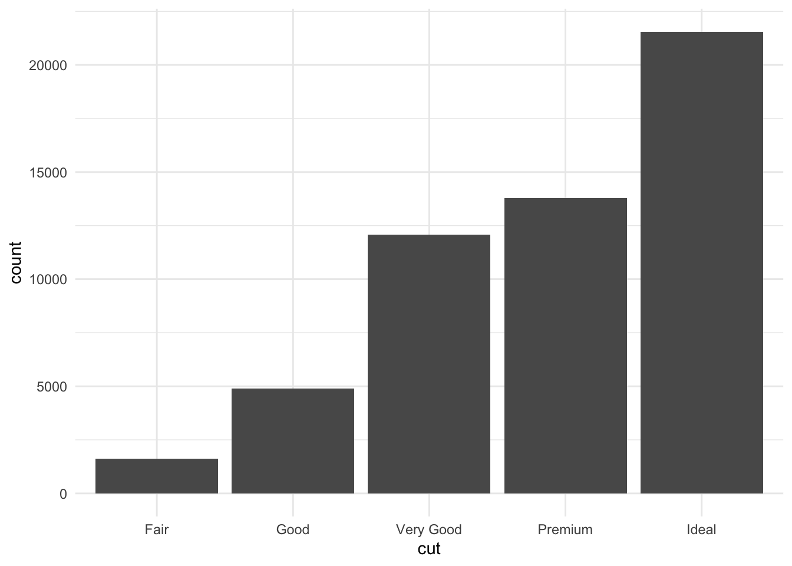

However, what if we wanted to carry this concept over to a bar plot and look at how many diamonds we have of each clarity group?


```r
# generate bar plot
ggplot(diamonds) + 
  geom_bar(aes(x = clarity))
```


As a general note, we've stopped including `data =` and `mapping =` here within our code. We included it so far to be explicit; however, in code you see in the world, the names of the arguments will typically be excluded and we want you to be familiar with code that appears as you see above. 

OK, well that's a start since we see the breakdown, but all the bars are the same color. What if we adjusted color within `aes()`?


```r
# color changes outline of bar
ggplot(diamonds) + 
  geom_bar(aes(x = clarity, color = clarity))
```


As expected, color added a legend for each level of clarity; however, it colored the lines around the bars on the plot, rather than the bars themselves. In order to color the bars themselves, you want to specify the more helpful argument `fill`:


```r
# use fill to color bars
ggplot(diamonds) + 
  geom_bar(aes(x = clarity, fill = clarity))
```


Great! We now have a plot with bars of different colors, which was our first goal! However, adding colors here, while maybe making the plot prettier doesn't actually give us any more information. We can see the same pattern of which clarity is most frequent among the diamonds in our dataset that we could in the first plot we made. 

Color is particularly helpful here, however, if we wanted to map a *different* variable onto each bar. For example, what if we wanted to see the breakdown of diamond "cut" within each "clarity" bar? 


```r
# fill by separate variable (cut) = stacked bar chart
ggplot(diamonds) + 
  geom_bar(aes(x = clarity, fill = cut))
```


Now we're getting some new information! We can see that each level in clarity appears to have diamonds of all levels of cut. Color here has really helped us understand more about the data.

But what if we were going to present these data? While there is no comparison between red and green (which is good!), there is a fair amount of yellow in this plot. Some projectors don't handle projecting yellow well, and it will show up too light on the screen. To avoid this, let's manually change the colors in this bar chart! To do so we'll add an additional layer to the plot using `scale_fill_manual`.


```r
ggplot(diamonds) + 
  geom_bar(aes(x = clarity, fill = cut)) +
  # manually control colors used
  scale_fill_manual(values = c("red", "orange", "darkgreen", "dodgerblue", "purple4"))
```


Here, we've specified five different colors within the `values` argument of `scale_fill_manual()`, one for each cut of diamond. The names of these colors can be specified using the names explained on the third page of the cheatsheet [here](https://www.nceas.ucsb.edu/~frazier/RSpatialGuides/colorPaletteCheatsheet.pdf). (Note: There are other ways to specify colors within R. Explore the details in that cheatsheet to better understand the various ways!)

Additionally, it's important to note that here we've used `scale_fill_manual()` to adjust the color of what was mapped using `fill = cut`. If we had colored our chart using `color` within `aes()`, there is a different function called `scale_color_manual`. This makes good sense! You use scale_fill_manual() with `fill` and `scale_color_manual()` with `color`. Keep that in mind as you adjust colors in the future!

Now that we have some sense of which clarity is most common in our diamonds dataset and were able to successfully specified the colors we wanted manually in order to make this plot useful for presentation, what if we wanted to compare the proportion of each cut across the different clarities?  Currently that's difficult because there is a different number within each clarity. In order to compare the proportion of each cut we have to use **position adjustment**. 

What we've just generated is a **stacked bar chart**. It's a pretty good name for this type of chart as the bars fur cut are all stacked on top of one another. If you don't want a stacked bar chart you could use one of the other `position` options: `identity`, `fill`, or `dodge`.

Returning to our question about proportion of each cut within each clarity group, we'll want to use `position = "fill"` within `geom_bar()`. Building off of what we've already done:


```r
ggplot(diamonds) + 
  # fill scales to 100%
  geom_bar(aes(x = clarity, fill = cut), position = "fill") +
  scale_fill_manual(values = c("red", "orange", "darkgreen", "dodgerblue", "purple4"))
```


Here, we've specified how we want to adjust the position of the bars in the plot. Each bar is now of equal height and we can compare each colored bar across the different clarities. As expected, we see that among the best clarity group (IF), we see more diamonds of the best cut ("Ideal")!

Briefly, we'll take a quick detour to look at `position = "dodge"`. This position adjustment places each object *next to one another*. This will not allow for easy comparison across groups, as we just saw with the last group but will allow values within each clarity group to be visualized.


```r
ggplot(diamonds) + 
  # dodge rather than stack produces grouped bar plot
  geom_bar(aes(x = clarity, fill = cut), position = "dodge") +
  scale_fill_manual(values = c("red", "orange", "darkgreen", "dodgerblue", "purple4"))
```


Unlike in the first plot where we specified `fill = cut`, we can actually see the relationship between each cut within the lowest clarity group (I1). Before, when the values were stacked on top of one another, we were not able to visually see that there were more "Fair" and "Premium" cut diamonds in this group than the other cuts. Now, with `position = "dodge"`, this information is visually apparent.

Note: `position = "identity"` is not very useful for bars, as it *places each object exactly where it falls within the graph*. For bar charts, this will lead to *overlapping bars*, which is not visually helpful. However, for scatterplots (and other 2-Dimensional charts), this is the default and is exactly what you want.  

### Labels

Text on plots is incredibly helpful. A good title tells viewers what they should be getting out of the plot. Axis labels are incredibly important to inform viewers of what's being plotted. Annotations on plot help guide viewers to important points in the plot. We'll discuss how to control all of these now!

#### Titles 

Now that we have an understanding of how to manually adjust color, let's improve the clarity of our plots by including helpful labels on our plot by adding an additional `labs()` layer. We'll return to the plot where we were comparing proportions of diamond cut across diamond clarity groups.

You can include a `title`, `subtitle`, and/or `caption` within the `labs()` function. Each argument, as per usual, will be specified by a comma. 


```r
ggplot(diamonds) + 
  geom_bar(aes(x = clarity, fill = cut), position = "fill") +
  scale_fill_manual(values = c("red", "orange", "darkgreen", "dodgerblue", "purple4")) +
  # add titles
  labs(title = "Clearer diamonds tend to be of higher quality cut",
       subtitle = "The majority of IF diamonds are an \"Ideal\" cut")
```


 
 
#### Axis labels
 
You may have noticed that our y-axis label says "count", but it's not actually a count anymore. In reality, it's a proportion. Having appropriately labeled axes is *so important*. Otherwise, viewers won't know what's being plotted. So, we should really fix that now using the `ylab()` function. Note: we won't be changing the x-axis label, but if you were interested in doing so, you would use `xlab("label")`.


```r
ggplot(diamonds) + 
  geom_bar(aes(x = clarity, fill = cut), position = "fill") +
  scale_fill_manual(values = c("red", "orange", "darkgreen", "dodgerblue", "purple4")) +
  labs(title = "Clearer diamonds tend to be of higher quality cut",
       subtitle = "The majority of IF diamonds are an \"Ideal\" cut") +
  # add y axis label explicitly
  ylab("proportion")
```


Note that the x- and y- axis labels can *also* be changed within `labs()`, using the argument (`x = ` and `y =`, respectively).


 
### Themes

To change the overall aesthetic of your graph, there are 8 themes built into `ggplot2` that can be added as an additional layer in your graph:


For example, if we wanted remove the gridlines and grey background from the chart, we would use `theme_classic()`. Building on what we've already generated:


```r
ggplot(diamonds) + 
  geom_bar(aes(x = clarity, fill = cut), position = "fill") +
  scale_fill_manual(values = c("red", "orange", "darkgreen", "dodgerblue", "purple4")) +
  labs(title = "Clearer diamonds tend to be of higher quality cut",
       subtitle = "The majority of IF diamonds are an \"Ideal\" cut") +
  ylab("proportion") +
  # change plot theme
  theme_classic()
```


We now have a pretty good looking plot! However, a few additional changes would make this plot *even better* for communication.

Note: Additional themes are available from the [`ggthemes` package](https://cran.r-project.org/web/packages/ggthemes/vignettes/ggthemes.html). Users can also generate their own themes.

### Custom Theme

In addition to using available themes, we can also adjust parts of the theme of our graph using an additional `theme()` layer. There are **a lot** of options within theme. To see them all, look at the help documentation within RStudio Cloud using: `?theme`. We'll simply go over the syntax for using a few of them here to get you comfortable with adjusting your theme. Later on, you can play around with all the options on your own to become an expert!

#### Altering text size

For example, if we want to increase text size to make it more easily viewable when presenting this graph, we would do that within theme. Notice here that we're increasing the text size of the `title`, `axis.text`, `axis.title`, and `legend.text` all within `theme()`! The syntax here is important. Within each of the elements of the theme you want to alter, you have to specify what it is you want to change. Here, for all three, we want to later text, so we specify `element_text()`. Within that, we specify that it's `size` that we want to adjust. 


```r
ggplot(diamonds) + 
  geom_bar(aes(x = clarity, fill = cut), position = "fill") +
  scale_fill_manual(values = c("red", "orange", "darkgreen", "dodgerblue", "purple4")) +
  labs(title = "Clearer diamonds tend to be of higher quality cut",
       subtitle = "The majority of IF diamonds are an \"Ideal\" cut") +
  ylab("proportion") +
  theme_classic() +
  # control theme
  theme(title = element_text(size = 16), 
        axis.text = element_text(size =14),
        axis.title = element_text(size = 16),
        legend.text = element_text(size = 14))
```


#### Additional text alterations

Changing the size of text on your plot is not the only thing you can control within `theme()`. You can make text **bold* and change its color within `theme()`. Note here that multiple changes can be made to a single element. We can change size and make the text **bold**. All we do is separate each argument with a comma, per usual.


```r
ggplot(diamonds) + 
  geom_bar(aes(x = clarity, fill = cut), position = "fill") +
  scale_fill_manual(values = c("red", "orange", "darkgreen", "dodgerblue", "purple4")) +
  labs(title = "Clearer diamonds tend to be of higher quality cut",
       subtitle = "The majority of IF diamonds are an \"Ideal\" cut") +
  ylab("proportion") +
  theme_classic() +
  theme(title = element_text(size = 16), 
        axis.text = element_text(size = 14),
        axis.title = element_text(size = 16, face = "bold"),
        legend.text = element_text(size = 14),
        # additional control
        plot.subtitle = element_text(color = "gray30"))
```


Any alterations to plot spacing/background, title, axis, and legend will all be made within `theme()`

### Legends

At this point, all the text on the plot is pretty visible! However, there's one thing that's still not quite clear to viewers. In daily life, people refer to the "cut" of a diamond by terms like "round cut" or "princess cut" to describe the *shape* of the diamond. That's not what we're talking about here when we're discussing "cut". In these data, "cut" refers to the quality of the diamond, not the shape. Let's be sure that's clear as well! We can change the name of the legend by using an additional layer and the `guides()` and `guide_legend()` functions of the `ggplot2` package!


```r
ggplot(diamonds) + 
  geom_bar(aes(x = clarity, fill = cut), position = "fill") +
  scale_fill_manual(values = c("red", "orange", "darkgreen", "dodgerblue", "purple4")) +
  labs(title = "Clearer diamonds tend to be of higher quality cut",
       subtitle = "The majority of IF diamonds are an \"Ideal\" cut") +
  ylab("proportion") +
  theme_classic() +
  theme(title = element_text(size = 16), 
        axis.text = element_text(size = 14),
        axis.title = element_text(size = 16, face = "bold"),
        legend.text = element_text(size = 14),
        plot.subtitle = element_text(color = "gray30")) +
  # control legend
  guides(fill = guide_legend("cut quality")) 
```


This `guides()` function, as well as the `guides_*` functions also allow us to modify legends even further. 

Thisis especially useful if you have many colors in your legend and you want to control how the legend is displayed in terms of the number of columns and rows using `ncol` and `nrow` respectively.


```r
ggplot(diamonds) + 
  geom_bar(aes(x = clarity, fill = cut), position = "fill") +
  scale_fill_manual(values = c("red", "orange", "darkgreen", "dodgerblue", "purple4")) +
  labs(title = "Clearer diamonds tend to be of higher quality cut",
       subtitle = "The majority of IF diamonds are an \"Ideal\" cut") +
  ylab("proportion") +
  theme_classic() +
  theme(title = element_text(size = 16), 
        axis.text = element_text(size = 14),
        axis.title = element_text(size = 16, face = "bold"),
        legend.text = element_text(size = 14),
        plot.subtitle = element_text(color = "gray30")) +
  # control legend
  guides(fill = guide_legend("Cut Quality", 
                              ncol = 2))
```


Or, we can modify the font of the legend title using `title.theme()`.


```r
ggplot(diamonds) + 
  geom_bar(aes(x = clarity, fill = cut), position = "fill") +
  scale_fill_manual(values = c("red", "orange", "darkgreen", "dodgerblue", "purple4")) +
  labs(title = "Clearer diamonds tend to be of higher quality cut",
       subtitle = "The majority of IF diamonds are an \"Ideal\" cut") +
  ylab("proportion") +
  theme_classic() +
  theme(title = element_text(size = 16), 
        axis.text = element_text(size = 14),
        axis.title = element_text(size = 16, face = "bold"),
        legend.text = element_text(size = 14),
        plot.subtitle = element_text(color = "gray30")) +
  # control legend
  guides(fill = guide_legend("Cut Quality", 
                             title.theme = element_text(face = "bold")))
```


Alternatively, we can do this modifcation as well as other legend modifcations, like adding a rectangle around the legend, using the `theme()` function.


```r
ggplot(diamonds) + 
  geom_bar(aes(x = clarity, fill = cut), position = "fill") +
  scale_fill_manual(values = c("red", "orange", "darkgreen", "dodgerblue", "purple4")) +
  labs(title = "Clearer diamonds tend to be of higher quality cut",
       subtitle = "The majority of IF diamonds are an \"Ideal\" cut") +
  ylab("proportion") +
# changing the legend title:
guides(fill = guide_legend("Cut Quality")) +
  theme_classic() +
  theme(title = element_text(size = 16), 
        axis.text = element_text(size = 14),
        axis.title = element_text(size = 16, face = "bold"),
        legend.text = element_text(size = 14),
        plot.subtitle = element_text(color = "gray30"),
# changing the legend style:
        legend.title = element_text(face = "bold"),
        legend.background = element_rect(color = "black"))
```


At this point, we have an informative title, clear colors, a well-labeled legend, and text that is large enough throughout the graph. This is certainly a graph that could be used in a presentation. We've taken it from a graph that is useful to just ourselves (exploratory) and made it into a plot that can communicate our findings well to others (explanatory)! 

We have touched on a number of alterations you can make by adding additional layers to a ggplot. In the rest of this lesson we'll touch on a few more changes you can make within `ggplot2` using a slightly different graph.

### Scales

There may be times when you want a different number of values to be displayed on an axis. The scale of your plot for **continuous variables** (i.e. numeric variables) can be controlled using `scale_x_continuous` or `scale_y_continuous`. Here, we want to increase the number of labels displayed on the y-axis, so we'll use `scale_y_continuous`:


```r
ggplot(diamonds) + 
  geom_bar(aes(x = clarity)) +
  # control scale for continuous variable
  scale_y_continuous(breaks = seq(0, 17000, by = 1000))
```


There is very handy argument called `trans` for the `scale_y_continuous` or the `scale_x_continuous` functions to change the scale of the axes. For example it can be very useful to show the logrithmic version of the scale if you have very high values with large differences.

According to the documentation for the `trans` argument:
> Built-in transformations include "asn", "atanh", "boxcox", "date", "exp", "hms", "identity", "log", "log10", "log1p", "log2", "logit", "modulus", "probability", "probit", "pseudo_log", "reciprocal", "reverse", "sqrt" and "time".


```r
ggplot(diamonds) + 
  geom_bar(aes(x = clarity)) +
  # control scale for continuous variable
  scale_y_continuous(trans = "log10") +
    labs(y = "Count (log10 scale)",
         x = "Clarity")
```


Notice that the values are not changed, just the way they are plotted. Now the y-axis increases by a factor of 10 for each break.


We will create a plot of the price of the diamonds to demonstrate the utility of creating a plot with a log10 scaled y-axis.


```r
ggplot(diamonds) + 
  geom_boxplot(aes(y = price, x = clarity))
```


```r
ggplot(diamonds) + 
  geom_boxplot(aes(y = price, x = clarity)) + 
  scale_y_continuous(trans = "log10") + 
  labs(y = "Price (log10 scale)",
       x = "Diamond Clarity")
```


In the first plot, it is difficult to tell what values the boxplots correspond to and it is difficult to compare the boxplots (particullarly for the last three clarity categories), however this is greatly improved in the second plot. 


We can also use another argument of the `scale_y_continuous()` function to add specific labels to our plot. For example, it would be nice to add dollar signs to the y-axis. We can do so using the `labels` argument. A variety of `label_*` functions  within the `scales` package can be used to modify axis labels. See [here](https://scales.r-lib.org/reference/index.html) to take a look at the many options.


```r
ggplot(diamonds) + 
  geom_boxplot(aes(y = price, x = clarity)) + 
  scale_y_continuous(trans = "log10", 
                    labels = scales::label_dollar()) +
  labs(y = "Price (log10 scale)",
       x = "Diamond Clarity")
```


In the above plot, we might also want to order the boxplots by the median price, we can do so using the `fct_reorder` function of `forcats` package to change the order for the `clarity` levels to be based on the median of the `price` values.


```r
ggplot(diamonds) + 
  geom_boxplot(aes(y = price, x = forcats::fct_reorder(clarity, price, .fun = median))) + 
  scale_y_continuous(trans = "log10", 
                    labels = scales::label_dollar()) +
  labs(y = "Price (log10 scale)",
       x = "Diamond Clarity")
```

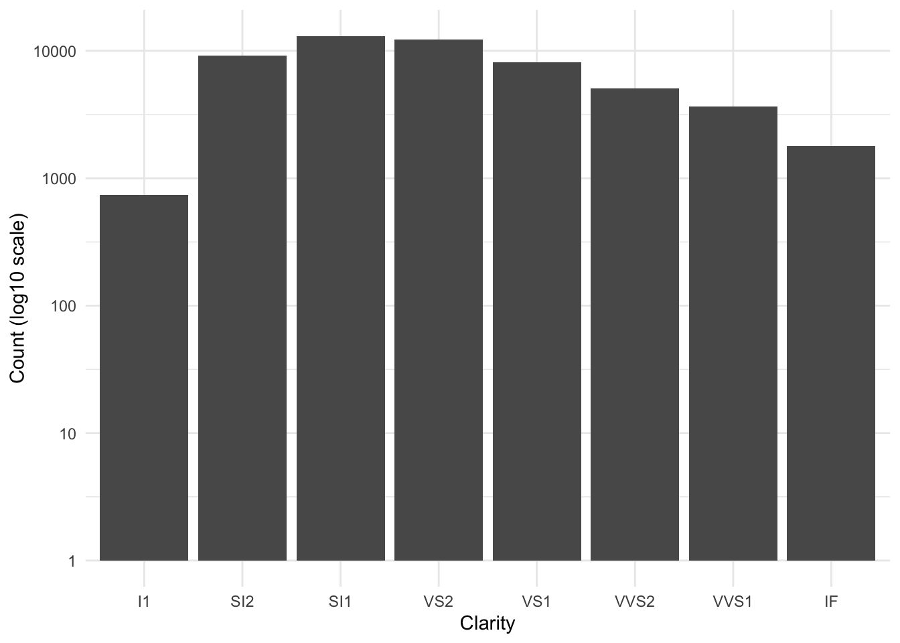

Now we can more easily determine that the `SI2` diamonds are the most expensive.

Another way modify **discrete variables** (aka factors or categorical variables), where there is a limited number of levels, you would use `scale_x_discrete` or `scale_y_discrete`. In this case we will just pick a few of the clarity categories to plot and we will specify the order.


```r
ggplot(diamonds) + 
  geom_bar(aes(x = clarity)) +
  # control scale for discrete variable
  scale_x_discrete(limit = c("SI2", "SI1", "I1")) +
  scale_y_continuous(breaks = seq(0, 17000, by = 1000)) 
```


### Coordinate Adjustment

There are times when you'll want to flip your axis. This can be accomplished using `coord_flip()`. Adding an additional layer to the plot we just generated switches our x- and y-axes, allowing for horizontal bar charts, rather than the default vertical bar charts:


```r
ggplot(diamonds) + 
  geom_bar(aes(x = clarity)) +
  scale_y_continuous(breaks = seq(0, 17000, by = 1000)) +
  scale_x_discrete(limit = c("SI2", "SI1", "I1")) +
  # flip coordinates
  coord_flip() +
  labs(title = "Clearer diamonds tend to be of higher quality cut",
       subtitle = "The majority of IF diamonds are an \"Ideal\" cut") +
  ylab("proportion") +
  theme_classic() +
  theme(title = element_text(size = 18), 
        axis.text = element_text(size = 14),
        axis.title = element_text(size = 16, face = "bold"),
        legend.text = element_text(size = 14),
        plot.subtitle = element_text(color = "gray30")) +
  guides(fill = guide_legend("cut quality")) 
```

```
## Warning: Removed 30940 rows containing non-finite values (stat_count).
```


It's important to remember that all the additional alterations we already discussed can still be applied to this graph, due to the fact that ggplot2 uses layering! 


```r
p <- ggplot(diamonds) + 
  geom_bar(mapping = aes(x = clarity)) +
  scale_y_continuous(breaks = seq(0, 17000, by = 1000)) +
  scale_x_discrete(limit = c("SI2", "SI1", "I1")) +
  coord_flip() +
  labs(title = "Number of diamonds by diamond clarity",
       subtitle = "Subset of all diamonds, looking three levels of clarity") +
  theme_classic() +
  theme(title = element_text(size = 18), 
        axis.text = element_text(size = 14),
        axis.title = element_text(size = 16, face = "bold"),
        legend.text = element_text(size = 14),
        plot.subtitle = element_text(color = "gray30") ) 
```


### Annotation

Finally, there will be times when you'll want to add text to a plot or to annotate points on your plot. We'll discuss briefly how to accomplish that here!

To add text to your plot, we can use the function `annotate`. This requires us to specify that we want to annotate here with a "text" geom (rather than say a shape, like a rectangle - "rect"). Additionally, we have to specify what we'd like that text to say (`label`), where on the plot we'd like that text to show up (using `x` and `y` for coordinates), how we'd like the text aligned (using `hjust` for horizontal alignment where the options are "left", "center", or "right" and `vjust` for vertical alignment where the arguments are "top", "center" or "bottom"), and how big we'd like that text to be (`size`):


```r
ggplot(diamonds) + 
  geom_bar(aes(x = clarity)) +
  scale_y_continuous(breaks = seq(0, 17000, by = 1000)) +
  scale_x_discrete(limit = c("SI2", "SI1", "I1")) +
  coord_flip() +
  labs(title = "Number of diamonds by diamond clarity",
       subtitle = "Subset of all diamonds, looking three levels of clarity") +
  theme_classic() +
  theme(title = element_text(size = 18), 
        axis.text = element_text(size = 14),
        axis.title = element_text(size = 16, face = "bold"),
        legend.text = element_text(size = 14),
        plot.subtitle = element_text(color = "gray30")) +
  # add annotation
  annotate("text", label = "SI1 diamonds are among \n the most frequent clarity diamond", 
           y = 12800, x = 2.9, 
           vjust = "top", hjust = "right", 
           size = 6)
```

```
## Warning: Removed 30940 rows containing non-finite values (stat_count).
```


Note: we could have accomplished this by adding an additional `geom`: `geom_text`. However, this requires creating a new data frame, as explained [here](http://r4ds.had.co.nz/graphics-for-communication.html#annotations). This can also be used to **label the points on your plot**. Keep this reference in mind in case you have to do that in the future.

### Vertical and Horizontal Lines

Sometimes it is very useful to add a line to our plot to indicate an important threshold. We can do so by using the `geom_hline()` function for a horizontal line and `geom_vline()` for a vertical line. 

In each case, the functions require that a y or x intercept be specified respectively.

For example, it might be useful to add a horizontal line to indicate 50% of the total counts for each of the `clarity` categories. We will also use the `scale_y_continuous()` function to change the y-axis to show percentages.


```r
ggplot(diamonds) + 
  # fill scales to 100%
  geom_bar(aes(x = clarity, fill = cut), position = "fill") +
  scale_fill_manual(values = c("red", "orange", "darkgreen", "dodgerblue", "purple4")) +
  scale_y_continuous(labels = scales::percent) +
  labs(y = "Percent of diamonds") +
  geom_hline(yintercept = 0.5, color = "red", size = 1)
```


Now, it is easier to tell that slightly over half of the `VVS2` diamonds have an `Ideal` cut. This would be much more difficult to see without the horizontal line. 


To add a vertical line we would instead use the `geom_vline()` function and we would specify an x-axis intercept. Since this plot has a discrete x-axis, numeric values specify a categorical value based on the order, thus a value of 4 would create a line down the center of the `VS2` bar. However, if we used 5.5 we could add a line offset from the center of a bar, as you can see in the following example:


```r
ggplot(diamonds) + 
  # fill scales to 100%
  geom_bar(aes(x = clarity, fill = cut), position = "fill") +
  scale_fill_manual(values = c("red", "orange", "darkgreen", "dodgerblue", "purple4")) +
  scale_y_continuous(labels = scales::percent) +
  labs(y = "Percent of diamonds") +
  geom_hline(yintercept = 0.5, color = "red", size = 1 ) +
  geom_vline(xintercept = 5.5, color = "black", size = .5)
```


This would be helpful if we wanted to especially point out differences between the last three clarity categories of diamonds compared to the other categories. 

## Tables

While we have focused on figures here so far, tables can be incredibly informative at a glance too. If you are looking to display summary numbers, **a table can also visually display information**. 

Using this same dataset, we can use a table to get a quick breakdown of how many males and females there are in the dataset and what percentage of each gender there is.

A few things to keep in mind when making tables is that it's best to:

* Limit the number of digits in the table
* Include a caption
* When possible, keep it simple.


### Tables in R

Now that we have a good understanding of what to consider when making tables, we can to practice making good tables in R. To do this, we'll return to the diamonds dataset. As a reminder, this dataset contains prices and other information about ~54,000 different diamonds. If we want to provide viewers with a summary of these data, we may want to provide information about diamonds broken down by the quality of the diamond's cut. To get the data we're interested in, we'll use the `diamonds` dataset and the `dplyr` R package, which we discussed in a lesson in an earlier course.

### Getting the Data in Order

To start figuring out how the quality of the cut of the diamond affects the price of that diamond, we first have to first get the data in order. To do that, we'll use the `dplyr` package that you learned about in an earlier course in this series. This allows us to group the data by the quality of the cut (`cut`) before summarizing the data to determine the number of diamonds in each category (`N`), the minimum price of the diamonds in this category (`min`), the average price (`avg`), and the highest price in the category (`max`).

To get these data in order, you could use the following code. This code groups the data by cut (quality of the diamond) and then calculates the number of diamonds in each group (N), the minimum price across each group (min), the average price of diamonds across each group (avg), and the maximum price within each group (max):


```r
# get summary data for table in order
df <- diamonds %>% 
  group_by(cut) %>%
  dplyr::summarize(
    N = n(), 
    min = min(price), 
    avg = mean(price), 
    max = max(price)
  )
```

```
## `summarise()` ungrouping output (override with `.groups` argument)
```

### An Exploratory Table


```r
# look at data
df
```

```
## # A tibble: 5 x 5
##   cut           N   min   avg   max
##   <ord>     <int> <int> <dbl> <int>
## 1 Fair       1610   337 4359. 18574
## 2 Good       4906   327 3929. 18788
## 3 Very Good 12082   336 3982. 18818
## 4 Premium   13791   326 4584. 18823
## 5 Ideal     21551   326 3458. 18806
```

By getting the data summarized into a single object in R (`df`), we're on our way to making an informative table. However, this is clearly just an exploratory table. The output in R from this code follows some of the good table rules above, but not all of them.  At a glance, it will help you to understand the data, but it's not the finished table you would want to send to your boss. 


From this output, you, the creator of the table, would be able to see that there are a number of **good qualities**:

* there is a **reasonable number of rows and columns** - There are 5 rows and 5 columns. A viewer can quickly look at this table and determine what's going on.
* the first column `cut` is **organized logically** - The lowest quality diamond category is first and then they are ordered vertically until the highest quality cut (`ideal))
* Comparisons are made **top to bottom** - To compare between the groups, your eye only has to travel up and down, rather than from left to right. 

There are also things that **need to be improved** on this table:

* **column headers** could be even more clear
* there's **no caption/title**
* It could be more **aesthetically pleasing**

### Improving the Table Output

By-default, R outputs tables in the Console using a monospaced font. However, this limits our ability to format the appearance of the table. To fix the remaining few problems with the table's format, we'll use the `kable()` function from the R package `knitr` and the additional formatting capabilities of the R packages `kableExtra`.

The first step to a prettier table just involves using the `kable()` function from the `knitr` package, which improves the readability of this table. The `knitr` package is *not* a core tidyverse package, so you'll have to be sure it's installed and loaded.


```r
# install.packages("knitr")
library(knitr)

kable(df)
```


|cut       |     N| min|      avg|   max|
|:---------|-----:|---:|--------:|-----:|
|Fair      |  1610| 337| 4358.758| 18574|
|Good      |  4906| 327| 3928.864| 18788|
|Very Good | 12082| 336| 3981.760| 18818|
|Premium   | 13791| 326| 4584.258| 18823|
|Ideal     | 21551| 326| 3457.542| 18806|

 

However, there are still a few issues we want to improve upon:

* column names could be more informative
* too many digits in the `avg` column
* Caption/title is missing
* Source of data not included.

To begin addressing these issues, we can use the `add_header_above` function from `kableExtra()` to specify that the min, avg, and max columns refer to `price` in US dollars (USD). Additionally, `kable()` takes a `digits` argument to specify how many significant digits to display. This takes care of the display of too many digits in the `avg` column. Finally, we can also style the table so that every other row is shaded, helping our eye to keep each row's information separate from the other rows using `kable_styling()` from `kableExtra`.  These few changes really improve the readability of the table. 

If you copy this code into your R console, the formatted table will show up in the Viewer tab at the bottom right-hand side of your RStudio console and the HTML code used to generate that table will appear in your console. 


```r
# install.packages("kableExtra")
library(kableExtra)

# use kable_styling to control table appearance
kable(df, digits=0, "html") %>%
  kable_styling("striped", "bordered") %>% 
  add_header_above(c(" " = 2,  "price (USD)" = 3)) 
```

<table class="table table-striped" style="margin-left: auto; margin-right: auto;">
 <thead>
<tr>
<th style="empty-cells: hide;border-bottom:hidden;" colspan="2"></th>
<th style="border-bottom:hidden;padding-bottom:0; padding-left:3px;padding-right:3px;text-align: center; " colspan="3"><div style="border-bottom: 1px solid #ddd; padding-bottom: 5px; ">price (USD)</div></th>
</tr>
  <tr>
   <th style="text-align:left;"> cut </th>
   <th style="text-align:right;"> N </th>
   <th style="text-align:right;"> min </th>
   <th style="text-align:right;"> avg </th>
   <th style="text-align:right;"> max </th>
  </tr>
 </thead>
<tbody>
  <tr>
   <td style="text-align:left;"> Fair </td>
   <td style="text-align:right;"> 1610 </td>
   <td style="text-align:right;"> 337 </td>
   <td style="text-align:right;"> 4359 </td>
   <td style="text-align:right;"> 18574 </td>
  </tr>
  <tr>
   <td style="text-align:left;"> Good </td>
   <td style="text-align:right;"> 4906 </td>
   <td style="text-align:right;"> 327 </td>
   <td style="text-align:right;"> 3929 </td>
   <td style="text-align:right;"> 18788 </td>
  </tr>
  <tr>
   <td style="text-align:left;"> Very Good </td>
   <td style="text-align:right;"> 12082 </td>
   <td style="text-align:right;"> 336 </td>
   <td style="text-align:right;"> 3982 </td>
   <td style="text-align:right;"> 18818 </td>
  </tr>
  <tr>
   <td style="text-align:left;"> Premium </td>
   <td style="text-align:right;"> 13791 </td>
   <td style="text-align:right;"> 326 </td>
   <td style="text-align:right;"> 4584 </td>
   <td style="text-align:right;"> 18823 </td>
  </tr>
  <tr>
   <td style="text-align:left;"> Ideal </td>
   <td style="text-align:right;"> 21551 </td>
   <td style="text-align:right;"> 326 </td>
   <td style="text-align:right;"> 3458 </td>
   <td style="text-align:right;"> 18806 </td>
  </tr>
</tbody>
</table>


### Annotating Your Table

We mentioned earlier that captions and sourcing your data are incredibly important. The `kable` package allows for a `caption` argument. Below, an informative caption has been included. Additionally, `kableExtra` has a `footnote()` function. This allows you to include the source of your data at the bottom of the table. With these final additions, you have a table that clearly displays the data and could be confidently shared with your boss. 


```r
kable(df, digits=0, "html", caption="Table 1: Diamonds Price by Quality of Cut. Most Diamonds are of the highest quality cut and the most expensive diamonds are of the highest quality") %>%
  kable_styling("striped", "bordered") %>% 
  # add headers and footnote
  add_header_above(c(" " = 2,  "price (USD)" = 3)) %>% 
  footnote(general = "Diamonds dataset from ggplot2", general_title = "Source:", footnote_as_chunk = T)
```

<table class="table table-striped" style="margin-left: auto; margin-right: auto;border-bottom: 0;">
<caption>(\#tab:unnamed-chunk-48)Table 1: Diamonds Price by Quality of Cut. Most Diamonds are of the highest quality cut and the most expensive diamonds are of the highest quality</caption>
 <thead>
<tr>
<th style="empty-cells: hide;border-bottom:hidden;" colspan="2"></th>
<th style="border-bottom:hidden;padding-bottom:0; padding-left:3px;padding-right:3px;text-align: center; " colspan="3"><div style="border-bottom: 1px solid #ddd; padding-bottom: 5px; ">price (USD)</div></th>
</tr>
  <tr>
   <th style="text-align:left;"> cut </th>
   <th style="text-align:right;"> N </th>
   <th style="text-align:right;"> min </th>
   <th style="text-align:right;"> avg </th>
   <th style="text-align:right;"> max </th>
  </tr>
 </thead>
<tbody>
  <tr>
   <td style="text-align:left;"> Fair </td>
   <td style="text-align:right;"> 1610 </td>
   <td style="text-align:right;"> 337 </td>
   <td style="text-align:right;"> 4359 </td>
   <td style="text-align:right;"> 18574 </td>
  </tr>
  <tr>
   <td style="text-align:left;"> Good </td>
   <td style="text-align:right;"> 4906 </td>
   <td style="text-align:right;"> 327 </td>
   <td style="text-align:right;"> 3929 </td>
   <td style="text-align:right;"> 18788 </td>
  </tr>
  <tr>
   <td style="text-align:left;"> Very Good </td>
   <td style="text-align:right;"> 12082 </td>
   <td style="text-align:right;"> 336 </td>
   <td style="text-align:right;"> 3982 </td>
   <td style="text-align:right;"> 18818 </td>
  </tr>
  <tr>
   <td style="text-align:left;"> Premium </td>
   <td style="text-align:right;"> 13791 </td>
   <td style="text-align:right;"> 326 </td>
   <td style="text-align:right;"> 4584 </td>
   <td style="text-align:right;"> 18823 </td>
  </tr>
  <tr>
   <td style="text-align:left;"> Ideal </td>
   <td style="text-align:right;"> 21551 </td>
   <td style="text-align:right;"> 326 </td>
   <td style="text-align:right;"> 3458 </td>
   <td style="text-align:right;"> 18806 </td>
  </tr>
</tbody>
<tfoot><tr><td style="padding: 0; " colspan="100%">
<span style="font-style: italic;">Source:</span> <sup></sup> Diamonds dataset from ggplot2</td></tr></tfoot>
</table>


## `ggplot2`: Extensions

Beyond the *many* capabilities of `ggplot2`, there are a few additional packages that build *on top of* `ggplot2`'s capabilities. We'll introduce a few packages here so that you can:

* directly annotate points on plots (`ggrepel` and `directlabels`)
* combine multiple plots (`cowplot` + `patchwork`)
* generate animated plots (`gganimate`)

These are referred to as `ggplot2` extensions There are dozens of additional [`ggplot2` extensions](http://www.ggplot2-exts.org/gallery/) available if you'd like to explore other plotting options beyond what is covered here!

### `ggrepel`

[`ggrepel`](https://github.com/slowkow/ggrepel) "provides geoms for` ggplot2` to repel overlapping text labels." 

To demonstrate the functionality within the `ggrepel` package and demonstrate cases where it would be needed, let's use a dataset available from R - the `mtcars` dataset: 

> The data was extracted from the 1974 Motor Trend US magazine, and comprises fuel consumption and 10 aspects of automobile design and performance for 32 automobiles (1973–74 models).

This dataset includes information about 32 different cars. Let's first convert this from a data.frame to a tibble.


```r
# see first 6 rows of mtcars
mtcars <- mtcars %>%
  rownames_to_column(var = "model") %>%
  as_tibble()
```

What if we were to plot a scatterplot between horsepower (`hp`) and weight (`wt`) of each car and wanted to label each point in that plot with the care model. 

If we were to do that with `ggplot2`, we'd see the following:


```r
# label points without ggrepel
ggplot(mtcars, aes(wt, hp, label = model)) +
  geom_text() +
  geom_point(color = 'dodgerblue') +
  theme_classic()
```


The overall trend is clear here - the more a car weights, the more horsepower it tends to have. However, many of the labels are overlapping and impossible to read - this is where `ggrepel` plays a role:


```r
# install and load package
# install.packages("ggrepel")
library(ggrepel)

# label points with ggrepel
ggplot(mtcars, aes(wt, hp, label = model)) +
  geom_text_repel() +
  geom_point(color = 'dodgerblue') +
  theme_classic()
```


The only bit of code here that changed was that we changed `geom_text()` to `geom_text_repel()`. This, like `geom_text()` adds text directly to the plot. However, it also helpfully repels overlapping labels away from one another and away from the data points on the plot.


#### Custom Formatting

Within `geom_text_repel()`, there are a number of additional formatting options available. We'll cover a number of the most important here, but the [`ggrepel` vignettes](https://cran.r-project.org/web/packages/ggrepel/vignettes/ggrepel.html) explore these further


**Highlighting Specific Points**

Often, you do not want to highlight *all* the points on a plot, but want to draw your viewer's attention to a few *specific* points. To do this and say highlight only cars that are the make Mercedes, you could use the following approach:


```r
# Label with model  in new column "merc"
# for columns with "Merc" in model column
mtcars <- mtcars %>% 
  mutate(merc = ifelse(grepl("Merc", mtcars$model), model, ""))

# Let's just label these items.
ggplot(mtcars, aes(wt, hp, label = merc)) +
  geom_point(color = ifelse(mtcars$merc == "", "grey50", "dodgerblue")) +
  geom_text_repel()
```


Here, notice that we first create a new column in our dataframe called `merc`. Here, we include the model of the car, only if "Merc" is in the model of the car's name.

We then, specify that only these Mercedes cars should be labeled *and* that we only want them colored blue if they are Mercedes. This allows us to focus in on those few points we're interested in. And, we can see that among the cars in this dataset, Mercedes tend to be of average weight but have varying horsepower, depending on the model of the car.

**Text Alignment**

Other times, you want to ensure that your labels are aligned on the top or bottom edge, relative to one another. This can be controlled using the `hjust` and `vjust` arguments. The values for particular alignment are:

`hjust = 0`   |  to left-align
`hjust = 0.5` |  to center
`hjust = 1`   |  to right-align

Additionally, you can adjust the starting position of text vertically with `nudge_y` (or horizontally with `nudge_x`). To use this, you'll specify the distance from the point to the label you want to use.

You can also allow the labels to move horizontally with `direction = "x"` (or vertically with `direction = "y"`. This will put the labels at a right angle from the point. The default here is "both", which allows labels to move in both directions.

For example, what if we wanted to plot the relationship between quarter mile time (`qsec`) and miles per gallon (`mpg`) to identify cars that get the best gas mileage.

To do this, we're specifying within `geom_text_repel()` the following arguments:

`data` | only label those cars with gas mileage > 30 mpg
`nudge_y` | position all labels so that they're vertically aligned
`hjust` | center-align the labels
`direction` | allow labels to move horizontally

For further customization, we're also changing the segment color from the default black to a light gray ("gray60").


```r
# customize within geom_text_repel
ggplot(mtcars, aes(qsec, mpg, label = model)) +
  geom_text_repel(
    data = subset(mtcars, mpg > 30),
    nudge_y = max(mtcars$mpg) + 2 - subset(mtcars, mpg > 30)$mpg,
    direction = "x",
    hjust = 0.5,
    segment.color = "gray60",
  ) +
  geom_point(color = ifelse(mtcars$mpg > 30, "dodgerblue", "black")) +
  scale_x_continuous(expand = c(0.05, 0.05)) +
  scale_y_continuous(limits = c(NA, 36))
```

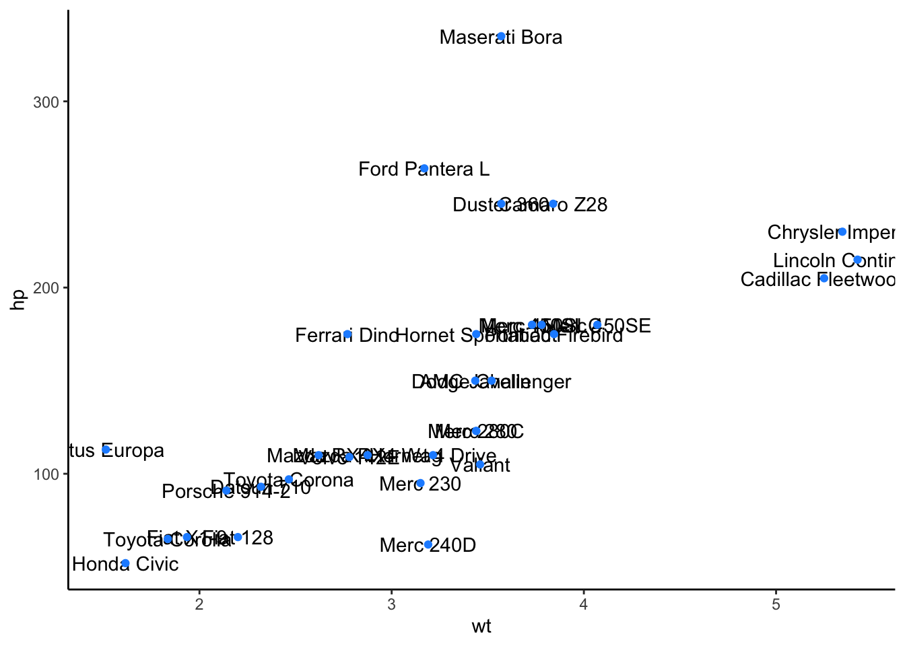
  
Notice that we've also had to provide the plot with more room by customizing the x- and y- axes, using the final two lines of code you see above.

With this plot, it is clear that there are four cars with mpg > 30. And, among these, we now know that the Toyota Corolla has the fastest quarter mile time, all thanks to direct labeling of the points!

### `directlabels`

The `directlabels` package also helps you to add labels directly to plots. There are functions that allow you to also add labels that generally dont overlap using less code than `ggrepel`, however there are less specification options.

There are several method options for adding direct labels to scatter plots, such as: `first.points` (which will place the label on the left in a scatterplot), and `last.points` (which will place the label on the right in a scatterplot).


```r
#install.packages("directlabels")
library(directlabels)

ggplot(mtcars, aes(qsec, mpg, label = model)) +
  geom_point(color = ifelse(mtcars$mpg > 30, "dodgerblue", "black")) +
  scale_x_continuous(expand = c(0.05, 0.05)) +
  scale_y_continuous(limits = c(NA, 36)) +
  geom_dl(data = subset(mtcars, mpg > 30), aes(label = model), 
          method = list(c("first.points"),
                        cex = 1))
```


```r
ggplot(mtcars, aes(qsec, mpg, label = model)) +
  geom_point(color = ifelse(mtcars$mpg > 30, "dodgerblue", "black")) +
  scale_x_continuous(expand = c(0.05, 0.05)) +
  scale_y_continuous(limits = c(NA, 36)) +
  geom_dl(data = subset(mtcars, mpg > 30), aes(label = model), 
          method = list(c("last.points"),
                        cex = 1))
```


This package is especially useful for labeling lines in a lineplot. There are several methods, one of which is the `angled.boxes` method. This often negates the need for a legend.


```r
ggplot(mtcars, aes(qsec, mpg, color = cyl, group = cyl)) + 
  geom_line()+
  geom_dl(aes(label = cyl), 
          method = list(c("angled.boxes"),
                        cex = 1)) +
  theme(legend.position = "none") +
  labs(title = "Differences in cars with 4, 6, or 8 cylinders")
```


See [here](https://cran.r-project.org/web/packages/directlabels/directlabels.pdf) for more information about this package.

### `cowplot`

Beyond customization within `ggplot2` and labeling points, there are times you'll want to arrange multiple plots together in a single grid, applying a standard theme across all plots. This often occurs when you're ready to present or publish your visualizations. When you're ready to share and present your work with others, you want to be sure your visualizations are conveying the point you want to convey to your viewer in as simple a plot as possible. And, if you're presenting multiple plots, you typically want to ensure that they have a consistent theme from one plot to the next. This allows the viewer to focus on the data you're plotting, rather than changes in theme. The `cowplot` package assists in this process!


#### Theme

The standard theme within `cowplot`, which works for many types of plots is `theme_cowplot()`. This theme is very similar to `theme_classic()`, which removes the background color, removes grid lines, and plots only the x- and y- axis lines (rather than a box around all the data). We'll use this theme for the examples from this package. However, note that there are a number of additional themes available from the `cowplot` package.


```r
# install and load package
# install.packages("cowplot")
library(cowplot)
```

We'll continue to use the `mtcars` dataset for these examples. Here, using the `forcats` package (which is part of the core tidyverse), we'll add two new columns: `transmission`, where we recode the `am` column to be "automatic" if `am == 0` and "manual" if `am == 1`, and `engine`, where we recode the `vs` column to be "v-shaped" if `vs == 0` and "straight" if `vs == 1`


```r
mtcars <- mtcars %>%
  mutate(transmission = fct_recode(as.factor(am), "automatic" = "0", "manual" = "1"),
         engine = fct_recode(as.factor(vs), "v-shaped" = "0", "straight" = "1"))
```

We'll use these data to generate a scatterplot plotting the relationship between 1/4 mile speed (`qsec`) and gas mileage (`mpg`). We'll color the points by this new column `transmission` and apply `theme_cowplot`. Finally, we'll assign this to `p1`, as we'll ultimately generate a few different plots.


```r
p1 <- ggplot(mtcars, aes(qsec, mpg, color = transmission)) + 
  geom_point() +
  theme_cowplot(12) + 
  theme(legend.position = c(0.7, 0.2))
p1
```


Let's make a similar plot, but color by engine type. We'll want to manually change the colors here so that we aren't using the same colors for transmission and engine. We'll store this in `p2`.


```r
p2 <- ggplot(mtcars, aes(qsec, mpg, color = engine)) + 
  geom_point() +
  scale_color_manual(values = c("red", "blue")) +
  theme_cowplot(12) +
  theme(legend.position = c(0.7, 0.2))
p2
```


Great - we've now got two plots with the same theme and similar appearance. What if we wanted to combine these into a single grid for presentation purposes?

#### Multiple Plots

Aligning plots is made simple within the `cowplot` package using the `align_plots()` function:


```r
# plot side by side
plot_grid(p1, p2, ncol = 2)
```


Here, we specify the two plots we'd like to plot on a single grid and we also optionally include how many columns we'd like using the `ncol` parameter. 

To plot these one on top of the other, you could specify for `plot_grid()` to use a single column. Also note here that we're aligning the plots vertically with `align = "v"`. The default here is "none", so if you want the graphs in the grid to be aligned, be sure to specify "h" (horizontally), "v" (vertically) or "hv" (align in both directions) explicitly.


```r
# plot on top of one another
plot_grid(p1, p2, ncol = 1, align = "v")
```


Note that by default, the plots will share the space equally, but it's also possible to make one larger than the other within the grid using `rel_widths` and `rel_heights`.

For example, if you had a faceted plot summarizing the number of cars by transmission and engine (which we'll call `p3`):


```r
# generate faceted plot
p3 <- ggplot(mtcars, aes(engine)) + 
  geom_bar() + 
  facet_wrap(~transmission) +
  scale_y_continuous(expand = expand_scale(mult = c(0, 0.1))) +
  theme_minimal_hgrid(12) +
  panel_border(color = "black") +
  theme(strip.background = element_rect(fill = "gray80"))
```

```
## Warning: `expand_scale()` is deprecated; use `expansion()` instead.
```

```r
p3
```


Note that for this plot we've chosen a different theme, allowing for horizontal grid lines. This can be helpful when visualizing bar plots.

If we were to plot these next to one another using the defaults, the faceted plot would be squished:


```r
# plot next to one another
plot_grid(p1, p3)
```

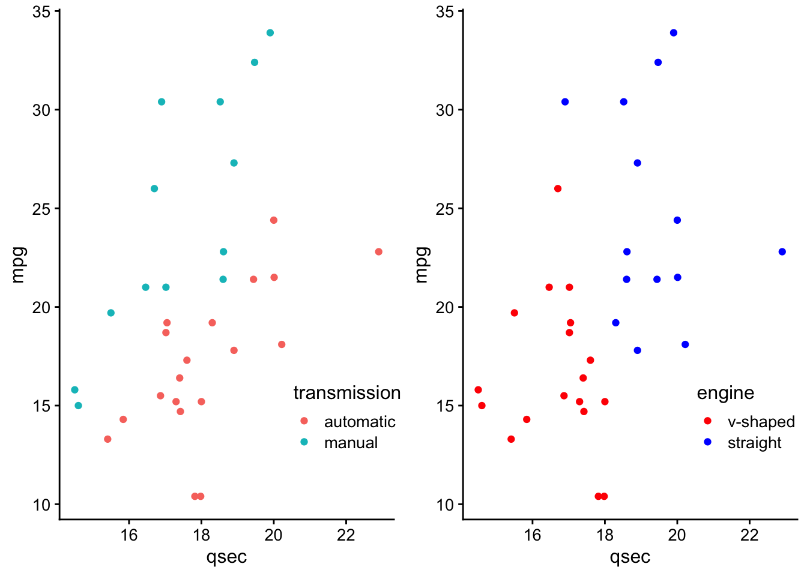

We can use `rel_widths` to specify the relative width for the plot on the left relative to the plot on the right: 


```r
# control relative spacing within grid
plot_grid(p1, p3, rel_widths = c(1, 1.3))
```


**Adding Labels**

Within these grids, you'll often want to label these plots so that you can refer to them in your report or presentation. This can be done using the `labels` parameter within `plot_grid()`:


```r
# add A and B labels to plots
plot_grid(p1, p3, labels = "AUTO", rel_widths = c(1, 1.3))
```


**Adding Joint Titles**

Finally, when generating grids with multiple plots, at times you'll often want a single title to explain what's going on across the plots. Here, the process *looks* slightly confusing, but this is only because we're putting all of these `cowplot` pieces together.

Generally, there are three steps:

1. Create `three_plots` grid with plots
2. Create `title` object
3. Piece `title` and `three_plots` together


```r
# use plot_grid to generate plot with 3 plots together
first_col <- plot_grid(p1, p2, nrow = 2, labels = c('A', 'B'))
three_plots <- plot_grid(first_col, p3, ncol = 2, labels = c('', 'C'), rel_widths = c(1, 1.3))

# specify title
title <- ggdraw() + 
  # specify title and alignment
  draw_label("Transmission and Engine Type Affect Mileage and 1/4 mile time",
              fontface = 'bold', x = 0, hjust = 0) +
  # add margin on the left of the drawing canvas,
  # so title is aligned with left edge of first plot
  theme(plot.margin = margin(0, 0, 0, 7))

# plot title and plot togetner
plot_grid(title, three_plots, ncol = 1, rel_heights = c(0.1, 1))
```

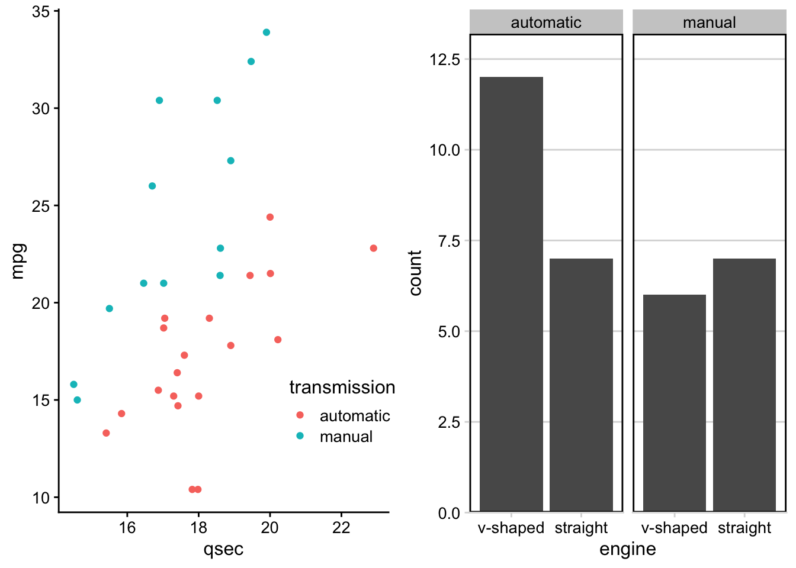

And, just like that we've got three plots, labeled, spaced out nicely in a grid, with a shared title, all thanks to the functionality within the `cowplot` package.

### `patchwork`

The `patchwork` package is similar to the `cowplot` package in that they both are helpful for combining plots together. They each allow for different plot modifications, so it is useful to know about both packages.

Instead of requiring a function like `plot_grid()` of the `cowplot` package plots can be combined using a few operators, such as `"+"`, `"/"`, and `"|".

To combine two plots together we can simply add them together with the `+` sign or place them next to one another using the `|`:


```r
#install.packages(patchwork)
library(patchwork)
```

```
## 
## Attaching package: 'patchwork'
```

```
## The following object is masked from 'package:cowplot':
## 
##     align_plots
```

```r
p1 + p2
```


```r
p1 | p2
```


If we want a plot above another plot we can use the "/" symbol:


```r
p1 / p2
```


Grouping or nesting plots together using parenthesis can result in two or more plots taking up a single grid space. 

Thus, to combine multiple plots in a more complicated layout, one can combine two plots on one row and have a third plot on another row like this:


```r
(p3 + p2) / p1
```


Otherwise, we would have the following:


```r
p3 + p2 / p1
```


You can also empty plot spacers using the `plotspacer()` function like so:


```r
(plot_spacer() + p2 + plot_spacer()) / p1
```


You can modify the widths of the plots using the `widths` argument of the `plot_layout()` function. In the following example we will make the width of the plot on the left 3 times that of the plot on the right. Any numeric values will do, it is the ratio of the numbers that make the difference.

Thus, both `p1 + p2 + plot_layout(widths = c(2, 1))` and `p1 + p2 + plot_layout(widths = c(60, 30))` will result in the same relative size difference between `p1` and `p2`.

```r
p1 + p2 + plot_layout(widths = c(2, 1))
```

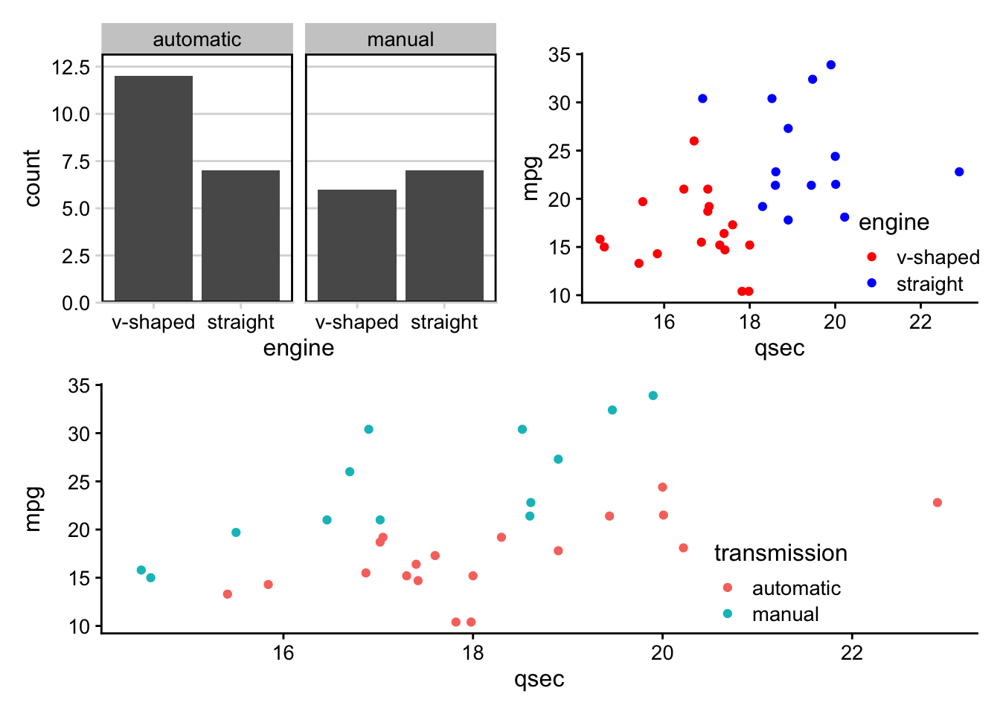

```r
p1 + p2 + plot_layout(widths = c(60, 30))
```


The relative heights of the plots can also be modified using a `heights` argument with the same function.

```r
p1 + p2 + plot_layout(heights = c(2, 1))
```

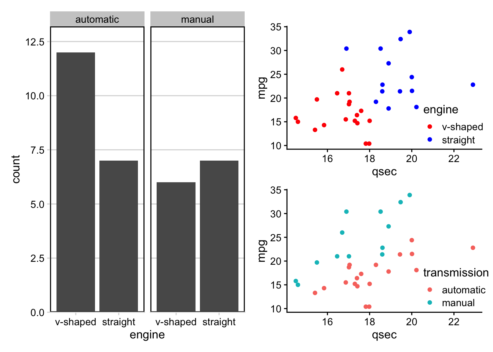

```r
p1 + p2 + plot_layout(heights = c(60, 30))
```


This package also allows for modification of legends. For example, legends can be gathered together to one side of the combined plots using the `guides = 'collect'` argument of the `plot_grid()` function.


```r
p1 + p2 + plot_layout(guides = "collect")
```


You can also specify the number of columns or rows using this same function with the `ncol` or `nrow` as you would with `facet_wrap()` of the `ggplot2` package, where plots are added to **complete a row** before they will be added to a new row. For example, the following will result in an empty 2nd row.


```r
p1 + p2 + plot_layout(nrow = 2, ncol = 2, guides = "collect")
```


However, the `byrow = FALSE` argument can disrupt this behavior and result in an empty 2nd column:


```r
p1 +p2 + plot_layout(nrow = 2, ncol = 2, byrow = FALSE, guides = "collect")
```


In this case the **columns will be preferentially completed** before placing a plot in a new column.


We can also use the package to change the theme specifications of specific plots. By default the plot just prior to the `theme()` function will be the only plot changed.


```r
p1 + p2 + theme(legend.position = "bottom") + p2
```


Using the `*`, themes can be added to all plots that are nested together. 


```r
(p1 + p2) *theme_bw() + p2
```


The `&` adds themes to all plots.

```r
(p1 + p2) + p2 & theme(axis.title.x = element_text(face = "bold"))
```


Annotations for all the plots combined can also be added using the `plot_annotation()` function, which can also take `theme()` function specifications with the `theme` argument.


```r
(p1 + p2) + p3 + theme(axis.text.x = element_text(angle = 90)) +
  plot_annotation(title = "Plot title for all 3 plots", 
                  theme = theme(plot.title = element_text(hjust = 0.5)))
```


See [here](https://patchwork.data-imaginist.com/) for more information about the `patchwork` package.

### `gganimate`

The final `ggplot2` extension we'll discuss here is [`gganmiate`](https://gganimate.com/). This extends the grammar of graphics implemented in the `ggplot2` package to work with animated plots. To get started, you'll need to install and load the package:


```r
library(gganimate)
```

The `gganimate` package adds functionality by providing a number of these grammar classes. Across the animation being generated, the following classes are made available, with each classes' corresponding functionality:

`transition_*()`  | specifies how data should transition 
`enter_*()`/`exit_*()`  |  specifies how data should appear and disappear
`ease_aes()`  |  specifies how different aesthetics should be eased during transitions
`view_*()`  |  specifies how positional scales should change
`shadow_*()` |  specifies how points from a previous frame should be displayed in current frame

We'll walk through these grammar classes using the `mtcars` dataset.

#### Example: `mtcars`

As noted, `gganimate` builds on top of the functionality within `ggplot2`, so the code should look pretty familiar by now. 

First, using the `mtcars` dataset we generate a static boxplot looking at the relationship between the number of cylinders a car has (`cyl`) and its gas mileage (`mpg`).


```r
# generate static boxplot
ggplot(mtcars) + 
  geom_boxplot(aes(factor(cyl), mpg))
```

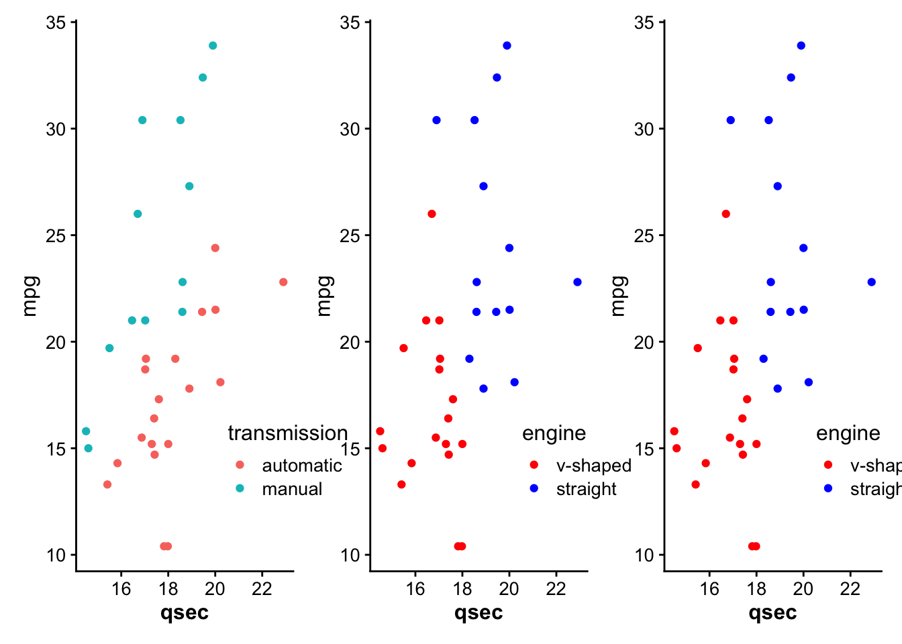

But what if we wanted to understand the relationship between those two variables and the number of gears a car has (`gear`)?

One option would be to use faceting:


```r
# facet by gear
ggplot(mtcars) + 
  geom_boxplot(aes(factor(cyl), mpg)) +
  facet_wrap(~gear)
```


Alternatively, we could animate the plot, using `gganimate` so that on a single plot we rotate between each of these three plots. 

##### Transitions

We'll transition in this example between frames by gear:


```r
# animate it!
mtcars %>%
  mutate(gear = factor(gear),
         cyl = factor(cyl)) %>%
  ggplot() + 
  geom_boxplot(aes(cyl, mpg)) + 
  transition_manual(gear)
```

<!-- -->

Note that here, `transition_manual()` is a new grammar class that we add right on top of our `ggplot2` plot code! Within this grammar class, we specify the variable upon which we'd like the transition in the animation to occur.

This means that the number of frames in the animation will be the number of levels in the variable by which you're transitioning. Here, there will be 3 frames, as there are three different levels of `gear` in the `mtcars` dataset.

`transition_manual()` is not the only option for transition. In fact, there are a number of different `transition_*` options, depending upon your animation needs. One of the most commonly used is `transition_states()`. The animation will plot the same information as the example above; however, it allows for finer tune control of the animation


```r
# animate it!
anim <- ggplot(mtcars) + 
  geom_boxplot(aes(factor(cyl), mpg)) + 
  transition_states(gear,
                    transition_length = 2,
                    state_length = 1)

anim
```

<!-- -->

Note here that we've stored the output from `transition_states` in the object `anim`. We'll build on this object below.

##### Labeling

Currently, it's hard to know which frame corresponds to which `gear`. To make this easier on the viewer, let's label our animation:


```r
# animate it!
anim <- anim +  
  labs(title = 'Now showing gear: {closest_state}')

anim
```

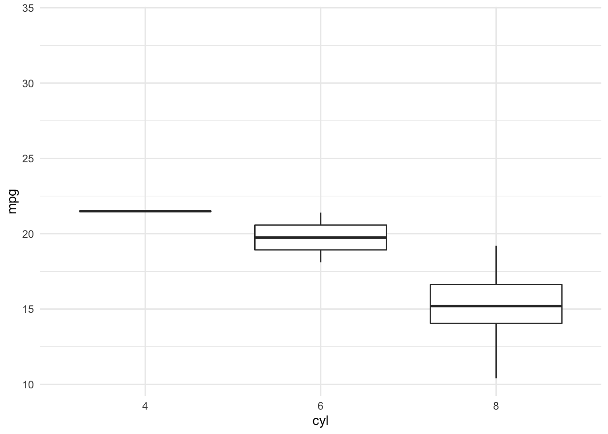<!-- -->

Note that we're referring to the appropriate gear within the animation frame by specifying `{closest_state}`.

##### Easing

Easing determines how the change from one value to another should occur. The default is linear, but there are other options that will control the appearance of progression in your animation. for example, 'cubic-in-out' allows for the start and end of the animation to have a smoother look.


```r
anim <- anim + 
  # Slow start and end for a smoother look
  ease_aes('cubic-in-out')

anim
```

<!-- -->

There are a number of easing functions, all of which are listed within the documentation, which can be viewed, as always, using the `?` help function: `?ease_aes`.

##### Enter & Exit

Building on top of easing, we can also control how the data appears (enters) and disappears (exits), using `enter_*` and `exit_*`:


```r
anim <- anim + 
  # fade to enter
  enter_fade() +
  # shrink on exit
  exit_shrink()

anim
```

<!-- -->

The changes are subtle but you'll notice that on transition the data fades in to appear and shrinks upon exit.

##### Position Scales

To  demonstrate how changing positional scales can be adjusted, let's take a look at a scatterplot. Here, we're plotting the relationship between 1/4 mile speed and miles per gallon and we'll be transitioning between gear.

The static plot would be as follows

```r
ggplot(mtcars) + 
  geom_point(aes(qsec, mpg))
```


However, upon adding animation, we see how the data changes by gear.


```r
# animate it!
scat <- ggplot(mtcars) + 
  geom_point(aes(qsec, mpg)) + 
  transition_states(gear,
                    transition_length = 2,
                    state_length = 1) +
    labs(title = 'Now showing gear: {closest_state}')

scat
```

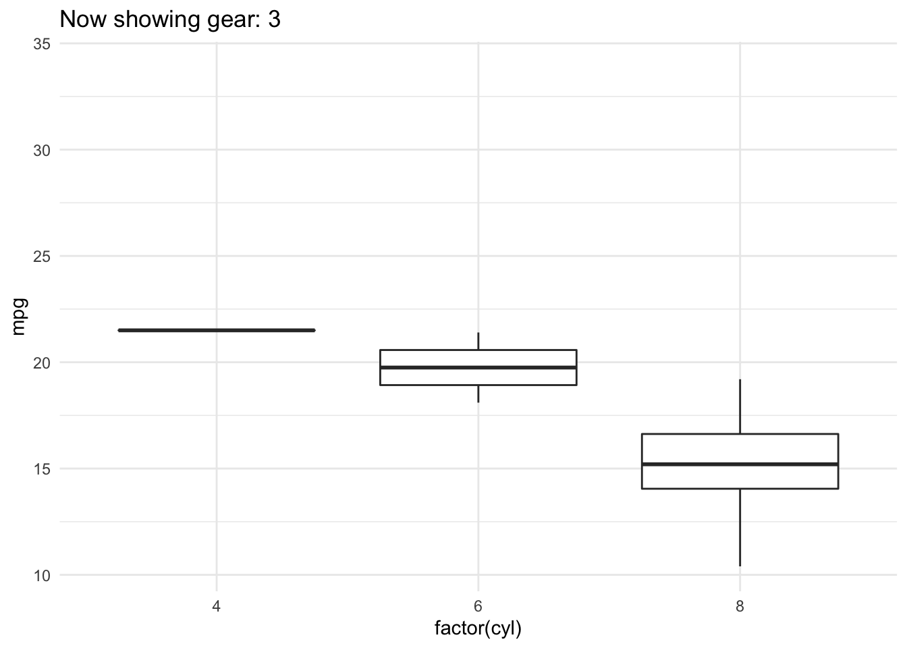<!-- -->

However, the x- and y-axes remain constant throughout the animation.

If you wanted to allow these positional scales to adjust between each gear level, you could use `view_step`:


```r
# allow positional scaling for each level in gear
scat +
  view_step(pause_length = 2, 
            step_length = 1, 
            nsteps = 3, 
            include = FALSE)
```

<!-- -->


#### Example: gapminder

One of the most famous examples of an animated plot uses the gapminder dataset. This dataset includes economic data for countries all over the world. The animated plot here demonstrates the relationship between GDP (per capita) and life expectancy over time, by continent. Note that the year whose data is being displayed is shown at the top left portion of the plot.


```r
# install.packages("gapminder")
library(gapminder)

gap <- ggplot(gapminder, aes(gdpPercap, lifeExp, size = pop, colour = country)) +
  geom_point(alpha = 0.7, show.legend = FALSE) +
  scale_colour_manual(values = country_colors) +
  scale_size(range = c(2, 12)) +
  scale_x_log10() +
  facet_wrap(~continent, ncol = 5) +
  theme_half_open(12) +
  panel_border() + 
  # animate it!
  labs(title = 'Year: {frame_time}', x = 'GDP per capita', y = 'life expectancy') +
  transition_time(year)

gap
```

<!-- -->

Note that in this example, we're now using `transition_time()` rather than `transition_states()`. This is a variant of `transition_states()` that is particularly useful when the states represent points in time, such as the years we're animating through in the plot above. The transition length is set to correspond to the time difference between the points in the data.

##### Shadow

However, what if we didn't want the data to completely disappear from one frame to the next and instead wanted to see the pattern emerge over time? We didn't demonstrate this using the `mtcars` dataset because each observation in that dataset is a different car. However, here, with the gapminder dataset, where we're looking at a trend over time, it makes more sense to include a trail

To do this, we would use `shadow_*`. Here, we'll use `shadow_trail()` to see a trail of the data from one frame to the next:


```r
gap +
 shadow_trail(distance = 0.05,
              alpha = 0.3)
```

<!-- -->

Here, distance specifies the temporal distance between the frames to show and alpha specifies the transparency of the trail, so that the current frame's data is always discernible.

## Case Studies

At this point, we've done a lot of work with our case studies. We've introduced the case studies, read them into R, and have wrangled the data into a usable format. Now, we get to peak at the data using visualizations to better understand each dataset's observations and variables! 

Let's start by loading our wrangled tidy data that we previously saved:


```r
load(here::here("data", "tidy_data", "case_study_1_tidy.rda"))

load(here::here("data", "tidy_data", "case_study_2_tidy.rda"))
```

### Case Study #1: Health Expenditures

We've now got the data in order so that we can start to explore the relationships between the variables contained in the health care dataset (`hc`) to answer our questions of interest:

1. Is there a relationship between healthcare coverage and healthcare spending in the United States?
2. How does the spending distribution change across geographic regions in the United States?
3. Does the relationship between healthcare coverage and healthcare spending in the United States change from 2013 to 2014?


```r
# see health care data
hc
```

```
## # A tibble: 612 x 10
##    Location  year type  tot_coverage abb   region tot_spending tot_pop
##    <chr>    <int> <chr>        <int> <chr> <fct>         <dbl>   <int>
##  1 Alabama   2013 Empl…      2126500 AL    South         33788 4763900
##  2 Alabama   2013 Non-…       174200 AL    South         33788 4763900
##  3 Alabama   2013 Medi…       869700 AL    South         33788 4763900
##  4 Alabama   2013 Medi…       783000 AL    South         33788 4763900
##  5 Alabama   2013 Othe…        85600 AL    South         33788 4763900
##  6 Alabama   2013 Unin…       724800 AL    South         33788 4763900
##  7 Alabama   2014 Empl…      2202800 AL    South         35263 4768000
##  8 Alabama   2014 Non-…       288900 AL    South         35263 4768000
##  9 Alabama   2014 Medi…       891900 AL    South         35263 4768000
## 10 Alabama   2014 Medi…       718400 AL    South         35263 4768000
## # … with 602 more rows, and 2 more variables: prop_coverage <dbl>,
## #   spending_capita <dbl>
```

As a reminder, we have state level data, broken down by year and type of insurance. For each, we have the total number of individuals who have health care coverage (`tot_coverage`), the amount spent on coverage (`tot_spending`), the proportion of individuals covered (`prop_coverage`), and the amount spent per capita (`spending_capita`). Additionally, we have the state name (`Location`), the two letter state abbreviation  (`abb`) and the region of the United States where the state is located (`region`). Let's get visualizing!

#### Exploratory Data Analysis (EDA)

To first get a sense of what information we do and do not have, the `visdat` package can be very helpful. This package uses `ggplot2` to visualize missingness in a data frame. For example, `vis_dat()` takes the data frame as an input and visualizes the observations on the left and the variables across the top. Solid colors indicate that a value is present. Each type of variable is represented by a different color. Grey lines indicate missing values.


```r
# install.packages("visdat")
library(visdat)

vis_dat(hc)
```


We now have a sense that a few states, for some years are missing coverage data, which also affects the ability to calculate proportion covered.

To see these values highlighted more specifically, we can use the related `vis_miss()` function.


```r
vis_miss(hc)
```


Here we see that missing values only occur 0.6% of the time, with 3.1% of the observations missing entries for `tot_coverage` and `prop_coverage`. So, all in all, there is not a lot of missing data, but we still want to be sure we understand where missingness occurs before answering our questions.

Let's use `dplyr` to see *which* observations have missing data:


```r
hc %>%
  filter(is.na(tot_coverage))
```

```
## # A tibble: 19 x 10
##    Location  year type  tot_coverage abb   region tot_spending tot_pop
##    <chr>    <int> <chr>        <int> <chr> <fct>         <dbl>   <int>
##  1 Arizona   2013 Othe…           NA AZ    West          41481 6603100
##  2 Arizona   2014 Othe…           NA AZ    West          43356 6657200
##  3 Distric…  2013 Othe…           NA DC    South          7443  652100
##  4 Distric…  2014 Othe…           NA DC    South          7871  656900
##  5 Indiana   2014 Othe…           NA IN    North…        54741 6477500
##  6 Kansas    2013 Othe…           NA KS    North…        21490 2817600
##  7 Kansas    2014 Othe…           NA KS    North…        22183 2853000
##  8 Kentucky  2014 Othe…           NA KY    South         35323 4315700
##  9 Massach…  2013 Othe…           NA MA    North…        68899 6647700
## 10 Massach…  2014 Othe…           NA MA    North…        71274 6658100
## 11 New Ham…  2014 Othe…           NA NH    North…        12742 1319700
## 12 New Jer…  2013 Othe…           NA NJ    North…        75148 8807400
## 13 North D…  2013 Othe…           NA ND    North…         6795  714500
## 14 Oklahoma  2013 Othe…           NA OK    South         28097 3709400
## 15 Rhode I…  2014 Othe…           NA RI    North…        10071 1048200
## 16 Tenness…  2013 Othe…           NA TN    South         46149 6400200
## 17 Tenness…  2014 Othe…           NA TN    South         48249 6502000
## 18 West Vi…  2013 Othe…           NA WV    South         16622 1822000
## 19 Wiscons…  2014 Othe…           NA WI    North…        50109 5747200
## # … with 2 more variables: prop_coverage <dbl>, spending_capita <dbl>
```

Ah, so we see that the "Other" type of coverage is missing in both 2013 and 2014 for a subset of states. We'll be focusing on the non-"Other" types of healthcare coverage, so this shouldn't pose a problem, but is good to know!

Taking this one step further, let's skim the entire dataset to get a sense of the information stored in each variable:


```r
library(skimr)

# get summary of the data
skim(hc)
```


<table style='width: auto;'
        class='table table-condensed'>
<caption>(\#tab:unnamed-chunk-99)Data summary</caption>
 <thead>
  <tr>
   <th style="text-align:left;">   </th>
   <th style="text-align:left;">   </th>
  </tr>
 </thead>
<tbody>
  <tr>
   <td style="text-align:left;"> Name </td>
   <td style="text-align:left;"> hc </td>
  </tr>
  <tr>
   <td style="text-align:left;"> Number of rows </td>
   <td style="text-align:left;"> 612 </td>
  </tr>
  <tr>
   <td style="text-align:left;"> Number of columns </td>
   <td style="text-align:left;"> 10 </td>
  </tr>
  <tr>
   <td style="text-align:left;"> _______________________ </td>
   <td style="text-align:left;">  </td>
  </tr>
  <tr>
   <td style="text-align:left;"> Column type frequency: </td>
   <td style="text-align:left;">  </td>
  </tr>
  <tr>
   <td style="text-align:left;"> character </td>
   <td style="text-align:left;"> 3 </td>
  </tr>
  <tr>
   <td style="text-align:left;"> factor </td>
   <td style="text-align:left;"> 1 </td>
  </tr>
  <tr>
   <td style="text-align:left;"> numeric </td>
   <td style="text-align:left;"> 6 </td>
  </tr>
  <tr>
   <td style="text-align:left;"> ________________________ </td>
   <td style="text-align:left;">  </td>
  </tr>
  <tr>
   <td style="text-align:left;"> Group variables </td>
   <td style="text-align:left;"> None </td>
  </tr>
</tbody>
</table>


**Variable type: character**

<table>
 <thead>
  <tr>
   <th style="text-align:left;"> skim_variable </th>
   <th style="text-align:right;"> n_missing </th>
   <th style="text-align:right;"> complete_rate </th>
   <th style="text-align:right;"> min </th>
   <th style="text-align:right;"> max </th>
   <th style="text-align:right;"> empty </th>
   <th style="text-align:right;"> n_unique </th>
   <th style="text-align:right;"> whitespace </th>
  </tr>
 </thead>
<tbody>
  <tr>
   <td style="text-align:left;"> Location </td>
   <td style="text-align:right;"> 0 </td>
   <td style="text-align:right;"> 1 </td>
   <td style="text-align:right;"> 4 </td>
   <td style="text-align:right;"> 20 </td>
   <td style="text-align:right;"> 0 </td>
   <td style="text-align:right;"> 51 </td>
   <td style="text-align:right;"> 0 </td>
  </tr>
  <tr>
   <td style="text-align:left;"> type </td>
   <td style="text-align:right;"> 0 </td>
   <td style="text-align:right;"> 1 </td>
   <td style="text-align:right;"> 8 </td>
   <td style="text-align:right;"> 12 </td>
   <td style="text-align:right;"> 0 </td>
   <td style="text-align:right;"> 6 </td>
   <td style="text-align:right;"> 0 </td>
  </tr>
  <tr>
   <td style="text-align:left;"> abb </td>
   <td style="text-align:right;"> 0 </td>
   <td style="text-align:right;"> 1 </td>
   <td style="text-align:right;"> 2 </td>
   <td style="text-align:right;"> 2 </td>
   <td style="text-align:right;"> 0 </td>
   <td style="text-align:right;"> 51 </td>
   <td style="text-align:right;"> 0 </td>
  </tr>
</tbody>
</table>


**Variable type: factor**

<table>
 <thead>
  <tr>
   <th style="text-align:left;"> skim_variable </th>
   <th style="text-align:right;"> n_missing </th>
   <th style="text-align:right;"> complete_rate </th>
   <th style="text-align:left;"> ordered </th>
   <th style="text-align:right;"> n_unique </th>
   <th style="text-align:left;"> top_counts </th>
  </tr>
 </thead>
<tbody>
  <tr>
   <td style="text-align:left;"> region </td>
   <td style="text-align:right;"> 0 </td>
   <td style="text-align:right;"> 1 </td>
   <td style="text-align:left;"> FALSE </td>
   <td style="text-align:right;"> 4 </td>
   <td style="text-align:left;"> Sou: 204, Wes: 156, Nor: 144, Nor: 108 </td>
  </tr>
</tbody>
</table>


**Variable type: numeric**

<table>
 <thead>
  <tr>
   <th style="text-align:left;"> skim_variable </th>
   <th style="text-align:right;"> n_missing </th>
   <th style="text-align:right;"> complete_rate </th>
   <th style="text-align:right;"> mean </th>
   <th style="text-align:right;"> sd </th>
   <th style="text-align:right;"> p0 </th>
   <th style="text-align:right;"> p25 </th>
   <th style="text-align:right;"> p50 </th>
   <th style="text-align:right;"> p75 </th>
   <th style="text-align:right;"> p100 </th>
   <th style="text-align:left;"> hist </th>
  </tr>
 </thead>
<tbody>
  <tr>
   <td style="text-align:left;"> year </td>
   <td style="text-align:right;"> 0 </td>
   <td style="text-align:right;"> 1.00 </td>
   <td style="text-align:right;"> 2013.50 </td>
   <td style="text-align:right;"> 0.50 </td>
   <td style="text-align:right;"> 2013.00 </td>
   <td style="text-align:right;"> 2013.00 </td>
   <td style="text-align:right;"> 2013.50 </td>
   <td style="text-align:right;"> 2014.00 </td>
   <td style="text-align:right;"> 2014.00 </td>
   <td style="text-align:left;"> ▇▁▁▁▇ </td>
  </tr>
  <tr>
   <td style="text-align:left;"> tot_coverage </td>
   <td style="text-align:right;"> 19 </td>
   <td style="text-align:right;"> 0.97 </td>
   <td style="text-align:right;"> 1059391.91 </td>
   <td style="text-align:right;"> 1864110.89 </td>
   <td style="text-align:right;"> 9900.00 </td>
   <td style="text-align:right;"> 135700.00 </td>
   <td style="text-align:right;"> 436800.00 </td>
   <td style="text-align:right;"> 1036800.00 </td>
   <td style="text-align:right;"> 17747300.00 </td>
   <td style="text-align:left;"> ▇▁▁▁▁ </td>
  </tr>
  <tr>
   <td style="text-align:left;"> tot_spending </td>
   <td style="text-align:right;"> 0 </td>
   <td style="text-align:right;"> 1.00 </td>
   <td style="text-align:right;"> 49004.39 </td>
   <td style="text-align:right;"> 54031.44 </td>
   <td style="text-align:right;"> 4639.00 </td>
   <td style="text-align:right;"> 12742.00 </td>
   <td style="text-align:right;"> 33939.00 </td>
   <td style="text-align:right;"> 60364.00 </td>
   <td style="text-align:right;"> 291989.00 </td>
   <td style="text-align:left;"> ▇▂▁▁▁ </td>
  </tr>
  <tr>
   <td style="text-align:left;"> tot_pop </td>
   <td style="text-align:right;"> 0 </td>
   <td style="text-align:right;"> 1.00 </td>
   <td style="text-align:right;"> 6172245.10 </td>
   <td style="text-align:right;"> 6983404.37 </td>
   <td style="text-align:right;"> 572000.00 </td>
   <td style="text-align:right;"> 1610200.00 </td>
   <td style="text-align:right;"> 4357900.00 </td>
   <td style="text-align:right;"> 6866000.00 </td>
   <td style="text-align:right;"> 38701300.00 </td>
   <td style="text-align:left;"> ▇▂▁▁▁ </td>
  </tr>
  <tr>
   <td style="text-align:left;"> prop_coverage </td>
   <td style="text-align:right;"> 19 </td>
   <td style="text-align:right;"> 0.97 </td>
   <td style="text-align:right;"> 0.17 </td>
   <td style="text-align:right;"> 0.16 </td>
   <td style="text-align:right;"> 0.01 </td>
   <td style="text-align:right;"> 0.06 </td>
   <td style="text-align:right;"> 0.13 </td>
   <td style="text-align:right;"> 0.18 </td>
   <td style="text-align:right;"> 0.61 </td>
   <td style="text-align:left;"> ▇▅▁▁▂ </td>
  </tr>
  <tr>
   <td style="text-align:left;"> spending_capita </td>
   <td style="text-align:right;"> 0 </td>
   <td style="text-align:right;"> 1.00 </td>
   <td style="text-align:right;"> 8246.17 </td>
   <td style="text-align:right;"> 1263.98 </td>
   <td style="text-align:right;"> 5676.52 </td>
   <td style="text-align:right;"> 7395.76 </td>
   <td style="text-align:right;"> 8049.26 </td>
   <td style="text-align:right;"> 8993.86 </td>
   <td style="text-align:right;"> 11982.04 </td>
   <td style="text-align:left;"> ▂▇▅▃▁ </td>
  </tr>
</tbody>
</table>

At a glance, by looking at the `hist` column of the output for our numeric/integer variables, we see that there is a long right tail in `tot_coverage` and `tot_pop`. 

We see that proportion coverage varies from 0.0054 (`p0`) to 0.61 (`p100`). So, we'll want to know which states are at each end of the spectrum here. 

We also see that for `tot_spending`, the `mean` is 49004 and the median (`p50`) is slightly lower and that this variable also has a long right tail (`hist`).

We also know that these data come from two different years, so we can group by `year` and again summarize the data: 


```r
# group by year
hc %>% 
  group_by(year) %>%
  skim()
```


<table style='width: auto;'
        class='table table-condensed'>
<caption>(\#tab:unnamed-chunk-100)Data summary</caption>
 <thead>
  <tr>
   <th style="text-align:left;">   </th>
   <th style="text-align:left;">   </th>
  </tr>
 </thead>
<tbody>
  <tr>
   <td style="text-align:left;"> Name </td>
   <td style="text-align:left;"> Piped data </td>
  </tr>
  <tr>
   <td style="text-align:left;"> Number of rows </td>
   <td style="text-align:left;"> 612 </td>
  </tr>
  <tr>
   <td style="text-align:left;"> Number of columns </td>
   <td style="text-align:left;"> 10 </td>
  </tr>
  <tr>
   <td style="text-align:left;"> _______________________ </td>
   <td style="text-align:left;">  </td>
  </tr>
  <tr>
   <td style="text-align:left;"> Column type frequency: </td>
   <td style="text-align:left;">  </td>
  </tr>
  <tr>
   <td style="text-align:left;"> character </td>
   <td style="text-align:left;"> 3 </td>
  </tr>
  <tr>
   <td style="text-align:left;"> factor </td>
   <td style="text-align:left;"> 1 </td>
  </tr>
  <tr>
   <td style="text-align:left;"> numeric </td>
   <td style="text-align:left;"> 5 </td>
  </tr>
  <tr>
   <td style="text-align:left;"> ________________________ </td>
   <td style="text-align:left;">  </td>
  </tr>
  <tr>
   <td style="text-align:left;"> Group variables </td>
   <td style="text-align:left;"> year </td>
  </tr>
</tbody>
</table>


**Variable type: character**

<table>
 <thead>
  <tr>
   <th style="text-align:left;"> skim_variable </th>
   <th style="text-align:right;"> year </th>
   <th style="text-align:right;"> n_missing </th>
   <th style="text-align:right;"> complete_rate </th>
   <th style="text-align:right;"> min </th>
   <th style="text-align:right;"> max </th>
   <th style="text-align:right;"> empty </th>
   <th style="text-align:right;"> n_unique </th>
   <th style="text-align:right;"> whitespace </th>
  </tr>
 </thead>
<tbody>
  <tr>
   <td style="text-align:left;"> Location </td>
   <td style="text-align:right;"> 2013 </td>
   <td style="text-align:right;"> 0 </td>
   <td style="text-align:right;"> 1 </td>
   <td style="text-align:right;"> 4 </td>
   <td style="text-align:right;"> 20 </td>
   <td style="text-align:right;"> 0 </td>
   <td style="text-align:right;"> 51 </td>
   <td style="text-align:right;"> 0 </td>
  </tr>
  <tr>
   <td style="text-align:left;"> Location </td>
   <td style="text-align:right;"> 2014 </td>
   <td style="text-align:right;"> 0 </td>
   <td style="text-align:right;"> 1 </td>
   <td style="text-align:right;"> 4 </td>
   <td style="text-align:right;"> 20 </td>
   <td style="text-align:right;"> 0 </td>
   <td style="text-align:right;"> 51 </td>
   <td style="text-align:right;"> 0 </td>
  </tr>
  <tr>
   <td style="text-align:left;"> type </td>
   <td style="text-align:right;"> 2013 </td>
   <td style="text-align:right;"> 0 </td>
   <td style="text-align:right;"> 1 </td>
   <td style="text-align:right;"> 8 </td>
   <td style="text-align:right;"> 12 </td>
   <td style="text-align:right;"> 0 </td>
   <td style="text-align:right;"> 6 </td>
   <td style="text-align:right;"> 0 </td>
  </tr>
  <tr>
   <td style="text-align:left;"> type </td>
   <td style="text-align:right;"> 2014 </td>
   <td style="text-align:right;"> 0 </td>
   <td style="text-align:right;"> 1 </td>
   <td style="text-align:right;"> 8 </td>
   <td style="text-align:right;"> 12 </td>
   <td style="text-align:right;"> 0 </td>
   <td style="text-align:right;"> 6 </td>
   <td style="text-align:right;"> 0 </td>
  </tr>
  <tr>
   <td style="text-align:left;"> abb </td>
   <td style="text-align:right;"> 2013 </td>
   <td style="text-align:right;"> 0 </td>
   <td style="text-align:right;"> 1 </td>
   <td style="text-align:right;"> 2 </td>
   <td style="text-align:right;"> 2 </td>
   <td style="text-align:right;"> 0 </td>
   <td style="text-align:right;"> 51 </td>
   <td style="text-align:right;"> 0 </td>
  </tr>
  <tr>
   <td style="text-align:left;"> abb </td>
   <td style="text-align:right;"> 2014 </td>
   <td style="text-align:right;"> 0 </td>
   <td style="text-align:right;"> 1 </td>
   <td style="text-align:right;"> 2 </td>
   <td style="text-align:right;"> 2 </td>
   <td style="text-align:right;"> 0 </td>
   <td style="text-align:right;"> 51 </td>
   <td style="text-align:right;"> 0 </td>
  </tr>
</tbody>
</table>


**Variable type: factor**

<table>
 <thead>
  <tr>
   <th style="text-align:left;"> skim_variable </th>
   <th style="text-align:right;"> year </th>
   <th style="text-align:right;"> n_missing </th>
   <th style="text-align:right;"> complete_rate </th>
   <th style="text-align:left;"> ordered </th>
   <th style="text-align:right;"> n_unique </th>
   <th style="text-align:left;"> top_counts </th>
  </tr>
 </thead>
<tbody>
  <tr>
   <td style="text-align:left;"> region </td>
   <td style="text-align:right;"> 2013 </td>
   <td style="text-align:right;"> 0 </td>
   <td style="text-align:right;"> 1 </td>
   <td style="text-align:left;"> FALSE </td>
   <td style="text-align:right;"> 4 </td>
   <td style="text-align:left;"> Sou: 102, Wes: 78, Nor: 72, Nor: 54 </td>
  </tr>
  <tr>
   <td style="text-align:left;"> region </td>
   <td style="text-align:right;"> 2014 </td>
   <td style="text-align:right;"> 0 </td>
   <td style="text-align:right;"> 1 </td>
   <td style="text-align:left;"> FALSE </td>
   <td style="text-align:right;"> 4 </td>
   <td style="text-align:left;"> Sou: 102, Wes: 78, Nor: 72, Nor: 54 </td>
  </tr>
</tbody>
</table>


**Variable type: numeric**

<table>
 <thead>
  <tr>
   <th style="text-align:left;"> skim_variable </th>
   <th style="text-align:right;"> year </th>
   <th style="text-align:right;"> n_missing </th>
   <th style="text-align:right;"> complete_rate </th>
   <th style="text-align:right;"> mean </th>
   <th style="text-align:right;"> sd </th>
   <th style="text-align:right;"> p0 </th>
   <th style="text-align:right;"> p25 </th>
   <th style="text-align:right;"> p50 </th>
   <th style="text-align:right;"> p75 </th>
   <th style="text-align:right;"> p100 </th>
   <th style="text-align:left;"> hist </th>
  </tr>
 </thead>
<tbody>
  <tr>
   <td style="text-align:left;"> tot_coverage </td>
   <td style="text-align:right;"> 2013 </td>
   <td style="text-align:right;"> 9 </td>
   <td style="text-align:right;"> 0.97 </td>
   <td style="text-align:right;"> 1052927.61 </td>
   <td style="text-align:right;"> 1863158.94 </td>
   <td style="text-align:right;"> 9900.00 </td>
   <td style="text-align:right;"> 132300.00 </td>
   <td style="text-align:right;"> 426300.00 </td>
   <td style="text-align:right;"> 1034500.00 </td>
   <td style="text-align:right;"> 17747300.00 </td>
   <td style="text-align:left;"> ▇▁▁▁▁ </td>
  </tr>
  <tr>
   <td style="text-align:left;"> tot_coverage </td>
   <td style="text-align:right;"> 2014 </td>
   <td style="text-align:right;"> 10 </td>
   <td style="text-align:right;"> 0.97 </td>
   <td style="text-align:right;"> 1065878.04 </td>
   <td style="text-align:right;"> 1868198.24 </td>
   <td style="text-align:right;"> 9900.00 </td>
   <td style="text-align:right;"> 137700.00 </td>
   <td style="text-align:right;"> 450150.00 </td>
   <td style="text-align:right;"> 1056725.00 </td>
   <td style="text-align:right;"> 17703700.00 </td>
   <td style="text-align:left;"> ▇▁▁▁▁ </td>
  </tr>
  <tr>
   <td style="text-align:left;"> tot_spending </td>
   <td style="text-align:right;"> 2013 </td>
   <td style="text-align:right;"> 0 </td>
   <td style="text-align:right;"> 1.00 </td>
   <td style="text-align:right;"> 47757.31 </td>
   <td style="text-align:right;"> 52637.29 </td>
   <td style="text-align:right;"> 4639.00 </td>
   <td style="text-align:right;"> 12392.00 </td>
   <td style="text-align:right;"> 33468.00 </td>
   <td style="text-align:right;"> 60364.00 </td>
   <td style="text-align:right;"> 278168.00 </td>
   <td style="text-align:left;"> ▇▂▁▁▁ </td>
  </tr>
  <tr>
   <td style="text-align:left;"> tot_spending </td>
   <td style="text-align:right;"> 2014 </td>
   <td style="text-align:right;"> 0 </td>
   <td style="text-align:right;"> 1.00 </td>
   <td style="text-align:right;"> 50251.47 </td>
   <td style="text-align:right;"> 55448.72 </td>
   <td style="text-align:right;"> 4856.00 </td>
   <td style="text-align:right;"> 12742.00 </td>
   <td style="text-align:right;"> 35299.00 </td>
   <td style="text-align:right;"> 62847.00 </td>
   <td style="text-align:right;"> 291989.00 </td>
   <td style="text-align:left;"> ▇▂▁▁▁ </td>
  </tr>
  <tr>
   <td style="text-align:left;"> tot_pop </td>
   <td style="text-align:right;"> 2013 </td>
   <td style="text-align:right;"> 0 </td>
   <td style="text-align:right;"> 1.00 </td>
   <td style="text-align:right;"> 6145121.57 </td>
   <td style="text-align:right;"> 6945677.64 </td>
   <td style="text-align:right;"> 582200.00 </td>
   <td style="text-align:right;"> 1600600.00 </td>
   <td style="text-align:right;"> 4400100.00 </td>
   <td style="text-align:right;"> 6866000.00 </td>
   <td style="text-align:right;"> 38176400.00 </td>
   <td style="text-align:left;"> ▇▂▁▁▁ </td>
  </tr>
  <tr>
   <td style="text-align:left;"> tot_pop </td>
   <td style="text-align:right;"> 2014 </td>
   <td style="text-align:right;"> 0 </td>
   <td style="text-align:right;"> 1.00 </td>
   <td style="text-align:right;"> 6199368.63 </td>
   <td style="text-align:right;"> 7032201.22 </td>
   <td style="text-align:right;"> 572000.00 </td>
   <td style="text-align:right;"> 1610200.00 </td>
   <td style="text-align:right;"> 4315700.00 </td>
   <td style="text-align:right;"> 7085000.00 </td>
   <td style="text-align:right;"> 38701300.00 </td>
   <td style="text-align:left;"> ▇▂▁▁▁ </td>
  </tr>
  <tr>
   <td style="text-align:left;"> prop_coverage </td>
   <td style="text-align:right;"> 2013 </td>
   <td style="text-align:right;"> 9 </td>
   <td style="text-align:right;"> 0.97 </td>
   <td style="text-align:right;"> 0.17 </td>
   <td style="text-align:right;"> 0.16 </td>
   <td style="text-align:right;"> 0.01 </td>
   <td style="text-align:right;"> 0.05 </td>
   <td style="text-align:right;"> 0.13 </td>
   <td style="text-align:right;"> 0.18 </td>
   <td style="text-align:right;"> 0.60 </td>
   <td style="text-align:left;"> ▇▆▁▁▂ </td>
  </tr>
  <tr>
   <td style="text-align:left;"> prop_coverage </td>
   <td style="text-align:right;"> 2014 </td>
   <td style="text-align:right;"> 10 </td>
   <td style="text-align:right;"> 0.97 </td>
   <td style="text-align:right;"> 0.17 </td>
   <td style="text-align:right;"> 0.16 </td>
   <td style="text-align:right;"> 0.01 </td>
   <td style="text-align:right;"> 0.06 </td>
   <td style="text-align:right;"> 0.12 </td>
   <td style="text-align:right;"> 0.18 </td>
   <td style="text-align:right;"> 0.61 </td>
   <td style="text-align:left;"> ▇▅▁▁▂ </td>
  </tr>
  <tr>
   <td style="text-align:left;"> spending_capita </td>
   <td style="text-align:right;"> 2013 </td>
   <td style="text-align:right;"> 0 </td>
   <td style="text-align:right;"> 1.00 </td>
   <td style="text-align:right;"> 8064.53 </td>
   <td style="text-align:right;"> 1228.01 </td>
   <td style="text-align:right;"> 5676.52 </td>
   <td style="text-align:right;"> 7210.56 </td>
   <td style="text-align:right;"> 7842.66 </td>
   <td style="text-align:right;"> 8883.00 </td>
   <td style="text-align:right;"> 11413.89 </td>
   <td style="text-align:left;"> ▂▇▅▃▁ </td>
  </tr>
  <tr>
   <td style="text-align:left;"> spending_capita </td>
   <td style="text-align:right;"> 2014 </td>
   <td style="text-align:right;"> 0 </td>
   <td style="text-align:right;"> 1.00 </td>
   <td style="text-align:right;"> 8427.80 </td>
   <td style="text-align:right;"> 1275.27 </td>
   <td style="text-align:right;"> 6007.03 </td>
   <td style="text-align:right;"> 7544.68 </td>
   <td style="text-align:right;"> 8242.67 </td>
   <td style="text-align:right;"> 9378.16 </td>
   <td style="text-align:right;"> 11982.04 </td>
   <td style="text-align:left;"> ▂▇▃▃▁ </td>
  </tr>
</tbody>
</table>

At a glance, there doesn't appear to be a huge difference in the variables from one year to the next, but we'll explore this again in a bit.

With at least some understanding of the data in our dataset, let's start generating exploratory plots that will help us answer each of our questions of interest.

#### Q1: Relationship between coverage and spending?

To answer the question:

> Is there a relationship between healthcare coverage and healthcare spending in the United States?

We'll have to visualize coverage and spending data across the United States.

And, to understand the relationship between two continuous variables - coverage and spending - a scatterplot will be the most effective visualization.

We'll first look at a scatterplot:


```r
hc %>%
  filter(type == "Employer", 
         year == "2013") %>% 
  ggplot(aes(x = spending_capita, 
             y = prop_coverage)) +
  geom_point() + 
  labs(x = "spending per capita",
       y = "coverage proportion")
```


We see that there appears to be some relationship, with those states that spend more per capita also having higher proportions of their population having healthcare coverage.

We can continue to improve this plot to better understand the underlying data. For example, we can add a best-fit line using `geom_smooth()` to visualize the magnitude of the linear relationship:


```r
# generate scatterplot with fit line
hc %>%
  filter(type == "Employer", 
         year == "2013") %>% 
  ggplot(aes(x = spending_capita, 
             y = prop_coverage)) + 
  geom_point() + 
  labs(x = "spending per capita",
       y = "coverage proportion") +
  geom_smooth(method = "lm", col = "red")
```

```
## `geom_smooth()` using formula 'y ~ x'
```


Beyond that, we likely want to know which point represents which state, so we can add state labels:


```r
# add state abbreviation labels
hc %>%
  filter(type == "Employer", 
         year == "2013") %>% 
  ggplot(aes(x = spending_capita, 
             y = prop_coverage)) + 
  geom_point() + 
  labs(x = "spending per capita",
       y = "coverage proportion") +
  geom_smooth(method = "lm", col = "red") + 
  geom_text(aes(label=abb), 
            nudge_x = 150)
```

```
## `geom_smooth()` using formula 'y ~ x'
```


From there, it'd likely be helpful to have information from each region:


```r
# color by region
hc %>%
  filter(type == "Employer", 
         year == "2013") %>% 
  ggplot(aes(x = spending_capita, 
             y = prop_coverage,
             color = region)) + 
  geom_point() + 
  labs(x = "spending per capita",
       y = "coverage proportion") +
  geom_smooth(method = "lm", col = "red") + 
  geom_text(aes(label=abb), 
            nudge_x = 150, 
            show.legend = FALSE)
```

```
## `geom_smooth()` using formula 'y ~ x'
```


So far, we've only been focusing on data from 2013. What about looking at data from both 2013 and 2014? We can do that using `facet_wrap()`:


```r
# color by region
hc %>%
  filter(type == "Employer") %>% 
  ggplot(aes(x = spending_capita, 
             y = prop_coverage,
             color = region)) + 
  geom_point() + 
  facet_wrap(~year) +
  labs(x = "spending per capita",
       y = "coverage proportion") +
  geom_smooth(method = "lm", col = "red") + 
  geom_text(aes(label=abb), 
            nudge_x = 150, 
            show.legend = FALSE)
```

```
## `geom_smooth()` using formula 'y ~ x'
```


We see that the overall trend holds, but there has been some movement. For example, we see at a glance that DC has a higher proportion of its population covered in 2014 relative to 2013, while MA saw a drop in coverage. UT appears to be an outlier in both years having low spending but a high proportion of individuals covered.

Beyond "Employer"-held healthcare coverage, let's look at the other types of coverage data we have. Here, we'll facet by type, rather than year, again focusing on just data from 2013.


```r
# visualize 2013 data by type
hc %>%
  filter(year == "2013") %>% 
  ggplot(aes(x = spending_capita, 
             y = prop_coverage,
             color = region)) + 
  geom_point() + 
  facet_wrap(~type) +
  labs(x = "spending per capita",
       y = "coverage proportion") +
  geom_smooth(method = "lm", col = "red") + 
  geom_text(aes(label=abb), 
            nudge_x = 150, 
            show.legend = FALSE)
```

```
## `geom_smooth()` using formula 'y ~ x'
```


From these data, we see that Employer health care coverage is the most popular way in which individuals receive their health insurance across all states. We also see a flat or positive relationship for all other types of insurance, except for "Uninsured". There, as makes sense, we see that the more money spent per capita the fewer individuals the state has without insurance. 

We can quickly peak at the data from 2014 to be sure the same general patterns hold:


```r
# visualize 2014 data by type
hc %>%
  filter(year == "2014") %>% 
  ggplot(aes(x = spending_capita, 
             y = prop_coverage,
             color = region)) + 
  geom_point() + 
  facet_wrap(~type) +
  labs(x = "spending per capita",
       y = "coverage proportion") +
  geom_smooth(method = "lm", col = "red") + 
  geom_text(aes(label=abb), 
            nudge_x = 150, 
            show.legend = FALSE)
```

```
## `geom_smooth()` using formula 'y ~ x'
```

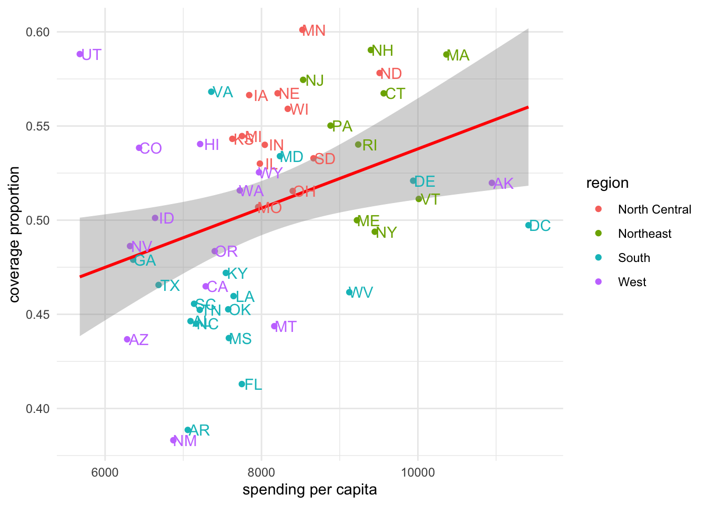

The same general patterns hold in 2014 as we saw in 2013; however, the patterns are not exactly the same.

With these plots we have a pretty good understanding of the relationship between spending and coverage across this country when it comes to health care.

Let's save some of these plots for later:


```r
pdf(here::here("figures", "exploratory", "2013and2014_spending_and_coverage.pdf"))

hc %>%
  filter(type == "Employer") %>% 
  ggplot(aes(x = spending_capita, 
             y = prop_coverage,
             color = region)) + 
  geom_point() + 
  facet_wrap(~year) +
  labs(x = "spending per capita",
       y = "coverage proportion") +
  geom_smooth(method = "lm", col = "red") + 
  geom_text(aes(label=abb), 
            nudge_x = 150, 
            show.legend = FALSE)
```

```
## `geom_smooth()` using formula 'y ~ x'
```

```r
dev.off()
```

```
## quartz_off_screen 
##                 2
```

```r
pdf(here::here("figures", "exploratory", "2013_coverage_type.pdf"))
hc %>%
  filter(year == "2013") %>% 
  ggplot(aes(x = spending_capita, 
             y = prop_coverage,
             color = region)) + 
  geom_point() + 
  facet_wrap(~type) +
  labs(x = "spending per capita",
       y = "coverage proportion") +
  geom_smooth(method = "lm", col = "red") + 
  geom_text(aes(label=abb), 
            nudge_x = 150, 
            show.legend = FALSE)
```

```
## `geom_smooth()` using formula 'y ~ x'
```

```
## Warning: Removed 9 rows containing non-finite values (stat_smooth).
```

```
## Warning: Removed 9 rows containing missing values (geom_point).
```

```
## Warning: Removed 9 rows containing missing values (geom_text).
```

```r
dev.off()
```

```
## quartz_off_screen 
##                 2
```

```r
pdf(here::here("figures", "exploratory", "2014_coverage_type.pdf"))
hc %>%
  filter(year == "2014") %>% 
  ggplot(aes(x = spending_capita, 
             y = prop_coverage,
             color = region)) + 
  geom_point() + 
  facet_wrap(~type) +
  labs(x = "spending per capita",
       y = "coverage proportion") +
  geom_smooth(method = "lm", col = "red") + 
  geom_text(aes(label=abb), 
            nudge_x = 150, 
            show.legend = FALSE)
```

```
## `geom_smooth()` using formula 'y ~ x'
```

```
## Warning: Removed 10 rows containing non-finite values (stat_smooth).
```

```
## Warning: Removed 10 rows containing missing values (geom_point).
```

```
## Warning: Removed 10 rows containing missing values (geom_text).
```

```r
dev.off()
```

```
## quartz_off_screen 
##                 2
```

#### Q2: Spending Across Geographic Regions?

To answer the question:

> Which US states spend the most and which spend the least on healthcare? How does the spending distribution change across geographic regions in the United States?

We'll want to visualize healthcare spending across regions of the US.

We saw in the previous plots that there are some regional effects when it comes to spending, as the states from the different regions tended to cluster in the previous plot. But, let's look at this explicitly now.

We're looking to visualize a continuous variable (`spending_capita`) by a categorical variable (`region`), so a boxplot is always a good place to start:


```r
# generate boxplot
hc %>% 
  ggplot(aes(x = region, 
             y = spending_capita)) + 
  geom_boxplot() +
  labs(y = "spending per capita")
```

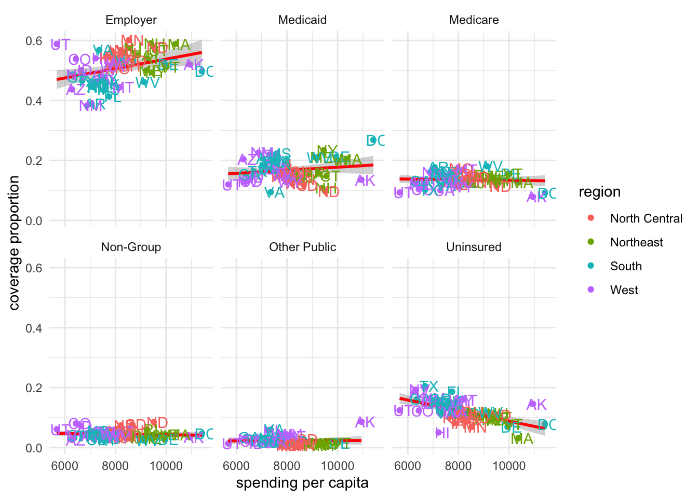

Here, we get a sense of the overall trend, seeing that states in the Northeast tend to spend the most on health care, while states in the West spend the least.

But, sometimes, it can be helpful to see the distribution of points along with the boxplot, so we can add those onto the plot. We'll use `geom_jitter()` rather than `geom_point()` here so that we can see all the points without overlap. Note that we also use `alpha = 0.2` to increase the transparency of the points and `outlier.shape = NA` to hide the outliers on the boxplot. This way, each observation is only plotted a single time:


```r
# add data points to boxplot
hc %>% 
  filter(type == "Employer") %>%
  ggplot(aes(x = region, 
             y = spending_capita)) + 
  geom_boxplot(outlier.shape = NA) +
  geom_jitter(alpha = 0.2) +
  labs(y = "spending per capita")
```


This gives us a sense of the variation in spending for states in each region. Of note, there are more outliers in the South and West, with a few states spending more on health care than even states in the Northeast, where spending tends to be higher.

With this we have a good sense of the regional effects of spending across the United states.

#### Q3: Coverage and Spending Change Over Time?

To answer the question:

> Does the relationship between healthcare coverage and healthcare spending in the United States change from 2013 to 2014?

we'll need to visualize a whole bunch of variables: coverage, spending, `year` and type of insurance. We can return to a scatterplot again, but now we'll put all these pieces we looked at separately in Q1 together at once to answer this temporal question visually. 

We won't filter the dataset but will instead use `facet_grid()`, which "forms a matrix of panels defined by row and column faceting variables":

`facet_wrap()`, which we used previously, *typically* utilizes screen space better than `facet_grid()`; however, in this case, where we want 2013 and 2014 to each be in a separate row, `facet_grid()` is the better visual choice.


```r
# color by region
hc %>% 
  ggplot(aes(x = spending_capita, 
             y = prop_coverage,
             color = region)) + 
  geom_point() + 
  labs(x = "spending per capita",
       y = "coverage proportion") +
  geom_smooth(method = "lm", col = "red") + 
  facet_grid(year~type)
```

```
## `geom_smooth()` using formula 'y ~ x'
```


With this, output the top row are the data from 2013 and the bottom from 2014. We can then visually compare the top plot to the bottom plot for each time of insurance. 

Visually, we can start to get a sense that a few things changed from 2013 to 2014. For example, as we saw previously, individual states changed from one year to the next, but overall patterns seem to hold pretty steady between these two years.

We were able to start answering all our questions of interest with a number of quick plots using `ggplot2`. 

Now, of course there are *many* ways in which we could customize each of these plots to be "publication-ready," but for now, we'll stop with this case study having gained a lot of new insight into these data and answers to our questions we now have, simply from generating a few exploratory plots.

### Case Study #2: Firearms

For our second case study, we're interested in the following question: 

>At the state-level, what is the relationship between firearm legislation strength and annual rate of fatal police shootings?

In the previous course, we wrangled the data into a single, helpful data frame: `firearms`.


```r
# see firearms data
firearms
```

```
## # A tibble: 51 x 15
##    NAME  white black hispanic  male total_pop violent_crime brady_scores
##    <chr> <dbl> <dbl>    <dbl> <dbl>     <dbl>         <dbl>        <dbl>
##  1 alab…  69.5 26.7      4.13  48.5   4850858          472.        -18  
##  2 alas…  66.5  3.67     6.82  52.4    737979          730.        -30  
##  3 ariz…  83.5  4.80    30.9   49.7   6802262          410.        -39  
##  4 arka…  79.6 15.7      7.18  49.1   2975626          521.        -24  
##  5 cali…  73.0  6.49    38.7   49.7  39032444          426.         76  
##  6 colo…  87.6  4.47    21.3   50.3   5440445          321          22  
##  7 conn…  80.9 11.6     15.3   48.8   3593862          218.         73  
##  8 dela…  70.3 22.5      8.96  48.4    944107          499          41  
##  9 dist…  44.1 48.5     10.7   47.4    672736         1269.         NA  
## 10 flor…  77.7 16.9     24.7   48.9  20268567          462.        -20.5
## # … with 41 more rows, and 7 more variables: gunshot_tally <int>,
## #   gunshot_filtered <int>, gunshot_rate <dbl>, unemployment_rate <dbl>,
## #   unemployment_rank <int>, density <dbl>, ownership <dbl>
```

This dataset contains state level information about firearm ownership (broken down by ethnicity and gender), the population of each state (`total_pop`), the number of violent crimes (`violent_crime`), the “total state points” from the Brady Scorecard (`brady_scores`), the number of gunshots (`gunshot_tally`), the number of gunshots from armed, non-white, male individuals (`gunshot_filtered`), the annualized rate per 1,000,000 residents (`gunshot_rate`), the `unemployment rate` and `unemployment_rank`, population density (`density`), and firearm ownership as a percent of firearm suicides to all suicides (`ownership`).

#### Exploratory Data Analysis (EDA)

Similar to how we approached the health care case study, let's get an overall understanding of the data in our dataset, starting with understanding where data are missing in our dataset:


```r
# visualize missingness
vis_dat(firearms)
```


We see that we have data for all 50 states (and Washington, D.C.) for most variables in our dataset; however, we're missing information for one state when it comes to gunshot information and another state when it comes to Brady scores and ownership by suicide rates. 

Additionally, we see that most of our variables are numeric (either integers or numeric) while the state name (`NAME`) is a character, confirming what we expect for these data.

We will also again use `skim()` to get a better sense of the values in our dataset:


```r
# summarize data
skim(firearms)
```


<table style='width: auto;'
        class='table table-condensed'>
<caption>(\#tab:unnamed-chunk-114)Data summary</caption>
 <thead>
  <tr>
   <th style="text-align:left;">   </th>
   <th style="text-align:left;">   </th>
  </tr>
 </thead>
<tbody>
  <tr>
   <td style="text-align:left;"> Name </td>
   <td style="text-align:left;"> firearms </td>
  </tr>
  <tr>
   <td style="text-align:left;"> Number of rows </td>
   <td style="text-align:left;"> 51 </td>
  </tr>
  <tr>
   <td style="text-align:left;"> Number of columns </td>
   <td style="text-align:left;"> 15 </td>
  </tr>
  <tr>
   <td style="text-align:left;"> _______________________ </td>
   <td style="text-align:left;">  </td>
  </tr>
  <tr>
   <td style="text-align:left;"> Column type frequency: </td>
   <td style="text-align:left;">  </td>
  </tr>
  <tr>
   <td style="text-align:left;"> character </td>
   <td style="text-align:left;"> 1 </td>
  </tr>
  <tr>
   <td style="text-align:left;"> numeric </td>
   <td style="text-align:left;"> 14 </td>
  </tr>
  <tr>
   <td style="text-align:left;"> ________________________ </td>
   <td style="text-align:left;">  </td>
  </tr>
  <tr>
   <td style="text-align:left;"> Group variables </td>
   <td style="text-align:left;"> None </td>
  </tr>
</tbody>
</table>


**Variable type: character**

<table>
 <thead>
  <tr>
   <th style="text-align:left;"> skim_variable </th>
   <th style="text-align:right;"> n_missing </th>
   <th style="text-align:right;"> complete_rate </th>
   <th style="text-align:right;"> min </th>
   <th style="text-align:right;"> max </th>
   <th style="text-align:right;"> empty </th>
   <th style="text-align:right;"> n_unique </th>
   <th style="text-align:right;"> whitespace </th>
  </tr>
 </thead>
<tbody>
  <tr>
   <td style="text-align:left;"> NAME </td>
   <td style="text-align:right;"> 0 </td>
   <td style="text-align:right;"> 1 </td>
   <td style="text-align:right;"> 4 </td>
   <td style="text-align:right;"> 20 </td>
   <td style="text-align:right;"> 0 </td>
   <td style="text-align:right;"> 51 </td>
   <td style="text-align:right;"> 0 </td>
  </tr>
</tbody>
</table>


**Variable type: numeric**

<table>
 <thead>
  <tr>
   <th style="text-align:left;"> skim_variable </th>
   <th style="text-align:right;"> n_missing </th>
   <th style="text-align:right;"> complete_rate </th>
   <th style="text-align:right;"> mean </th>
   <th style="text-align:right;"> sd </th>
   <th style="text-align:right;"> p0 </th>
   <th style="text-align:right;"> p25 </th>
   <th style="text-align:right;"> p50 </th>
   <th style="text-align:right;"> p75 </th>
   <th style="text-align:right;"> p100 </th>
   <th style="text-align:left;"> hist </th>
  </tr>
 </thead>
<tbody>
  <tr>
   <td style="text-align:left;"> white </td>
   <td style="text-align:right;"> 0 </td>
   <td style="text-align:right;"> 1.00 </td>
   <td style="text-align:right;"> 78.83 </td>
   <td style="text-align:right;"> 13.17 </td>
   <td style="text-align:right;"> 26.02 </td>
   <td style="text-align:right;"> 71.95 </td>
   <td style="text-align:right;"> 82.15 </td>
   <td style="text-align:right;"> 87.65 </td>
   <td style="text-align:right;"> 94.95 </td>
   <td style="text-align:left;"> ▁▁▂▆▇ </td>
  </tr>
  <tr>
   <td style="text-align:left;"> black </td>
   <td style="text-align:right;"> 0 </td>
   <td style="text-align:right;"> 1.00 </td>
   <td style="text-align:right;"> 11.70 </td>
   <td style="text-align:right;"> 10.89 </td>
   <td style="text-align:right;"> 0.55 </td>
   <td style="text-align:right;"> 3.56 </td>
   <td style="text-align:right;"> 8.23 </td>
   <td style="text-align:right;"> 16.26 </td>
   <td style="text-align:right;"> 48.52 </td>
   <td style="text-align:left;"> ▇▃▂▁▁ </td>
  </tr>
  <tr>
   <td style="text-align:left;"> hispanic </td>
   <td style="text-align:right;"> 0 </td>
   <td style="text-align:right;"> 1.00 </td>
   <td style="text-align:right;"> 11.55 </td>
   <td style="text-align:right;"> 10.18 </td>
   <td style="text-align:right;"> 1.49 </td>
   <td style="text-align:right;"> 4.92 </td>
   <td style="text-align:right;"> 9.08 </td>
   <td style="text-align:right;"> 13.15 </td>
   <td style="text-align:right;"> 48.20 </td>
   <td style="text-align:left;"> ▇▂▁▁▁ </td>
  </tr>
  <tr>
   <td style="text-align:left;"> male </td>
   <td style="text-align:right;"> 0 </td>
   <td style="text-align:right;"> 1.00 </td>
   <td style="text-align:right;"> 49.40 </td>
   <td style="text-align:right;"> 0.85 </td>
   <td style="text-align:right;"> 47.44 </td>
   <td style="text-align:right;"> 48.78 </td>
   <td style="text-align:right;"> 49.28 </td>
   <td style="text-align:right;"> 49.78 </td>
   <td style="text-align:right;"> 52.37 </td>
   <td style="text-align:left;"> ▁▇▇▁▁ </td>
  </tr>
  <tr>
   <td style="text-align:left;"> total_pop </td>
   <td style="text-align:right;"> 0 </td>
   <td style="text-align:right;"> 1.00 </td>
   <td style="text-align:right;"> 6294898.80 </td>
   <td style="text-align:right;"> 7191254.03 </td>
   <td style="text-align:right;"> 586102.00 </td>
   <td style="text-align:right;"> 1744545.50 </td>
   <td style="text-align:right;"> 4422057.00 </td>
   <td style="text-align:right;"> 6977540.00 </td>
   <td style="text-align:right;"> 39032444.00 </td>
   <td style="text-align:left;"> ▇▂▁▁▁ </td>
  </tr>
  <tr>
   <td style="text-align:left;"> violent_crime </td>
   <td style="text-align:right;"> 0 </td>
   <td style="text-align:right;"> 1.00 </td>
   <td style="text-align:right;"> 379.86 </td>
   <td style="text-align:right;"> 186.69 </td>
   <td style="text-align:right;"> 118.00 </td>
   <td style="text-align:right;"> 257.60 </td>
   <td style="text-align:right;"> 349.60 </td>
   <td style="text-align:right;"> 441.75 </td>
   <td style="text-align:right;"> 1269.10 </td>
   <td style="text-align:left;"> ▇▇▁▁▁ </td>
  </tr>
  <tr>
   <td style="text-align:left;"> brady_scores </td>
   <td style="text-align:right;"> 1 </td>
   <td style="text-align:right;"> 0.98 </td>
   <td style="text-align:right;"> 3.94 </td>
   <td style="text-align:right;"> 32.25 </td>
   <td style="text-align:right;"> -39.00 </td>
   <td style="text-align:right;"> -19.00 </td>
   <td style="text-align:right;"> -8.75 </td>
   <td style="text-align:right;"> 19.62 </td>
   <td style="text-align:right;"> 76.00 </td>
   <td style="text-align:left;"> ▇▇▂▁▃ </td>
  </tr>
  <tr>
   <td style="text-align:left;"> gunshot_tally </td>
   <td style="text-align:right;"> 1 </td>
   <td style="text-align:right;"> 0.98 </td>
   <td style="text-align:right;"> 20.34 </td>
   <td style="text-align:right;"> 30.57 </td>
   <td style="text-align:right;"> 1.00 </td>
   <td style="text-align:right;"> 5.25 </td>
   <td style="text-align:right;"> 16.00 </td>
   <td style="text-align:right;"> 20.00 </td>
   <td style="text-align:right;"> 196.00 </td>
   <td style="text-align:left;"> ▇▁▁▁▁ </td>
  </tr>
  <tr>
   <td style="text-align:left;"> gunshot_filtered </td>
   <td style="text-align:right;"> 1 </td>
   <td style="text-align:right;"> 0.98 </td>
   <td style="text-align:right;"> 17.28 </td>
   <td style="text-align:right;"> 24.47 </td>
   <td style="text-align:right;"> 1.00 </td>
   <td style="text-align:right;"> 4.25 </td>
   <td style="text-align:right;"> 14.00 </td>
   <td style="text-align:right;"> 18.75 </td>
   <td style="text-align:right;"> 150.00 </td>
   <td style="text-align:left;"> ▇▁▁▁▁ </td>
  </tr>
  <tr>
   <td style="text-align:left;"> gunshot_rate </td>
   <td style="text-align:right;"> 1 </td>
   <td style="text-align:right;"> 0.98 </td>
   <td style="text-align:right;"> 1.74 </td>
   <td style="text-align:right;"> 1.09 </td>
   <td style="text-align:right;"> 0.28 </td>
   <td style="text-align:right;"> 0.97 </td>
   <td style="text-align:right;"> 1.51 </td>
   <td style="text-align:right;"> 2.10 </td>
   <td style="text-align:right;"> 5.12 </td>
   <td style="text-align:left;"> ▇▇▂▁▁ </td>
  </tr>
  <tr>
   <td style="text-align:left;"> unemployment_rate </td>
   <td style="text-align:right;"> 0 </td>
   <td style="text-align:right;"> 1.00 </td>
   <td style="text-align:right;"> 5.04 </td>
   <td style="text-align:right;"> 1.08 </td>
   <td style="text-align:right;"> 2.80 </td>
   <td style="text-align:right;"> 4.25 </td>
   <td style="text-align:right;"> 5.10 </td>
   <td style="text-align:right;"> 6.00 </td>
   <td style="text-align:right;"> 6.90 </td>
   <td style="text-align:left;"> ▃▅▅▇▅ </td>
  </tr>
  <tr>
   <td style="text-align:left;"> unemployment_rank </td>
   <td style="text-align:right;"> 0 </td>
   <td style="text-align:right;"> 1.00 </td>
   <td style="text-align:right;"> 25.47 </td>
   <td style="text-align:right;"> 14.78 </td>
   <td style="text-align:right;"> 1.00 </td>
   <td style="text-align:right;"> 13.00 </td>
   <td style="text-align:right;"> 26.00 </td>
   <td style="text-align:right;"> 38.00 </td>
   <td style="text-align:right;"> 51.00 </td>
   <td style="text-align:left;"> ▇▇▇▇▇ </td>
  </tr>
  <tr>
   <td style="text-align:left;"> density </td>
   <td style="text-align:right;"> 0 </td>
   <td style="text-align:right;"> 1.00 </td>
   <td style="text-align:right;"> 412.52 </td>
   <td style="text-align:right;"> 1537.71 </td>
   <td style="text-align:right;"> 1.29 </td>
   <td style="text-align:right;"> 47.77 </td>
   <td style="text-align:right;"> 106.35 </td>
   <td style="text-align:right;"> 226.87 </td>
   <td style="text-align:right;"> 11019.43 </td>
   <td style="text-align:left;"> ▇▁▁▁▁ </td>
  </tr>
  <tr>
   <td style="text-align:left;"> ownership </td>
   <td style="text-align:right;"> 1 </td>
   <td style="text-align:right;"> 0.98 </td>
   <td style="text-align:right;"> 51.07 </td>
   <td style="text-align:right;"> 12.11 </td>
   <td style="text-align:right;"> 20.27 </td>
   <td style="text-align:right;"> 47.85 </td>
   <td style="text-align:right;"> 52.04 </td>
   <td style="text-align:right;"> 59.79 </td>
   <td style="text-align:right;"> 70.09 </td>
   <td style="text-align:left;"> ▂▁▅▇▅ </td>
  </tr>
</tbody>
</table>

Ultimately, we're interested in firearm legislation and fatal police shootings, which we'll get to,  but let's explore the relationship between other variables in our dataset first to gain a more complete understanding.

For example, determining if there's a relationship between the number of violent crimes and the total population in a state is good to know. Outliers in this relationship would be important to note as they would be states with either lower or higher crime by population. Let's use a scatterplot to better understand this relationship:


```r
# violent crimes
ggplot(firearms, 
       aes(x = total_pop,
           y = violent_crime)) + 
  geom_point() +
  labs(x = "Total Population",
       y = "Violent Crime") + 
  theme_classic() + 
  geom_text_repel(aes(label = NAME))
```

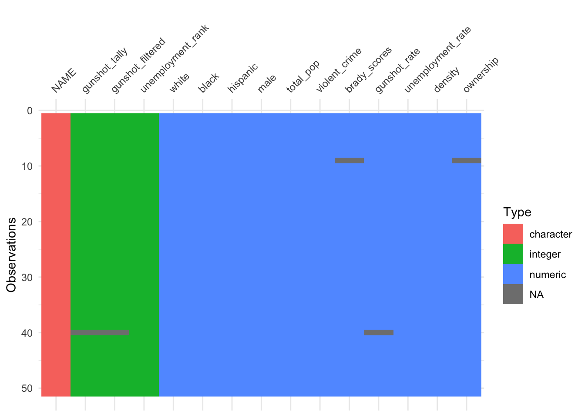

Here we see that the visualization of this relationship is largely dependent upon the state's population, with large states like Texas and California sticking out. However, we do see that, for its size, Washington D.C had many more violent cries than other states, despite its small population. 

It would also be helpful to understand the relationship between unemployment and violent crime:


```r
# violent crimes
ggplot(firearms, 
       aes(x = unemployment_rate,
           y = violent_crime)) + 
  geom_point() +
  labs(x = "Unemployment Rate",
       y = "Violent Crime") + 
  theme_classic()
```


Here, there appears to be some relationship with states that have higher rates of unemployment having slightly more violent crimes, but violent crimes is not adjusted by population, so this is likely not *that* helpful.

What about the relationship between fatal police shootings and gun `ownership`  as a percent of firearm suicides to all suicides.


```r
# violent crimes
ggplot(firearms, 
       aes(x = gunshot_rate,
           y = ownership)) + 
  geom_point() +
  labs(x = "Annualized Rate of Fatal \n Police Shootings per 1,000,000",
       y = "Gun Ownership \n (firearm suicides:all suicides)") + 
  theme_classic()
```

```
## Warning: Removed 2 rows containing missing values (geom_point).
```


This suggests that states with more fatal police shootings *tend* to have more firearm suicides relative to non-firearm suicides; however, this relationship is non linear. 

With these plots, we're starting to get an understanding of the data and see that there are patterns and don't appear to be wild outliers in any one variable (although, we should keep an eye on Washington, D.C. as it appeared as an outlier in a few plots). With that we're confident we can move on to start looking into our question of interest.

#### Q: Fatal Police Shootings and Legislation

Ultimately, we're interested in firearm legislation and fatal police shootings, so let's focus in on Brady scores here, which measure legislation and `gunshot_tally`, a measure of the rate of fatal police shootings.

We see that the average `brady_score` (`mean`) is 3.94, with state values ranging from -39 to 76.

When it comes to the rate of police shootings (`gunshot_rate`), we see the average number (`mean`) for a state is  is 1.74, with state values ranging from 0.28 to 5.12, depending on the state.

To start to understand the relationship between the two, we'll want to visualize this relationship using a scatterplot:


```r
# visualize legistlation and shootings
ggplot(firearms, aes(x = brady_scores, 
                     y = gunshot_rate)) + 
  geom_point() +
  labs(x = "Firearm Legislative Strength Score",
       y = "Annualized Rate of Fatal \n Police Shootings per 1,000,000") + 
  theme_classic()
```

```
## Warning: Removed 2 rows containing missing values (geom_point).
```


In this plot, we see that there is a relationship, but it is non-linear. Overall, the higher the legislative strength score (`brady_scores`), the lower the rate of police shootings; however, this decrease is nonlinear, as all states with a positive Brady Score have a similar police shooting rate. 

For now, we won't explore a model, but we will label the points to better contextualize the information displayed. To see which states are at either end of the distribution, using `geom_text()` is a good option:


```r
# label points with state name
ggplot(firearms, aes(x = brady_scores, 
                     y = gunshot_rate)) + 
  geom_point() +
  labs(x = "Firearm Legislative Strength Score",
       y = "Annualized Rate of Fatal \n Police Shootings per 1,000,000") + 
  theme_classic() +
  geom_text(aes(label = NAME), 
            nudge_x = 7)
```

```
## Warning: Removed 2 rows containing missing values (geom_point).
```

```
## Warning: Removed 2 rows containing missing values (geom_text).
```


This makes it clear that Wyoming, New Mexico, Oklahoma, Arizona, and Nevada have some of the highest rates of fatal police shootings, while  Connecticut, New York, Pennsylvania, and North Dakota are among the lowest. 

However, a number of labels overlap there, so it can be helpful to use `ggrepel` if you want to be able to match each point to its label:


```r
library(ggrepel)

# repel points with state name 
ggplot(firearms, aes(x = brady_scores, 
                     y = gunshot_rate)) + 
  geom_point() +
  labs(x = "Firearm Legislative Strength Score",
       y = "Annualized Rate of Fatal \n Police Shootings per 1,000,000") + 
  theme_classic() +
  geom_text_repel(aes(label = NAME))
```

```
## Warning: Removed 2 rows containing missing values (geom_point).
```

```
## Warning: Removed 2 rows containing missing values (geom_text_repel).
```


If we wanted to save this particular plot as a pdf, we could do so like this to save the plot in a directory called exploratory within a directory called figures:


```r
pdf(here::here("figures", "exploratory", "Fatal_police_shootings_and_firearm_legislative_strength.pdf"))

ggplot(firearms, aes(x = brady_scores, 
                     y = gunshot_rate)) + 
  geom_point() +
  labs(x = "Firearm Legislative Strength Score",
       y = "Annualized Rate of Fatal \n Police Shootings per 1,000,000") + 
  theme_classic() +
  geom_text_repel(aes(label = NAME))
```

```
## Warning: Removed 2 rows containing missing values (geom_point).
```

```
## Warning: Removed 2 rows containing missing values (geom_text_repel).
```

```r
dev.off()
```

```
## quartz_off_screen 
##                 2
```
