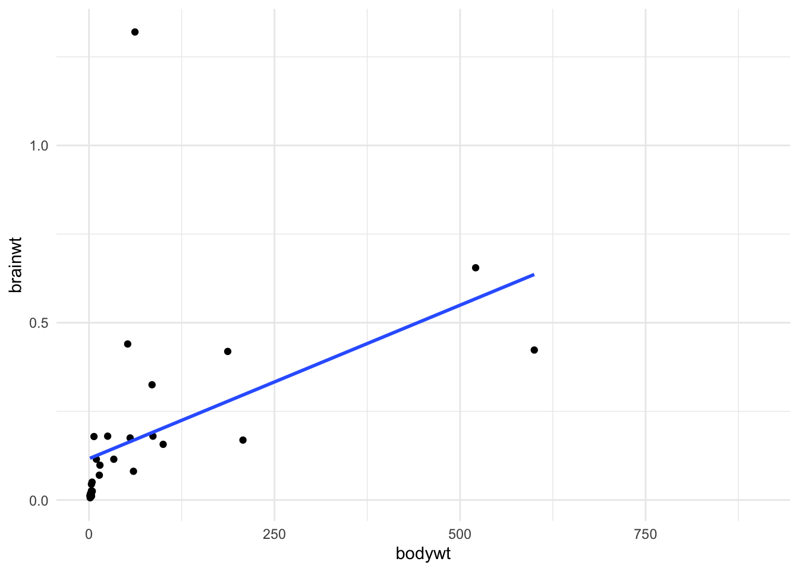
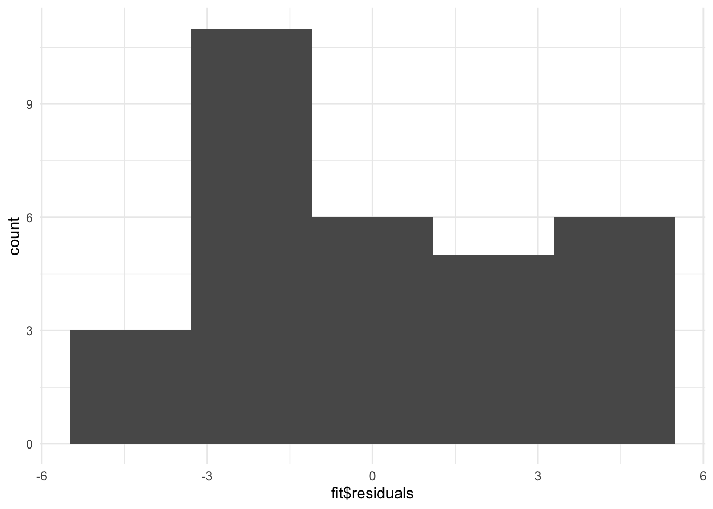
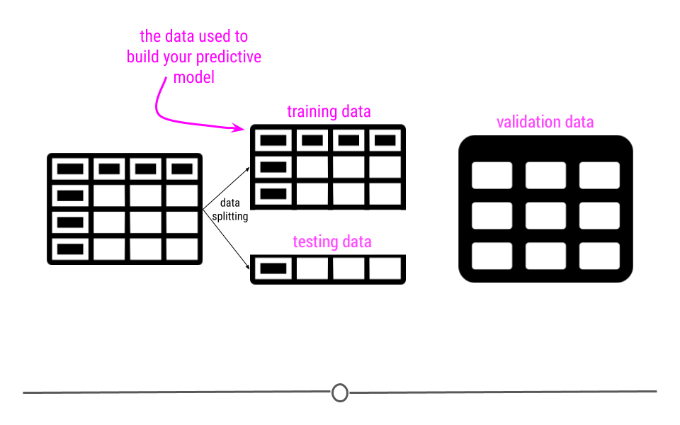

# Modeling Data in the Tidyverse {#model}


## About This Course

Developing insights about your organization, business, or research project depends on effective modeling and analysis of the data you collect. Building effective models requires understanding the different types of questions you can ask and how to map those questions to your data. Different modeling approaches can be chosen to detect interesting patterns in the data and identify hidden relationships. 

This course covers the types of questions you can ask of data and the various modeling approaches that you can apply. Topics covered include hypothesis testing, linear regression, nonlinear modeling, and machine learning. With this collection of tools at your disposal, as well as the techniques learned in the other courses in this specialization, you will be able to make key discoveries from your data for improving decision-making throughout your organization.

In this specialization we assume familiarity with the R programming language. If you are not yet familiar with R, we suggest you first complete [R Programming](https://www.coursera.org/learn/r-programming) before returning to complete this course.


## The Purpose of Data Science


Data science has multiple definitions. For this module we will use the definition:

Data science is the process of formulating a quantitative question that can be answered with data, collecting and cleaning the data, analyzing the data, and communicating the answer to the question to a relevant audience.

In general the data science process is iterative and the different components blend together a little bit. But for simplicity lets discretize the tasks into the following 7 steps:

1. Define the question you want to ask the data
2. Get the data
3. Clean the data
4. Explore the data
5. Fit statistical models
6. Communicate the results
7. Make your analysis reproducible

This module is focused on three of these steps: (1) defining the question you want to ask, (4) exploring the data and (5) fitting statistical models to the data.

We have seen previously how to extract data from the web and from databases and we have seen how to clean it up and tidy the data. You also know how to use plots and graphs to visualize your data. You can think of this module as using those tools to start to answer questions using the tools you have already learned about.

## Types of data science questions

We will look at a few different types of questions that you might want to answer from data. This flowchart gives some questions you can ask to figure out what type of question your analysis focuses on. Each type of question has different goals.

There are four classes of question that we will focus on:

1. <u>Descriptive</u>: The goal of descriptive data science questions is to understand the components of a data set, describe what they are, and explain that description to others who might want to understand the data. This is the simplest type of data analysis.

2. <u>Exploratory</u>: The goal of exploratory data science questions is to find unknown relationships between the different variables you have measured in your data set. Exploratory analysis is open ended and designed to find expected or unexpected relationships between different measurements. We have already seen how plotting the data can be very helpful to get a general understanding about how variables relate to one another.

3. <u>Inferential</u>: The goal of inferential data science questions is to is to use a small sample of data to say something about what would happen if we collected more data. Inferential questions come up because we want to understand the relationships between different variables but it is too expensive or difficult to collect data on every person or object.

4. <u>Predictive</u>: The goal of predictive data science question is to use data from a large collection to predict values for new individuals. This might be predicting what will happen in the future or predicting characteristics that are difficult to measure. Predictive data science is sometimes called machine learning.


One primary thing we need to be aware of is that just because two variables are correlated with each other, doesn't mean that changing one causes a change in the other.

[One way](http://www.tylervigen.com/spurious-correlations) that people illustrate this idea is to look at data where two variables show a relationship, but are clearly not related to each other. For example, in a specific time range, the number of people who drown while falling into a pool is related to the number of films that Nicholas Cage appears in. These two variables are clearly unrelated to each other, but the data seems to show a relationship. We'll discuss more later.


## Data needs

Let's assume you have the dataset that contains the variables you are looking for to evaluate the question(s) you are interested in, and it is tidy and ready to go for your analysis. It's always nice to step back to make sure the data is the right data before you spend hours and hours on your analysis. So, let's discuss some of the potential and common issues people run into with their data.

<u> Number of observations is too small</u>

It happens quite often that collecting data is expensive or not easy. For instance, in a medical study on the effect of a drug on patients with Alzheimer disease, researchers will be happy if they can get a sample of 100 people. These studies are expensive, and it's hard to find volunteers who enroll in the study. It is also the case with most social experiments. While data are everywhere, the data you need may not be. Therefore, most data scientists at some point in their career face the curse of small sample size. Small sample size makes it hard to be confident about the results of your analysis. So when you can, and it's feasible, a large sample is preferable to a small sample. But when your only available dataset to work with is small you will have to note that in your analysis. Although we won't learn them in this course, there are particular methods for inferential analysis when sample size is small.

<u> Dataset does not contain the exact variables you are looking for</u>

In data analysis, it is common that you don't always have what you need. You may need to know individuals' IQ, but all you have is their GPA. You may need to understand food expenditure, but you have total expenditure. You may need to know parental education, but all you have is the number of books the family owns. It is often that the variable that we need in the analysis does not exist in the dataset and we can't measure it. In these cases, our best bet is to find the closest variables to that variable. Variables that may be different in nature but are highly correlated with (similar to) the variable of interest are what are often used in such cases. These variables are called proxy variables.

For instance, if we don't have parental education in our dataset, we can use the number of books the family has in their home as a proxy. Although the two variables are different, they are highly correlated (very similar), since more educated parents tend to have more books at home. So in most cases where you can't have the variable you need in your analysis, you can replace it with a proxy. Again, it must always be noted clearly in your analysis why you used a proxy variable and what variable was used as your proxy.

<u>Variables in the dataset are not collected in the same year</u>

Imagine we want to find the relationship between the effect of cab prices and the number of rides in New York City. We want to see how people react to price changes. We get a hold of data on cab prices in 2018, but we only have data on the number of rides from 2015. Can these two variables be used together in our analysis? Simply, no. If we want to answer this question, we can't match these two sets of data. If we're using the prices from 2018, we should find the number of rides from 2018 as well. Unfortunately, a lot of the time, this is an issue you'll run into. You'll either have to find a way to get the data from the same year or go back to the drawing board and ask a different question. This issue can be ignored only in cases where we're confident the variables does not change much from year to year.

<u>Dataset is not representative of the population that you are interested in</u>

You will hear the term **representative sample**, but what is it? Before defining a representative sample, let's see what a population is in statistical terms. We have used the word population without really getting into its definition.

A sample is part of a ** population **. A population, in general, is every member of the whole group of people we are interested in. Sometimes it is possible to collect data for the entire population, like in the U.S. Census, but in most cases, we can't. So we collect data on only a subset of the population. For example, if we are studying the effect of sugar consumption on diabetes, we can't collect data on the entire population of the United States. Instead, we collect data on a sample of the population. Now, that we know what sample and population are, let's go back to the definition of a representative sample.

A representative sample is a sample that accurately reflects the larger population. For instance, if the population is every adult in the United States, the sample includes an appropriate share of men and women, racial groups, educational groups, age groups, geographical groups, and income groups. If the population is supposed to be every adult in the U.S., then you can't collect data on just people in California, or just young people, or only men. This is the idea of a representative sample. It has to model the broader population in all major respects.

We give you one example in politics. Most recent telephone poles in the United States have been bad at predicting election outcomes. Why? This is because by calling people's landlines you can't guarantee you will have a representative sample of the voting age population since younger people are not likely to have landlines. Therefore, most telephone polls are skewed toward older adults.

Random sampling is a necessary approach to having a representative sample. Random sampling in data collection means that you randomly choose your subjects and don't choose who gets to be in the sample and who doesn't. In random sampling, you select your subjects from the population at random like based on a coin toss. The following are examples of lousy sampling:

A research project on attitudes toward owning guns through a survey sent to subscribers of a gun-related magazine (gun magazine subscribers are not representative of the general population, and the sample is very biased)
A research project on television program choices by looking at Facebook TV interests (not everybody has a Facebook account)
A research study on school meals and educational outcomes done in a neighborhood with residents mainly from one racial group (school meal can have a different effect on different income and ethnic groups)
A researcher polls people as they walk by on the street.
A TV show host asks the program viewers to visit the network website and respond to a poll.
With this logic, most online surveys or surveys on social media has to be taken with a grain of salt because not members of all social groups have an online presentation or use social media.

The moral of the story is to always think about what your population is. Your population will change from one project to the next. If you are researching the effect of smoking on pregnant women, then your population is, well, pregnant women (and not men). After you know your population, then you will always want collect data from a sample that is representative of your population. Random sampling helps.

And lastly, if you have no choice but to work with a dataset that is not collected randomly and is biased, be careful not to generalize your results to the entire population. If you collect data on pregnant women of age 18-24, you can't generalize your results to older women. If you collect data from the political attitudes of residents of Washington, DC, you can't say anything about the whole nation.

<u>Some variables in the dataset are measured with error</u>

Another curse of a dataset is measurement error. In simple, measurement error refers to incorrect measurement of variables in your sample. Just like measuring things in the physical world comes with error (like measuring distance, exact temperature, BMI, etc.), measuring variables in the social context can come with an error. When you ask people how many books they have read in the past year, not everyone remembers it correctly. Similarly, you may have measurement error when you ask people about their income. A good researcher recognizes measurement error in the data before any analysis and takes it into account during their analysis.

<u>Variables are confounded</u>

What if you were interested in determining what variables lead to increases in crime? To do so, you obtain data from a US city with lots of different variables and crime rates for a particular time period. You would then wrangle the data and at first you look at the relationship between popsicle sales and crime rates. You see that the more popsicles that are sold, the higher the crime rate.


Your first thought may be that popsicles lead to crimes being committed. However, there is a confounder that's not being considered!

In short, confounders are other variables that may affect our outcome but are also correlated with (have a relationship with) our main variable of interest. In the popsicle example, temperature is an important confounder. More crimes happen when it's warm out and more popsicles are sold. It's not the popsicles at all driving the relationship. Instead temperature is likely the culprit.


This is why getting an understanding of what data you have and how the variables relate to one another is so vital before moving forward with inference or prediction. We have already described exploratory analysis to some extent using visualization methods. Now we will recap a bit and discuss descriptive analysis. 

## Descriptive and Exploratory Analysis

Descriptive and Exploratory analysis will first and foremost generate simple summaries about the samples and their measurements to describe the data you're working with and how the variables might relate to one another. There are a number of common descriptive statistics that we'll discuss in this lesson: measures of central tendency (eg: mean, median, mode) or measures of variability (eg: range, standard deviations or variance).


This type of analysis is aimed at summarizing your dataset. Unlike analysis approaches we'll discuss in later, descriptive and exploratory analysis is not for generalizing the results of the analysis to a larger population nor trying to draw any conclusions. Description of data is separated from interpreting the data. Here, we're just summarizing what we're working with.

Some examples of purely descriptive analysis can be seen in censuses. In a census, the government collects a series of measurements on all of the country's citizens. After collecting these data, they are summarized. From this descriptive analysis, we learn a lot about a country. For example, you can learn the age distribution of the population by looking at U.S. census data.


This can be further broken down (or stratified) by sex to describe the age distribution by sex. The goal of these analyses is to describe the population. No inferences are made about what this means nor are predictions made about how the data might trend in the future. The point of this (and every!) descriptive analysis is only to summarize the data collected.


Recall that the `glimpse()` function of the `dplyr` package can help you to see what data you are working with. 

```r
## load packages
library(tidyverse)
df <- msleep # this data comes from ggplot2
## get a glimpse of your data
glimpse(df)
```


Also becuase the data is in tibble format, we can gain alot of information by just viewing the data itself.


```r
df
```

Here we also get information about the dimensions of our data object and the name and class of our variables.


### Missing Values

In any analysis, missing data can cause a problem. Thus, it's best to get an understanding of missingness in your data right from the start. Missingness refers to observations that are not included for a variable. In R, NA is the preferred way to specify missing data, so if you're ever generating data, its best to include NA wherever you have a missing value.

However, individuals who are less familiar with R code missingness in a number of different ways in their data: -999, N/A, ., or a blank space. As such, it's best to check to see how missingness is coded in your dataset. A reminder: sometimes different variables within a single dataset will code missingness differently. This shouldn't happen, but it does, so always use caution when looking for missingness.

In this dataset, all missing values are coded as NA, and from the output of str(df) (or glimpse(df)), we see that at least a few variables have NA values. We'll want to quantify this missingness though to see which variables have missing data and how many observations within each variable have missing data.

To do this, we can write a function that will calculate missingness within each of our variables. To do this we'll combine a few functions. In the code here is.na() returns a logical (TRUE/FALSE) depending upon whether or not the value is missing (TRUE if it is missing). sum() then calculates the number of TRUE values there are within an observation. We wrap this into a function and then use sapply() to calculate the number of missing values in each variable. The second bit of code does the exact same thing but divides those numbers by the total number of observations (using nrow(df). For each variable, this returns the proportion of missingness:


```r
library(purrr)
## calculate how many NAs there are in each variable
df %>% 
        map(is.na) %>%
        map(sum)

## calculate the proportion of missingness 
## for each variable
df %>% 
        map(is.na) %>%
        map(sum)%>%
        map(~ . / nrow(df))%>%
        bind_cols()
```

There are also some useful visualization methods for evaluating missingness. You could manually do this with ggplot, but there are two packages called [naniar](https://github.com/njtierney/naniar) and visdat[https://github.com/ropensci/visdat](https://github.com/ropensci/visdat) written by [Nicholas Tierney](https://www.njtierney.com/about/) that are very helpful. The `visdat` package was used previously in one of our case studies.


```r
#install.packages("naniar")
library(naniar)

## visualize missingness
vis_miss(df)
```


Here, we see the variables listed along the top with percentages summarizing how many observations are missing data for that particular variable. Each row in the visualization is a different observation. Missing data are black. Non-missing values are in grey. Focusing again on brainwt, we can see the 27 missing values visually. We can also see that sleep_cycle has the most missingness, while many variables have no missing data.

### Shape

Determining the shape of your variable is essential before any further analysis is done. Statistical methods used for inference often require your data to be distributed in a certain manner before they can be applied to the data. Thus, being able to describe the shape of your variables is necessary during your descriptive analysis.

When talking about the shape of one's data, we're discussing how the values (observations) within the variable are distributed. Often, we first determine how spread out the numbers are from one another (do all the observations fall between 1 and 10? 1 and 1000? -1000 and 10?). This is known as the range of the values. The range is described by the minimum and maximum values taken by observations in the variable.

After establishing the range, we determine the shape or distribution of the data. More explicitly, the distribution of the data explains how the data are spread out over this range. Are most of the values all in the center of this range? Or, are they spread out evenly across the range? There are a number of distributions used commonly in data analysis to describe the values within a variable. We'll cover just a few, but keep in mind this is certainly not an exhaustive list.

#### Normal Distribution

The Normal distribution (also referred to as the Gaussian distribution) is a very common distribution and is often described as a bell-shaped curve. In this distribution, the values are symmetric around the central value with a high density of the values falling right around the central value. The left hand of the curve mirrors the right hand of the curve.


A variable can be described as normally distributed if:

There is a strong tendency for data to take a central value - many of the observations are centered around the middle of the range
deviations away from the central value are equally likely in both directions
the frequency of these deviations away form the central value occurs at the same rate on either side of the central value.
Taking a look at the sleep_total variable within our example dataset, we see that the data are somewhat normal; however, they aren't entirely symmetric.


```r
ggplot(df, aes(sleep_total)) +
  geom_density()
```


A variable that is distributed more normally can be seen in the iris dataset, when looking at the `Sepal.Width` variable.


```r
iris %>% 
  ggplot() +
  geom_density(aes(x=Sepal.Width))
```


**Skewed Distribution**

Alternatively, sometimes data follow a skewed distribution. In a skewed distribution, most of the values fall to one end of the range, leaving a tail off to the other side. When the tail is off to the left, the distribution is said to be skewed left. When off to the right, the distribution is said to be skewed right.
 


To see an example from the msleep dataset, we'll look at the variable sleep_rem. Here we see that the data are skewed right, given the shift in values away from the right, leading to a long right tail. Here, most of the values are at the lower end of the range.


```r
ggplot(df, aes(sleep_rem)) +
  geom_density()
```

```
## Warning: Removed 22 rows containing non-finite values (stat_density).
```


**Uniform Distribution**

Finally, in distributions we'll discuss today, sometimes values for a variable are equally likely to be found along any portion of the distribution. The curve for this distribution looks more like a rectangle, since the likelihood of an observation taking a value is constant across the range of possible values.

**Outliers**

Now that we've discussed distributions, it's important to discuss outliers in more depth. An outlier is an observation that falls far away from the rest of the observations in the distribution. If you were to look at a density curve, you could visually identify outliers as observations that fall far from the rest of the observations.


For example, imagine you had a sample where all of the individuals in your sample are between the ages of 18 and 65, but then you have one sample that is 1 year old and another that is 95 years old.


If we were to plot the age data on a density plot, it would look something like this:


It can sometimes be difficult to decide whether or not a sample should be removed from the dataset. In the simplest terms, no observation should be removed from your dataset unless there is a valid reason to do so. For a more extreme example, what if that dataset we just discussed (with all the samples having ages between 18 and 65) had one sample with the age 600? Well, if these are human data, we clearly know that is a data entry error. Maybe it was supposed to be 60 years old, but we may not know for sure. If we can follow up with that individual and double-check, it's best to do that, correct the error, make a note of it, and continue you with the analysis. However, that's often not possible. In the cases of obvious data entry errors, it's likely that you'll have to remove that observation from the dataset. It's valid to do so in this case since you know that an error occurred and that the observation was not accurate.

Outliers do not only occur due to data entry errors. Maybe you were taking weights of your observations over the course of a few weeks. On one of these days, your scale was improperly calibrated, leading to incorrect measurements. In such a case, you would have to remove these incorrect observations before analysis.

Outliers can occur for a variety of reasons. Outliers can occur due human error during data entry, technical issues with tools used for measurement, as a result of weather changes that affect measurement accuracy, or due to poor sampling procedures. It's **always** important to look at the distribution of your observations for a variable to see if anything is falling far away from the rest of the observations. If there are, it's then important to think about why this occurred and determine whether or not you have a valid reason to remove the observations from the data.

An important note is that observations should never be removed just to make your results look better. Wanting better results is not a valid reason for removing observations from your dataset.

### Identifying Outliers

To identify outliers visually, density plots and boxplots can be very helpful.

For example, if we returned to the iris dataset and looked at the distribution of `Petal.Length`, we would see a bimodal distribution (yet another distribution!). Bimodal distributions can be identified by density plots that have two distinct humps. In these distributions, there are two different modes -- this is where the term "bimodal" comes from. In this plot, the curve suggests there are a number of flowers with petal length less than 2 and many with petal length around 5.


```r
## density plot
library(ggplot2)
iris %>%
  ggplot(aes(Petal.Length)) +
  geom_density()
```


Since the two humps in the plot are about the same height, this shows that it's not just one or two flowers with much smaller petal lengths, but rather that there are many. Thus, these observations aren't likely an outlier.

To investigate this further, we'll look at petal length broken down by flower species:


```r
## box plot
iris %>%
  ggplot(aes(Species, Petal.Length)) +
  geom_boxplot()
```


In this boxplot, we see in fact that setosa have a shorter petal length while virginica have the longest. Had we simply removed all the shorter petal length flowers from our dataset, we would have lost information about an entire species!

Boxplots are also helpful because they plot "outlier" samples as points outside the box. By default, boxplots define "outliers" as observations as those that are 1.5 x IQR (interquartile range). The IQR is the distance between the first and third quartiles. This is a mathematical way to determine if a sample may be an outlier. It is visually helpful, but then it's up to the analyst to determine if an observation should be removed. While the boxplot identifies outliers in the setosa and versicolor species, these values are all within a reasonable distance of the rest of the values, and unless I could determine why this occurred, I would not remove these observations from the dataset.


### Evaluating Variables

**Central Tendency**

Once you know how large your dataset is, what variables you have information on, how much missing data you've got for each variable, and the shape of your data, you're ready to start understanding the information within the values of each variable.

Some of the simplest and most informative measures you can calculate on a numeric variable are those of central tendency. The two most commonly used measures of central tendency are: mean and median. These measures provide information about the typical or central value in the variable.

**mean**

The mean (often referred to as the average) is equal to the sum of all the observations in the variable divided by the total number of observations in the variable. The mean takes all the values in your variable and calculates the most common value.

**median**

The median is the middle observation for a variable after the observations in that variable have been arranged in order of magnitude (from smallest to largest). The median is the middle value.

**Variability**

In addition to measures of central tendency, measures of variability are key in describing the values within a variable. Two common and helpful measures of variability are: standard deviation and variance. Both of these are measures of how spread out the values in a variable are.

**Variance**

The variance tells you how spread out the values are. If all the values within your variable are exactly the same, that variable's variance will be zero. The larger your variance, the more spread out your values are. Take the following vector and calculate its variance in R using the var() function:


```r
## variance of a vector where all values are the same
a <- c(29, 29, 29, 29)
var(a)
```

```
## [1] 0
```

```r
## variance of a vector with one very different value
b <-  c(29, 29, 29, 29, 723678)
var(b)
```

```
## [1] 104733575040
```

The only difference between the two vectors is that the second one has one value that is much larger than "29". The variance for this vector is thus much higher.

**Standard Deviation**

By definition, the standard deviation is the square root of the variance, thus if we were to calculate the standard deviation in R using the sd() function, we'd see that the sd() function is equal to the square root of the variance:


```r
## calculate standard deviation
sd(b)
```

```
## [1] 323625.7
```

```r
## this is the same as the square root of the variance
sqrt(var(b))
```

```
## [1] 323625.7
```

For both measures of variance, the minimum value is 0. The larger the number, the more spread out the values in the valuable are.

#### Summarizing Your Data

Often, you'll want to include tables in your reports summarizing your dataset. These will include the number of observations in your dataset and maybe the mean/median and standard deviation of a few variables. These could be organized into a table using what you learned in the data visualization course about generating tables.

##### skimr

Alternatively, there is a helpful package that will summarize all the variables within your dataset. The skimr package provides a tidy output with information about your dataset.

To use `skimr`, you'll have to install and load the package before using the helpful function `skim()` to get a snapshot of your dataset.


```r
#install.packages("skimr")
library(skimr)
skim(df)
```


Using this function we can quickly get an idea about missingness, varaibility, central tendency, and shape, and outliers all at once. 

The output from `skim()` separately summarizes categorical and continuous variables. For continuous variables you get information about the mean and median (`p50`) column. You know what the range of the variable is (`p0` is the minimum value, `p100` is the maximum value for continuous variables). You also get a measure of variability with the standard deviation (`sd`). It even quantifies the number of missing values (missing) and shows you the distribution or shape of each variable (`hist`)! Potential outliers can also be identified from the hist column and the p100 and p0 columns. This function can be incredibly useful to get a quick snapshot of what's going on with your dataset.

If we take a look closer at the `bodywt` and `brianwt` variables, we can see that there may be outliers. The maximum value of the `bodywt` variable looks very different from the `mean` value. 


```r
dplyr::filter(df, bodywt == 6654)
```

```
## # A tibble: 1 x 11
##   name  genus vore  order conservation sleep_total sleep_rem sleep_cycle awake
##   <chr> <chr> <chr> <chr> <chr>              <dbl>     <dbl>       <dbl> <dbl>
## 1 Afri… Loxo… herbi Prob… vu                   3.3        NA          NA  20.7
## # … with 2 more variables: brainwt <dbl>, bodywt <dbl>
```
Ah! looks like it is an elephant, that makes sense.

Taking a deeper look at the histogram we can see that there are two values that are especially different.

```r
hist(pull(df, bodywt))
```


```r
dplyr::filter(df, bodywt > 2000)
```

```
## # A tibble: 2 x 11
##   name  genus vore  order conservation sleep_total sleep_rem sleep_cycle awake
##   <chr> <chr> <chr> <chr> <chr>              <dbl>     <dbl>       <dbl> <dbl>
## 1 Asia… Elep… herbi Prob… en                   3.9        NA          NA  20.1
## 2 Afri… Loxo… herbi Prob… vu                   3.3        NA          NA  20.7
## # … with 2 more variables: brainwt <dbl>, bodywt <dbl>
```

Looks like both data points are for elephants.


Therefore, we might consider perfroming an anlysis both with and without the elephant data, to see if it influences the overall result.


### Evaluating Relationships

Another important aspect of exploratory analysis is looking at relationships between variables.

Again visualizations can be very helpful. 

We might want to look at the relationships between all of our continuous variables. A good way to do this is to use a visualization of **correlation**. As a reminder, correlation is a measure of the relationship or interdependence of two variables.  In otherwords, how much do the values of one variable change with the values of another. Correlation can be either positive or negative and it ranges from -1 to 1, with 1 and -1 indicating perfect correlation (1 being positive and -1 being negative) and 0 indicating no correlation. We will describe this in greater detail when we look at associations.

Here are some very useful plots that can be generated using the `GGally` package and the `PerformanceAnalytics` package to examine if variables are correlated.


```r
library(PerformanceAnalytics)
df %>%
dplyr::select_if(is.numeric) %>%
  chart.Correlation()
```


```r
library(GGally)
```

```
## Registered S3 method overwritten by 'GGally':
##   method from   
##   +.gg   ggplot2
```

```r
df %>%
dplyr::select_if(is.numeric) %>%
    ggcorr(label = TRUE)
```


```r
library(GGally)
df %>%
dplyr::select_if(is.numeric) %>%
    ggpairs()
```


 
We can see from these plots that the `awake` variable and the `sleep_total` variable are perfectly correlated. This becomes important for choosing what to include in models when we try to perform prediction or inference analyses.

We may be especially interested in how brain weight (`brain_wt`) relates to body weight (`body_wt`). We might assume that these to variables might be related to one another. 
 
Here is a plot of the these two variables including the elephant data:

```r
library(ggplot2)
ggplot(df, aes(x = bodywt, y = brainwt)) +
  geom_point()
```



Clearly, including the elephant data points makes it hard to look at the other data points, it is possible that these points are driving the positive correlation that we get when we use all the data. Here is a plot of the relationship between these to variables excluding the elephant data and the very low body weight organisms:


```r
library(ggplot2)

df %>%
  filter(bodywt<2000 & bodywt >1) %>%
  ggplot(aes(x = bodywt, y = brainwt)) +
  geom_point()+
  geom_smooth(method = "lm", se = FALSE)
```

```
## `geom_smooth()` using formula 'y ~ x'
```


```r
cor.test(pull(df %>% filter(bodywt<2000 & bodywt >1),bodywt),
         pull(df %>%filter(bodywt<2000 & bodywt >1),brainwt))
```

```
## 
## 	Pearson's product-moment correlation
## 
## data:  pull(df %>% filter(bodywt < 2000 & bodywt > 1), bodywt) and pull(df %>% filter(bodywt < 2000 & bodywt > 1), brainwt)
## t = 2.7461, df = 28, p-value = 0.01042
## alternative hypothesis: true correlation is not equal to 0
## 95 percent confidence interval:
##  0.1203262 0.7040582
## sample estimates:
##       cor 
## 0.4606273
```
We can see from this plot that in general `brainwt` is correlated with `bodywt`. Or in otherwords, `brainwt` tends to increase with `bodywt`.

But it also looks like we have an outlier for our brainwt variable! There is a very high `brainwt` value that is greater than 1.

We can also see it in our histogram of this variable:


```r
hist(pull(df, brainwt))
```


Let's see which organism this is:


```r
df %>%
  filter(brainwt >=1)
```

```
## # A tibble: 3 x 11
##   name  genus vore  order conservation sleep_total sleep_rem sleep_cycle awake
##   <chr> <chr> <chr> <chr> <chr>              <dbl>     <dbl>       <dbl> <dbl>
## 1 Asia… Elep… herbi Prob… en                   3.9      NA          NA    20.1
## 2 Human Homo  omni  Prim… <NA>                 8         1.9         1.5  16  
## 3 Afri… Loxo… herbi Prob… vu                   3.3      NA          NA    20.7
## # … with 2 more variables: brainwt <dbl>, bodywt <dbl>
```
It is humans! Let's see what the plot looks like without humans:


```r
library(ggplot2)
df %>%
  filter(bodywt<2000 & bodywt >1 & brainwt<1) %>%
  ggplot(aes(x = bodywt, y = brainwt)) +
  geom_point()+
  geom_smooth(method = "lm", se = FALSE)
```

```
## `geom_smooth()` using formula 'y ~ x'
```


```r
cor.test(pull(df %>% filter(bodywt<2000 & bodywt >1 & brainwt<1),bodywt),
         pull(df %>%filter(bodywt<2000 & bodywt >1 & brainwt<1),brainwt))
```

```
## 
## 	Pearson's product-moment correlation
## 
## data:  pull(df %>% filter(bodywt < 2000 & bodywt > 1 & brainwt < 1), bodywt) and pull(df %>% filter(bodywt < 2000 & bodywt > 1 & brainwt < 1), brainwt)
## t = 6.6127, df = 27, p-value = 4.283e-07
## alternative hypothesis: true correlation is not equal to 0
## 95 percent confidence interval:
##  0.5897381 0.8949042
## sample estimates:
##       cor 
## 0.7862926
```

We can see from these plots that the `brainwt` variable seems have a relationship (correlation value = 0.79)  with `bodywt` and it increases with the `bodywt` variable, however this relationship is less strong when humans are included (correlation value = 0.46). This information would be important to keep in mind when trying to model this data to make inference or predictions about the animals included.


## Inference

Inferential Analysis is what analysts carry out after they've described and explored their data set. After understanding your dataset better, analysts often try to infer something from the data. 
This is done using **statistical tests**.

We discussed a bit about how we can use models to perform inferance and prediction analyses. What does this mean?

The goal of inferential analyses is to use a relatively **small** sample of data to **infer** or say something about the **population at large**. This is required because often we want to answer questions about a population. Let's take a dummy example here where we have a population of 14 shapes. Here, in this graphic, the shapes represent individuals in the population and the colors of the shapes can be either pink or grey:


In this example we only have fourteen shapes in the population; however, in inferential data analysis, it's not usually possible to sample *everyone* in the population. Consider if this population were everyone in the United States or every college student in the world. As getting information from every individual would be infeasible. Data are instead collected on a subset, or a **sample** of the individuals in the larger population.


In our example, we've been showing you how many pink and how many gray shapes are in the larger population. However, in real life, we don't know what the answer is in the larger population. That's why we collected the sample!


This is where **inference** comes into play. We analyze the data collected in our sample and then do our best to infer what the answer is in the larger population. In other words, inferential data analysis uses data from a sample to make its best guess as to what the answer would be in the population if we were able to measure every individual.


### Uncertainty

Because we haven't directly measured the population but have only been able to take measurements on a sample of the data, when making our inference we can't be exactly sure that our inference about the population is exact. For example, in our sample one-third of the shapes are grey. We'd expect about one-third of the shapes in our population to be grey then too! Well, one-third of 14 (the number of shapes in our population) is 4.667. Does this mean four shapes are truly gray?


Or maybe five shapes in the population are grey?


Given the sample we've taken, we can guess that 4-5 shapes in our population will be grey, but we aren't certain exactly what that number is. In statistics, this "best guess" is known as an **estimate**. This means that we estimate that 4.667 shapes will be gray. But, there is uncertainty in that number. Because we're taking our best guess at figuring out what that estimate should be, there's also a measure of uncertainty in that estimate. Inferential data analysis includes **generating the estimate and the measure of uncertainty around that estimate**.

Let's return back to the example where we *know* the truth in the population. Hey look! There were actually only three grey shapes after all. It is totally possible that if you put all those shapes into a bag and pulled three out that two would be pink and one would be grey. As statisticians, we'd say that getting this sample was **probable** (it's within the realm of possibility), but it's not the most likely (The most likely was either 4 or 5.) This really drives home why it's important to add uncertainty to your estimate whenever you're doing inferential analysis!


### Random Sampling
Since you are moving from a *small* amount of data and trying to generalize to a *larger* population, your ability to accurately infer information about the larger population depends heavily on how the data were sampled. 

The data in your sample *must* be representative of your larger population to be used for inferential data analysis. Let's discuss what this means.

Using the same example, what if, in your larger population, you didn't just have grey and pink shapes, but you also had blue shapes?


Well, if your sample only has pink and grey shapes, when you go to make an inference, there's no way you'd infer that there should be blue shapes in your population since you didn't capture any in your sample.

In this case, your sample is *not* representative of your larger population. In cases where you do not have a representative sample, you can not carry out inference, since you will not be able to correctly infer information about the larger population.


This means that you have to design your analysis so that you're collecting representative data and that you have to check your data after data collection to make sure that you were successful.

You may at this point be thinking to yourself. "Wait a second. I thought I didn't know what the truth was in the population. How can I make sure it's representative?" Good point! With regards to the measurement you're making (color distribution of the shapes, in this example), you don't know the truth. But, you should know other information about the population. What is the age distribution of your population? Your sample should have a similar age distribution. What proportion of your population is female? If it's half, then your sample should be comprised of half females. Your data collection procedure should be set up to ensure that the sample you collect is representative (very similar to) your larger population. Then, once the data are collected, your descriptive analysis should check to ensure that the data you've collected are in fact representative of your larger population. By randomly sampling your larger population, then ensures that the inference you make about the measurement of interest (color distribution of the shapes) will be most accurate.

To reiterate: If the data you collect is not from a representative sample of the population, the generalizations you infer won't be accurate for the population.

#### An example of inferential data analysis

Unlike in our previous examples, Census data wouldn't be used for inferential analysis. By definition, a census already collects information on (functionally) the entire population. Thus, there is no population on which to infer. Census data are the rare exception where a whole population is included in the dataset. Further, using data from the US census to infer information about another country would not be a good idea because the US isn't necessarily representative of the other country.

Instead, a better example of a dataset on which to carry out inferential analysis would be the data used in the study: [The Effect of Air Pollution Control on Life Expectancy in the the United States: An Analysis of 545 US counties for the period 2000 to 2007](https://www.ncbi.nlm.nih.gov/pmc/articles/PMC3521092/). In this study, researchers set out to understand the effect of air pollution on everyone in the United States


To answer this question, a subset of the US population was studied, and the researchers looked at the level of air pollution experienced and life expectancy. It would have been nearly impossible to study every individual in the United States year after year. Instead, this study used the data they collected from a sample of the US population to infer how air pollution might be impacting life expectancy in the entire US!


## Linear modeling


### Linear Regression
Inferential analysis is commonly the goal of statistical modeling, where you have a small amount of information to extrapolate and generalize that information to a larger group. One of the most common approaches used in statistical modeling is known as linear regression. Here, we'll discuss when using **linear regression** is appropriate, how to carry out the analysis in R, and how to interpret the results from this statistical approach.

When discussing linear regression, we're trying to describe (model) the relationship between a **dependent variable** and an **independent variable**.


When visualizing a linear relationship, the independent variable is plotted along the bottom of the graph, on the **x-axis** and the dependent variable is plotted along the side of the plot, on the **y-axis**.


When carrying out linear regression, a **best-fitting line** is drawn through the data points to describe the relationship between the variables.


A best-fitting line, technically-speaking, minimizes the sum of the squared errors. In simpler terms, this means that the line that minimizes the distance of all the points from the line is the best-fitting line. Or, most simply, there are the same number of points above the line as there are below the line. In total, the distance from the line for the points above the line will be the same as the distance from the points to the line below the line.

Note that the best fitting line does *not* have to go through any points to be the best-fitting line. Here, on the right, we see a line that goes through seven points on the plot (rather than the four the best-fitting line goes through, on the left). However, this is not a best-fitting line, as there are way more points above the line than there are below the line.


This line describes the relationship between the two variables. If you look at the direction of the line, it will tell you whether there is a positive or a negative relationship between the variables. In this case, the larger the value of the independent variable, the larger the value of the dependent variable. Similarly, the smaller the value of the independent variable, the smaller the value of the dependent variable. When this is the case, there is a **positive relationship** between the two variables.


An example of variables that have a positive relationship would be the height of fathers and their sons. In general, the taller a father is, the taller his son will be. And, the shorter a father is the more likely his son is to be short.


Alternatively, when the higher the value of the independent variable, the lower the value of the dependent variable, this is a negative relationship.


An example of variables that have a negative relationship would be the relationship between a students' absences and their grades. The more absences a student has, the lower their grades tend to be.


Linear regression, in addition to to describing the direction of the relationship, it can also be used to determine the **strength** of that relationship.

This is because the assumption with linear regression is that the true relationship is being described by the best-fitting line. Any points that fall away from the line do so due to random error. This means that if all the points fall directly on top of the line, there is no error. The further the points fall from the line, the greater the error. When points are further from the best-fitting line, the relationship between the two variables is weaker than when the points fall closer to the line.


In this example, the pink line is exactly the same best-fitting line in each graph. However, on the left, where the points fall further from the line, the strength of the relationship between these two variables is weaker than on the right, where the points fall closer to the line, where the relationship is stronger. The strength of this relationship is measured using **correlation**. The closer the points are to the line the more **correlated** the two variables are, meaning the relationship between the two variables is stronger.

### Assumptions

Thus far we have focused on drawing linear regression lines. Linear regression lines *can* be drawn on any plot, but just because you can do something doesn't mean you actually *should*. When it comes to linear regression, in order to carry our any inference on the relationship between two variables, there are a few assumptions that must hold before inference from linear regression can be done.

The two assumptions of simple linear regression are **linearity** and **homoscedasticity**.

#### Linearity

The relationship between the two variables must be linear.

For example, what if we were plotting data from a single day and we were looking at the relationship between temperature and time. Well, we know that generally temperature increases throughout the day and then decreases in the evening. Here, we see some example data reflective of this relationship. The upside-down u-shape of the data suggests that the relationship is not in fact linear. While we *could* draw a straight line through these data, it would be inappropriate. In cases where the relationship between the variables cannot be well-modeled with a straight line, linear regression should not be used.


#### Homoscedasticity

In addition to displaying a linear relationship, the random variables must demonstrate **homoscedasticity**. In other words, the variance (distance from the line) must be constant throughout the variable.

If points at one end are much closer to the best-fitting line than points are at the other end, homoscedasticity has been violated and linear regression is not appropriate for the data.


#### Normality of residuals

When we fit a linear regression, typically the data do not fall *perfectly* along the regression line. Rather, there is some distance from each point to the line. Some points are quite close to the line, while others are further away. Each point's distance to the regression line can be calculated. This distance is the **residual** measurement.


In linear regression, one assumption is that these residuals follow a Normal distribution. This means that if you were to calculate each residual (each point's distance to the regression line) and then plot a histogram of all of those values - that plot should look like a Normal Distribution.


If you do not see normality of residuals, this can suggest that outlier values - observations more extreme than the rest of the data - may exist in your data. This can severely affect you regression results and lead you to conclude something that is untrue about your data.

Thus, it is your job, when running linear regression to check for:

- Non-linearity
- Heteroscedasticity
- Outlier values
- Normality of residuals

We'll discuss how to use diagnostic plots below to check that these assumptions have been met and that outlier values are not severely affecting your results.

**What can linear regression infer?**

Now that we understand what linear regression is and what assumptions must hold for its use, when would you actually use it? Linear regression can be used to answer many different questions about your data. Here we'll discuss specifically how to make inferences about the relationship between two numeric variables.

### Association

Often when people are carrying out linear regression, they are looking to better understand the relationship between two variables. When looking at this relationship, analysts are specifically asking "What is the **association** between these two variables?" Association between variables describes the trend in the relationship (positive, neutral, or negative) *and* the strength of that relationship (how correlated the two variables are).

After determining that the assumptions of linear regression are met, in order to determine the association between two variables, one would carry out a linear regression. From the linear regression, one would then interpret the **Beta estimate** and the **standard error** from the model.

#### Beta estimate

The beta estimate determines the direction and strength of the relationship between the two variables.

A beta of zero suggests there is no association between the two variables. However, if the beta value is positive, the relationship is positive. If the value is negative, the relationship is negative. Further, the larger the number, the bigger the effect is. We'll discuss effect size and how to interpret the value in more detail later in this lesson.


#### Standard error 

The standard error determines how uncertain the beta estimate is. The larger the standard error, the *more* uncertain we are in the estimate. The smaller the standard error, the less uncertain we are in the estimate.

Standard errors are calculated based on how well the best-fitting line models the data. The closer the points are to the line, the lower the standard error will be, reflecting our decreased uncertainty. However, as the points are further from the regression line, our uncertainty in the estimate will increase, and the standard error will be larger.


A reminder that when carrying out inferential data analysis, you will **always** want to report an estimate and a measure of uncertainty. For linear regression, this will be the **beta estimate** and the **standard error**.

You may have heard talk of **p-values** at some point. People tend to use p-values to describe the strength of their association due to its simplicity. The p-value is a single number that takes into account both the estimate (beta estimate) and the uncertainty in that estimate (SE). The lower a p-value the more significant the association is between two variables. However, while it is a simple value, it doesn't tell you nearly as much information as reporting the estimates and standard errors directly. Thus, if you're reporting p-values, it's best to also include the estimate and standard errors as well.

That said, the general interpretation of a p-value is "the probability of getting the observed results (or results more extreme) by chance alone." Since it's a probability, the value will always be between 0 and 1. Then, for example, a p-value of 0.05, means that 5 percent of the time (or 1 in 20), you'd observe results this extreme simply by chance.


### Association Testing in R
Now that we've discussed what you can learn from an association test, let's look at an example in R. For this example we'll use the `trees` dataset available in R, which includes `girth`, `height`, and `volume` measurements for 31 black cherry trees.

With this dataset, we'll answer the question:

    Can we infer the height of a tree given its girth?

Presumably, it's easier to measure a trees `girth` (width around) than it is to measure its `height`. Thus, here we want to know whether or not `height` and `girth` are associated.

In this case, since we're asking if we can infer `height` from `girth`, `girth` is the independent variable and height is the dependent variable. In other words, we're asking does `height` depend on `girth`?

First, before carrying out the linear regression to test for association and answer this question, we have to be sure linear regression is appropriate. We'll test for linearity and homoscedasticity.

To do so, we'll first use `ggplot2` to generate a scatterplot of the variables of interest.


```r
library(ggplot2)

trees %>%
  ggplot() + 
  geom_point(aes(Height, Girth))
```


From the looks of this plot, the relationship looks approximately linear, but to visually make this a little easier, we'll add a line of best first to the plot.


```r
trees %>%
  ggplot(aes(Height, Girth)) + 
  geom_point() + 
  geom_smooth(method = "lm", se = FALSE)
```

```
## `geom_smooth()` using formula 'y ~ x'
```


On this graph, the relationship looks approximately linear and the variance (distance from points to the line) is constant across the data. Given this, it's appropriate to use linear regression for these data.

### Fitting the model

Now that that's established, we can run the linear regression. To do so, we'll use the `lm()` function to **fit the model**. The syntax for this function is `lm(dependent_variable ~ independent_variable, data = dataset)`.


```r
## run the regression
fit <- lm(Girth ~ Height , data = trees)
```

### Model Diagnostics

Above, we discussed a number of assumptions of linear regression. After fitting a model, it's necessary to check the model to see if the model satisfies the assumptions of linear regression. If the model does not fit the data well (for example, the relationship is nonlinear), then you cannot use and interpret the model.

In order to assess your model, a number of diagnostic plots can be very helpful. Diagnostic plots can be generated using the `plot()` function with the fitted model as an argument.


```r
par(mfrow = c(2, 2))
plot(fit)
```



This generates four plots:
1) **Residuals vs Fitted** - checks linear relationship assumption of linear regression. A linear relationship will demonstrate a horizontal red line here. Deviations from a horizontal line suggest nonlinearity and that a different approach may be necessary.

2) **Normal Q-Q** - checks whether or not the residuals (the difference between the observed and predicted values) from the model are normally distributed. The best fit models points fall along the dashed line on the plot. Deviation from this line suggests that a different analytical approach may be required.

3) **Scale-Location** - checks the homoscedasticity of the model. A horizontal red line with points equally spread out indicates a well-fit model. A non-horizontal line or points that cluster together suggests that your data are not homoscedastic.

4) **Residuals vs Leverage** - helps to identify outlier or extreme values that may disproportionately affect the model's results. Their inclusion or exclusion from the analysis may affect the results of the analysis. Note that the top three most extreme values are identified with numbers next to the points in all four plots.

### Tree girth and height example

In our example looking at the relationship between tree girth and height, we can first check **linearity** of the data by looking at the **Residuals vs Fitted** plot. Here, we do see a red line that is approximately horizontal, which is what we're looking for. Additionally, we're looking to be sure there is no clear pattern in the points on the plot - we want them to be random on this plot. Clustering of a bunch of points together or trends in this plot would indicate that the data do not have a linear relationship.

To check for **homogeneity of the variance**, we can turn to the **Scale-Location** plot. Here, we're again looking for a horizontal red line. In this dataset, there's a suggestion that there is some heteroscedasticity, with points not being equally far from the regression line across the observations.

While not discussed explicitly here in this lesson, we will note that when the data are nonlinear or the variances are not homogeneous (are not homoscedastic), **transformations** of the data can often be applied and then linear regression can be used.

**QQ Plots** are very helpful in assessing the **normality of residuals**. Normally distributed residuals will fall along the grey dotted line. Deviation from the line suggests the residuals are not normally distributed.Here, in this example, we do not see the points fall perfectly along the dotted line, suggesting that our residuals are not normally distributed.

A **histogram** (or densityplot) of the residuals can also be used for this portion of regression diagnostics. Here, we're looking for a **Normal distribution** of the residuals.


```r
library(ggplot2)
ggplot(fit, aes(fit$residuals)) + 
  geom_histogram(bins = 5)
```


The QQ Plot and the histogram of the residuals will always give the same answer. Here, we see that with our limited sample size, we do not have perfectly Normally distributed residuals; however, the points do not fall wildly far from the dotted line.

Finally, whether or not **outliers** (extreme observations) are driving our results can be assessed by looking at the **Residuals vs Leverage** plot.

Generally speaking, standardized residuals greater than 3 or less than -3 are to be considered as outliers. Here, we do not see any values in that range (by looking at the y-axis), suggesting that there are no extreme outliers driving the results of our analysis.

### Interpreting the model

While the relationship in our example appears to be linear, does not indicate being driven by outliers, is approximately homoscedastic and has residuals that are not perfectly Normally distributed, but fall close to the line in the QQ plot, we can discuss how to interpret the results of the model.


```r
## take a look at the output
summary(fit)
```

The `summary()` function summarizes the model as well as the output of the model. We can see the values we're interested in in this summary, including the beta estimate, the standard error (SE), and the p-value.

Specifically, from the beta estimate, which is positive, we confirm that the relationship is positive (which we could also tell from the scatterplot). We can also interpret this beta estimate explicitly.


The **beta estimate** (also known as the beta coefficient or coefficient in the Estimate column) is the amount **the dependent variable will change given a one unit increase in the independent variable**. In the case of the trees, a beta estimate of 0.256, says that for every inch a tree's girth increases, its height will increase by 0.256 inches. Thus, we not only know that there's a positive relationship between the two variables, but we know by precisely how much one variable will change given a single unit increase in the other variable. Note that we're looking at the second row in the output here, where the row label is "Height". This row quantifies the relationship between our two variables. The first row quantifies the intercept, or where the line crosses the y-axis.

The standard error and p-value are also included in this output. Error is typically something we want to minimize (in life and statistical analyses), so the *smaller* the error, the *more confident* we are in the association between these two variables.

The beta estimate and the standard error are then both considered in the calculation of the p-value (found in the column `Pr[>|t|]`). The smaller this value is, the more confident we are that this relationship is not due to random chance alone.

### Variance Explained

Additionally, the strength of this relationship is summarized using the adjusted R-squared metric. This metric explains how much of the variance this regression line explains. The more variance explained, the closer this value is to 1. And, the closer this value is to 1, the closer the points in your dataset fall to the line of best fit. The further they are from the line, the closer this value will be to zero.


As we saw in the scatterplot, the data are not right up against the regression line, so a value of 0.2445 seems reasonable, suggesting that this model (this regression line) explains 24.45% of the variance in the data.

### Using `broom`

Finally, while the `summary()` output are visually helpful, if you want to get any of the numbers out from that model, it's not always straightforward. Thankfully, there is a package to help you with that! The `tidy()` function from the `broom` package helps take the summary output from a statistical model and organize it into a tabular output.


```r
#install.packages("broom")
library(broom)
tidy(fit)
```

```
## # A tibble: 2 x 5
##   term        estimate std.error statistic p.value
##   <chr>          <dbl>     <dbl>     <dbl>   <dbl>
## 1 (Intercept)   -6.19     5.96       -1.04 0.308  
## 2 Height         0.256    0.0782      3.27 0.00276
```


Note that the values *haven't* changed. They're just organized into an easy-to-use table. It's helpful to keep in mind that this function and package exist as you work with statistical models.

Finally, it's important to always keep in mind that the **interpretation of your inferential data analysis** is incredibly important. When you use linear regression to test for association, you're looking at the relationship between the two variables. While girth can be used to infer a tree's height, this is just a correlation. It **does not mean** that an increase in girth **causes** the tree to grow more. Associations are *correlations*. They are **not** causal. 

For now, however, in response to our question, can we infer a tree's height from its girth, the answer is yes. We would expect, on average, a tree's height to increase 0.255 inches for every one inch increase in girth.

### Correlation is not Causation

You've likely heard someone say before that "correlation is not causation," and it's true! In fact, there are [entire websites](http://www.tylervigen.com/spurious-correlations) dedicated to this concept. Let's make sure we know exactly what that means before moving on. In the plot you see here, as the divorce rate in Maine decreases, so does per capita consumption of margarine. These two lines are clearly correlated; however, there isn't really a strong (or any) argument to say that one caused the other. Thus, just because you see two things with the same trend does not mean that one caused the other. These are simply **spurious correlations** -- things that trend together by chance. **Always** keep this in mind when you're doing inferential analysis, and be sure that you **never draw causal claims when all you have are associations**.


In fact, one could argue that the only time you can make causal claims are when you have carried out a randomized experiment. **Randomized experiments** are studies that are designed and carried out by randomly assigning certain subjects to one treatment and the rest of the individuals to another treatment. The treatment is then applied and the results are then analyzed. In the case of a randomized experiment, causal claims can start to be made. Short of this, however, be careful with the language you choose and do not overstate your findings.


### Confounding

Confounding in something to watch out for in any analysis you're doing that looks at the relationship between two more more variables. So...what is confounding?

Let's consider an example. What if we were interested in understanding the relationship between shoe size and literacy. To do so, we took a look at this small sample of two humans, one who wears small shoes and is not literate and one adult who wears big shoes and is literate.


If we were to diagram this question, we may ask "Can we infer literacy rates from shoe size?"


If we return to our sample, it'd be important to note that one of the humans is a young child and the other is an adult.


Our initial diagram failed to take into consideration the fact that these humans differed in their age. Age affects their shoe size and their literacy rates. In this example, age is a confounder.


Any time you have a variable that affects both your dependent and independent variables, it's a confounder. Ignoring confounders is not appropriate when analyzing data. In fact, in this example, you would have concluded that people who wear small shoes have lower literacy rates than those who wear large shoes. That would have been incorrect. In fact, that analysis was *confounded* by age. Failing to correct for confounding has led to misreporting in the media and retraction of scientific studies. You don't want to be in that situation. So, **always consider and check for confounding** among the variables in your dataset.


## Multiple Linear Regression

There are ways to **effectively handle confounders within an analysis**. Confounders can be included in your linear regression model. When included, the analysis takes into account the fact that these variables are confounders and carries out the regression, removing the effect of the confounding variable from the estimates calculated for the variable of interest.

This type of analysis is known as **multiple linear regression**, and the general format is: `lm(dependent_variable ~ independent_variable + confounder , data = dataset)`.

As a simple example, let's return to the `mtcars` dataset, which we've worked with before. In this dataset, we have data from 32 automobiles, including their weight (`wt`), miles per gallon (`mpg`), and Engine (`vs`, where 0 is "V-shaped" and 1 is "straight").

Suppose we were interested in inferring the mpg a car would get based on its weight. We'd first look at the relationship graphically:

```r
## take a look at scatterplot
ggplot(mtcars, aes(wt, mpg)) +
  geom_point()
```


From the scatterplot, the relationship looks approximately linear and the variance looks constant. Thus, we could model this using linear regression:


```r
## model the data without confounder
fit <- lm(mpg ~ wt, data = mtcars)
tidy(fit)
```


From this analysis, we would infer that for every increase 1000 lbs more a car weighs, it gets 5.34 miles less per gallon.

However, we know that the weight of a car doesn't necessarily tell the whole story. The type of engine in the car likely affects both the weight of the car and the miles per gallon the car gets. Graphically, we could see if this were the case by looking at these scatterplots:


```r
## look at the difference in relationship 
## between Engine types
ggplot(mtcars, aes(wt, mpg)) +
  geom_point() +
  facet_wrap(~vs)
```


From this plot, we can see that V-shaped engines (`vs`= 0), tend to be heavier and get fewer miles per gallon while straight engines (`vs` = 1) tend to weigh less and get more miles per gallon. Importantly, however, we see that a car that weighs 3000 points (`wt` = 3) and has a V-Shaped engine (`vs` = 0) gets fewer miles per gallon than a car of the same weight with a straight engine (`vs` = 1), suggesting that simply modeling a linear relationship between weight and mpg is not appropriate.

Let's then model the data, taking this confounding into account:


```r
## include engine (vs) as a confounder
fit <- lm(mpg ~ wt + vs, data = mtcars)
tidy(fit)
```


Here, we get a more accurate picture of what's going on. Interpreting multiple regression models is slightly more complicated since there are more variables; however, we'll practice how to do so now.

The best way to interpret the coefficients in a multiple linear regression model is to focus on a single variable of interest and hold all other variables constant. For instance, we'll focus on weight (`wt`) while holding (`vs`) constant to interpret. This means that for a V-shaped engine, we expect to see a 4.44 miles per gallon decrease for every 1000 lb increase in weight.

We can similarly interpret the coefficients by focusing on the engines (`vs`). For example, for two cars that weigh the same, we'd expect a straight engine (`vs` = 1) to get 3.5 more miles per gallon than a V-Shaped engine (`vs`= 0).


Finally, we'll point out that the p-value for `wt` decreased in this model relative to the model where we didn't account for confounding. This is because the model was not initially taking into account the engine difference. Sometimes when confounders are accounted for, your variable of interest will become more significant; however, frequently, the p-value will increase, and that's OK. What's important is that the data are most appropriately modeled.


## Beyond Linear Regression

While we've focused on linear regression in this lesson on inference, linear regression isn't the only analytical approach out there. However, it is arguably the most commonly used. And, beyond that, there are *many* statistical tests and approaches that are slight variations on linear regression, so having a solid foundation and understanding of linear regression makes understanding these other tests and approaches much simpler.

For example, what if you didn't want to measure the linear relationship between two variables, but instead wanted to know whether or not the average observed is different from expectation?

### Mean different from expectation?

To answer a question like this, let's consider the case where you're interested in analyzing data about a single numeric variable. If you were doing descriptive statistics on this dataset, you'd likely calculate the mean for that variable. But, what if, in addition to knowing the mean, you wanted to know if the values in that variable were all within the bounds of normal variation. You could calculate that using inferential data analysis. You could use the data you have to *infer* whether or not the data are within the expected bounds.

For example, let's say you had a dataset that included the number of ounces *actually* included in 100 cans of a soft drink. You'd expect that each can have exactly 12 oz of liquid; however, there is some variation in the process. So, let's test whether or not you're consistently getting shorted on the amount of liquid in your can.

In fact, let's go ahead and generate the dataset ourselves!

```r
## generate the dataset
set.seed(34) 
soda_ounces <- rnorm(100, mean = 12, sd = 0.04)
head(soda_ounces)
```

```
## [1] 11.99444 12.04799 11.97009 11.97699 11.98946 11.98178
```

In this code, we're specifying that we want to take a random draw of 100 different values (representing our 100 cans of soft drink), where the mean is 12 (representing the 12 ounces of soda expected to be within each can), and allowing for some variation (we've set the standard deviation to be 0.04).

We can see that the values are approximately, but not always exactly equal to the expected 12 ounces.

### Testing mean difference from expectation in R

To make an inference as to whether or not we're consistently getting shorted, we're going to use this sample of 100 cans. Note that we're using this sample of cans to infer something about all cans of this soft drink, since we aren't able to measure the number of ounces in all cans of the soft drink generated.

To carry out this statistical test, we'll use a t-test.

Wait, we haven't talked about that statistical test yet. So, let's take a quick detour to discuss t-tests and how they relate to linear regression.

R has a built in t-test function: `t.test()`.

However, I mentioned earlier that many statistical tests are simply extension of linear regression. In fact, a t-test is simply a linear model where we specify to only fit an intercept (where the data crosses the y-axis). In other words, this specifies to calculate the mean...which is exactly what we're looking to do here with our t-test! We'll compare these two approaches below.

However, before we can do so, we have to ensure that the data follow a normal distribution, since this is the primary assumption of the t-test.


```r
library(ggplot2)

## check for normality
ggplot(as.data.frame(soda_ounces))+
  geom_histogram(aes(soda_ounces), bins = 10)
```


Here, we see that the data are approximately normally distributed.

A t-test will check whether the observed ounces differs from the expected mean (12 oz). As mentioned above, to run a t-test in R, most people use the built-in function: `t.test()`.


```r
## carry out t-test
t.test(soda_ounces, mu = 12)
```

```
## 
## 	One Sample t-test
## 
## data:  soda_ounces
## t = -0.074999, df = 99, p-value = 0.9404
## alternative hypothesis: true mean is not equal to 12
## 95 percent confidence interval:
##  11.99187 12.00754
## sample estimates:
## mean of x 
##   11.9997
```

In the output from this function, we'll focus on the 95 percent confidence interval. Confidence Intervals provide the range of values likely to contain the unknown population parameter. Here, the population parameter we're interested in is the mean. Thus, the 95% Confidence Intervals provides us the range where, upon repeated sampling, the calculated mean would fall 95 percent of the time. More specifically, if the 95 percent confidence interval contains the expected mean (12 oz), then we can be confident that the company is not shorting us on the amount of liquid they're putting into each can.

Here, since 12 is between 11.99187 and 12.00754, we can see that the amounts in the 100 sampled cans are within the expected variation. We could infer from this sample that the population of all cans of this soft drink are likely to have an appropriate amount of liquid in the cans.

However, as mentioned previously, t-tests are an extension of linear regression. We could also look to see whether or not the cans had the expected average of 12 oz in the data collected using `lm()`.


```r
# from linear regression
regression_output <-  lm(soda_ounces ~ 1)

# calculate confidence interval
confint(regression_output)
```


Note that the confidence interval is the exact same here using `lm()` as above when we used `t.test()`! We bring this up not to confuse you, but to guide you away from trying to memorize each individual statistical test and instead understand how they relate to one another.

## More Statistical Tests

Now that you've seen how to measure the linear relationship between variables (linear regression) and how to determine if the mean of a dataset differs from expectation (t-test), it's important to know that you can ask lots of different questions using extensions of linear regression.
These have been nicely summarized by Jonas Kristoffer Lindelov in is blog post [Common statistical tests are linear models (or: how to teach stats)](https://lindeloev.github.io/tests-as-linear).


## Hypothesis Testing

You may have noticed in the previous sections that we were asking a question about the data. We did so by testing if a particular answer to the question was true.

For example:

1) In the cherry tree analsysis we asked "Can we infer the height of a tree given its girth?"  
We expected that we could. Thus we had a statment that "tree height can be inferred by it's girth or can be predicted by girth"  

2) In the car mileage analysis we asked  "Can we infer the miles the car can go per gallon of gasoline based on the car weight?"  
We expected that we could. Thus we had a statement that "car mileage can be inferred by car weight"  

We took this further and asked "Can we infer the miles the car can go per gallon of gasoline based on the car weight and care engine type?"  
We again expected that it did. Thus we had a statement that " car mileage can be inferred  by weight and engine type"  

3) In the soda can analysis we asked "Do soda cans really have 12 ounces of fluid". We expected that often do. Thus we had a statement that "soda cans typically have 12 onces, the mean amount is 12".  

A common problem in many data science problem involves developing evidence for or against certain testable statements like these statments above. These testable statements are called *hypotheses*. Typically, the way these problems are structured is that a statement is made about the world (the hypothesis) and then the data are used (usually in the form of a summary statistic) to support or reject that statement.


Recall that we defined a p-value as "the probability of getting the observed results (or results more extreme) by chance alone." Often p-values are used to determine if one should accept or reject that statement. 

Typically a p-value of 0.05 is used as the threshold, however remeber that it is best to report more than just the p-value, but also estimates and standard errors among other statistics. Different statistical tests allow for testing different hyptotheses.


### The`Infer` Package

The `infer` package simplifies inference analyses. Users can quickly calculate a variety of statistics and perform statistical tests including those that require resampling, permutation, or simulations using data that is in `tidy` format.

In fact users can even perform analyses based on specified hypotheses with the `hypothesize()` function.

We will perform the same analysis about soda cans that we just did with this package to illustrate how to use it.

Recall that we wanted to know if the observed ounces of soda can differs from the expected mean of 12 oz. Also recall that we had measurments for 100 soda cans (we made up this data). We had a testable statement or hypothesis that "soda cans typically have 12 onces, the mean amount is 12" and we wanted to know if this was true.

This type of hypothesis is called a null hypothesis becuase it is a statement that expects no difference or change. The alternative hypothesis is the complement statement. It would be that the mean is not 12.

OK, so now we will use the `infer` package to test if our null hypothesis is true.

First, we need to get our data into a tidy format. Thus we will use the `as_tibble()` function of the `tidyr` package.


```r
soda_ounces <-as_tibble(soda_ounces)
soda_ounces
```

```
## # A tibble: 100 x 1
##    value
##    <dbl>
##  1  12.0
##  2  12.0
##  3  12.0
##  4  12.0
##  5  12.0
##  6  12.0
##  7  12.0
##  8  12.0
##  9  12.0
## 10  12.0
## # … with 90 more rows
```
Now we will use the `specify()` function of the `infer` package to indicate that the `value` variable is our response variable that will be used in our hypothesis. This is as you might expect more important when we have multiple variables in our data. Then we can specify our null hypothesis with the `hypothesize()` function.

There are two options for the `null` argument of this function:
1) point - this option should be used when there is one variable in the hypothesis, such as "the mean of this data x".
2) independence - this option should be used when there are two populations, such as " the means of these two groups identical" or "this variable influences this other variable".


Then if the point option is used, there are several additional arguments regarding what is being tested about that one variable. One can test a particular `mu` for mean, `med` for median, `sigma` for standard deviation, or `p` for the proportion of sucessess (for a categorical variable).

Our hypothesis was "the mean amount of soda ounces is 12" thus we will use the `point` option for our `null` argument and we will specify a mean with the `mu` argument as 12.

The major benefit of this package, besides allowing the user to think about the statistical analysis more than the programming required, is that the user can easily implement interative methods like resampling.

What do we mean by this? 

Resampling is a method where a random samples are drawn from the original data to create a dataset of the same size as the orginal data (but with some samples repeated) and this is done repetitively over and over. This process is called Bootstraping. This provides more information about the confidence in our estimations from our sample about the true population that we are trying to investigate, as it gives us more of a sense the range of values for statistics like mean and meadian might vary using other samples.

To perform resampling, users can use the `generate()` function with the `type` argument set to `"bootsrap"` and use the `rep` argument to specify how many bootstrap resamples to generate.

The `calculate()` function then allows for many different statstics to be calculated including:
1) `mean`  
2) `median`  
3) `sum`  
4) `sd` for standard devation  
5) `prop` for proportion for categorical variables
6) `count`  
7) `diff in means`  
8) `dirf in medians`  
9) `diff in props`  
10) `Chisq`
11) `F`
12) `slope`
13) `correlation`
14) `t`
15) `z`
16) `ratio of props`
17) `odds ratio`  

Finally, the `get_confidence_interval()` as you might guess calculates a confidence interval.

Now we will use these functions on our data.


```r
library(infer)
soda_ounces %>%
  specify(response = value) %>%
  hypothesize(null = "point", mu = 12) %>%
  generate(rep = 1000, type = "bootstrap") %>%
  calculate(stat = "mean") %>% 
  get_confidence_interval()
```

```
## # A tibble: 1 x 2
##   `2.5%` `97.5%`
##    <dbl>   <dbl>
## 1   12.0    12.0
```

We can see that our confidence interval is very similar but slightly different from the results we obtained using the `t.test()` function and the `lm()` function. This is because we used a different method to calculate the confidence interval based on the bootstrap samples. Furthemore, the results will vary everytime the code is run because the bootstrap samples are randomly created each time.


### Prediction modeling concepts

While the goal in inference is to learn something about the population, when we're talking about **prediction**, the focus is on the individual. The goal of predictive analysis and machine learning approaches is to **train a model using data** to make predictions about an individual.

In other words, the **goal of predictive analysis** is to use data you have now to make **predictions** about **future data**.

We spend a lot of time trying to predict things in daily life- the upcoming weather, the outcomes of sports events, and the outcomes of elections. Using historical polling data and trends and current polling, Nate Silver's [FiveThirtyEight](https://fivethirtyeight.com/) builds models to predict the outcomes and the next US Presidential vote - and has been fairly accurate at doing so! FiveThirtyEight's models accurately predicted the 2008 and 2012 elections and was widely considered an outlier in the 2016 US elections, as it was one of the few models to suggest Donald Trump had a chance of winning.

Predicting the outcome of elections is a key example of predictive analysis, where historical data (data they have now) are used to predict something about the future.


### What is Machine Learning?

So far we've been discussing predictive analysis. But, you may have heard people on the news or in daily life talking about "machine learning." The goal of machine learning in prediction is to build models (often referred to as algorithms) from the patterns in data that can be used for predictions in the future. Here, machine learning refers to using the relationships within a dataset to build a model that can be used for prediction.

That said, there is without a doubt an entire field of individuals dedicating themselves to machine learning. This lesson will just touch on the very basics within the field.

### Machine Learning

In order to make predictions for the future using data you have now, there are four general steps:

1) Data Splitting - what data are you going to use to train your model? To tune your model? To test your model?
2) Variable Selection - what variable(s) from the data you have now are you going to use to predict future outcomes?
3) Model Selection - How are you going to model the data?
4) Accuracy Assessment - How are you going to assess accuracy of your predictions?


### Data Splitting

For predictive analysis (or machine learning), you need data on which to train your model. These are the set of observations and corresponding variables that you're going to use to build your predictive model. But, a predictive model is only worth something if in can predict accurately in a future dataset. Thus, often, in machine learning there are three datasets used to build a predictive model. The names for these datasets vary to some degree.

### Train, Test, Validate

Many people use train, validate, and test. However, almost as many people use train, test, and validate, as evidenced by this Twitter poll:


In this lesson, we've decided to go with the terminology that fits the tidymodels terminology: train, test, validate.


### Train
Training data are the data we described above. It is the data used to *build* your predictive model. These data are referred to as your training set.


```r

```


### Test
Before getting started, your original dataset is often split. Some (often 70%-75%) of the observations in your dataset are used to train the model, while 25%-30% are held out. This held-out set of observations from your original dataset are then used to improve the accuracy of model.

These hold-out samples are used to see whether or not your predictive model accurately makes predictions in the set of samples not used to train the model.


```r
knitr::include_graphics("book_figures/data_splitting2.png")
```


### Validate

Finally, an independent dataset -- one that is not from the same experiment or source as the data used to train and test your model are used to see whether or not your predictive model makes accurate predictions in a completely new dataset. Predictive models that can be generalized to and make accurate predictions in new datasets are the best predictive models.


```r
knitr::include_graphics("book_figures/data_splitting3.png")
```


### Variable Selection

For predictive analysis to be worth anything, you have to be able to predict an outcome accurately with the data you have on hand.

If all the data you have on hand are the heights of elephants in Asia, you're likely not going to be able to predict the outcome of the next US election. Thus, the variables in the data you have on hand have to be related to the outcome you're interested in predicting in some way (which is not the case for the heights of elephants and US elections).

Instead, to predict US elections, you'd likely want some data on outcomes of previous elections, maybe some demographic information about the voting districts, and maybe some information about the ages or professions of the people voting. All of these variables are likely to be helpful in predicting the outcome in a future election, but which ones are actually predictive? All of them? Some of them? The process of deciding which variables to use for prediction is called **variable selection**.


You ideally want to include the *fewest variables* in your model as possible. Only having a few variables in your model avoids you having to collect a ton of data or build a really complicated model. But, you want the model to be as accurate as possible in making predictions. Thus, there's always a *balance* between minimizing the variables included (to only include the most predictive variables!) and maximizing your model's predictive accuracy. In other words, like in inferential analysis, your ability to make accurate predictions is dependent on whether or not you have measurements on the right variables. If you aren't measuring the right variables to predict an outcome, your predictions aren't going to be accurate. Thus, **variable selection**, is incredibly important.

All that said, there *are* machine learning approaches that carry out variable selection for you, using all the data to determine which variables in the dataset are most helpful for prediction. Nevertheless, whether you are deciding on the variables to include or the computer is deciding for you, variable selection is important to accurate prediction.

#### Lack of Causality Reminder

As a reminder, as was discussed in the inferential analysis, just because one variable may predict another, it *does not mean that one **causes** the other*. In predictive analysis, you are taking advantage of the relationship between two variables, using one variable (or *one* set of variables) to predict a second variable. Just because one variable accurately predicts another variable does *not* mean that they are causally related.


### Model Selection

Additionally, there are many ways to generate prediction models. Each model was developed for a different and specific purpose. However, regardless of which model you choose to use for prediction, it's best to keep in mind that, in general, the **more data** you have and the **simpler your model is**, the best chance you have at accurately predicting future outcomes:

- More data - The more observations you have and the more variables you have to choose from to include in your model, the more likely you are to generate an accurate predictive model. Note, however, large datasets with lots of missing data or data that have been incorrectly entered are *not* better than small, complete, and accurate datasets. Having a trustworthy dataset to build your model is critical.

- Simple Models - If you can accurately predict an individual's height by only considering that person's parents height, then go for it. There's no need to include other variables if a single variable generates accurate predictions. A simple model that predicts accurately (regardless of the dataset in which you're predicting) is better than a complicated model.

### Regression vs. Classification

Before we jump into discussing the various models you can use for predictive analysis, it's important to first note the difference between regression and classification. **Regression** is used when you're trying to predict a continuous variable. For example if you're trying to predict an individual's age, you would use regression. On the other hand, **classification** is used for categorical variables, as it predicts which *group* an individual belongs to. An example of a classification would be predicting someone's education level, as there are only a limited number of groups into which one would be.


With regards to machine learning, certain methods can be used for both regression and classification, while others are designed exclusively for one or the other.

In this lesson we'll discuss one regression model and one classification model. However, there are literally [hundreds of models](http://topepo.github.io/caret/available-models.html) available for predictive modeling. Thus, it's important to keep in mind that we're really just scratching the surface here.

#### Linear Regression

Just like in the previous lesson in inferential analysis, linear regression is an incredibly powerful method in machine learning! The concept here is the same as it was in the last lesson: we're going to capitalize on the linear relationship between variables. However, instead of using linear regression to estimate something about a larger population, we're going to use linear regression for prediction of a **continuous variable**.


To better understand this, let's use a conceptual example. Consider trying to predict a child's age from their height. You'd likely expect that a taller child was older. So, let's imagine that we're looking here at the training data. We see the expected relationship between height and age in this scatterplot.


Using the training data, linear regression is then carried out to model the relationship.


Now that we have our model, we no longer care about the individual data points in the training data. We'll simply use the linear regression model to make our predictions.


Then, in the future when we know a child's height, we can return to our linear regression, supply it with the new child's height and it will return the child's age using the model we've built.


Conceptually, this is what will happen whenever we use linear regression for machine learning. However, it will be carried out mathematically, rather than graphically. This means you won't have to look on the graph to see your predictions. You'll just have to run a few lines of code that will carry out the necessary calculations to generate predictions.

Additionally, here we're using a single variable (height) to model age. Clearly, there are other variables (such as a child's sex) that could affect this prediction. Often, regression models will include multiple predictor variables that will improve prediction accuracy of the outcome variable.

#### Classification and Regression Trees (CART)

Alternatively, when trying to predict a **categorical variable**, you'll want to look at classification methods, rather than regression (which is for continuous variables). In these cases you may consider using a **classification and regression tree (CART)** for prediction. While not the only classification method for machine learning, CARTs are a basic and commonly-used approach to prediction for categorical variables.

Conceptually, when using a CART for prediction, a **decision tree** is generated from the training data. A decision tree branches the data based on variables within the data. For example, if we were trying to predict an individual's education level, we would likely use a dataset with information about many different people's income level, job title, and the number of children they have. These variable would then be used to generate the tree.

For example, maybe the first branch would separate individuals who make less than 40,000 dollars a year. All of those in the training data who made less than 40K would go down the left-hand branch, while everyone else would go down the right-hand branch.


At each level, the data will continue to be split, using the information in the training data.


Finally, a full decision tree will be constructed, such that there will be a label for the variable we're trying to predict at the end of each branch.


This CART will then be used for prediction in future samples. Thus, if you follow the path along the decision tree, for this example CART, an individual who made more than $40,000 a year, was in a manual labor profession, and had children, this CART would predict that that individual's education level were "High School."


Again, this is conceptually and graphically how a CART works; however, when generating a CART yourself, it again only takes a few lines of code to generate the model and carry out the necessary math.

### Model Accuracy
A common saying is that prediction is hard, especially about the future. This is true in predictive analysis. Thus, it's important to always carefully evaluate the accuracy of your model and to never overstate how well you are able to make predictions.

Generally, if your predictions are correct, you're doing well! If your predictions are wrong, you're not doing as well. But, how do we define "well"?

#### Error Rates
To assess whether or not our predictive models are doing well, we calculate error rates. There are metrics used to measure model performance, however, the two most common ways to assess how well our predictive models are doing are:

1) RMSE (Root-mean-square Error)
2) Accuracy

We'll note here that in order to assess error, you have to know the truth (the actual value) in addition to the predicted value. Thus, RMSE and accuracy are assessed in the training and tuning data, where you *know* the actual value as well as the predicted value.


##### RMSE

The root-mean-square error (RMSE) is a measure used to assess prediction error for continuous variables. Generally, we want to minimize error in prediction. Thus, a small RMSE is better than a large RMSE.


Mathematically speaking, the RMSE is the square root of the variance. From earlier, we know that **variance** has something to do with how confident we are in our estimate. Since we're trying to determine how close our predictions are to the actual value, this seems like a good place to start.

When we look at the equation, we can see that the difference between the predicted and actual values is calculated `(Predicted - Actual)` and that this value is then squared `(Predicted - Actual)^2`. These differences squared are then added for every individual in your dataset (that's what the sigma, or big E says). This value (the sum of all the errors squared) is then divided by the number of individuals in your dataset (`N`). This square root of this value is then taken. This is how RMSE is calculated.

We went through that description because we want to point out that when differences are squared `(Predicted - Actual)^2`, outliers, or samples whose prediction was far off from their actual value are going to increase the RMSE a lot. Thus, * a few outliers can lead to really high RMSE values*, even if all the other predictions were pretty good. This means it's important to check to see if a few outliers (meaning a few bad predictions) are leading to a high RMSE value.

#### Accuracy

Alternatively, to assess error in the prediction of categorical variables, **accuracy** is frequently used. Accuracy looks to determine the number of predictions that match their actual values.


The closer this value is to 100%, the better your predictive model was. The closer to 0%, the worse your model's predictions are.

Accuracy is a helpful way to assess error in categorical variables, but it can be used for numeric values too. However, it will only account a prediction "correct" if it matches exactly. In the case of age, if a sample's age is 10 and the model predicts it to be 10, the model will say it's been predicted correctly. However, if a sample's age is 10 and it is predicted to be 9, it will be counted as incorrect, even though it was close. A prediction off by a year will be marked just as incorrect as a sample predicted off by 50 years. Due to this, RMSE is often opted for instead of accuracy for continuous variables.


## The `tidymodels` ecosystem

There are *incredibly* helpful packages available in R thanks to the work of [Max Kuhn](https://twitter.com/topepos?lang=en). As mentioned above, there are hundreds of different machine learning algorithms. Max's R packages have compiled all of them into a single framework, allowing you to use *many* different machine learning models easily. Additionally, he has written a very [helpful book](http://appliedpredictivemodeling.com/) about predictive modeling. There are also many [helpful links](https://topepo.github.io/) about each of the packages. Max previously developed the `caret` package (short for Classification And REgression Training) which has been widely used. [Here](https://konradsemsch.netlify.com/2019/08/caret-vs-tidymodels-comparing-the-old-and-new/) you can see some of the dicussion about the difference between `caret` and `tidymodels`. 

In this [rstudio community thread](https://community.rstudio.com/t/caret-to-tidymodels/) you can see that Max stated that "The tidyverse is more about modular packages that are designed to play well with one another. The main issue with caret is that, being all in one package, it is very difficult to extend it into areas that people are interested in...The bottom line is that the tidymodels set should do what caret does and more." We will describe some of the advantages of the `tidymodels` packages.  

### Benefits of `tidymodels`  

The two major benefits of `tidymodels` are: 

1. Standardized workflow/format/notation across different types of machine learning algorithms  

Different notations are required for different algorithms as the algorithms have been developed by different people. This would require the painstaking process of reformatting the data to be compatible with each algorithm if multiple algorithms were tested.

2. Can easily modify pre-processing, algorithm choice, and hyper-parameter tuning making optimization easy  

Modifying a piece of the overall process is now easier than before because many of the steps are specified using the `tidymodels` packages in a convenient manner. Thus the entire process can be rerun after a simple change to pre-processing without much difficulty.


### `tidymodels Packages

We will focus on the following packages although there are many more in the tidymodels ecosystem:                          


avocado maybe remove below:
* rsamples - to split the data into training and testing sets (as well as cross validation sets - more on that later!)  
* recipes -  to prepare the data with preprocessing (assign variables and preprocessing steps)  
* parsnip -  to specify and fit the data to a model  
* yardstick and tune -  to evaluate model performance (tune is useful if using cross validation sets)  
* workflows - combining recipe and parsnip objects into a workflow  (this makes it easier to keep track of what you have done and it makes it easier to modify specific steps)  
* tune and dials - hyper-paramater tuning (more on that later too!)  
* broom - to make the output from fitting a model easier to read  


Here you can see a visual of how these packages work together in the process of performing a machine learning analysis:


To illustrate how to use each of these packages, we will work through some examples.


Other tidymodel packages include:
![]https://pbs.twimg.com/media/Ef1Oac7WAAImCos.jpg

1) `applicable` compares new data points with the training data to see how much the new data points appear to be an extrapolation of the training data  
2) `baguette` is for speeding up bagging pipelines  
3) `butcher` is for dealing with pipelines that create model objects take up too much memory  
4) `discrim` has more model options classification  
5) `embed` has extra preprocessing options for categorical predictors  
6) `hardhat` helps you to make new modeling packages  
7) `infer` helps you perform statistical analyses more easily (in the context of this.?)avocado... also update if we talk about infer above  
8) `corrr` has more options for looking at correlation matrices  
9) `rules` has more model options for prediction rule ensembles  
10) `text recipes` has extra preprocessing options for using text data  
11) `tidypredict` is for running predictions inside SQL databases  
12) `modeldb` is also for working within SQL datbases and it allows for `dplyr` and `tidyeval` use within a database  
13) `tidyposterior` compares models using resampling statistics  

Most of these packges offer advanced modeling options, with the exception of `corrr`.

### Example of Continuous Variable Prediction: Linear Regression 

For this example, we'll keep it simple and use a dataset you've seen before: the `iris` dataset. This way you can focus on the syntax used in the `tidymodels` packages and the steps of predictive analysis. In this example, we'll attempt to use the data in the `iris` dataset to predict `Sepal.Length`.

#### Example of Data Splitting with `rsample`

As mentioned above, one of the first steps is often to take your dataset and split it into a training set and a testing set. To do this, we'll load the `rsample` package and use the `initial_split()`  function to split the dataset.  

We can specify what proportion of the data we would like to use for training using the `prop` argument. 

Since the split is performed randomly, it is a good idea to use the set.seed() function in base R to ensure that if your rerun your code that your split will be the same next time.


```r
library(rsample)
set.seed(1234)
split_iris <-initial_split(iris, prop = 2/3) 
split_iris
```

```
## <Analysis/Assess/Total>
## <100/50/150>
```

```r
# the default proportion is 1/4 testing and 3/4 training
```

This results in printing the number of training data rows, the number testing data rows, and the total rows - each is printed with the "/" as a division between the values. Here the training set is called the analysis set, while the testing set is called the assess set.


We can see that about 70% of our observations are in the training dataset and the other 30% are in the tuning dataset, as we specified.

We can then extract the training and testing data sets by using the `training()` and `testing()` functions, also of the `rsample` package.


```r
training_iris <-training(split_iris)
head(training_iris)
```

```
##    Sepal.Length Sepal.Width Petal.Length Petal.Width Species
## 1           5.1         3.5          1.4         0.2  setosa
## 7           4.6         3.4          1.4         0.3  setosa
## 8           5.0         3.4          1.5         0.2  setosa
## 9           4.4         2.9          1.4         0.2  setosa
## 10          4.9         3.1          1.5         0.1  setosa
## 11          5.4         3.7          1.5         0.2  setosa
```

```r
testing_iris <-testing(split_iris)
head(testing_iris)
```

```
##    Sepal.Length Sepal.Width Petal.Length Petal.Width Species
## 2           4.9         3.0          1.4         0.2  setosa
## 3           4.7         3.2          1.3         0.2  setosa
## 4           4.6         3.1          1.5         0.2  setosa
## 5           5.0         3.6          1.4         0.2  setosa
## 6           5.4         3.9          1.7         0.4  setosa
## 14          4.3         3.0          1.1         0.1  setosa
```

avocado move this to the classification data example
Importantly we can stratify our split by a particular feature of the data.
For example, let's say that we intend to classify different species of flowers based on there petal and sepal sizes. In this case the iris dataset would be very useful.


```r
str(iris)
```

```
## 'data.frame':	150 obs. of  5 variables:
##  $ Sepal.Length: num  5.1 4.9 4.7 4.6 5 5.4 4.6 5 4.4 4.9 ...
##  $ Sepal.Width : num  3.5 3 3.2 3.1 3.6 3.9 3.4 3.4 2.9 3.1 ...
##  $ Petal.Length: num  1.4 1.4 1.3 1.5 1.4 1.7 1.4 1.5 1.4 1.5 ...
##  $ Petal.Width : num  0.2 0.2 0.2 0.2 0.2 0.4 0.3 0.2 0.2 0.1 ...
##  $ Species     : Factor w/ 3 levels "setosa","versicolor",..: 1 1 1 1 1 1 1 1 1 1 ...
```

We can see that there are 3 different species in this dataset.
We therefore would want good representation of each in our testing and training data.


```r
initial_split(iris, strata = Species, prop = 3/4)
```

```
## <Analysis/Assess/Total>
## <114/36/150>
```

#### Example of preparing for pre-processing the data with `recipes`

After splitting the data, the next step is to process the training and testing data so that the data are are compatible and optimized to be used with the model. This involves assigning variables to specific roles within the model and pre-processing like scaling variables and removing redundant variables. This process is also called feature engineering.

To do this in tidymodels, we will create what’s called a “**recipe**” using the recipes package, which is a standardized format for a sequence of steps for pre-processing the data. This can be very useful because it makes testing out different pre-processing steps or different algorithms with the same pre-processing very easy and reproducible. 

Creating a recipe specifies **how a data frame of predictors should be created** - it specifies what variables to be used and the pre-processing steps, but it **does not execute these steps** or create the data frame of predictors.

##### Step 1: Specify variables  with the `recipe()` function

The first thing to do to create a recipe is to specify which variables we will be using as our outcome and predictors using the recipe() function. In terms of the metaphor of baking, we can think of this as listing our ingredients. Translating this to the recipes package, we use the `recipe()` function to assign roles to all the variables.

We can do so in two ways:

1. Using formula notation
2. Assigning roles to each variable

Let’s look at the first way using formula notation, which looks like this:

outcome(s) ~ predictor(s)

If in the case of multiple predictors or a multivariate situation with two outcomes, use a plus sign:

outcome1 + outcome2 ~ predictor1 + predictor2

If we want to include all predictors we can use a period like so:

outcome_variable_name ~ .

Let's make our first recipe with the `iris data`! We will first try to predict `Sepal.Length` in our training data from `Sepal.Width`. Thus, `Sepal.Length` is our outcome variable and `Sepal.Width` is our predictor.

First we can specify our variables using formula notation:


```r
library(recipes)
```

```
## 
## Attaching package: 'recipes'
```

```
## The following object is masked from 'package:stringr':
## 
##     fixed
```

```
## The following object is masked from 'package:stats':
## 
##     step
```

```r
first_recipe <- training_iris %>%
                  recipe(Sepal.Length ~ Sepal.Width)
first_recipe
```

```
## Data Recipe
## 
## Inputs:
## 
##       role #variables
##    outcome          1
##  predictor          1
```

Alternatively, we could also specify the outcome and predictor(s) by assigning roles to the variables by using the `update_role()` function. Please see [here](https://tidymodels.github.io/recipes/reference/recipe.html) for examples of the variety of roles variables can take.  

We first need to use the `recipe()` function with this method to specify what dat we are using.


```r
first_recipe <- recipe(training_iris) %>%
                  recipes::update_role(Sepal.Length, new_role = "outcome")  %>%
                  recipes::update_role(Sepal.Width, new_role = "predictor")
first_recipe
```

```
## Data Recipe
## 
## Inputs:
## 
##       role #variables
##    outcome          1
##  predictor          1
## 
##   3 variables with undeclared roles
```

We can also view our recipe in more detail using the base summary() function.


```r
summary(first_recipe)
```

```
## # A tibble: 5 x 4
##   variable     type    role      source  
##   <chr>        <chr>   <chr>     <chr>   
## 1 Sepal.Length numeric outcome   original
## 2 Sepal.Width  numeric predictor original
## 3 Petal.Length numeric <NA>      original
## 4 Petal.Width  numeric <NA>      original
## 5 Species      nominal <NA>      original
```
#### 


#### Example of Variable Selection


What if we first try to predict `Sepal.Length` in our training data from `Sepal.Width`. To do that, we provide the `train` function with the model and specify that the dataset we'll be using is the `iris` dataset. Additionally, we let the train function know that we want to run linear regression (`lm`) and that we want to assess our model's accuracy using the `RMSE` metric.


```r
## train regression model
set.seed(123)
fit.lm <- train(Sepal.Length ~ Sepal.Width, 
                data = iris, 
                method = "lm", 
                metric = "RMSE")
```


After training the model, we take a look at our RMSE, and see that it is 0.85 for this dataset.


```r
## look at RMSE
fit.lm$results
```


Using this model, we would then generate predictions of `Sepal.Length` in the tuning dataset using the `predict()` function. Since we know the actual `Sepal.Length` in the tuning set, these predictions can then be visualized using a scatterplot.


```r
## make predictions in tuning data set
predictions <- predict(fit.lm, iris_tune)


## visualize results
iris_tune %>%
  mutate(predictions = predictions) %>%
  ggplot() +
  geom_point(aes(Sepal.Length,predictions))
```


Given the lack of correlation, we can see that this model does not predict sepal length in our tuning set well.

In this first attempt, we specified which variable to use for prediction; however, what if we provided our regression model with all the variables in the dataset (specified by the . in the code here:


```r
## train regression model
set.seed(123)
fit.lm2 <- train(Sepal.Length ~ ., 
                data=iris, 
                method="lm", 
                metric= "RMSE")

## look at RMSE
fit.lm2$results

## make predictions in tuning data set
predictions2 <- predict(fit.lm2, iris_tune)


## visualize results
iris_tune %>%
  mutate(predictions = predictions2) %>%
  ggplot() +
  geom_point(aes(Sepal.Length,predictions2))
```
#### Example Accuracy Assessment 
Now when we look at the results we visually see improvement in the `Sepal.Length` predictions within the tuning dataset, which is also reflected in the decreased RMSE (0.325).

Here, by including additional variables (often referred to as `features` in machine learning), we see improved prediction accuracy. There are more robust ways than trying a number of different variables in your model to select which should be included in your predictive model. These will be covered in lessons in the advanced track of this Course Set.

#### Example of Model Selection

In this example (and the example below), we've pre-specified which model we were going to use for the example ahead of time. However, there are many different regression models from which we could have chosen and a number of parameters in each that can be tuned, each of which can improve the predictive accuracy of your model. Learning how to choose and tune the best model will be discussed in lessons in the advanced track of this Course Set; however, for now we'll note that, as specified in the `caret` book, the `train()` function has a number of capabilities. It can:

-evaluate how different tuning parameters in the model affect performance
-choose the "optimal" model, given these parameters
-estimate model performance (given a training set)

Here, we haven't played around much with the tuning parameters; however, checking out the [documentation on how to do this](http://topepo.github.io/caret/model-training-and-tuning.html#fitting-models-without-parameter-tuning) can lead to improved prediction as you generate predictive models on your own.

#### Example of Categorical Variable Prediction: CART

A more natural prediction model given this dataset may be to predict what Species a flower is, given its measurements. We'll use the `iris` dataset to carry out this classification prediction here, using a CART.

##### Example of Data Splitting

Data splitting from above will be used here. Thus, our training set will still be `iris_train` and our tuning set `iris_tune`.

##### Example of Variable Selection

Given the relatively small nature of this dataset, we'll build the CART using all of the data; however, further and more robust optimization of what variables are included in the model is possible within the `caret` package.

Here we specify that we want to predict `Species`, that we want to use a CART to do so by setting the method to `rpart`, and that, since it's a categorical variable, we're going to use `Accuracy` to as our assessment metric.


```r
## CART
set.seed(7)
fit.cart <- train(Species~., 
                data = iris, 
                method = "rpart", 
                metric = "Accuracy")
```

##### Example of Accuracy Assessment


```r
## look at Accuracy
fit.cart$results

## make predictions in tuning data set
predictions_cart <- predict(fit.cart, iris_tune)
```


```r
table(iris_tune$Species, predictions_cart)
```


Here, we see that in the tuning data, the CART accurately predicted the Species of most flowers using the model generated from the training data; however, it did make two incorrect predictions (the 1s in the table).

#### Additional Resources
- [The caret Package book](http://topepo.github.io/caret/index.html)
- [Example of machine learning using caret and the iris dataset for classification](https://rstudio-pubs-static.s3.amazonaws.com/261616_3097bfd3aa4341faafede5ed2ca7bb39.html)


## Case Studies


